# METIS — Architecture Document

> **METIS** stands for **Master Enterprise Tool for Issue Synthesis**. It is an AI-powered platform that helps teams automatically analyze business documents, code repositories, and databases to discover requirements, then turn those requirements into actionable GitHub issues. This document explains how the system is built, what each part does, and how all the pieces fit together.

---

## Table of Contents

1. [What Is METIS?](#1-what-is-metis)
2. [High-Level Architecture](#2-high-level-architecture)
3. [Technology Stack](#3-technology-stack)
4. [Monorepo Structure](#4-monorepo-structure)
5. [Server Architecture](#5-server-architecture)
   - 5.1 [Entry Point and Application Factory](#51-entry-point-and-application-factory)
   - 5.2 [Middleware Pipeline](#52-middleware-pipeline)
   - 5.3 [API Route Modules](#53-api-route-modules)
   - 5.4 [Library Modules (Business Logic)](#54-library-modules-business-logic)
6. [AI Engine](#6-ai-engine)
   - 6.1 [Copilot Wrapper](#61-copilot-wrapper)
   - 6.2 [Token Tracker](#62-token-tracker)
   - 6.3 [Tool Registry (MCP Tools)](#63-tool-registry-mcp-tools)
   - 6.4 [Mock AI Provider](#64-mock-ai-provider)
7. [Multi-Agent Analysis System](#7-multi-agent-analysis-system)
   - 7.1 [Analysis Orchestrator](#71-analysis-orchestrator)
   - 7.2 [Specialist Agents](#72-specialist-agents)
   - 7.3 [Requirement Synthesis](#73-requirement-synthesis)
8. [Knowledge & RAG Pipeline](#8-knowledge--rag-pipeline)
   - 8.1 [What Is RAG?](#81-what-is-rag)
   - 8.2 [Ingestion Flow](#82-ingestion-flow)
   - 8.3 [Search Flow](#83-search-flow)
   - 8.4 [Components](#84-components)
9. [Task Engine](#9-task-engine)
   - 9.1 [How Tasks Work](#91-how-tasks-work)
   - 9.2 [Priority Queue](#92-priority-queue)
   - 9.3 [Agent Orchestration](#93-agent-orchestration)
10. [Project Management](#10-project-management)
    - 10.1 [Project Lifecycle](#101-project-lifecycle)
    - 10.2 [Document Pipeline](#102-document-pipeline)
11. [Publishing Workflow](#11-publishing-workflow)
    - 11.1 [Draft Generation](#111-draft-generation)
    - 11.2 [Review and Approval](#112-review-and-approval)
    - 11.3 [Batch Publishing](#113-batch-publishing)
12. [Database Intelligence](#12-database-intelligence)
    - 12.1 [Project-scoped AI database tools (Epic #880)](#121-project-scoped-ai-database-tools-epic-880)
    - 12.2 [Requirement ↔ data mappings (Epic #889)](#122-requirement--data-mappings-epic-889)
    - 12.3 [Requirement version history & per-row audit trail (Epic #770)](#123-requirement-version-history--per-row-audit-trail-epic-770)
    - 12.5 [Formal review & approval workflow + baselines (Epic #609)](#125-formal-review--approval-workflow--baselines-epic-609)
    - 12.6 [Database-aware Requirements Analysis (Epic #820)](#126-database-aware-requirements-analysis-epic-820)
13. [Repository Analysis](#13-repository-analysis)
   - 13.5 [GitHub Publishing (Phase 9)](#135-github-publishing-phase-9)
   - 13.6 [Skills + Agents Library (Phase 10)](#136-skills--agents-library-phase-10)
   - 13.7 [Scheduler + Tasks (Phase 11)](#137-scheduler--tasks-phase-11)
   - 13.8 [Auto Documentation Generator (Epic #486)](#138-auto-documentation-generator-epic-486)
   - 13.9 [Jira Integration (Epic #556)](#139-jira-integration-epic-556)
14. [Authentication & Authorization](#14-authentication--authorization)
    - 14.1 [How Login Works](#141-how-login-works)
    - 14.2 [Roles and Permissions](#142-roles-and-permissions)
    - 14.3 [JWT Tokens](#143-jwt-tokens)
15. [Secret Vault](#15-secret-vault)
16. [Real-Time Communication](#16-real-time-communication)
17. [UI Architecture](#17-ui-architecture)
    - 17.1 [Pages and Navigation](#171-pages-and-navigation)
    - 17.2 [Component Library](#172-component-library)
    - 17.3 [State Management](#173-state-management)
    - 17.4 [Theme System](#174-theme-system)
18. [Database Schema](#18-database-schema)
19. [Security Architecture](#19-security-architecture)
20. [Deployment Architecture](#20-deployment-architecture)
    - 20.1 [Docker Compose (Development)](#201-docker-compose-development)
    - 20.2 [Production Deployment](#202-production-deployment)
21. [Mock-First Design Pattern](#21-mock-first-design-pattern)
22. [Complete API Reference](#22-complete-api-reference)
23. [Environment Variables Reference](#23-environment-variables-reference)

---

## 1. What Is METIS?

Imagine you work at a large organization and your team needs to build or upgrade a software system. Before any code is written, someone — typically a Business Analyst — needs to:

1. **Read** through business documents (policies, specs, regulations)
2. **Examine** existing code in repositories
3. **Inspect** existing databases to understand the current data structure
4. **Search** the web for industry standards and best practices
5. **Write** detailed requirements describing what needs to be built
6. **Create** GitHub issues (work items) that developers can pick up and implement

This process typically takes weeks of manual effort. **METIS automates it.** It uses AI to read your documents, analyze your code, inspect your databases, and research best practices — all at the same time — then synthesizes everything into a clean set of requirements that it can publish as GitHub issues.

Think of METIS as a tireless Business Analyst that works 24/7, never misses a detail, and produces consistent, traceable requirements in minutes instead of weeks.

---

## 2. High-Level Architecture

METIS is built as four main pieces that talk to each other:

```
┌─────────────────────────────────────────────────────────────────────┐
│                          USER'S BROWSER                             │
│                                                                     │
│  ┌───────────────────────────────────────────────────────────────┐  │
│  │                     METIS UI (Next.js 16)                     │  │
│  │                                                               │  │
│  │  Login ─── Dashboard ─── Projects ─── Analysis ─── Chat      │  │
│  │                  │                                            │  │
│  │  Spec Kit ─── Workbench ─── Library ─── Settings ─── Eval    │  │
│  │                  │                                            │  │
│  │  Documents ─── Repositories ─── Databases ─── Vault          │  │
│  └───────────────────────────┬───────────────────────────────────┘  │
│                              │                                      │
│              HTTP REST API (port 3000 → port 4000)                  │
│              WebSocket (Socket.IO for real-time updates)            │
└──────────────────────────────┬──────────────────────────────────────┘
                               │
┌──────────────────────────────▼──────────────────────────────────────┐
│                       METIS SERVER (Express 5)                      │
│                                                                     │
│  ┌─────────┐ ┌──────────┐ ┌──────────┐ ┌──────────┐ ┌──────────┐  │
│  │   AI    │ │ Analysis │ │Knowledge │ │Publishing│ │  Tasks   │  │
│  │ Engine  │ │  Agents  │ │   RAG    │ │ Workflow │ │  Engine  │  │
│  └────┬────┘ └────┬─────┘ └────┬─────┘ └────┬─────┘ └────┬─────┘  │
│       │           │            │             │            │         │
│  ┌────▼───────────▼────────────▼─────────────▼────────────▼─────┐  │
│  │              Shared Services Layer                            │  │
│  │  Auth │ Audit │ Vault │ Spec Kit │ Eval │ MCP Federation     │  │
│  │  Living-Spec │ PR Reviewer │ Sandbox │ Scheduler │ Projects  │  │
│  └──────────────────────────┬───────────────────────────────────┘  │
│                              │                                      │
└──────────┬───────────────────┴───────────┬─────────────────────────┘
           │                               │
           │  HTTP (token auth)            │  HTTP (token auth)
           ▼                               ▼
┌───────────────────────┐   ┌────────────────────────────┐
│ METIS EMBEDDINGS      │   │ METIS COPILOT SIDECAR      │
│ SIDECAR               │   │ (opt-in, #180)             │
│                       │   │                            │
│ POST /embed → vectors │   │ POST /chat → SSE stream    │
│ POST /rerank → scores │   │ POST /sandbox/exec → E2B   │
│ GET  /healthz         │   │ POST /apply → morph diff   │
│                       │   │ GET  /healthz              │
│ transformers.js v3    │   │                            │
│ + onnxruntime-node    │   │ @github/copilot-sdk ^0.3   │
│ bookworm-slim base    │   │ Bearer-token auth          │
│ ~423 MB image         │   │ ~150 MB image              │
└───────────────────────┘   └────────────────────────────┘
           │                               │
           └───────────┬───────────────────┘
                       ▼
           ┌──────────────────────────────┐
           │         DATA LAYER           │
           │                              │
           │ ┌──────────┐ ┌────────────┐  │
           │ │  SQLite  │ │  LanceDB   │  │
           │ │  (dev) / │ │  vector    │  │
           │ │ Postgres │ │  store     │  │
           │ │ (prod)   │ │            │  │
           │ └──────────┘ └────────────┘  │
           │                              │
           │  External: GitHub, LDAP,     │
           │  Oracle, Bedrock Gateway,    │
           │  E2B, Morph, Smithery        │
           └──────────────────────────────┘
```

**In plain language:**

- The **UI** is what users see in their web browser. It lets them log in, create projects, upload documents, start analyses, chat with the AI, review requirements, manage the spec kit, run evaluations, and publish issues.
- The **Server** is the brain of the application. It receives requests from the UI, runs the AI analysis, manages the database, and communicates with external services like GitHub.
- The **Embeddings sidecar** owns the heavy ML runtime (`@huggingface/transformers` + `onnxruntime-node`). The server talks to it over token-authenticated HTTP for vector embeddings and cross-encoder reranking. This split exists so the main `metis-server` image can stay slim — see [Operations §7 "Container Image Sizes"](./OPERATIONS.md#7-container-image-sizes) for the full accounting.
- The **Copilot sidecar** (opt-in via `docker compose --profile copilot-native up`) wraps `@github/copilot-sdk` and exposes chat streaming, E2B sandbox execution, and morph diff application. The server talks to it via `RemoteCopilotClient` when `COPILOT_NATIVE_MODE=sidecar`. See [COPILOT_SIDECAR.md](./COPILOT_SIDECAR.md) for setup.
- The **SQL-lineage sidecar** (`metis-sql-lineage`, Python + `sqlglot`) parses embedded SQL, procedure bodies, and SAS PROC SQL into table/column/lineage usage for schema-impact analysis. The server talks to it over token-authenticated HTTP via `SqlLineageClient` when `SQL_LINEAGE_MODE=sidecar`, degrading gracefully when it is absent. See [§12 "Database Intelligence" → SQL-lineage sidecar](#sql-lineage-sidecar-epic-294). It only parses SQL — never executes it — and makes no outbound calls.
- The **Data Layer** stores everything — user accounts, projects, documents, analysis results, requirements, secrets, spec kit artifacts, benchmark runs, and the vector embeddings used by the AI for searching through documents.

---

## 3. Technology Stack

Here is every major technology used in METIS and why it was chosen:

| Technology | Where It's Used | What It Does |
|---|---|---|
| **TypeScript** | Everywhere | A programming language that adds type safety to JavaScript. This catches bugs before the code runs. |
| **Node.js ≥ 20** | Server | The runtime environment that lets JavaScript/TypeScript code run outside a browser. |
| **Express 5** | Server | A web framework for building HTTP APIs. Think of it as the traffic controller that routes incoming requests to the right handler. |
| **Next.js 16** | UI | A React framework that handles page routing, server-side rendering, and optimization. Uses the `--webpack` flag to opt out of the default Turbopack bundler. |
| **React** | UI | A library for building interactive user interfaces with reusable components. |
| **Prisma 6** | Server | An ORM (Object-Relational Mapper) — translates between TypeScript objects and database tables so developers don't write raw SQL. |
| **SQLite** | Database (dev) | A lightweight file-based database perfect for development. No server needed — the database is just a file. |
| **PostgreSQL** | Database (prod) | A powerful, production-grade database server for handling multiple users and large datasets. |
| **Socket.IO** | Server + UI | Enables real-time, bi-directional communication. When the server has an update (e.g., analysis progress), it pushes it to the browser instantly instead of waiting for the browser to ask. |
| **JSON Web Tokens (JWT)** | Server | A standard way to securely identify users. After login, the server gives the browser a signed token that proves who the user is. |
| **Tailwind CSS** | UI | A utility-first CSS framework — instead of writing custom stylesheets, developers compose styles directly in the HTML using predefined classes. |
| **TanStack React Query** | UI | A data-fetching library that handles caching, refetching, and synchronization between server data and UI state. |
| **Zod** | Server | A schema validation library. Every API request is validated against a schema before processing, preventing bad data from entering the system. |
| **Winston** | Server | A logging library that records what the server is doing, essential for debugging and monitoring. |
| **Docker** | Deployment | A containerization tool that packages the entire application and its dependencies into portable containers that run the same way everywhere. |
| **Vite 8** | Build tooling | Fast build tool used by Vitest for test transformation and by `@vitejs/plugin-react` for JSX/TSX compilation. |
| **Vitest 4** | All Testing | A fast Vite-native testing framework used across all workspaces (2,866 automated tests: 2,182 server + 490 UI + 108 shared + 75 copilot-svc + 9 embeddings-svc + 2 ui-kit). |

---

## 4. Monorepo Structure

METIS uses a **monorepo** — meaning all the code for the entire application lives in one repository, organized into separate workspaces. Think of it like an office building where each department has its own floor, but they all share the same address and lobby.

```
metis/                          ← Root of the entire project
├── package.json                ← Master config: defines workspaces, shared scripts
├── docker-compose.yml          ← Development container setup (3+ services)
├── docker-compose.prod.yml     ← Production container overrides
├── Dockerfile.sql-lineage      ← metis-sql-lineage sidecar image (Python + sqlglot)
├── metis-sql-lineage/          ← SQL-lineage sidecar (Python: FastAPI + sqlglot, Epic #294)
│   ├── app/                    ← api.py (FastAPI + auth), extractor.py (sqlglot), server.py
│   ├── tests/                  ← pytest suite (ruff-linted, ≥80% coverage gate)
│   └── requirements*.txt       ← Pinned deps (no model downloads)
├── .env.example                ← Template for environment variables
│
├── server/                     ← Backend API server (Express 5 + TypeScript)
│   ├── package.json            ← Server-specific dependencies
│   ├── tsconfig.json           ← TypeScript configuration
│   ├── vitest.config.ts        ← Test configuration (Vitest 4)
│   ├── prisma/
│   │   ├── schema.prisma       ← Database schema (SQLite dev — canonical source)
│   │   ├── migrations/         ← SQLite migration history
│   │   └── postgres/           ← Autogenerated Postgres twin (do not hand-edit)
│   │       ├── schema.prisma   ← Generated by scripts/gen-postgres-schema.sh
│   │       └── migrations/     ← Postgres migration history
│   ├── embeddings-svc/         ← Embeddings sidecar (@metis/embeddings-svc)
│   │   ├── package.json
│   │   ├── src/
│   │   │   ├── index.ts        ← HTTP server bootstrap
│   │   │   ├── app.ts          ← Express app + token auth
│   │   │   └── pipelines.ts    ← Lazy-loaded Xenova pipelines
│   │   └── tests/
│   ├── copilot-svc/            ← Copilot-native sidecar (@metis/copilot-svc)
│   │   ├── package.json
│   │   ├── src/
│   │   │   ├── index.ts        ← SSE + Bearer-auth Express server
│   │   │   ├── sandbox.ts      ← E2B Firecracker sandbox endpoint
│   │   │   └── morph.ts        ← Morph apply diff endpoint
│   │   └── tests/
│   └── src/
│       ├── index.ts            ← Entry point: starts HTTP server + Socket.IO
│       ├── app.ts              ← Express app factory with middleware chain
│       ├── middleware/          ← Auth, error handling, request logging
│       ├── routes/             ← API endpoint definitions (20+ modules)
│       └── lib/                ← Business logic library (25+ modules)
│
├── ui/                         ← Frontend web application (Next.js 16)
│   ├── package.json            ← UI-specific dependencies
│   ├── next.config.ts          ← Next.js configuration
│   ├── vitest.config.ts        ← UI test config (Vitest 4 + @vitejs/plugin-react 6)
│   └── src/
│       ├── app/                ← Pages (App Router; per-segment loading/error/not-found boundaries)
│       ├── components/         ← Reusable UI components
│       │   └── ui/             ← Re-export shims → @metis/ui-kit (canonical primitives)
│       ├── hooks/              ← Custom React hooks
│       └── lib/                ← Utility functions + API clients (incl. sanitize-error, navigation, settings-nav)
│
├── packages/
│   ├── shared/                 ← Shared code used by both server and UI
│   │   └── src/
│   │       ├── types.ts        ← TypeScript type definitions
│   │       └── constants.ts    ← Shared constants (roles, limits, ports)
│   └── ui-kit/                 ← Shared UI component primitives (@metis/ui-kit)
│       └── src/
│           ├── components/     ← button, card, dialog, select, table, tooltip, alert, skeleton, …
│           ├── utils.ts        ← cn() class-merge helper
│           └── index.ts        ← Public barrel; consumed by ui/ via the @metis/ui-kit alias
│
├── e2e/                        ← Playwright end-to-end tests
│   ├── playwright.config.ts    ← Config with isolated :4101/:3101 webServers
│   ├── tests/                  ← Test specs
│   └── fixtures/               ← apiBase() / uiBase() helpers
│
└── docs/                       ← Documentation (you are here)
    ├── ARCHITECTURE.md         ← This file
    ├── USER_GUIDE.md           ← User guide
    ├── OPERATIONS.md           ← Deployment + operations guide
    └── COPILOT_SIDECAR.md      ← Copilot sidecar setup
```

**Why a monorepo?**

- **Shared types**: The server and UI share the same TypeScript type definitions (e.g., what a "Project" looks like), so they always agree on the shape of data.
- **Coordinated changes**: When you change an API on the server, you can update the UI in the same commit.
- **Single install**: One `npm install` at the root sets up everything.

---

## 5. Server Architecture

The server is the core engine of METIS. It is an **Express 5** application written in TypeScript that handles all API requests, runs AI analysis, manages data, and communicates with the UI in real time.

### 5.1 Entry Point and Application Factory

When the server starts, two files work together:

**`server/src/index.ts`** — The process entry point. It:
1. Creates an HTTP server from the Express app
2. Attaches Socket.IO for real-time WebSocket communication
3. Sets up JWT-based authentication for WebSocket connections
4. Configures room-based subscriptions (clients can subscribe to a specific project to receive its updates)
5. Listens on port 4000 (configurable via `PORT` environment variable)
6. Handles graceful shutdown — when the server receives a stop signal (SIGTERM/SIGINT), it closes Socket.IO connections, shuts down the HTTP server, disconnects from the database, and force-exits after 10 seconds if anything hangs

**`server/src/app.ts`** — The application factory (`createApp()` function). It assembles the Express app by:
1. Adding security headers (Helmet)
2. Configuring cross-origin request sharing (CORS)
3. Setting up JSON body parsing (with a 10 MB limit for document uploads)
4. Adding URL-encoded form support
5. Enabling cookie parsing
6. Enabling response compression (gzip)
7. Adding request logging with correlation IDs
8. Mounting all API routes under the `/api` prefix
9. Adding 404 handling for unknown routes
10. Adding a global error handler

### 5.2 Middleware Pipeline

Middleware is code that runs on every request before it reaches the route handler. Think of it like a series of checkpoints at a security gate — each one inspects or modifies the request before passing it along.

METIS uses these middleware layers:

| Middleware | What It Does |
|---|---|
| **Helmet** | Adds security-related HTTP headers to every response (prevents clickjacking, XSS, etc.) |
| **CORS** | Controls which websites can make requests to the API. In development, this is `http://localhost:3000` (the UI). |
| **JSON Parser** | Reads the JSON body of incoming requests and makes it available as `req.body`. Limited to 10 MB. |
| **Cookie Parser** | Reads cookies from the request headers. Used for JWT refresh tokens. |
| **Compression** | Compresses responses with gzip to reduce bandwidth usage. |
| **Request Logger** | Assigns a unique **Correlation ID** to every request (or uses one passed via the `X-Correlation-ID` header). Logs the start and finish of every request with timing information. |
| **Auth (`requireAuth`)** | Extracts the JWT from the `Authorization: Bearer` header or the `accessToken` cookie. Verifies the token and attaches the user's identity to the request. |
| **Role Check (`requireRole`)** | Verifies the user has a sufficient role level. Roles are hierarchical: admin > coordinator > developer > read-only. |
| **Permission Check (`requirePermission`)** | Verifies the user has a specific granular permission (e.g., `project.create`, `analysis.start`). |
| **Rate Limiter** | Applied only to authentication endpoints — limits to 20 requests per 15-minute window to prevent brute-force attacks. |
| **Error Handler** | Catches any errors thrown by route handlers. Known errors (`AppError`) return structured JSON with a helpful error code. Unknown errors return a sanitized 500 response. |
| **Not Found Handler** | Returns a 404 JSON response for any routes that don't match. |

### 5.3 API Route Modules

The server exposes **56 API endpoints** organized into **11 route modules**. Each module handles a specific domain of functionality:

| Module | Prefix | # Endpoints | Purpose |
|---|---|---|---|
| **Auth** | `/api/auth` | 4 | Login, logout, session check, token refresh |
| **Health** | `/api/health` | 2 | System health checks (basic + deep) |
| **Source** | `/api/source` | 1 | AGPL-3.0 §13 source offer — the running commit (#1296) |
| **Sessions** | `/api/sessions` | 6 | AI chat sessions — create, list, send messages, track usage |
| **Tasks** | `/api/tasks` | 7 | Background task queue — submit, monitor, cancel, retry |
| **Projects** | `/api/projects` | 10 | Project CRUD, status transitions, document management, audit trail |
| **Analysis** | `/api/analysis` | 6 | Start multi-agent analysis, view results, manage requirements |
| **Knowledge** | `/api/knowledge` | 6 | RAG pipeline — ingest documents, semantic search, manage sources |
| **Publishing** | `/api/publishing` | 11 | Generate issue drafts, review, approve, batch-publish to GitHub |
| **Databases** | `/api/databases` | 6 | Oracle database connections — register, test, inspect schema |
| **Repos** | `/api/repos` | 9 | Git repositories — clone, index, generate brain summaries, sync |
| **Vault** | `/api/vault` | 4 | Secret management — store, retrieve, delete encrypted secrets |

Every route handler follows the same pattern:
1. **Validate** the request body/params/query using Zod schemas
2. **Authorize** the user using `requireAuth` + `requirePermission` middleware
3. **Execute** the business logic by calling library modules
4. **Respond** with a structured JSON response
5. **Log** the action via the audit service (for state-changing operations)

### 5.4 Library Modules (Business Logic)

The actual intelligence of METIS lives in the `server/src/lib/` directory. Each sub-directory is a self-contained module:

| Module | Directory | Purpose |
|---|---|---|
| **AI Engine** | `lib/ai/` | Core AI chat, tool execution, token budget management |
| **Analysis** | `lib/analysis/` | Multi-agent orchestration, specialist agents, requirement synthesis |
| **Auth** | `lib/auth/` | Authentication providers (mock, LDAP), JWT tokens, role/permission mapping |
| **Audit** | `lib/audit/` | Action logging for compliance and traceability |
| **Database** | `lib/database/` | Oracle DB client, schema inspection, AI database tools |
| **Knowledge** | `lib/knowledge/` | RAG pipeline — chunking, embedding, vector search, file conversion |
| **Projects** | `lib/projects/` | Project state machine, document upload pipeline |
| **Publishing** | `lib/publishing/` | Issue draft generation, batch publishing to GitHub |
| **Repo** | `lib/repo/` | Git repository cloning, code indexing, brain building, sync scheduling |
| **Tasks** | `lib/tasks/` | Priority queue, concurrent execution, agent spawning |
| **Vault** | `lib/vault/` | AES-256-GCM encryption for sensitive data |

Each module is described in detail in the sections that follow.

---

## 6. AI Engine

The AI Engine is the heart of METIS. It abstracts the underlying chat model behind a single `AIProvider` contract, manages session lifecycle and isolation, tracks token usage to the audit trail, gates tool execution by risk, and exposes streaming + non-streaming HTTP surfaces for the UI.

### 6.1 Provider abstraction

All providers implement the same contract (`server/src/lib/ai/types.ts`):

```ts
interface AIProvider {
  key: ProviderKey;       // 'copilot-native' | 'bedrock-gateway' | 'local-gemma' | 'openai' | 'azure' | 'anthropic' | 'offline-stub'
  model: string;
  offline: boolean;
  capabilities?: ProviderCapabilities;                    // #1115 — see below
  capabilitiesFor?(model): ProviderCapabilities;          // #131 — per model, from the model catalog
  chat(messages, opts?):   Promise<ChatResponse>;         // ChatResponse.toolCalls?: {id, name, args}[]
  stream(messages, opts?): AsyncIterable<ChatChunk>;     // delta | tool_call | usage | done
  embed(texts, opts?):     Promise<EmbedResult>;          // 384-dim L2-normalised
  models():                Promise<string[]>;
  ping(timeoutMs?):        Promise<boolean>;
}
```

#### Capability probe (#1115)

`ChatOptions` is the union of every option *some* adapter honours, so passing one
is not a guarantee it takes effect. Before #1115 that was invisible:
`responseFormat` was declared on the interface but implemented by exactly one
adapter, so calling code could pass a JSON schema to `anthropic` — the currently
configured provider — get no error, and silently receive unconstrained text.

Each adapter now declares what it actually honours
(`server/src/lib/ai/capabilities.ts`), and callers branch on it:

```ts
import { providerSupports, supportsResponseFormat } from "../ai/capabilities.js";

if (supportsResponseFormat(provider)) opts.responseFormat = SCHEMA;
// else: keep the free-form parse-and-repair path
```

| Adapter | `responseFormat` | `nativeToolCalls` |
| --- | --- | --- |
| `OpenAICompatibleProvider` = `BedrockDirectProvider` | ✅ (#336, with degrade-retry) | ✅ (#132) |
| `AnthropicProvider` (native endpoint) | ✅ `json_schema` as `output_config.format` (#133, with degrade-retry) | ✅ (#133) |
| `AnthropicProvider` (DeepSeek Anthropic-compatible endpoint) | ❌ (DeepSeek accepts only `effort` in `output_config`) | ✅ |
| `CopilotProvider` | ❌ (absent in copilot-sdk 0.3.0 **and** 1.0.8) | ✅ |
| `OfflineStubProvider` | ❌ | ✅ only when constructed with a `script` (#131) |
| `ReplayProvider` | ❌ | ❌ (replays recorded tool calls, #131) |
| `RecordingProvider` | forwards the wrapped adapter's declaration | forwards |

These are the adapter-wide answers. Since #131 an adapter that serves many
models also answers **per model** through `capabilitiesFor(model)`, fed by the
model catalog (#135): `resolveCapabilities(provider, model)`,
`providerSupports(provider, cap, model)` and
`supportsResponseFormat(provider, model, "json_schema" | "json_object")` read it.
A model the catalog marks not tool-capable is never sent `tools` (dropped with a
one-time warning); a local runtime that 400s `does not support tools` is retried
once without them and remembered per model, like the #336/#1229/#176 probes.

Two rules make the seam safe to build on:

- **Absence means unsupported.** `capabilities` is optional purely so test
  doubles need not restate it; `providerSupports` reads a missing record as
  `false`, so a new adapter degrades rather than over-promising. Always read
  through the helpers, never `provider.capabilities?.x` inline.
- **A dropped option is audible.** Adapters that cannot honour `responseFormat`
  log it once per instance, so the loss shows up even for callers that never
  probe.

`nativeToolCalls` distinguishes `tool_call` chunks emitted by the backend's own
tool channel (they carry `native: true` and a `toolCallId`) from ones
`providers/tool-tag-parser.ts` scraped out of prose — which is the measurement
that would justify eventually retiring that parser.

#### Native tool calls and structured output (#131–#133)

`ChatOptions.tools` (`{ name, description, parameters: JSONSchema }[]`) and
`toolChoice` (`auto` | `none` | `required` | `{ name }`) are hand-rolled onto the
two wire formats METIS already has clients for — no new framework:

| | OpenAI-compatible (`OpenAICompatibleProvider`) | Anthropic Messages (`AnthropicProvider`, official `@anthropic-ai/sdk`) |
| --- | --- | --- |
| tools | `tools[].function` + `tool_choice` | `tools[].input_schema` + `tool_choice` (`required` → `any`) |
| calls out | `message.tool_calls`; streamed `delta.tool_calls` assembled by `index` (`ToolCallDeltaAssembler`) | `tool_use` blocks (streamed calls read from the SDK's final message) |
| results in | assistant `tool_calls` + `role: "tool"` / `tool_call_id` | assistant `tool_use` + one user turn of `tool_result` blocks |
| structured output | `response_format` `json_schema` \| `json_object` | `output_config.format` (schema fitted by the SDK's `transformJSONSchema`) |
| Azure | `{endpoint}/openai/deployments/{deployment}/chat/completions?api-version=…`, `api-key` header | — |

Tool definitions sit inside Anthropic's cacheable prefix (the API renders
`tools` before `system`): a system breakpoint covers them, and with no system
prompt the last tool carries the breakpoint. `OfflineStubProvider({ script })`
replays scripted turns, tool calls included, so a tool loop runs with no network.
`server/tests/lib/ai/provider-contract/` holds the shared contract suite; the
matrix test runs it for every provider key through the real factory.
Its wire shapes are hand-written from vendor references; `provider-contract-recorded.test.ts`
(#197) replays the same kinds of scenario from traffic recorded live
(`AI_RECORD=1`) against DeepSeek's Anthropic-compatible endpoint and Ollama's
`/v1`, through the real adapters, offline. Fixtures live in
`server/tests/fixtures/llm/provider-contract/`; OpenAI and Azure are not recorded yet.

#### Model catalog (#135)

`server/src/lib/ai/model-catalog.ts` is the one list of models: context window,
output ceiling, capabilities and price, served at `GET /api/ai/models`
(`?scope=router` for the analysis ModelRouter's models) and rendered by every UI
model picker. Prices are never written there — each entry reads
`resolveRate()` from `finops/provider-rates.ts`, the function usage is billed
with. Sources, later wins: builtin rows → local discovery (`GET {base}/models`,
Ollama `POST /api/show` for context length and capabilities; bounded, cached
60 s, only from the route) → `AI_MODEL_CATALOG_OVERRIDES` (operator JSON keyed
`"<provider>:<model>"`).

The factory (`buildProvider`) reads `loadAIConfig(env)` and returns (#134):

| `AI_PROVIDER` | Selected provider |
| --- | --- |
| `offline-stub` / `AI_OFFLINE=1` | `OfflineStubProvider` |
| `anthropic` | `AnthropicProvider` (native, or DeepSeek via `ANTHROPIC_BASE_URL`) |
| `local-gemma` / `bedrock-gateway` / `openai` / `azure` | `OpenAICompatibleProvider` (direct HTTP) |
| `copilot-native` | `CopilotProvider` — the ONLY key that still reaches the Copilot SDK wrapper (removed in P4, #130) |

`loadAIConfig` validates env via zod and refuses public LLM hosts (`api.openai.com`, `api.anthropic.com`, etc.) so a stray env var cannot exfiltrate prompts.

#### Direct OpenAI-compatible provider seam (`bedrock-gateway`, `local-gemma`)

For structured-output workloads (analysis, doc generation) and the local Gemma
path, METIS bypasses the agentic Copilot SDK and talks to the backend's
OpenAI-compatible `/v1/chat/completions` endpoint directly via
`OpenAICompatibleProvider` (exported with a `BedrockDirectProvider` alias for
back-compat). These keys are also **intercepted before the factory** in both
`server.ts` and `routes/analysis.ts` (historical; since #134 the factory builds
the identical client, so the two paths cannot diverge):

```text
loadAIConfig() ─▶ provider === 'bedrock-gateway' || 'local-gemma'  ──▶ new OpenAICompatibleProvider({ providerKey, baseUrl, apiKey, model })
                  (otherwise)                                       ──▶ buildProvider() → CopilotProvider / OfflineStub
```

`buildProvider` builds the same direct client for `local-gemma`,
`bedrock-gateway`, `openai` and `azure` (#134), so none of them falls into the
SDK wrapper. Provider selection is a
pure `AI_PROVIDER` config switch (env or runtime tunable) — no code change is
needed to move between Bedrock and local Gemma, and each provider keeps its own
default model (`us.anthropic.claude-sonnet-4-6` vs `gemma4:12b`).

`local-gemma` uses a dedicated **loopback-allowing** URL validator
(`validateLocalProviderUrl`) that permits `http://localhost` / RFC-1918 hosts
even in production (Ollama's `http://localhost:11434/v1`) while still refusing
public LLM hosts. `validateBedrockGatewayUrl` is untouched. `local-gemma` is
chat/stream only — embeddings stay on the dedicated embeddings backend.

##### Structured-output enforcement on the local/vLLM path (#336, default OFF)

The JSON-shaped doc-gen grounding calls (**claim extraction** →
`{ claims: [...] }`, **faithfulness judge** → `{ verdicts: [...] }`) can request
**schema-constrained decoding** on the local path so a local model cannot emit
unparseable JSON. A caller supplies `ChatOptions.responseFormat`, which
`OpenAICompatibleProvider` forwards verbatim as the OpenAI-compatible
`response_format: { type: "json_schema", json_schema: { name, schema, strict } }`
field on both `chat()` and `stream()`. vLLM (≥ 0.8.5) maps this to its
**xgrammar/guidance** structured-output backend; OpenAI enforces it via strict
mode. (The older vLLM `guided_json` extra-body param is deprecated and not used.)

- **Flag + capability gate.** Threaded ONLY on the `local` provider bundle and
  ONLY when `DOCS_GEN_LOCAL_STRUCTURED_OUTPUT` is `json_schema` (or `1`) or
  `json_object` (`docsGenTuning.structuredOutput`, a `StructuredOutputMode`).
  Anthropic/Bedrock tunings always report `"off"`, so the field is never forced
  onto a cloud path that ignores it. When unset, the request body is unchanged.
- **Accept-and-ignore runtimes (#117).** Some runtimes answer a `json_schema`
  request with HTTP 200 and prose (`laguna-s-2.1` on Ollama 0.34.2), which the
  400/422 fallback below cannot detect. In `json_schema` mode the extractor
  retries an unparseable reply once in `json_object` mode, and the judge's one
  unparseable-batch retry (#25) is sent in `json_object` mode; `json_object`
  mode sends `response_format: { type: "json_object" }` from the start with the
  schema appended to the system prompt. A claim list or verdict batch that still
  does not parse is reported (`ClaimDecomposition.unparseable`,
  `JudgeDiagnostics.unparseableBatches` → `FaithfulnessResult.unparseable`) and
  surfaces as an untiered `section-ungrounded` warning — never as "no claims".
- **Replies cut off at the output cap (#152).** `finishReason` is checked
  BEFORE parsing: a claim or verdict reply stopped by `max_tokens` is never
  parsed and never retried in `json_object` mode (the same prompt is cut off
  the same way). The extractor batches a section into passages of at most
  `DEFAULT_CLAIM_BATCH_CHARS` (8,000) characters and splits a passage whose
  reply is still cut off in two, down to 500 characters; the judge counts a
  cut-off batch in `JudgeDiagnostics.truncatedBatches`. Either way
  `FaithfulnessResult.truncated` selects warning wording that names the cap
  (`DOCS_GEN_CLAIM_MAX_OUTPUT_TOKENS` / `DOCS_GEN_SECTION_MAX_OUTPUT_TOKENS`)
  instead of the structured-output mode.
- **Graceful degradation.** A runtime that does not support the field (some
  Ollama / LM Studio builds) returns a **400/422**; the provider — only when the
  request carried `response_format` — logs one warn and retries **once without
  the field**, so the existing `extractFirstJson` parse/repair path still runs
  (never a hard failure). On `stream()` this happens pre-first-byte, so no
  partial output leaks and the "never retry mid-stream" rule (§ #388) holds. A
  non-capability 4xx (401/404) is not retried.
- **Mid-stream drop on the local provider (#114).** The provider still never
  retries mid-stream. One level up, `generateSectionGroup` retries a LOCAL
  section's draft once, immediately, with the identical prompt when the stream
  dropped after its first chunk (`TypeError: terminated` / `ECONNRESET`,
  `isConnectionDropped`): the partial text is discarded, not stitched, and
  llama-server saved the prompt to its cache on cancel, so the retry skips most
  of the prefill. A drop before the first chunk and every timeout are not
  retried (#111).
- **Schemas** (`docs-gen/grounding/structured-output-schemas.ts`) are
  strict-mode-valid and mirror the shapes the extractor/judge already
  Zod-validate after parsing, so the constrained output and the parser cannot
  drift.


### 6.2 Copilot wrapper + session isolation

`CopilotWrapper` (lifted from talos and re-pointed at METIS paths) wraps `@github/copilot-sdk` with:

- Lazy SDK loading (`loadCopilotClientCtor`) so unit tests inject `CopilotClientLike` stubs without resolving the real package.
- Token resolution order: `GITHUB_TOKEN` from the environment, then a cached auth file at `~/.metis/auth.json` (`METIS_AUTH_DIR` override), then `~/.config/github-copilot/apps.json` for EMU users who already have a host token.
- **There is no device-flow login.** It was removed in #1348: `CopilotClient` has never exposed `startDeviceAuth` or `waitForAuth` — measured on SDK 0.2.2 and 0.3.0 alike — so the code that called them could only ever throw. Nothing inside METIS writes `~/.metis/auth.json` any more; it is read if an operator or a mounted volume supplies it, and token refresh is not implemented.
- **Per-session `COPILOT_HOME` at `~/.metis-sessions/<sessionId>` (R-SDK-9)** so concurrent sessions never share auth state, MCP server caches, or telemetry buckets. The directory is shredded on `destroySession`.
- Concurrent `ensureStarted` calls coalesce on a single in-flight start promise to avoid double-initialisation.

`CopilotProvider` translates SDK session events (`assistant.message_delta`, `toolCall`, `usage`, `error`, `session.idle`) into the `ChatChunk` async iterable used by the rest of the engine, propagates `AbortSignal`, and wraps SDK errors in `AIProviderError`.

### 6.3 Token tracker → AuditLog

`TokenTracker` aggregates usage per session in memory and persists each turn to `AITokenUsage` via a non-blocking microtask:

- `record({sessionId, userId, provider, model, usage, prompt?})` — increments in-memory counters with overflow / negative / NaN sanitisation.
- `recordAndFlush(...)` — same, plus awaited Prisma write with `dayBucketUTC` and a SHA-256 `promptHash` (no plaintext stored).
- `dailyRollup(userId)` — sums the user's bucket for the current UTC day; surfaced via `GET /api/ai/usage/today`.
- Persistence failures are logged but never propagate — chat completion succeeds even if the audit row fails.

### 6.3.1 Categorized Token Telemetry (Epic #511)

`TokenCategorizer` at [`server/src/lib/ai/token-categorizer.ts`](../server/src/lib/ai/token-categorizer.ts) tags every prompt section with a `TokenCategory` enum value before the provider call:

| Category | Description |
| --- | --- |
| `system_prompt` | System instructions and persona |
| `tool_manifests` | MCP tool schemas sent to the model |
| `tool_results` | Returned tool call outputs |
| `rag_context` | Retrieved document chunks |
| `user_message` | The user's current input |
| `history` | Prior conversation turns |
| `code_context` | Graph-ranked code snippets |

Token counts per category use a character-based estimator (1 token ≈ 4 chars). The resulting `CategoryBreakdown` JSON is persisted in the `AITokenUsage.categoryBreakdown` column (TEXT/JSON for SQLite, JSONB for Postgres). Existing rows have `null` (backward compatible).

**Token Breakdown API** — `GET /api/projects/:id/token-breakdown?range=24h|7d|30d` aggregates category breakdowns with period-over-period trend comparison and surfaces optimization suggestions (e.g., "tool manifests >30%, enable compact mode").

### 6.3.2 Adaptive Budget Allocation (Epic #511)

`AdaptiveBudgetAllocator` at [`server/src/lib/analysis/adaptive-budget.ts`](../server/src/lib/analysis/adaptive-budget.ts) extends `TokenBudget` with per-category allocation:

1. **Query classification** — heuristic classifier maps user queries to `code_query | document_query | tool_workflow | general_chat`.
2. **Static profiles** — each query type has a default allocation (e.g., `code_query` gives 40% to `code_context`, 20% to `history`).
3. **Adaptive learning** — when ≥10 telemetry data points exist for a query type, the allocator shifts budget from consistently underused categories to overused ones (capped at ±15% per category, 50% dampening).
4. **Fallback** — with <10 data points, uses the static profile.

```
┌────────────────┐     ┌─────────────┐     ┌────────────────────┐
│ User Query     │ ──▶ │ Classifier  │ ──▶ │ Profile Lookup     │
└────────────────┘     └─────────────┘     └────────────────────┘
                                                     │
                                           ┌─────────▼──────────┐
                                           │ Telemetry ≥ 10?    │
                                           └─────────┬──────────┘
                                          yes │            │ no
                                    ┌─────────▼───┐  ┌────▼─────┐
                                    │  Adaptive   │  │  Static  │
                                    │  Profile    │  │  Profile │
                                    └─────────────┘  └──────────┘
```

### 6.4 Tool runtime + enforced approval gate (epic #128)

`ToolRegistry` registers tools with explicit `risk: 'low' | 'medium' | 'high'`, a zod argument schema, and an `exec` function. `invoke` validates args (throws `AIToolInvalidArgsError`) and consults an `ApprovalGate`; since #142 the gate argument is **required** (it used to default to allow-all, so a caller that forgot it ran any tool unprompted).

**One runtime (`server/src/lib/ai/tool-runtime/`).** Until #128 the approval gate was never instantiated and the registry was only *listed*. Chat (`/api/ai/chat`, `/api/ai/stream`) now offers a project-scoped session its tools and runs them server-side:

| Piece | File | Role |
| --- | --- | --- |
| Toolset | `toolset.ts` | METIS registry tools (JSON Schema derived from zod by `json-schema.ts`, or an MCP server's own `inputSchema`), MCP tools **only from servers the project may use** (`MCPRegistryService.listForProject`) and admitted by each server's governance allowlist, and — with `CHAT_CODE_SEARCH_TOOLS` — the code-search tools. `search-knowledge-global` is never offered (it crosses projects). Canonical names such as `mcp:github:list_issues` are mapped to provider-safe wire names (`^[a-zA-Z0-9_-]{1,64}$`) and back. |
| Session tools | `session-tools.ts` | Mode per turn: **native** when the model catalog marks the model tool-capable, **text** (the #713 code tools on the textual protocol, byte-identical prompt) otherwise, **off** for an unscoped session (#1368) or `CHAT_TOOLS=false`. Loads the agent's `tools:` allowlist (an agent that can no longer be read gets **no** tools). |
| Loop | `chat-turn.ts` → `analysis/agent-loop.ts` | The shared agent loop, in native mode: tool definitions on `ChatOptions.tools`, calls from `ChatResponse.toolCalls`, results as `tool` messages answering each call id (calls over the per-reply cap are answered with an error, never left open). Results are capped in the model's copy (#138), fenced as untrusted data (`fence.ts`), and recorded in full. `/stream` streams each native turn's text as it arrives through `collectGuardedStream` (`stream-collect.ts`), one idle guard and one local slot per model call; `/chat` returns the same joined text (`replyText`), not only the last turn's. |
| Executor | `executor.ts` | Per call: `started` → validate args (before anyone is asked) → **gate** → execute → `result` / `error`. A refused call never reaches `execute`. Every call is audited (`ai.tool.call`: actor, session, tool, args hash, outcome, decision). |
| Gate | `lib/ai/approval-policy.ts` | `ApprovalGateService.evaluate`: bound to ONE session and user (any other identity is refused); agent allowlist first (refuses even under `auto`); then the risk policy; `forcePrompt` (MCP `requireApproval`, re-read at call time so a mid-turn change applies to the next call; unreadable governance forces the prompt) always asks; `prompt-once` is remembered per **session** from `AIToolApproval` rows a person approved in answer to a `prompt-once` prompt (`reason = prompt-once` — an `always-prompt` or forced approval admits one call only). One `AIToolApproval` row per decision, and an allow whose row cannot be written is refused (`error`, `audit_write_failed`). |
| Broker + prompter | `approval-broker.ts`, `prompter.ts` | A prompt registers a pending approval under an unguessable `apr_<uuid>` bound to session, owner, project and args hash, emits `awaiting_approval`, and waits. Only `POST /api/ai/sessions/:id/approvals/:approvalId` (owner + project access via `loadAuthorizedSession`) can answer it; the entry is removed as it resolves, so a replay, another user/session/project, a forged id and a late answer all get the same 404. Unanswered after `AI_TOOL_APPROVAL_TIMEOUT_MS` (default 120 s) ⇒ `expired` = denied; an aborted turn denies. In-process, like the MCP approvals — multi-replica chat needs sticky sessions. |

| Risk | Default policy | Behaviour |
| --- | --- | --- |
| `low` | `auto` | runs without prompting, audit row written |
| `medium` | `prompt-once` | prompts on the first call per (session, tool, risk), then auto-approves |
| `high` | `always-prompt` | prompts on every invocation |

Each policy supports `auto | prompt-once | always-prompt | deny`. Decisions are persisted to `AIToolApproval` with `approve | deny | auto-approve | expired | error` and a sorted-key SHA-256 arg hash. The transcript's `tool_result` part carries the call's `decision`, `errorCode` and `executed: false` for a refused call, so a denial is on record, never a silent gap.

**Events (#143).** Each step is a `tool_event` SSE frame and an `ai:tool:event` in the session's socket room (joined only by the session's owner — `subscribe:session` now authorises like every session read). Errors use a fixed vocabulary (`TOOL_DENIED`, `TOOL_APPROVAL_EXPIRED`, `TOOL_NOT_ALLOWED`, `TOOL_UNKNOWN`, `TOOL_INVALID_ARGS`, `TOOL_FAILED`); a tool's exception text stays in the server log and never reaches the stream or the transcript. The stream's hard ceiling is paused while a person decides. **Every page that sends a turn on a session answers its prompts**: the `/chat` page and the Workbench share `useToolApprovals` (`ui/src/hooks/use-tool-approvals.ts` — the turn's `tool_event` frames plus the session room, and `decideToolApproval`) and render `ToolActivityList` (`ui/src/components/chat/tool-activity.tsx`) with Approve / Deny. No other surface drives a tool-bearing turn: discussion replies, custom-agent playground runs and the async `chat` run kind offer no tools.

**Copilot SDK built-ins.** The Copilot SDK carries its own tools (shell, file write, URL fetch, …) that would run under the provider's `onPermissionRequest`, never this gate. Every chat call asks for them withheld with `withholdSdkBuiltinTools` (set by `buildSdkSkillRuntime`), a flag only the Copilot provider reads: it maps to `availableTools: []`, and its permission handler refuses every request (`rejectSdkPermission`). It is deliberately **not** `disableTools`, which means "send no tools" on every provider — the Anthropic and OpenAI-compatible clients drop `tools` from the request when it is set, so using it here would strip METIS's own tools from every chat. `disableTools` stays on the pure-text callers that offer no tools (discussion replies, custom-agent playground runs, analysis/docs-gen synthesis), and on Copilot it withholds the built-ins too. The SDK hands the handler the full request (a shell request's `fullCommandText`, a write's `fileName` and `diff`), so routing it through the gate would be possible; refusing everything is the least-risk interim because the Copilot provider is removed in P4 (#130). Non-chat text-synthesis callers that set neither flag keep the earlier behaviour until then. The Copilot provider declares `nativeToolCalls: false` — it never reads `ChatOptions.tools` — so a Copilot chat gets the code tools on the text protocol (with `CHAT_CODE_SEARCH_TOOLS`) rather than native tools it would silently drop.

**Local provider.** The loop asks for approval and runs tools only between provider calls, so the per-base-URL concurrency slot (#127) is never held across a human decision or a tool run. That depends on every reader that stops at `done` returning the provider stream: `withIdleTimeout` (`stream-idle.ts`) passes an early stop (`break`, `collectStream`, a throw in the consumer) on to the source, whose `finally` releases the slot — without it the next local call on that base URL waited forever.

**Spans (#144).** Every direct-provider `chat`/`stream` (OpenAI-compatible and Anthropic clients) is one `chat {model}` CLIENT span with `gen_ai.provider.name`, request/response model, input/output and cache read/write tokens, finish reason, latency, and — on streams — `gen_ai.response.time_to_first_chunk` measured from the local slot's acquisition, with the queue wait recorded separately. A chat tool turn is an `invoke_agent chat` span; its model and `execute_tool` spans nest under it. Prompt and completion text are recorded only with `OTEL_GENAI_CAPTURE_CONTENT=true`.

### 6.5 Embeddings (R-Embed-1)

`embedTexts(texts, {model, dimension})` uses a deterministic SHA-256 hash-projection to produce 384-dim L2-normalised vectors under the same wire shape as `bge-small-en-v1.5`. It is intentionally lightweight to avoid pulling 100 MB+ of native binaries during Phase 4; swapping to `@huggingface/transformers` (issue #41) is non-breaking because it preserves the `embed(texts) → EmbedResult` contract.

**Pluggable multi-backend embeddings (epic #930).** The embeddings/retrieval path is decoupled from the generative LLM path. Backends (`offline`, `xenova`, `embeddinggemma`, `sidecar`, `bedrock`, `bedrock-sdk`, `openai`) implement a common `EmbedBackend` interface and self-register in the embedder registry; the active one is chosen per deployment via `EMBED_BACKEND` with NO single backend hardcoded. The vector store is dimension-aware and changing backends triggers a project reindex from **Admin → Embedding backends**. See [EMBEDDINGS_BACKENDS.md](./EMBEDDINGS_BACKENDS.md) for the decision matrix, per-backend env vars, the recommended hybrid profile, and air-gapped deployment.

**Default model: `Alibaba-NLP/gte-modernbert-base` — 768-dim, `cls`-pooled, `q8` (epic #780 / issue #783).** Flipped from `Xenova/bge-small-en-v1.5` (384-dim, mean) on the strength of the #788 before/after eval: **0.402 vs 0.246 nDCG@10** on NL-requirement → code retrieval (+0.156; 95% CI [+0.054, +0.266]). Three properties of this design are load-bearing:

- **Pooling is bound to the model id, not to a config knob.** `embed-model-config.ts` maps `gte-modernbert*` → `cls`; the server sends the resolved pooling explicitly on every sidecar `/embed` call, so a server/sidecar skew cannot mean-pool a CLS model. This matters because the failure is *silent*: the same weights at `mean` pooling produce well-formed vectors that score level with the model they replaced (#788 arm C), and no end-to-end metric detects it.
- **The hash fallback is opt-in (#783).** A `xenova`/`sidecar` backend that fails to load now **throws**; it does not substitute the non-semantic `metis-offline-hash-v1` stub. The failure surfaces in `/readyz` (`embeddings: error` → 503, so a broken rollout never goes ready) and in Admin → Embedding backends. `EMBED_ALLOW_HASH_FALLBACK=1` re-enables the stub for dev/offline use and reports it as **degraded**. The server warms the embedder at boot (`index.ts`) so the readiness answer is definite before the first probe.
- **Vector spaces never mix.** Chunks are model-tagged (`KnowledgeChunk.embeddingModel`) and search filters to the active model, so 384-dim rows are *ignored*, never compared against 768-dim queries. Writes that would mix widths are refused with a `VECTOR_DIMENSION_MISMATCH` naming the reindex route (pgvector checks the real column width at bootstrap; Lance/local check on upsert + search). Migration tooling is #787.

### 6.6 HTTP surface (`/api/ai`, all `requireAuth`)

| Method | Path | Purpose |
| --- | --- | --- |
| `POST` | `/sessions` | Create chat session (title, projectId, policy) |
| `GET` | `/sessions/:id` | Read session metadata |
| `PATCH` | `/sessions/:id` | Update title / policy |
| `GET` | `/sessions/:id/usage` | In-memory + today's persisted token totals |
| `GET` | `/sessions/:id/approvals` | Recent approval audit rows |
| `GET` | `/sessions/:id/approvals/pending` | The owner's pending tool approvals (#142) |
| `POST` | `/sessions/:id/approvals/:approvalId` | Approve or deny a pending tool call — owner only, single use (#142) |
| `GET` | `/usage/today` | Per-user daily rollup |
| `GET` | `/tools` | List registered tools with risk |
| `POST` | `/chat` | Non-stream completion (rate-limited) |
| `POST` | `/stream` | SSE stream: `delta` / `tool_call` / `tool_event` (#143) / `usage` / `done` / `error` (rate-limited) |

The SSE endpoint sets `Content-Type: text/event-stream`, `Cache-Control: no-cache, no-transform`, `Connection: keep-alive`, `X-Accel-Buffering: no`, and binds an `AbortController` to `req.aborted` + `res.close` so a client disconnect cancels the upstream provider call within one chunk.

`aiRateLimiter` (lazy-built so test setup can override env) keys by `user:<id>` (or `ip:<addr>` for unauthenticated probes), defaults to 60 requests / 15 min, is tunable via `AI_RATE_LIMIT_MAX` / `AI_RATE_LIMIT_WINDOW_MS`, and returns `429` with `error.code = 'AI_RATE_LIMITED'`.

### 6.7 Health probe

`/readyz` (and `/api/health/deep`) now races `provider.ping()` against `AI_PING_TIMEOUT_MS` (default 1500 ms) and skips the AI check entirely when `AI_OFFLINE=1`. The probe never blocks on a failing upstream provider.

---

## 7. Multi-Agent Analysis System

This is METIS's most powerful feature. Instead of a single AI analyzing everything, METIS runs **four named specialist personas** in parallel against the project's RAG knowledge base, then a **fifth reviewer agent** merges their findings into a deduplicated requirement set.

### 7.1 Analysis Orchestrator

`AnalysisOrchestrator` (`server/src/lib/analysis/orchestrator.ts`) coordinates the pipeline in two phases. The HTTP layer (`server/src/routes/analysis.ts`) returns `202 Accepted` with the analysis id and the orchestrator runs the work asynchronously, broadcasting progress over the `analysis:{id}` Socket.IO room.

**Phase 1 — Parallel Specialist Execution**

Each specialist gets its own `AbortController` and runs through `runOneAgent`:

1. **Retrieve** — `KnowledgeService.search(projectId, RETRIEVAL_QUERIES[agent], {k, documentIds})` returns the top vector chunks. The query text is focus-tuned per agent (the document analyst asks for scope/policy text; the code analyst asks for source/API surface; etc.). Per-project vector tables guarantee no cross-project leakage.
2. **Prompt** — `buildSpecialistPrompt` produces a system message that names the persona and a user message that wraps the project + retrieved context inside `===METIS-DATA-BOUNDARY===` fences. `escapeContext` strips any line that tries to forge its own boundary so a hostile document cannot break out of the data region. The model is told explicitly to treat anything inside the fences as data, never as instructions.
3. **Chat** — the orchestrator's injected `AIProvider` (offline stub by default; OpenAI / Copilot / Bedrock when configured) runs the request with the per-agent abort signal.
4. **Validate** — `agentOutputSchema.parse` enforces the JSON shape; `enrichCitations` backfills filename + snippet from the retrieved chunks so the UI can render evidence inline.
5. **Persist** — `persistAgentResult` writes the `AgentResult` row plus one `Finding` row per item, replacing any prior row for the same `(analysisId, agentKey)` pair so single-agent regenerate (#57) leaves no orphans.

The orchestrator collects results with `Promise.allSettled` so a failure in one specialist never short-circuits the others.

```
                       ┌─────────────────────┐
                       │ AnalysisOrchestrator│
                       └──────────┬──────────┘
              ┌──────────────────┼──────────────────────┐
              │                  │                  │              │
       ┌──────▼──────┐    ┌──────▼──────┐    ┌──────▼──────┐ ┌──────▼──────┐
       │   Mary      │    │  Winston    │    │   Sally     │ │   Quinn     │
       │  document   │    │   code      │    │  database   │ │    web      │
       │             │    │             │    │             │ │             │
       │ Business    │    │ Architecture│    │ Schema +    │ │ Web surface │
       │ analyst     │    │ + tech debt │    │ data flow   │ │ + QA        │
       └──────┬──────┘    └──────┬──────┘    └──────┬──────┘ └──────┬──────┘
              │                  │                  │              │
              └──────────────────┼──────────────────┴──────────────┘
                                 │
                          ┌──────▼──────┐
                          │  Synthesis  │
                          │  (reviewer) │
                          └─────────────┘
```

**Phase 2 — Synthesis**

`runSynthesis` flattens every persisted finding, prompts the reviewer to merge near-duplicates and infer priority, and validates the response against `synthesisOutputSchema`. On parse failure, schema rejection, upstream chat error, or zero-requirement output against a populated finding set, it falls back to `fallbackSynthesize` — a Jaccard title-similarity clusterer that infers priority deterministically (compliance/critical → critical, security/high → high, …). The user always gets a populated Requirements tab. `persistRequirements` writes the result and stores the link from each Requirement back to its source Findings as `finding:<id>` pseudo-labels in the existing `Requirement.labels` JSON column — no schema migration required.

**The fallback is lossy, and says so (#1117, findings B + C).** "The user always gets a populated Requirements tab" was true and, on its own, misleading: the clusterer has no model, so it cannot classify. It hardcodes `type: "feature"` and `acceptanceCriteria: []` on **every** requirement it emits. A live run degraded and shipped 16 of 16 requirements typed `[Feature]` — including two security defects — with 0 of 16 carrying acceptance criteria, and reported `completed`; the symptoms were filed as two separate defects with two separate wrong theories, and the only way to identify the real cause was recognising `fallbackSynthesize`'s summary template inside a persisted `AgentResult` blob. `runSynthesis` now returns a `SynthesisDegradation` (`@metis/shared`) naming which trigger fired — `provider-error` | `non-json` | `schema-invalid` | `empty-requirements` — plus the provider/parser message, attempt count and resulting requirement count. `runSynthesisAndPersist` persists it to `metadata.synthesisDegraded` (additive, no migration) and `SynthesisDegradedNotice` renders `describeSynthesisDegradation` above the requirements list, naming **both** output consequences explicitly because each reads independently as a different bug. The two **recoverable** triggers (`non-json`, `schema-invalid`) now retry once before degrading — one malformed completion should not cost a whole run its typing and criteria — while a thrown provider call (cost cap, auth, abort) and a well-formed empty answer are not retried, since neither is a matter of luck. Tokens spent on a failed attempt are still billed. The degradation types live in `@metis/shared` rather than on `synthesis.ts`: ten pipeline suites `vi.mock("./synthesis.js")` exposing only `runSynthesis`, so a new value export there throws at runtime in all of them.

**Verifier/critic pass (Epic #727 / #740).** *Between* agent completion and synthesis, each finding gets a deterministic verification verdict. The verifier (`verifyFinding`, `lib/analysis/finding-verification.ts`) is **LLM-free**: it reuses the #734 code-citation grounding gate that already validates every cited `filePath:startLine-endLine` against the retrieved provenance set. A finding that kept a grounded code citation is `confirmed`; a finding that asserted code evidence but had **all** of it dropped by the gate as un-retrievable is `unverified`; a finding that made no code claim stays `null`. The verdict is persisted on the nullable `Finding.verificationStatus` column and threaded into synthesis: `formatFindingsTable` prefixes `unverified` findings with an `[UNVERIFIED]` marker and `buildSynthesisPrompt` instructs the reviewer to treat them as **weaker evidence** — down-weighted in priority, never silently dropped, and still surfaced. The status is returned on the analysis GET snapshot and rendered as a per-finding badge (+ filter) in the UI. Best-effort by construction: verification rides the existing grounding step, so a verifier that produces no verdict simply leaves `null` and the run completes exactly as before.

**Multi-lens support panel — a grader, not a gate (#1109, epic #1107).** The #740 verifier above can ask *"was this cited file retrieved?"* and its own design note names what it cannot ask — *"does this file actually back the CLAIM, not just exist?"* — and defers it. The panel (`lib/analysis/support-panel.ts`) picks that up, running **after** the deterministic gate at both code-agent call sites, never instead of it: cheap signal first, paid signal only where the cheap one structurally cannot judge. Three lenses judge the same proposition from one angle each — **support** (does the evidence back the claim, or merely exist?), **scope** (is the claim's breadth justified, or is one example generalised?), **currency** (is the evidence current, or contradicted elsewhere in the retrieved set?) — as three independent `provider.chat` calls built from the same frozen input, so no lens sees another's prompt or verdict and none is asked to predict consensus. Evidence is what the agent itself retrieved: fused code-graph chunks, `read_file_slice` results, **and document-RAG chunks** (documents are included precisely because the #734 gate never validates document citations, so a finding overstating what a requirements doc says is invisible to every deterministic check). Verdicts come through #1114's `requestStructuredVerdict`, so malformation retries once and then counts as **no signal, never a negative vote**; `applySupportPanel` swallows every non-cancellation error, so the panel **cannot fail a run** — a finding it could not grade keeps exactly the deterministic label it had. **The tally is a pure function computed in code, outside any model** (`support-panel-tally.ts`): `low` when not-supported votes *outnumber* supporting ones, `medium` for outvoted dissent or any uncertainty, `high` for unanimous support, `no-signal` when nothing countable came back — and `no-signal` is structurally distinct from `low`, because a verifier that failed has said nothing about the finding. **Every counted verdict must cite a decisive `file:line` drawn from the evidence that lens was actually shown**, and the rule cuts both ways: an uncited `unsupported` is discarded exactly like an uncited `supported`, so it cannot become a back door for down-weighting. **No vote combination removes a finding** — the tally's entire surface is counts plus a label — because METIS is recall-first and a dropped requirement is invisible (#1101); Claude Security's `FALSE_POSITIVE`-by-default semantics are deliberately not imported. The result persists as `supportPanel` on the existing `Finding.evidence` JSON blob (no migration), beside rather than instead of `verificationStatus`, and panel tokens are folded into the producing agent's `usage` so the spend lands in existing per-agent cost accounting. **The limitation travels with the signal: the panel reads only the evidence the agent retrieved, so `high` means "supported by what we retrieved", never "true"** — a finding that is wrong because *retrieval* missed something is a finding the panel will confidently confirm. Flag `ANALYSIS_LLM_SUPPORT_PANEL`, **default OFF** (no provider call, no persisted key, byte-identical to a pre-#1109 run). Measured on `pnpm eval:verification --arm both` (12-case corpus, live `anthropic`/`claude-sonnet-5`, 3 runs): recall **0.3333 → 1.0000**, precision **0.5000 → 0.6667**, over-flag **0.3333 → 0.5000**, at **3,270.5 tokens/finding** and 0.0% malformation over 99 calls.

**Surfacing panel confidence — ranking, API and UI (#1110, epic #1107).** #1109 produces the signal; #1110 makes it count. The rules that decide what the signal *means* live in ONE pure module, `packages/shared/src/support-panel-view.ts`, so synthesis ranking, the analysis snapshot, the issue-draft generator and the React badge cannot drift apart. **Ranking:** `orderByPanelConfidence` weights `high` above a neutral band (`medium`, `no-signal`, *and no panel at all*) above `low`, and is a **stable sort, never a filter** — its output is asserted to be a permutation of its input. `runSynthesisAndPersist` applies it to the flattened findings **once, on the source list**, then derives `findings`, `findingIdsByIndex` and `verdictFindings` from the result, because `formatFindingsTable` numbers rows `[0]…[N]` and the model answers with `evidenceFindingIndexes` against those numbers; sorting any later would silently mis-attribute evidence. The table then marks `low` as `[LOW-CONFIDENCE]` and `no-signal` as `[UNJUDGED]` — deliberately different markers with deliberately different prompt rules, since "we doubt this" and "we could not check this" call for different behaviour — with a `panel=<label> <supported>/<counted> (dissent: …)` tail. The prompt rule is added only when a marker is actually present, so a flag-off run sends a byte-identical system message. **API:** each requirement on the analysis GET snapshot carries `supportConfidence`, rolled up at read time from the panels of its evidence findings (no column, no migration) and carrying every dissenting lens's own words and `file:line` — so "why is this low-confidence?" is answerable from the response the UI already has. The rollup takes the worst **judged** label and excludes `no-signal` from that comparison entirely: a requirement with one confident finding and one the panel could not judge stays confident, with the unjudged one reported. **UI:** `SupportPanelBadge` gives each state its own hue (`low` rose, `no-signal` slate), dims and dashes only the `low` card, sorts `low` last, and ships a collapsed **"Why?"** disclosure containing every lens's verdict, reasoning and locator. There is deliberately **no confidence filter anywhere** — the panel grades, it never gates. **Published issues:** `renderPublishedConfidenceNote` emits a plain-language `## Confidence` section for `low` and `no-signal` only, naming the disagreeing check, its reason and its locator, with model prose sanitised before it enters markdown (OWASP LLM01/LLM02 — it was written after reading untrusted evidence). `high` and `medium` publish nothing, so a confident requirement's issue body is byte-identical to pre-#1110 and no internal machinery leaks without a warning to justify it. The decision to publish the doubt at all is an asymmetry judgement: silence at that boundary reads as "this was checked", and the reader of an issue is furthest from the evidence.

**Verifying absence claims — closing the #773 hole (#1111, epic #1107).** A finding asserting an ABSENCE (*"X is not implemented"*, *"No evidence found for X"*) **cites nothing**, so the #740 citation gate dropped nothing, retained nothing and classified `null` — it sailed through unflagged and was rendered downstream as a confirmed gap. That is structural: a citation-counter cannot grade a claim with no citations, and neither can #1109's three lenses, every one of which asks *"does the evidence back this claim?"* — a question with no good answer for a claim about what is **not** there. `lib/analysis/absence-verification.ts` asks the one that can be answered, **against the evidence the agent retrieved and nothing else**: `supported` (the excerpts cover where it would live; it is not there), `contradicted` (it *is* there — with the `file:line`), `unexamined` (nothing retrieved bears on it; nobody looked). **`unexamined` may never present as `supported`, and structurally cannot** — every downgrade runs *toward* `unexamined`: an ungrounded confident verdict (a verifier that says it looked but cannot say where) becomes `unexamined` with the downgrade recorded in `downgradedFrom`, and the locator is validated against the excerpts the verifier was actually shown, the #734 principle applied to the verifier's own output. #1114's degraded branch is a **fourth** state, carried as a `null` verdict with a reason and never folded in, because it is a fact about the verifier rather than about the evidence. The verdict reaches the label through `applyAbsenceVerdictToConfidence`, pure and **monotone downward**: `contradicted` forces `low`, `unexamined` caps at `medium` — the *neutral* rank, so it withholds a promotion without applying a demotion, since thin retrieval is not evidence against a requirement — and `supported`/`null` change nothing; the vote counts are left untouched, so label and evidence stay independently auditable. **The verifier is given no tools, no search and no file access**: if the deciding evidence was never retrieved, `unexamined` is the answer, because a panel that retrieves is no longer grading the claim the agent made. Detection reuses #773's `assertsAbsence` at a new `grader` tier — a strict **superset** of the `gate` tier that fires the destructive `could-not-verify` downgrade, so a read-only check costing one call may act on a subordinate clause that a title-rewriting downgrade may not, and no finding can be downgraded by one and skipped by the other. Presentation rides the #1110 seam (`describeAbsenceCheck` → `SupportPanelSummary.absence`, `RequirementSupportConfidence.absenceCautions`), so synthesis (`[ABSENCE-UNEXAMINED]` + `absence=` tail), the API, the `AbsenceVerdictBadge` and the published `## Confidence` note all read one rule. Published issues are the one place #1110's "only `low` and `no-signal` publish" is widened: an absence caution publishes at **any** confidence, because a requirement synthesised from *"X is not implemented"* is an instruction to build X. **Detection is measured** (`lib/eval/verification/absence-detection.ts`, 28 labelled cases): the pre-#1111 patterns scored **recall 0.3333**, missing the epic's own headline example; the shipped `grader` tier scores **0.8000 recall / 0.9231 precision**, the `gate` tier **0.7333 / 0.9167**, and the three residual misses assert an absence with **no negation vocabulary at all** — a stated bound of lexical detection, listed in the report rather than hidden. Measured end-to-end on `pnpm eval:verification --arm both` (2026-07-28, 12-case corpus, live `anthropic`/`claude-sonnet-5`, 3 runs): recall **1.0000**, precision **0.6667**, over-flag **0.5000** — identical to #1109 — at **3,658.9 tokens/finding** (up from 3,270.5, the cost of one extra call on the 4 of 12 findings that assert an absence), 0.0% malformation over 111 calls. It correctly returned `contradicted` on both of #773's real dogfooded cases (VC-01 `change-analysis-engine.ts:128-146`, VC-06 `prisma-adapter.ts:244-264`) — in a run where all three lens votes were discarded for missing citations, the absence check alone produced the `low` label and the contradicting locator.

**Structured verdicts across providers — retry, then degrade (#1114, epic #1107).** The adversarial verifier panel (#1109) puts ~3 extra LLM calls on every finding — ~135 on a 45-finding run — and each must come back as a parseable verdict. The existing analysis path obtains JSON with `extractJsonObject` and a **hard throw** on failure, which is survivable for five agents per run and is not survivable at 135 calls. `requestStructuredVerdict` (`lib/analysis/structured-verdict.ts`) is the verifier path's replacement: parse → validate against the caller's Zod schema → on malformation **re-prompt exactly once**, replaying the model's own bad output plus the parse error and the expected shape → on a second failure **degrade**. The return type is a discriminated union, `{ status: "verdict", verdict } | { status: "no-signal", reason }`, and the degraded branch carries **no `verdict` field at all** — so "the verifier could not judge this" is physically not readable as a vote against the finding. That distinction is load-bearing (recall-first applies to the verifier's own failures) and survives into A2's presentation. `responseFormat` is used **opportunistically only**, probed through `supportsResponseFormat` (#1115): the `anthropic` and `copilot` adapters both drop it, so it is omitted there rather than sent and hoped for, and parse-and-retry is the portable path on every provider — verification quality is not a function of which provider is configured. Parity on `anthropic` and `copilot` is asserted against the **real adapter classes** with their SDK seams stubbed, not against a hand-rolled double. Cancellation is the one failure that still throws (an aborted run must stop, not manufacture 135 "no signal" results); a provider/transport error degrades without a retry, since it is not malformation. Every call is accumulated into `StructuredVerdictMetrics` — in-process, dependency-free, bucketed per lens label — so the malformation/retry/no-signal rates are **measured** rather than assumed; `formatStructuredVerdictReport` renders them for the A5 harness (#1108).

### 7.2 Persona Registry

`getPersona(agentKey)` returns the named persona for each agent. Defaults map to the BMAD-style cast:

| Agent Key | Persona | Role | Focus |
|---|---|---|---|
| `document` | **Mary** | Business Analyst | Scope docs, policies, compliance text |
| `code` | **Winston** | Solutions Architect | Source code, architecture, tech debt |
| `database` | **Sally** | Product Owner | Schemas, data flow, integrity |
| `web` | **Quinn** | QA Lead | Web surfaces, references, behaviour gaps |
| `synthesis` | **Synthesis** | Reviewer | Merge specialist findings into requirements |

Every field is overrideable via `ANALYSIS_PERSONA_<AGENT>_NAME|ROLE|AVATAR|DESCRIPTION` env. `GET /api/analyses/personas` exposes the resolved registry to the UI.

### 7.3 Agentic Tool-Calling Loop (Epic #473)

When a project has a **code graph** (from deep-ingest) and the document agent extracts **structured requirements**, the code agent automatically upgrades from single-shot to **agentic mode** — a multi-turn loop where the LLM can call tools to investigate the codebase.

**Native tool calls (#141).** With `ANALYSIS_NATIVE_TOOL_CALLS=true` and a model the catalog marks tool-capable, the loop offers its tools as native definitions and reads calls from the provider's tool channel (several per reply, run in order); the text-protocol manifest is not rendered and `parseToolCall` is not used. The default stays the text protocol until the analysis quality harness has been re-run against a live model. Chat always uses native calls on a tool-capable model (§6.4).

**Architecture:**

```
┌────────────────────────────────────────────────┐
│            Agent Loop Engine                    │
│         (agent-loop.ts)                        │
├────────────────────────────────────────────────┤
│  Provider.chat() → parse response              │
│       ├─ Tool call? → execute tool → loop      │
│       └─ Final JSON? → return findings         │
├────────────────────────────────────────────────┤
│  Token Budget (token-budget.ts)                │
│  Graceful degradation on exhaustion            │
└────────────────────────────────────────────────┘
         │
         ▼ Tools (server/src/lib/analysis/tools/) — assembled by `assembleAgenticCodeTools`
┌────────────────┬────────────────┬──────────────┬─────────────────┬────────────────────┐
│search_code_graph│read_file_slice │ list_files   │search_knowledge │search_code_symbols │
│ (Prisma query) │ (fs + SSRF)    │ (glob walk)  │ (RAG search)    │ (hybrid BM25+vector)│
└────────────────┴────────────────┴──────────────┴─────────────────┴────────────────────┘
```

> `read_file_slice` / `list_files` are offered only when a repo clone dir exists; the
> other three are always present. Array order is irrelevant — `formatToolSchemas` sorts
> by name (`sortToolsForCache`) before rendering the schema block into the cache-stable
> prompt lead, so every tool's schema position is deterministic.

**Symbol embeddings — the vector half of code search (#797, Epic #780).** Until #797,
`search_code_symbols` (and #729's fused seeding, and Spec-Kit's RAG context) was
**BM25-only in production**: `project-code-searcher.ts` handed `HybridCodeSearch` a
*no-op* vector store, so the vector branch never ran and #780's embedder upgrade
reached document chunks only. It is now wired end to end:

- **Vectors** live in the existing `VectorStore` under a synthetic `<projectId>__symbols`
  namespace (`symbol-embedding-service.ts`), so they work unchanged on pgvector (prod),
  Lance (default) and the local JSON store, and inherit #787's `ensureTable`/`swapTable`/
  `listChunkRefs` shadow-and-resume primitives. They are deliberately **not** a Prisma
  column — a `vector(N)` width is runtime-derived from the active embedder and a static
  migration cannot express it (see `vector-store-pgvector.ts`).
- **Metadata** lives in Prisma (`CodeSymbolEmbedding`): the index-time `text`
  (`formatSymbolForEmbedding` output), its content hash, and the `embeddingModel` tag.
  The text must be durable because `CodeSymbol` stores no signature/docstring/body, so a
  re-index could not otherwise rebuild it without a repo checkout.
- **Population** is a background job hooked at the end of `ingestCodeGraph` (covering both
  a fresh BUILD and a scheduled REFRESH), batched at 64 (the sidecar's per-post cap),
  idempotent and resumable — a symbol is "done" iff a vector exists for its id at the
  active model with a matching content hash.
- **Search filters to the active model**, so a previous generation's vectors (or the hash
  stub's) are ignored rather than mis-scored — the same invariant `KnowledgeService.search()`
  relies on. A model flip re-embeds symbols as **phase 2** of `KnowledgeService.reindexProject`,
  and symbol counts appear in `coverageReport` / `deploymentCoverage` / `embed-migrate status`.
- Vector hits that fall outside the BM25 index's `MAX_INDEXED_SYMBOLS` window are **hydrated
  by id** rather than discarded (`SymbolIndex.getSymbolsByIds`); METIS has ~15k symbols against
  a 5000-row lexical window, so the old behaviour silently dropped correct semantic hits.

**`search_code_symbols` (#730, Epic #725)** — the same hybrid (BM25 + vector RRF) symbol
tool chat got in Epic #712 (`createSearchSymbolsTool`), now offered to Winston's agentic
loop. It is **complementary to #729's passive fused-symbol seeding**: the seed grounds
turn 1 from a query derived from project metadata + requirements, while this tool lets the
agent run its **own** follow-up symbol queries mid-loop (fuzzy/semantic discovery when it
doesn't know exact names). Both hit the **same** injectable searcher + line-lookup seam
(`AnalysisOrchestratorDeps.fusedCode`), so there is a single source of truth for the symbol
index. Each hit renders a `filePath:startLine-endLine` locator (from authoritative
`CodeSymbol` spans); an empty index degrades to a clean "no matching symbols" tool result,
never a throw. The passive seed and the tool are kept independent (no cross-dedupe): they
use different queries so overlap is incidental, and the tool's per-hit snippet cap + result
limit bound its output.

**Key design decisions:**
- **Prompt-based tool calling** — The AI provider does not support native `function_calling`. The agent outputs `{"tool": "name", "args": {...}}` and the loop parses/executes/feeds back.
- **Backward compatibility** — `maxTurns=1` (default) = single-shot. Agentic mode is opt-in when code graph + requirements exist.
- **Security** — `read_file_slice` validates path containment (no traversal beyond clone dir). Knowledge search is project-scoped.
- **Budget enforcement** — `TokenBudget` class caps total tokens across turns; on exhaustion, partial findings are emitted gracefully.

**Sequencing in the orchestrator:**
1. Document agent runs first (extracts structured requirements)
2. Code agent runs in agentic mode with tools + requirements
3. Database/web agents run in parallel during step 2
4. Synthesis merges all findings

### 7.4 Grounded Retrieval & Requirement-Grounded Mode (Epic #912)

Specialist agents are grounded in the **documents the operator selected** and the **free-text requirements** they typed, rather than a fixed set of generic per-agent queries. The retrieval helpers live in `server/src/lib/analysis/retrieval.ts`:

- **Query derivation** — `deriveRetrievalQuery` / `buildRetrievalQueries` compose queries from the project name + description + `extraInstructions` plus the per-agent seed query. An offline-guarded HyDE helper (`maybeGenerateHydeQuery`) is available when a non-offline provider is configured.
- **Document selection honoured everywhere** — every retrieval passes the run's `documentIds` to `knowledge.search`, including the code branch (which previously ignored the selection).
- **Multi-query fusion** — multiple derived queries are issued and merged with reciprocal-rank fusion (`reciprocalRankFusion`), capped by `MAX_ANALYSIS_RETRIEVAL_QUERIES`, drawn from a wide `ANALYSIS_FUSION_POOL_SIZE` pool and trimmed to `ANALYSIS_RETRIEVE_K`. When `RAG_RERANK` is enabled the cross-encoder reranks the fused pool; otherwise a noop reranker keeps the path offline-safe.

**Requirement-grounded code mode** — `detectAgentMode` now returns `requirement-grounded` when the code agent has requirements but **no** code graph (agentic mode still wins when a graph exists). `runRequirementGroundedCodeAgent`:

1. Resolves the selected `documentIds` (falling back to ready, non-connector documents).
2. Calls `retrievePerRequirement`, which searches the knowledge base with each requirement's own text as the query — bounded by `MAX_REQUIREMENTS_FOR_RETRIEVAL` and run through a fixed `REQUIREMENT_RETRIEVAL_CONCURRENCY` worker pool (offline-safe: the requirement text is the query, no LLM dependency).
3. Builds a single prompt via `buildRequirementGroundedPrompt`, rendering each requirement and its evidence inside escaped `===METIS-DATA-BOUNDARY===` fences so retrieved text and operator notes cannot break out of the prompt.
4. Parses the model output, enriches citations against the retrieved chunks, **validates each finding's `requirementId`** against the known set (hallucinated ids are nulled), and **backfills a `severity=info` finding tagged `requirement-gap`** for any requirement with no grounded evidence.

`requirementId` is persisted inside the existing evidence JSON blob on each finding (no schema migration) and surfaced through the snapshot API so the UI can render per-finding requirement badges and gap indicators.

**Fused code-graph symbol context (#729, Epic #725)** — the code agent (Winston) fuses **symbol-level hits from the code graph** (`HybridCodeSearch`, BM25 over `CodeSymbol`) into its context in **all three of its modes**, giving it the same code-graph grounding chat and Spec-Kit gained in #714. `server/src/lib/analysis/fused-code-chunks.ts` reuses the shared `buildFusedCodeBlock` dedupe + token-budget engine (`server/src/lib/rag/fused-code-context.ts`) and maps each surviving hit to a `RetrievalContextChunk` with a synthetic `code-graph:<symbolId>` documentId and structured provenance (`source:"code-graph"`, `symbolId`, `filePath`, `startLine`, `endLine`) so Epic #726 can cite `filePath:startLine-endLine`. Symbol hits are deduped against the source-as-RAG chunks already retrieved (`connector:repo:<cid>:src/<relPath>` filenames) and token-budgeted (ranked tail truncated deterministically; document chunks never dropped). Per-mode wiring — the two graph-present modes are what AC #1 targets, and `retrieveContext` alone would never reach them because it is only invoked on the single-shot (no-requirements) path:

- **Agentic mode** (code graph present + requirements) — `runAgenticCodeAgent` **passively seeds** the fused block into the agentic prompt's RETRIEVED CONTEXT section *before* the tool loop, so the agent is grounded in real source on turn 1 rather than spending a turn discovering it (complementary to the `search_code_symbols` tool #730 adds). The block's token cost is **carved out of** the agent's `DEFAULT_AGENT_TOKEN_BUDGET` (per-repo in multi-repo runs), not added on top.
- **Requirement-grounded mode** (requirements, no graph) — `runRequirementGroundedCodeAgent` folds the fused chunks into a `CODE SYMBOLS` evidence fence and the citation-enrichment set. This mode runs when no graph exists, so the fused retrieval typically no-ops; it is wired for flag consistency and degrades cleanly.
- **Single-shot mode** (no requirements) — `retrieveContext` appends the fused chunks after the requirements-half + code-half chunks.

All three share `retrieveFusedCodeContext` / `retrieveFusedCodeChunks`, which derive the query (via `buildCodeAgentFusedQuery`) from project metadata + operator notes (`extraInstructions`) + requirement texts. Env-gated **ON by default** via `ANALYSIS_FUSED_CODE_RETRIEVAL` (flipped on in #752 once #750 restored the agentic/requirement-grounded modes this seeds; operators can still set it `=false`; budget `ANALYSIS_FUSED_CODE_TOKEN_BUDGET`, default 1500 tokens; cap `ANALYSIS_FUSED_CODE_MAX_SYMBOLS`, default 12): with the flag off no code-graph query is issued and every mode's context/budget is byte-identical to the pre-#729 behaviour.

**Derived source-code retrieval queries (#731, Epic #725)** — the code agent's **source-code half** (the RAG search over `connector:*` source chunks) previously ran on a single static keyword bag (`RETRIEVAL_QUERIES.code`), unrelated to what the operator asked and the historical root cause of ungrounded code findings. That query is now derived like every other half: `retrieveContext`'s source-code half (the single-shot path, where no requirements exist) calls `buildRetrievalQueries` with `staticBag: RETRIEVAL_QUERIES.code`, so it fuses the project-metadata + `extraInstructions` queries and keeps the static bag only as a fallback (empty input ⇒ exactly the pre-#731 single-query behaviour). On the **agentic** path — where extracted requirements *are* present — `runAgenticCodeAgent` now threads `extraInstructions` into `buildCodeAgentFusedQuery` so the fused symbol search is derived from requirements + operator notes + metadata, not requirements + metadata alone. Query count stays capped by `MAX_ANALYSIS_RETRIEVAL_QUERIES`.

**Code citations on findings (#734, Epic #726)** — findings grounded in retrieved source carry **code citations** `{ filePath, startLine, endLine, symbolId? }`, rendered as `filePath:startLine-endLine` (reusing chat's #715 format). The shared finding citation schema (`packages/shared/src/analysis.ts`) is a tolerant **union** of `documentCitationSchema` (the historical `{ documentId, chunkIndex, … }` shape — unchanged, so every pre-#734 persisted finding still parses) and `codeCitationSchema`, with `isCodeCitation` / `isDocumentCitation` guards and a shared `formatCodeCitationLocator`. The code agent's prompts (`prompts.ts`) instruct code citations **only when grounded in retrieved code** (never fabricate a `file:line`, mirroring #715's degradation clause) on both the agentic and requirement-grounded paths. **Grounding gate** (`server/src/lib/analysis/code-citations.ts`, pure): `groundCodeCitations` validates each code citation against the provenance the agent actually had — the #729 fused code-graph chunks plus, on the agentic path, files opened via `read_file_slice` AND every symbol discovered via the `search_code_symbols` / `search_code_graph` tool **results** (`collectToolProvenance` + `parseLocatorFilePaths` parse the `filePath:startLine-endLine` locators out of the full, untruncated tool result now retained on `AgentLoopResult.toolCalls`). Grounding is on the normalised **filePath only** (span containment optional). It **drops** any `filePath` in no provenance source (anti-hallucination) and logs the drop (never silent); a synthetic `code-graph:<symbolId>` document citation is **normalised** into a real code citation, so no synthetic id is ever persisted or later chased as a `Document` row (`toResolvedEvidenceRef` / `readCrossDocFindings` in `analysis-service.ts` are union-aware and skip `code-graph:` ids; the shared `documentId` schema tolerates an over-long `code-graph:`-prefixed id so a long qualified symbol name never discards a whole finding at parse time). Citations round-trip through the existing `Finding.evidence` JSON with **no migration**. The UI renders code citations via the `CodeCitation` component (`ui/src/components/findings/code-citation.tsx`) — a monospace locator + "code" badge with copy-to-clipboard, visually distinct from document citations; there is no in-app repo file viewer, so it is non-link text.

**Deterministic requirement→code mapping for new requirements (#735, Epic #726)** — the operator's free-text new requirements (`extraInstructions`) used to reach the code agent only as fenced operator notes + retrieval-query derivation (#731); there was no deterministic requirement→code mapping. `server/src/lib/analysis/affected-code-context.ts` now closes that gap by **reusing Impact Analysis's machinery** (Epic #159) with no new traversal: the LLM-free `heuristicChangeExtractor` splits the free text into discrete candidates (the same splitter the impact engine uses — deterministic and offline-safe; `RequirementsExtractor` was rejected here as LLM-based/non-deterministic and shape-incompatible with `computeProjectImpact`), then `computeProjectImpact` runs `mapRequirementToCode` (BM25 over `CodeSymbol`) + `blastRadius` per candidate. The merged affected-symbol list is rendered into a deterministic, token-budgeted **DATA** block seeded into Winston's gap prompt on **both** the agentic and requirement-grounded paths (`buildAgenticCodePrompt` / `buildRequirementGroundedPrompt`, inside a dedicated `AFFECTED CODE` untrusted-data fence; the how-to-use rule sits in the trusted SYSTEM message). The block's token cost is **carved out** of the agent budget (never additive, mirroring #729), and the mapped file paths join the #734 code-citation provenance set so the agent may cite a mapped file without re-opening it. Computed **once per run** in `start()` (project-scoped, so identical across multi-repo connectors) and injected into the run methods; the per-candidate mapping is persisted additively to `Analysis.metadata.affectedCode` (`persistAnalysisAffectedCode`) and surfaced as a typed `affectedCode` field (`AnalysisAffectedCode`) on the GET snapshot. Injectable via `OrchestratorDeps.affectedCode`. Env-gated **ON by default** via `ANALYSIS_AFFECTED_CODE_MAPPING` (budget `ANALYSIS_AFFECTED_CODE_TOKEN_BUDGET` default 1500; caps `ANALYSIS_AFFECTED_CODE_MAX_CANDIDATES` / `ANALYSIS_AFFECTED_CODE_MAX_SYMBOLS` default 8). **Degrades cleanly:** disabled, no new requirements, or nothing matched across all candidates (the typical no-code-graph / requirement-grounded case) ⇒ a no-op with no fence and nothing persisted; a per-candidate empty state renders only when some candidates matched and others did not. UI: `AffectedCodePanel` (`ui/src/components/analysis/affected-code-panel.tsx`) renders one collapsible section per candidate (symbol, `filePath:startLine`, relation, confidence) on the analysis results page.

**Input-side requirement coverage (#1112, Epic #1107)** — `RequirementCoverage` (#736, below) grades **outputs**; nothing graded **inputs**, which is how #1101 happened: a user pasted seven requirements, six were mapped, the seventh was sliced off by `ANALYSIS_AFFECTED_CODE_MAX_CANDIDATES` (default 8) and the run reported success. The raw text never reaches the synthesis prompt, so nothing downstream could notice the absence — the loss was unobservable *by construction*. Three stages could discard user input silently: the candidate-cap `.slice()` in `extractNewRequirementCandidates`, the Jaccard ≥ `DUPLICATE_REQUIREMENT_OVERLAP` de-dupe in `mergeRequirementSets`, and the free-text box's own character cap. Each now **reports** instead. `server/src/lib/analysis/new-requirements.ts` gains accounted variants — `extractNewRequirementCandidatesWithAccount` (returns `parsedCount` + a `dropped[]` naming `candidate-cap` / `unparseable` + an `inputTruncated` flag when the paste arrived at `MAX_EXTRA_INSTRUCTIONS`) and `mergeRequirementSetsWithAccount` (returns `merged[]`, each naming the **survivor** it was folded into) — which `buildRequirementInputAccount` composes into a `RequirementInputAccount` on #733's capability record (`metadata.capability.requirementInputAccount`, additive, no migration). The invariant `parsedCount === analyzedIds.length + merged.length + dropped.length` (`isRequirementInputAccountBalanced`) is what makes "nothing vanished" checkable rather than assumed. **Merge and drop are deliberately distinct**: a duplicate folded into a named survivor is accounted for and does **not** raise a degradation reason, while a genuine loss derives the `requirement-inputs-dropped` capability reason — placed **outside** the `codeAnalysisRequested` gate, because the loss is of the user's own words regardless of which agents ran. **The cap is not raised**: a bigger cap that truncates in silence is the same bug at a different number. UI: `RequirementInputAccountPanel` ("Requirements you supplied", one line per merged/dropped input) on the results page, plus an explicit *"your text was cut at N characters"* notice in `EvaluateRequirementsPanel` — the textarea dropped its `maxLength` so the overflow is observable in `onChange` at all (the browser used to swallow it before React saw it) while the controlled value stays clamped. `MAX_EXTRA_INSTRUCTIONS` now lives in `@metis/shared` so the Zod cap, the textarea and the truncation check cannot drift.

**The block splitter's subordination contract (#1136)** — #1112 accounted honestly for a population the parser had inflated ~4×. `extractChangesHeuristically` (`server/src/lib/impact-analysis/extract-changes.ts`) promoted **every acceptance-criteria bullet to its own requirement candidate**: a measured walkthrough of ten requirements × three bullets produced `parsedCount: 40` and *"6 of 40 requirements you supplied were analyzed"*, with `Roles: owner, editor, viewer` arriving as `NR-10`. Since `ANALYSIS_AFFECTED_CODE_MAX_CANDIDATES` defaults to 8, an ordinary **three**-requirement paste with criteria already overflowed the cap — which is what actually produced #1101's "R7 was silently dropped". **The defect was the unit being counted, not the threshold, so the cap is unchanged.** The contract, derived from the existing #964 fixture rather than invented: **a bullet list is a requirement *set* only when it is introduced as one** — standing alone (`- A\n- B`, the headline paste shape, still one requirement per bullet), or under a heading / `Label:` lead-in that names a group. `Numbered requirements:` and `Notification channels:` in that fixture each introduce lists of genuinely distinct requirements and **still split**, which is precisely why a purely structural rule ("a lead-in label means subordinate") was not available and the discriminator has to include the label's *meaning*. A list that **continues the requirement just stated** — directly with no intervening label, or under a `SUBORDINATING_LABELS` entry (`acceptance criteria`, `success criteria`, `definition of done`, `AC`, `DoD`, `examples`, `notes`; matched through ATX-heading, `Label:` and `**emphasized**` forms, and through a trailing `(qualifier)`) — is that requirement's **detail** and is folded into it. The list is deliberately narrow: every entry describes how a requirement is *verified or illustrated*, never what the system must do, so `constraints` / `assumptions` / `rules` are excluded. Folding **appends** the detail to the parent's `body` (updating `bodyDelta`) rather than discarding it, so the criteria still reach the code agent and still seed #735's BM25 mapping; `title` and the `added`/`modified`/`removed` classification are **not** recomputed, so a criterion like *"the archived workspace is removed from the sidebar"* cannot retype an `added` requirement as a removal. Two guards keep the change loss-free: with no preceding requirement to attach to (a paste that *opens* with `Acceptance criteria:`), the pre-#1136 promotion is kept; and only the block **immediately** after a stated requirement is claimed as its detail, so a second adjacent bullet block stays a requirement set. #1101's own seven-requirement paste now parses to **7, all analyzed, nothing dropped**; the walkthrough's paste to **10, not 40**. #1112's accounting is unchanged and now grades the corrected population.

**Requirement escalation policy (#739, Epic #727)** — the agentic code pass previously spent the same loop budget/turn cap on every requirement. It now **scores each extracted requirement** and routes only high scorers to a deeper multi-hop pass. Scoring is **pure and LLM-free** (`server/src/lib/analysis/escalation-policy.ts`): an **ambiguity** sub-score from requirement-text heuristics (vagueness markers + cross-cutting keywords, word-boundary matched, plus a brevity bump for under-specified one-liners) and an **impact** sub-score from the **blast-radius size** — the count of code symbols the requirement maps to, computed by **reusing** #735's `mapRequirementToCode` (BM25 over `CodeSymbol`) + `blastRadius` traversal (`server/src/lib/analysis/escalation-context.ts`, no new traversal, no extra LLM call; a requirement that fails to map degrades to impact 0, never throws). B3's `no_evidence` coverage and the LLM `ambiguity-grounding` pipeline were both rejected as inputs — coverage is only known post-synthesis, and the grounding pipeline is LLM-based and needs clarifying questions to exist; the routing decision must be cheap and made *before* the pass runs. Combined score = `0.5·ambiguity + 0.5·impact`; a requirement is routed **`deep`** when its score `>= ANALYSIS_ESCALATION_SCORE_THRESHOLD` (default 0.5) **and** it is among the top `ANALYSIS_ESCALATION_MAX_REQUIREMENTS` scorers (default 3). **Budget accounting:** in `runAgenticCodeAgent` (`orchestrator.ts`) the run's requirements are partitioned into a deep pass (turn cap `ANALYSIS_ESCALATION_DEEP_MAX_TURNS`, default 16) and a standard pass (the usual `DEFAULT_AGENTIC_MAX_TURNS`=10), and the two passes **split the run's existing token budget proportional to their requirement counts** (`splitEscalationBudget`, `deepBudget + standardBudget === agentBudget` exactly). Turns — not tokens — are the depth lever: the deep pass may hop more times but still stops at its token share, so total spend **never exceeds** the pre-#739 budget. The escalation cap bounds how much of the budget is diverted (escalating *every* requirement would just deepen the whole run and dilute each deep share). Computed **once per run** in `start()` (agentic mode only; the requirement-grounded path has no tool loop) and injected into each connector's agentic call. Env-gated **OFF by default** via `ANALYSIS_ESCALATION_POLICY`: with the flag off — or when no requirement escalates — the pass collapses to a **single uniform pass over all requirements, byte-identical to pre-#739** (same turn cap, same full budget, nothing persisted). The per-requirement decision (`{ requirementId, ambiguityScore, impactScore, score, blastRadiusSize, depth }`) is persisted additively to `Analysis.metadata.escalation` (`persistAnalysisEscalation`, no migration) and surfaced as a typed `escalation` field (`AnalysisEscalation`) on the GET snapshot. Injectable impact seam via `OrchestratorDeps.affectedCode` (shared with #735). UI: `AnalysisDepthPanel` (`ui/src/components/analysis/analysis-depth-panel.tsx`) shows a **"deep analysis"** badge on escalated requirements with a score-breakdown tooltip and a deep-vs-standard count.

**Per-requirement coverage classification (#736, Epic #726)** — each synthesized requirement carries a deterministic **coverage** enum — `grounded_in_code` | `grounded_in_docs_only` | `no_evidence` — computed at synthesis time (LLM-free), so "is this requirement backed by CODE, only by DOCS, or by nothing?" is a queryable field rather than prose buried in a placeholder gap finding. `server/src/lib/analysis/requirement-coverage.ts` (pure) applies a first-match rule over the citations aggregated across the findings a requirement links to via `evidenceFindingIndexes`: any **CODE** citation (`filePath:startLine-endLine`, #734) → `grounded_in_code`; else any **DOCUMENT** citation → `grounded_in_docs_only`; else (no linked findings, or only citation-free/placeholder findings) → `no_evidence`. `computeCoverageForRequirements` is called in `runSynthesisAndPersist` over the same flattened findings the reviewer saw, and the result is passed into `persistRequirements`, which writes a new nullable `Requirement.coverage` column (Prisma migration `20260710000000_issue736_requirement_coverage` — SQLite + idempotent Postgres mirror + init-baseline parity; requirements are delete+recreated per run, so a re-run recomputes coverage — no backfill). `toSnapshot` (`analysis-service.ts`) validates the stored value against `REQUIREMENT_COVERAGES` and surfaces a typed `coverage` field on the GET snapshot; unknown/pre-#736 values collapse to `null` so old runs render neutrally. **#735 interplay:** the deterministic requirement→code mapping folds into `grounded_in_code` **transitively** (its mapped file paths are already in the #734 code-citation provenance set, so a mapped file the agent cites becomes a real code citation) — there is deliberately **no** separate affected-code signal, because a #735 `NR-*` candidate has no id linkage to a synthesized requirement and so cannot be attributed per-requirement without inventing one. `RequirementImplementation` / `RequirementDataMapping` are intentionally **not** referenced — coverage is analysis-time grounding against the run's own findings, distinct from those post-hoc PR/data traceability spines. UI: `CoverageBadge` (`ui/src/components/analysis/CoverageBadge.tsx`) renders three colour-distinct states with a plain-language tooltip (actionable for `no_evidence`) on each requirement row, plus a coverage filter on the analysis results page.

**Three-state requirement verdict + retrieval-health gate (#773)** — coverage (#736) answers *what kind of evidence exists*; the **verdict** answers the question a BA actually acts on: *must we build this?* Each requirement carries a deterministic `implemented | gap-confirmed | could-not-verify` verdict (nullable `Requirement.verdict` column, migration `20260712000000_issue773_requirement_verdict` — SQLite + idempotent Postgres mirror + init-baseline parity), and a confident verdict in **either** direction requires **two independent signals**: retrieval actually worked, AND the retrieved evidence supports the claim. Signal (a) is `server/src/lib/analysis/retrieval-health.ts` — a pure, **scale-free** evidence threshold in two layers. **Run-level** (`absenceIsConfirmable`, whose negation is `degraded`): the pass was not starved of turns/tokens, ≥1 code-retrieval call returned usable results (or the #729 passive fused seed returned real chunks — `seedGrounded`, the same evidence the single-shot path trusts, so identical evidence is not degraded on one path and healthy on the other), and ≤50% of code tool calls **errored**. **Per-claim** (`absenceIsConfirmableForClaim`): the pass ran ≥1 working code search whose query *bears on that requirement* — ≥2 shared significant terms (camelCase-split, de-pluralised, stopworded) or one *rare* term carried by no more than half the pass's requirements. A gap for REQ-7 is confirmable iff the agent actually looked for REQ-7 — a requirement nobody searched for stays `could-not-verify`, which is also exactly what budget starvation demands. Two properties are load-bearing here. **Only code tools count**: `search_knowledge` is in the same tool set but is *document* RAG, and a doc hit says nothing about whether the code exists — letting it prove retrieval worked, dilute the error rate, or satisfy the per-claim rule would relaunch #773's own inference through a different tool. **Only the requirement text is the claim side**: the model authors both the search queries and the finding titles, so admitting its title into the matcher would let it license a gap for a requirement it never searched for by echoing an earlier query's vocabulary in the headline. (Known bound: search→requirement attribution is still reconstructed *lexically, after the fact*; attributing at issue time is the right long-term design. The matcher is therefore biased so a vocabulary mismatch costs recall, never precision.) The gate reads a **complete, in-memory `ClaimEvidenceIndex`**, never the persisted `searchedScope` — the latter is truncated for bounded storage, and gating on a truncated record made every search past the cut invisible, silently demoting the gaps it found (the scale cliff, wearing a different constant). This replaces a pass-wide quota (`successfulSearches >= requirementCount`) that the turn cap could not fund: at ~30 requirements a confirmed gap was mathematically impossible, so the product degraded into "could-not-verify everything" — honest and worthless. **A tool ERROR and a well-formed EMPTY result are different things and are counted separately** (`erroredCalls` vs `failedSearches`): an error means retrieval is broken and says nothing about the codebase; an empty result means the tool worked and the code genuinely is not there, which is precisely what a *correct* absence investigation returns. Counting empties as brokenness made a codebase's real gaps inversely correlated with our ability to report them. The tools set this structurally (`ToolResult.isError` / `resultCount`, forwarded onto the loop's tool-call records) rather than having retrieval health pattern-match their prose. Bounded **searched-scope provenance** (which queries ran, which hit, which errored) is persisted in the analysis metadata blob, rendered in the UI, and exported in the #744 markdown — the artifact a BA circulates — so a `gap-confirmed` verdict is auditable rather than judgement-by-vibes. Signal (b) is the model's own per-finding `verdict`, which `gateFindingVerdict` (`server/src/lib/analysis/requirement-verdict.ts`) can only ever **weaken**, symmetrically: `gap-confirmed` is downgraded to `could-not-verify` unless the per-claim threshold passed (a "grounded" citation is not sufficient — the #729 passive fused seed supplies provenance even when no search ran), and `implemented` is downgraded unless it cites code that survived the #734 gate **and** the run's retrieval was healthy — the false-positive guard, and the more expensive direction once the system is made reluctant to claim absence (a hallucinated "you already have this" silently closes a real gap). With no explicit model verdict the gate is conservative in the same direction: absence-flavoured prose yields `could-not-verify` (a regex over model prose must never mint a gap), and "cites code" is **not** "implemented" — that is the #736 conflation, and it is not reintroduced as a verdict. Note the bound: #734/#740 prove a cited file *was retrieved*, not that it *supports* the claim (semantic support is deferred). The #740 verifier is **extended, not duplicated**: `verifyFinding` gains a `could-not-verify` status, ranked **above** its citation rules so an absence claim carrying a passively-seeded citation cannot render a green "Confirmed" badge beside a violet "Could not verify" one. Budget starvation is first-class: a requirement with no linked code finding rolls up to `could-not-verify` (never a gap), and `resolveAgenticMaxTurns` scales the turn cap with the pass's requirement count (`ANALYSIS_AGENTIC_TURNS_PER_REQUIREMENT`, floor `ANALYSIS_AGENTIC_MAX_TURNS`, ceiling `ANALYSIS_AGENTIC_MAX_TURNS_CAP`, default 60) and warns when the cap cannot fund one search per requirement — spend stays bounded by the unchanged token budget. Downstream, an unverifiable finding is retitled ("Could not verify: X"), demoted to `info`, and split out of `GapReportRequirement.gapFindings` into `unverifiedFindings`; the #737 matrix gains a Verdict column; and the `code-retrieval-degraded` capability reason (#733) fires whenever the **run** was degraded — not only when a claim happened to be downgraded, which left the worst case (an `implemented` claim on a run where every search failed) silent. **The health report also checks coverage (#19)**: after a pass's verdicts are gated, `assessInvestigationCoverage` marks the *persisted* record `starved` when the pass made fewer than one code-retrieval call per four requirements, and `degraded` when it is starved or more than half its requirements came back only `could-not-verify` (`unverifiedRequirements`). One working search clears the scale-free verdict threshold, so without this a run that verified 0 of 16 requirements was reported healthy. It is report-side only — the verdicts never read it — and a budget-`exhausted` pass keeps that signal instead (#1236).

**Traceability matrix (#737, Epic #726)** — the analysis-scoped **requirement → findings → code → tests** matrix, assembled from already-persisted data (distinct from the #207 requirement→spec→code spine, which is a different, cross-flow traceability surface). `GET /api/projects/:projectId/analyses/:id/traceability` (`analysis.read` + #674 `requireProjectAccess` chokepoint + `ensureAnalysisVisible(id, projectId)` — no cross-project leak) drives the **pure** builder `buildTraceabilityMatrix` (`server/src/lib/analysis/traceability-matrix.ts`) from three reads assembled in `server/src/lib/analysis/traceability-service.ts`: (1) the analysis snapshot via the shared `getAnalysisSnapshot` read path — requirements (+ `coverage` + `evidenceFindingIds`) and each finding's code citations; (2) the persisted requirement→code spine (`RequirementCodeMapping`, `deterministic-mapping` provenance) — additive and usually empty on a fresh run, since `seedRequirementCodeLinksFromFindings` is **not** wired into the analysis flow; and (3) a **best-effort** code-graph test-detection pass (`detectTestsForSymbols`): for the code-graph symbol ids the requirements' code citations reference, it finds symbols in test-path files (pure `isTestFilePath` — `*.test.*`/`*.spec.*`/`*_test.*`/`test_*`/`__tests__`/`tests/…`) with an incoming `calls`/`references`/`imports` `CodeEdge` (project-scoped, BOLA defense-in-depth). Test linkage is flagged `testsDetection: "heuristic"` — analysis code citations carry a `symbolId` only when the code agent resolved one, so an unresolved requirement renders **"none detected"** rather than a fabricated link. Nothing recomputes analysis output; the same persisted rows always yield the same matrix. **Export is server-side** (stable, injection-safe format matching the clarify-CSV pattern): `?format=csv` / `?format=md` stream a downloadable attachment; the pure serializers reuse the RFC-4180 injection-safe `toCsvField` (`../requirements/csv.ts` — quotes/escapes `,`/`"`/newline and neutralizes leading `=`/`+`/`-`/`@` formulae), and the markdown serializer escapes pipes/newlines so a requirement title can never corrupt the table grid. UI: `TraceabilityMatrix` (`ui/src/components/analysis/traceability-matrix.tsx`) renders the table in a horizontally-scrolling container with per-row coverage badges and CSV/Markdown export buttons that stream + download the server-serialized file. `RequirementImplementation` / `RequirementDataMapping` are intentionally **not** joined (post-hoc PR/data spines, not analysis-time grounding).

**Per-requirement gap report (#742, Epic #728)** — a per-requirement **narrative** view over the same persisted spine as the traceability matrix, aimed at a business analyst: for each synthesized requirement, the current implementation (code-grounded), the gap, and an effort estimate. `GET /api/projects/:projectId/analyses/:id/gap-report` (authorized identically to the matrix: `analysis.read` + #674 `requireProjectAccess` chokepoint + `ensureAnalysisVisible(id, projectId)`) drives the **pure** builder `buildGapReport` (`server/src/lib/analysis/gap-report.ts`) from a single snapshot read assembled in `server/src/lib/analysis/gap-report-service.ts` (`getGapReport`, via the shared `getAnalysisSnapshot` read path). **No LLM call and no recompute.** Per requirement: `currentImplementation` is the deduped set of **CODE** citations (`filePath:startLine-endLine`, #734) across the requirement's linked findings, ordered so #740-**confirmed** + code-cited findings lead (`evidenceRank`), with `hasEvidence`/`citedFindingCount`; `gapFindings` surfaces those linked findings **verbatim** (`{title, body, severity, verificationStatus, citations}`) — the `code` specialist prompt already makes each finding body state what the requirement asks, what current code does/lacks, and the change needed, so the finding body IS the gap narrative and is not re-derived or split; `storyPoints` is passed through **unchanged** from the requirement (null ⇒ the UI shows "unestimated", never a fabricated number); `verificationStatus` is a roll-up (`confirmed` if any linked finding is confirmed, else `unverified` if any made an unconfirmed code claim, else null); and `noEvidence` is the schema-enforced honest state — true when NO linked finding cites code, so the UI renders "Nothing found in code" instead of a hallucinated summary (mirrors #736 `no_evidence`). Stale evidence links (an id with no matching finding) are skipped, never faked. The builder is total: every input requirement yields exactly one report. The assembled `GapReport` is reusable by the D3 export (#744) the same way the matrix feeds its serializers. UI: `GapReport` (`ui/src/components/analysis/gap-report.tsx`) renders one card per requirement reusing the #734 `CodeCitation`, #736 `CoverageBadge`, and #740 `VerificationBadge` components.

**Diff-style current-vs-proposed view (#743, Epic #728)** — a side-by-side diff for the requirements that **CHANGED** between a base ("current") and head ("proposed") analysis run, aimed at a business analyst. It **composes the Change Analysis engine** (`server/src/lib/change-analysis/change-analysis-engine.ts`) rather than re-deriving any diff: the pure aggregator `buildRequirementDiff` (`server/src/lib/change-analysis/requirement-diff.ts`) calls the engine's already-exported, side-effect-free primitives — `matchRequirements` (title-similarity matching → matched/added/removed), `computeSeverity`, `computeImpactScore`, and `generateDiffSummary` — and only maps their added/removed/modified output onto a current-vs-proposed shape, attaching the #742 gap reports (the engine file is **not modified** by this feature). "Current" is the **base** run, "proposed" the **head** run: `modified` carries both sides, `added` a proposed side only, `removed` a current side only; an unchanged matched pair is excluded. Per side: `current.codeCitations` is the base run's gap-report `currentImplementation.citations` (the code-grounded evidence of what exists), and `proposed.gapReport` is the head run's gap report (what would change / the remaining gap). The snapshot-read service `getRequirementDiff` (`requirement-diff-service.ts`) loads both runs' requirements + gap reports from **already-persisted** data (no LLM call, no recompute of requirement text) and resolves the base run — an explicit `?base=` wins, otherwise the project's most recent completed run before the head — returning an **explicit empty diff** (baseAnalysisId null) when there is nothing to compare against. `GET /api/projects/:projectId/analyses/:id/requirement-diff?base=<analysisId>` is authorized identically to the gap-report / matrix reads: `analysis.read` + #674 `requireProjectAccess` chokepoint + an `ensureAnalysisVisible` analysis↔project ownership check for **both** the head **and** the supplied base (so neither can point at another project's run — OWASP A01). UI: `RequirementDiff` (`ui/src/components/analysis/requirement-diff.tsx`) renders side-by-side cards with a pure LCS word-diff highlight of the body, severity/impact/change-type badges, a base run-picker (default "previous run"), and wide content isolated in its own horizontal-scroll container; it reuses the #734 `CodeCitation` for the current-side evidence.

**Schema-aware context for Sally (#732, Epic #725)** — the database agent (Sally) grounds her entity/attribute/relationship findings in the project's **live database schema**, not just uploaded documents. Because specialists have no agentic mode (only the code agent does), Sally always runs single-shot, so this is wired directly into her `retrieveContext` branch (`start → runPipeline → runOneAgent("database") → retrieveContext`). `server/src/lib/analysis/schema-context.ts` introspects the project's **primary DB connector** through the same **read-only** path the Impact Analysis route uses (`listDbConnectors` + `inspectDbConnector` — never DDL, never a routine body) and renders a token-budgeted summary of tables/entities, key columns (pk/fk/nullable), and outbound foreign-key relationships, plus a `used`/`unreferenced` tag per table where a persisted usage classification exists (#297). The summary is emitted as one citable `RetrievalContextChunk` with a synthetic `live-schema:<projectId>` documentId, appended **after** the document-RAG chunks and landing inside the existing untrusted-data prompt fence (`buildSpecialistPrompt`). The introspector is injectable via `OrchestratorDeps.schemaContext` for testability, and the actor who started the analysis is threaded through `runOneAgent` so introspection runs under the same principal the connector authorises. Env-gated **ON by default** via `ANALYSIS_SCHEMA_CONTEXT` (flipped on in #752; operators can still set it `=false`; budget `ANALYSIS_SCHEMA_CONTEXT_TOKEN_BUDGET`, default 2000; cap `ANALYSIS_SCHEMA_CONTEXT_MAX_TABLES`, default 60): with the flag off — or when the project has no introspectable connector, the schema is empty, or introspection fails — no introspection is issued and Sally's context is byte-identical to the pre-#732 docs-only behaviour (no throw, no empty fence). On overflow the tail of tables is truncated deterministically with an explicit marker; document chunks are never dropped. The UI renders a `live-schema:` citation as a friendly **"Live schema"** label (`ui/src/lib/format-source-label.ts`) rather than a broken document link.

### 7.5 Cost Cap, Cancellation, Regenerate

- **Cost cap** — `assertCanStartAnalysis` sums `Analysis.totalTokens` across the current UTC month and refuses to start when usage ≥ `ANALYSIS_MONTHLY_TOKEN_CAP` (default 5M; set 0 to disable). The route returns `429 ANALYSIS_MONTHLY_CAP_EXCEEDED`. Enforcement lives in the service layer, not the route, so direct DB writes cannot bypass it.
- **Cancel** — `POST /api/analyses/:id/cancel` flips the run's `cancelled` flag and aborts every per-agent `AbortController`. The orchestrator marks the analysis `cancelled`, emits `analysis:cancelled` to the room, and audits the action with the cancelling user.
- **Regenerate one agent** — `POST /api/analyses/:id/agents/:agentKey/regenerate` re-runs a single specialist plus the reviewer. `persistAgentResult` deletes the prior row for the same `(analysisId, agentKey)` before inserting; `persistRequirements` deletes the prior synthesis output before re-writing. The token totals already on the `Analysis` row are seeded into the new run's accumulator so cost tracking stays accurate.
- **Resume budget-skipped repos (#741, Epic #727)** — `POST /api/analyses/:id/resume-repos` re-runs the agentic code agent for ONLY the connectors a prior multi-repo run dropped for token budget. Multi-repo runs split `DEFAULT_AGENT_TOKEN_BUDGET` across connectors; when the even split falls below `MIN_PER_REPO_TOKEN_BUDGET` (50k) the **pure, shared `capConnectorsForBudget`** truncates the list, hands the survivors the re-split budget, and returns the dropped connectors — which are recorded on #733's capability record (`skippedRepos` → the `repos-skipped-budget` reason) and broadcast at the cap point as a structured `analysis:repos-skipped` Socket.IO event (no more silent `log.warn`). Resume is authorized like the sibling mutations (`requirePermission("analysis.run")` + `ensureAnalysisVisible`); its synchronous pre-flight `assertCanResumeRepos` maps cost-cap → 429, a non-terminal or already-in-flight analysis → 409 (the double-resume / resume-while-running guard, via the existing `this.active` run tracking), unknown → 404, and **nothing-skipped → an idempotent 200 no-op** (never starts a run). The skipped set gets its own full per-repo budget and is **re-capped** if it still can't fit every repo (the loop guard — leftovers are re-persisted as skipped). Findings **merge** rather than clobber: `persistAgentResult` gains a `mode: "append"` so resumed `code` AgentResult rows are added alongside the original run's (both read by `readFlattenedFindings`), and synthesis re-runs over the merged set; the capability's `skippedRepos` is then rewritten to whatever remains (usually empty ⇒ the reason + the UI action disappear). Token spend is committed atomically via SQL `increment` deltas. UI: the #733 capability banner gains an "Analyze remaining repositories" action on the `repos-skipped-budget` reason (hidden for read-only viewers / when nothing was skipped).
- **Review workflow** — `PATCH /api/analyses/:id/requirements/:reqId` lets coordinators approve/reject/edit a requirement. `reviewStatus` (one of `draft|approved|rejected|deferred`) is stored as a `review:<status>` pseudo-label on the existing `Requirement.labels` field; finding traceability is preserved by keeping any `finding:<id>` labels intact through the patch.
- **Tenant scope on the top-level `/api/analyses` router (#1099)** — the five routes above (plus `GET /api/analyses/:id`) address an analysis by bare primary key on a router mounted **without** a `:projectId` segment, so the #674 `requireProjectAccess` chokepoint cannot gate them and `ensureAnalysisVisible`'s project predicate has nothing to bind to. Until #1099 they were gated by `requireAuth` + a **global-role** `requirePermission` alone — and `analysis.read` is held by `reader`, the lowest role — so any authenticated account could read the full snapshot (findings + requirements) of any analysis in the deployment, and any `developer` could cancel/regenerate/resume/edit another tenant's run. They now resolve the row first and authorize through the canonical `assertProjectAccess` seam on the analysis's **own** `projectId` (`ensureAnalysisAccessible` in `routes/analysis.ts`), the same resolve-then-authorize shape as `lib/async/run-authz.ts` (#1056) and `lib/connectors/connection-authz.ts` (#1055). System admins bypass, pre-migration `workspaceId: null` projects stay open, and the seam's 404 is re-labelled `ANALYSIS_NOT_FOUND` so an out-of-tenant id is byte-identical to an unknown one. `GET /api/analyses/personas` and `GET /api/analyses/cost-cap` address no tenant object (a static persona registry and a deployment-wide monthly token aggregate) and are deliberately unchanged.
- **Tenant scope on the top-level `/api/requirements` router (#1118)** — the requirements collaboration mount (`requirementsCollaborationRouter()`, `routes/requirements.ts`) has the same shape and the same defect: `PUT /api/requirements/:requirementId` — the endpoint the collaboration UI actually calls (`ui/src/lib/collaboration-api.ts`) — plus the assignment routes and the #770 history/restore sub-router addressed a requirement by bare primary key behind `requireAuth` + a global-role `requirePermission` alone. `project.update` is held by `coordinator`, so any coordinator could edit, assign, read the version history of, or roll back **any** requirement in the deployment. #1103 fixed the analogous `PATCH /api/analyses/:id/requirements/:reqId` but not this one (its issue scope named only `/api/analyses`). The router now mounts a single resolve-then-authorize chokepoint — `requireRequirementAccess` (`server/src/lib/requirements/requirement-authz.ts`) resolves the requirement's own `projectId` and authorizes it through the canonical `assertProjectAccess` seam — ahead of every route, including the optimistic-lock loader, whose 409 conflict diff would otherwise echo another tenant's field values. The resolved projectId is threaded into each handler's query (`updateRequirementWithHistory` / `restoreRequirementVersion` / the lock loader) so the scope lives in the query, not only in the router. Admin bypass, the pre-migration `workspaceId: null` convention, and a 404 (`REQUIREMENT_NOT_FOUND`) byte-identical to an unknown id are all inherited from the seam. The comments and links sub-routers already carried their own equivalent check and keep it as defence in depth.

### 7.6 Live Progress (Socket.IO)

Clients subscribe to the `analysis:{id}` room and receive type-checked events from `packages/shared/src/socket.ts`:

| Event | Payload | When |
|---|---|---|
| `analysis:agent` | `{analysisId, agentKey, type, status, ...}` | Each specialist (and synthesis) start / chunk / completed / failed / cancelled |
| `analysis:completed` | `{analysisId}` | Pipeline reached `markAnalysisCompleted` |
| `analysis:failed` | `{analysisId, errorMessage}` | Pipeline raised an unrecoverable error |
| `analysis:cancelled` | `{analysisId}` | Pipeline observed `cancelled=true` |

JWT auth at handshake gates room subscription so only authenticated users see progress.

#### 7.6.1 Realtime job-events bus (Epic #238 / #239, widened by Epic #406 / #419)

Beyond the analysis-specific events above, every long-running flow shares a single, kind-tagged job-lifecycle channel so the UI can handle them uniformly. The emitter (`server/src/lib/socket/job-events.ts`) resolves the live IO server via the `getSocketServer()` registry (no DI threading) and broadcasts on both a per-job room (`job:{jobId}`, joined via `subscribe:job`) and, for single-project jobs, the `project:{projectId}` room. Emission is best-effort: a missing IO server or transport error is swallowed, never thrown into the job's critical path.

**`JobKind` catalogue** (the single union chokepoint, `packages/shared/src/socket.ts`):

| Kind | Flow | Added |
|---|---|---|
| `analysis` | Multi-agent requirements analysis | #238/#239 |
| `doc-generation` | Document generation (also emits `job:doc-section`) | #238/#239 |
| `impact-analysis` | Change/impact analysis (may be cross-project → `projectId: null`) | #238/#239 |
| `scan` | Quality/ruleset scans | #406/#419 |
| `pr-review` | PR review runs | #406/#419 |
| `import-sync` | Import-source sync runs | #406/#419 |
| `embeddings-reindex` | Embeddings reindex | #406/#419 |
| `spec-kit` | Spec Kit command runs | #406/#419 |
| `overview-regenerate` | Code-overview regeneration | #406/#419 |

**Bus contract** — emit on both `job:{jobId}` and (when single-project) `project:{projectId}`; phases are `started` → `progress` (0–100) → `completed` (progress pinned to 100) / `failed`.

| Event | Payload | When |
|---|---|---|
| `job:lifecycle` | `{kind, jobId, projectId, status, progress?, message?, error?, ts}` — `kind` ∈ the catalogue above, `status` ∈ `started`/`progress`/`completed`/`failed` | Each job state transition |
| `job:doc-section` | `{jobId, projectId, section, status, index?, total?, warning?, ts}` — `status` ∈ `queued`/`generating`/`done`/`degraded`/`failed` | Per-section doc-generation progress + degraded/failed-section warnings (#243) |

**The emit seam** (one place each op wires into — #420–#424 call this, no new API needed). Import `jobEvents` (registry-backed module singleton) and `genericFailureMessage` from `server/src/lib/socket/job-events.ts`:

```ts
import { jobEvents, genericFailureMessage } from "../socket/job-events.js";

jobEvents.started("scan", jobId, projectId, "queued");
jobEvents.progress("scan", jobId, projectId, 55, "scanning files"); // progress is 0–100
jobEvents.completed("scan", jobId, projectId);                       // progress pinned to 100
// #254 invariant: NEVER pass a raw err.message — resolve a user-safe string:
jobEvents.failed("scan", jobId, projectId, genericFailureMessage("scan"));
```

Pass `projectId: null` for cross-project jobs (the `project:{id}` broadcast is then skipped). `genericFailureMessage(kind)` returns a stable, user-safe string for every kind — the `GENERIC_FAILURE_MESSAGE` record is `Record<JobKind, string>`, so adding a kind without a message is a compile error (the #254 no-raw-leak invariant stays total over the union). `JOB_KINDS` exports the exhaustive kind list for iteration. Use `NOOP_JOB_EMITTER` in tests / non-socket contexts.

The UI consumes these via `ui/src/hooks/use-job-events.ts`: `useJobLifecycle`/`useDocSectionProgress` for single-job status, and `useProjectJobEvents` (which surfaces the latest lifecycle event of any kind for banner UI) to invalidate the relevant TanStack Query caches on each transition. The original three kinds have bespoke invalidation targets; every other kind falls through to a generic project-scoped default (invalidate `projects.detail(projectId)`), so a new `JobKind` needs no edit in the consumer. Push replaces `refetchInterval` polling for analysis + impact analysis, with polling RETAINED only as a degraded fallback for a disconnected socket.

**Async long-op model (Issue #423, epic #406).** Three previously-blocking ops now emit on this bus, each matched to its async shape:

- **Embeddings reindex** (`server/src/routes/admin/embeddings.ts`, kind `embeddings-reindex`) — **fire-and-forget**: `POST …/reindex` enqueues a background worker (`runReindexJob`) and returns `202 { jobId }` immediately (no gateway/idle-timeout risk on large corpora). The worker streams `started → progress` (0-100, from `reindexProject`'s `onProgress`) `→ completed/failed`. Because the work happens *after* the response, the client learns the terminal outcome ONLY from the bus.
- **Spec Kit commands** (`server/src/routes/spec-kit.ts`, kind `spec-kit`) and **overview regenerate** (`server/src/routes/projects.ts`, kind `overview-regenerate`) — **awaited**: the op runs in one server-side shot and the HTTP response carries the result (so the precise success payload + 4xx/5xx error contract are preserved). Lifecycle events are still emitted for the global indicator, but the surface drives its terminal toast from the mutation callback (a late `subscribe:job` would miss the already-fired terminal event). Spec Kit threads its grounded-completion line verbatim into `jobEvents.completed` via `extractCompletionMessage`.

Client surfaces use `useJobToast` (`ui/src/hooks/use-job-toast.ts`) for the fire-and-forget case (subscribe to one `jobId` → live progress + a terminal toast fired at most once) and the shared accessible `<JobProgress>` component (`ui/src/components/realtime/job-progress.tsx`, `role="progressbar"`; determinate bar from a 0-100 progress event, indeterminate animated bar for awaited ops). Terminal failure text always comes from `genericFailureMessage(kind)` / a generic client string — raw error detail never reaches the user. The same holds for a failed generated document's persisted `errorMessage` (#52): `generationFailureMessage(err)` (`server/src/lib/docs-gen/generation-failure-message.ts`) maps the error to one of a fixed set of user-safe reasons (restart, provider 402 balance, project budget, rate limit, credentials, generic), and `GET`/`PATCH /projects/:id/docs/:docId` re-classify rows written before #52 on read.

#### 7.6.2 Personal user rooms and notification center (Issue #416, epic #405)

Every authenticated socket auto-joins a personal room `user:{userId}` in `attachHandlers` (`server/src/lib/socket/server.ts`). The room id is derived ONLY from `socket.data.user.userId` (the verified JWT) — no client-supplied value is ever used and there is no `subscribe:user` handler (OWASP A01). The join fires on every (re)connection so reconnect is covered automatically.

Two server modules emit to these rooms:
- `mentions.ts`: `comment:mention` → `user:{mentionedUserId}`
- `sla-checker.ts`: `sla:deadline_expired` → `user:{assigneeId}` and (if different) `user:{coordinatorId}`

Both also persist a `Notification` row (model: `server/prisma/schema.prisma`) for the target user alongside the emit (best-effort — a DB failure never breaks the emit). The REST surface (`server/src/routes/notifications.ts`) exposes `GET /api/notifications` (newest-first, scoped to `req.user`), `PATCH /api/notifications/:id/read`, and `POST /api/notifications/read-all`. All queries are hard-scoped to the authenticated user; cross-user access returns 404.

The UI drawer (`ui/src/components/notifications/notifications-drawer.tsx`) listens for `comment:mention` and `sla:deadline_expired` (the old dead `audit:warn`/`audit:error` listeners are removed), and hydrates persisted history from `GET /api/notifications` on mount so the unread count and items survive reload/reconnect.

**Per-user notification preferences (Issue #611, epic #608).** The `NotificationPreference` model (`server/prisma/schema.prisma`, table `notification_preferences`) stores per-user, per-channel × per-event toggles: `userId` + `channel` + `event` + `enabled`, `@@unique([userId, channel, event])`, cascade-deleted with the user. A row exists **only** for cells the user has explicitly toggled — **absent row = default**, so existing users need no backfill and default behavior is preserved with zero rows. The channel/event vocabulary is shared by server and UI from `packages/shared/src/notifications.ts` (channels `email | inApp | webhook | teams`; events `analysisCompleted | requirementsApproved | issuesPublished | systemAlerts | mention | slaDeadline`); the DB columns are free-form strings for forward-compat, and resolution ignores rows whose values fall outside the vocabulary. The default matrix lives in **one** server module, `server/src/lib/notifications/preferences.ts`: `getDefaultPreferences()` (fresh full matrix), `getDefaultEnabled(channel, event)`, `resolvePreference(rows, channel, event)` (single cell) and `resolvePreferences(rows)` (defaults overlaid with stored rows). Defaults: `email`/`inApp`/`teams` on (matching the Settings UI defaults and today's unconditional dispatch), `webhook` off (opt-in). The UI migration off localStorage and dispatch-path enforcement are delivered by the sibling epic #608 sub-issues (#613–#614).

**Preferences CRUD API (Issue #612).** `server/src/routes/notification-preferences.ts` (mounted at `/api/users/me/notification-preferences`, ahead of the generic `/users` router) exposes the matrix as a **self-service-only** surface — both routes are hard-scoped to `req.user.userId` and no id parameter is ever accepted. `GET` returns `{ preferences: [{ channel, event, enabled, isDefault }] }` — the full resolved list from `resolvePreferenceEntries()` (every channel × event cell exactly once; `isDefault: true` when no stored row backs the cell). `PUT` accepts `{ preferences: [{ channel, event, enabled }] }` with **upsert semantics**: payloads are zod-validated against the shared vocabulary (unknown channel/event → 400), duplicate cells collapse last-wins, and `upsertNotificationPreferences()` writes all cells in one transaction before the response returns the freshly-resolved matrix. Each write is audited (`notification_preferences.update`, actor = target = the user). Responses use the standard `{ success, data }` envelope.

**Notification preferences — enforcement & exemptions (Issue #614).** One shared helper, `shouldNotify(userId, channel, event)` in `server/src/lib/notifications/preferences.ts`, is the **only** place dispatch-time preference decisions are made — no dispatch path carries its own preference logic. Contract: it **never throws** into a dispatch path (they are all fire-and-forget/non-throwing) and **fails open** — any internal failure (DB error, etc.) returns *send* with a warn log, because losing a notification is worse than sending one the user opted out of. Suppressed sends are logged at debug with `{userId, channel, event}` only, never notification content. Enforcement points:

| Dispatch path | Cell checked |
|---|---|
| Discussion @mention fan-out — `server/src/lib/discussions/notify.ts` (after the member check, before the spam-guard window is consumed) | `inApp × mention` |
| Comment @mention fan-out — `server/src/lib/collaboration/mentions.ts` (before the socket emit + `Notification` row; the `Mention` provenance row is still recorded, un-notified) | `inApp × mention` |
| Teams cards targeting one identifiable METIS user (`targetUserId` on the #67 hooks) — `server/src/lib/teams/notification-hooks.ts` | `teams × analysisCompleted` / `teams × issuesPublished` |
| FinOps alert emails whose target maps to an active METIS user (case-insensitive email match, SSO/AAD parity) — `server/src/lib/finops/channels/dispatcher.ts` via `shouldNotifyEmailRecipient()`; a withheld send is a `DeliveryResult` with `ok: true, suppressed: true` | `email × systemAlerts` |

**Ops-critical exemption policy** — enumerated in code as the frozen exported constant `NOTIFICATION_PREFERENCE_EXEMPTIONS` (same module); these paths are **never** preference-suppressed, deliberately:

1. **`pagerduty-ops-alerting`** — everything in `server/src/lib/pagerduty/alerting-hooks.ts` (publish rollback, vault rotation failure, provider down/recovered) plus the FinOps `pagerduty` alert-channel branch. Sev-1 pages go to an on-call rotation, not a METIS user; a wrongly-applied preference would silently drop pages.
2. **`teams-workspace-broadcast-cards`** — all budget-exceeded cards (always workspace-level budget alerts) and any analysis-complete / publish-rolled-back card sent without a `targetUserId` (workspace broadcast: no identifiable per-user recipient).
3. **`finops-non-user-recipients`** — FinOps `webhook` and `slack` channels (shared endpoints), and `email` channels whose target does not match an active METIS user (distribution lists, shared ops mailboxes).

The bias is always toward **sending**: preferences only suppress a notification when the recipient is one identifiable METIS user who explicitly disabled that exact channel × event cell.

**End-to-end verification (Issue #615).** The whole chain — Settings matrix → `PUT /api/users/me/notification-preferences` → stored `NotificationPreference` row → `shouldNotify()` at the discussion @mention fan-out — is exercised by a Playwright spec (`e2e/tests/notification-preferences.spec.ts`, POM `e2e/pages/settings-notifications.page.ts`): disabling `mention × inApp` in the browser verifiably suppresses the in-app notification a discussion @mention would create (and re-enabling restores delivery), and a toggled cell survives both a reload with localStorage wiped and a full re-login in a clean session, proving persistence is server-side.

#### 7.6.3 Standardized mutation feedback (Epic #238 / #241 + #242)

The shared mutation helper `ui/src/lib/use-app-mutation.ts` wraps TanStack Query's `useMutation` so every high-traffic action gets a consistent contract: a pending flag for loading/disabled button state, a success `sonner` toast, an error toast that surfaces the typed `ApiError` from `ui/src/lib/api-client.ts` (no more silent failures), and declarative cache invalidation via an `invalidateKeys` list (built on `ui/src/lib/query-keys.ts`). Optimistic `setQueryData` flows layer on through the still-invoked `onMutate`/`onSuccess` passthroughs.

#### 7.6.4 Realtime event catalogue + drift guard (Issue #417, epic #405)

The `ServerToClientEvents` contract (`packages/shared/src/socket.ts`) is the single source of truth for every server→client Socket.IO event. To stop it drifting away from real emitters/consumers, a typed-event guard (`packages/shared/src/socket-contract.ts`, tested by `packages/shared/tests/socket-contract.test.ts`) statically scans `server/src` for `.emit("…")` and `ui/src` for `.on("…")` and **fails CI** unless every declared event is **both** emitted **and** consumed — or allow-listed, with a reason, as having no UI consumer (`SOCKET_EVENT_ALLOWLIST`). Until #91 it failed only on an event used on *neither* side, so an emitted event whose UI listener name was misspelled passed; UI listeners are typically cast `as never`, so the compiler does not catch that either. An emitter that computes the event name is registered in `SOCKET_COMPUTED_EMITTERS` against the file holding the literal. That check walks the *declared* events, so a misspelled **copy** beside a correct occurrence satisfied it; since #113 the guard also walks every *used* name and fails on an emitted or listened-for name that is not declared — except Socket.IO's own listener names (`connect`, `connect_error`, `disconnect`, `reconnect*`) and non-socket `EventEmitter` emits listed with a reason in `SOCKET_NON_SOCKET_EMITS`. The guard also parses **this table** and fails if a declared event has no current row, or a current row names an event that is not declared — so a new event is not done until it is catalogued here.

| Event | Emitter (server/src) | UI consumer (ui/src) | Status |
|---|---|---|---|
| `job:lifecycle` | `lib/socket/job-events.ts` | `hooks/use-job-events.ts` | live |
| `job:doc-section` | `lib/socket/job-events.ts` | `hooks/use-job-events.ts` | live |
| `analysis:promotion-blocked` | `lib/analysis/orchestrator.ts` | `components/analysis/ApprovalsPanel.tsx` | live |
| `analysis:agent` / `analysis:capability` / `analysis:repos-skipped` | `lib/analysis/orchestrator.ts` (room `analysis:{id}`) | — | allow-listed (#91): no `ui/src` listener; the UI follows runs via `job:lifecycle` |
| `analysis:completed` / `analysis:failed` / `analysis:cancelled` | `lib/analysis/orchestrator.ts` (room `analysis:{id}`) | — | allow-listed (#91): no `ui/src` listener; the UI follows runs via `job:lifecycle` |
| `connector:progress` / `connector:discovery` | `lib/connectors/socket-emitter.ts` | `hooks/use-connector-events.ts` | live |
| `publish:status` / `publish:progress` / `publish:completed` | `lib/publishing/socket-emitter.ts` | `…/publish/page.tsx` | live |
| `scheduler:status` | `lib/scheduler/socket-emitter.ts` | `scheduler/page.tsx` | live |
| `task:status` / `task:progress` | `lib/scheduler/socket-emitter.ts` | `tasks/page.tsx` | live |
| `testcoverage:run-update` / `testcoverage:run-finished` | `lib/testcoverage/socket-emitter.ts` (computed name — `SOCKET_COMPUTED_EMITTERS`) | `…/test-coverage/page.tsx` | live |
| `presence:update` | `lib/collaboration/presence.ts` | `components/presence/PresenceAvatars.tsx` | live |
| `message:new` / `message:stream` | `lib/discussions/socket-emitter.ts` (room `thread:{id}`) | `components/chat/discussion-thread-view.tsx` | live |
| `typing:update` | `lib/socket/discussion-presence.ts` | `components/chat/typing-indicator.tsx` | live |
| `comment:mention` | `lib/collaboration/mentions.ts` | `components/notifications/notifications-drawer.tsx` | live (#416) |
| `sla:deadline_expired` | `lib/scheduler/sla-checker.ts` | `components/notifications/notifications-drawer.tsx` | live (#416) |
| `discussion:mention` | `lib/discussions/notify.ts` (room `user:{id}`) | — | allow-listed (#91), **no UI consumer yet** (#104) |
| `review:notification` | `lib/reviews/notify.ts` (room `user:{id}`) | — | allow-listed (#91), **no UI consumer yet** (#104) |
| `drift:detected` | `lib/sync/socket-emitter.ts` (room `project:{id}`; payload `{ projectId, driftEventId, requirementId, status, ts }` — identifiers only, no issue content) | `hooks/use-drift-count.ts` (re-reads `GET /api/sync/drift/count`) | live (#78); reachable from GitHub deliveries since #96 |
| `auth:error` | `lib/socket/server.ts`, `lib/socket/discussion-presence.ts` | `lib/socket-client.ts` | live |
| `document:status` | `lib/rag/socket-emitter.ts` (room `project:{id}`) | `…/documents/page.tsx` | live |
| `auth:ok` / `heartbeat` | `lib/socket/server.ts` | socket-client plumbing | allow-listed (protocol/handshake) |
| `mcp:status` / `mcp:approval:requested` / `mcp:approval:decided` | `lib/mcp/index.ts` | — | allow-listed (admin/protocol, no UI by design) |
| `ai:tool:event` | `routes/ai.ts` (room `session:{id}`, joined only by the session's owner — #142; payload `AiToolEvent`: phase `started` / `awaiting_approval` / `result` / `error`, bounded previews, fixed-vocabulary error codes) | `hooks/use-session-tool-events.ts` via `hooks/use-tool-approvals.ts` (chat and Workbench pages: live tool activity + Approve / Deny) | live (#143) |
| `usage:tick` / `bg-run:status` / `bg-run:step` | `server.ts` | — | allow-listed, **deferred to Epic #406** (progress UI) |
| `connector:status` | `lib/connectors/socket-emitter.ts` | — | allow-listed, **deferred to Epic #406** |
| `presence:error` | `lib/collaboration/presence.ts` | — | allow-listed, **deferred to Epic #406** |
| `requirement:drift` | — | — | **removed** (#417) — never emitted or consumed. Not current: project drift is `drift:detected` (#78) |
| `project:updated` / `analysis:progress` / `session:event` | — | — | **removed** (#417): declared with zero references (no emitter, no consumer) |

Deferred events keep their server emitter and a `TODO(#406)` allow-list reason rather than being deleted — removing the contract entry would break the live emitter and fail typecheck.

### 7.7 Audit Trail

Every lifecycle event writes an `AuditLog` row through `audit({actor, action, target, metadata})`:

- `analysis.start` — `{projectId, agentKeys, documentCount, model}`
- `analysis.complete` — `{tokens, agentCount}`
- `analysis.failed` — `{error}`
- `analysis.cancelled` — `{tokens}`
- `analysis.agent.regenerate` — `{agentKey}`
- `analysis.requirement.update` — `{analysisId, fields}`

---

### 7.8 Cross-Project Requirement Links & Workspace Traceability (Epic #610)

Requirements in different projects of the same workspace often relate — one
depends on, duplicates, or is derived from another. The `RequirementLink` model
records these as **typed, directed edges** between two `Requirement` rows
(`sourceRequirementId → targetRequirementId`, `type ∈ {relates_to, duplicates,
depends_on, derived_from}`, with a unique constraint on the triple so the same
edge can't be created twice). Endpoints may live in the **same** project or in
two projects that share a **non-null** `workspaceId`; two projects that are both
workspace-less are *not* a shared tenant, so a link between them is rejected.

**Service + authorization** (`lib/requirements/requirement-link-service.ts`).
Every create/delete/read/search funnels both endpoints through the existing
per-project guard `actorCanAccessProject` (`lib/scheduler/project-access.ts`) —
the security-critical invariant is **dual-project authorization**: a caller must
be able to access the projects of BOTH endpoints, so an actor with access to one
side can never wire into, learn about, or sever a link touching a project they
cannot see (OWASP A01 / IDOR). `createRequirementLink` layers the remaining
guards in order: self-link rejection, link-type validation, existence of both
requirements, dual-project access, the same-workspace boundary
(`CROSS_WORKSPACE_LINK`), a bounded `depends_on` cycle check, and uniqueness
(the DB constraint is the real guard; a racing `P2002` maps to the same
`DUPLICATE_LINK` 409). `listRequirementLinks` additionally omits any link whose
*counterpart* project the caller can't access — defence in depth beyond
create-time authz. Workspace-scoped search
(`searchWorkspaceRequirements`) reuses `listAccessibleProjectsInWorkspace`
(`lib/cross-project/cross-project-access.ts`), which asserts workspace
membership (404 with no existence leak) and intersects the workspace's projects
with the caller's accessible set. REST surface
(`routes/requirement-links.ts`): `POST`/`GET /api/requirements/:id/links`,
`DELETE /api/requirement-links/:linkId`, and
`GET /api/workspaces/:workspaceId/requirements/search`.

**Workspace rollup composition** (`lib/traceability/workspace-rollup.ts`). The
workspace view is a *composition layer* over the single-requirement,
project-scoped traceability spine (#229) — it never rewrites it. Two reads:

1. `getRequirementChainWithLinks` extends the spine chain with `linkedChains[]`
   — the requirement→spec→code chains of requirements reachable by following
   `RequirementLink` edges (bounded BFS, `depth` clamped to
   `MAX_TRACEABILITY_LINK_DEPTH = 3`, cycles terminated by a visited set). It
   access-checks each counterpart's project and surfaces an inaccessible one as
   `{ restricted: true, chain: null }` (the edge shows; no content leaks) without
   expanding through it. Served at
   `GET /api/projects/:projectId/requirements/:requirementId/traceability?includeLinked=true&depth=N`;
   **without** `includeLinked` the response is byte-for-byte the #229 chain.
2. `getWorkspaceTraceabilitySummary` returns a per-project coverage rollup
   (requirements, cross-project-linked requirements, spec & code coverage
   fractions) plus the cross-project link map — every count and edge confined to
   the caller's accessible projects, so an edge is surfaced only when *both*
   endpoints live in an accessible project. Served at
   `GET /api/workspaces/:workspaceId/traceability/summary`
   (`routes/traceability.ts` → `workspaceTraceabilityRouter`) and rendered by the
   workspace **Traceability** tab.

---

## 8. Knowledge & RAG Pipeline

### 8.1 What Is RAG?

**RAG** stands for **Retrieval-Augmented Generation**. It's a technique that makes AI much smarter about your specific data. Here's the idea:

Without RAG, an AI only knows what it was trained on (general internet knowledge). With RAG, when you ask the AI a question, the system first **retrieves** the most relevant pieces of your own documents, then **augments** the AI's prompt with those pieces, so the AI can **generate** an answer grounded in your actual data.

Think of it like giving the AI a stack of relevant documents to read before answering your question, instead of expecting it to know everything from memory.

### 8.2 Ingestion Flow

When a document is uploaded to METIS, it goes through this pipeline:

```
Document Upload
      │
      ▼
┌─────────────────┐
│   Converter     │  Converts the file to plain text
│   Registry      │  (PDF → text, DOCX → text, XLSX → text, etc.)
└────────┬────────┘
         │
         ▼
┌─────────────────┐
│    Chunker      │  Splits the text into small overlapping pieces
│                 │  (default: 512 tokens per chunk, 64 token overlap)
│                 │  Preserves code blocks intact
│                 │  Markdown-aware: splits at headings first
└────────┬────────┘
         │
         ▼
┌─────────────────┐
│   Embedder      │  Converts each chunk into a mathematical vector
│                 │  (a list of 384 numbers that capture the meaning)
└────────┬────────┘
         │
         ▼
┌─────────────────┐
│  Vector Store   │  Stores chunks + vectors in a searchable database
│                 │  Organized by project (namespace isolation)
└─────────────────┘
```

**What is a vector?** When we say a chunk is converted to a "vector," imagine each piece of text being plotted as a point in a 384-dimensional space. Texts with similar meanings end up close together, even if they use different words. "The user should be able to log in" and "Authentication is required" would be close together because they mean similar things.

### 8.3 Search Flow

When the AI (or a user) searches the knowledge base:

```
Search Query: "What are the authentication requirements?"
      │
      ├──────────────────────────┐
      │                          │
      ▼                          ▼
┌──────────────┐         ┌──────────────┐
│ Vector Search │         │ BM25 Search  │  (keyword-based)
│ (semantic)    │         │ (text match) │
│               │         │              │
│ Finds chunks  │         │ Finds chunks │
│ with similar  │         │ containing   │
│ MEANING       │         │ the exact    │
│               │         │ WORDS        │
└──────┬───────┘         └──────┬───────┘
       │                        │
       └───────────┬────────────┘
                   │
                   ▼
          ┌────────────────┐
          │  Hybrid Merge  │  Combines both results
          │  70% vector +  │  with weighted scoring
          │  30% keyword   │
          └────────┬───────┘
                   │
                   ▼
           Ranked Results
```

This hybrid approach catches both semantically related content (even when different words are used) and exact keyword matches (for technical terms that need precise matching).

### 8.4 Components

| Component | What It Does |
|---|---|
| **Knowledge Service** | Orchestrates the entire pipeline. Handles ingestion and hybrid search. |
| **Chunker** | Splits documents into 512-token chunks with 64-token overlap. Markdown-aware — splits at headings first, then paragraphs. Never splits in the middle of a code block. |
| **Embedder** | Converts text chunks into **768-dimensional** vectors. In production, the actual `Alibaba-NLP/gte-modernbert-base` model (CLS-pooled, `q8` — the #783 default) runs in the [embeddings sidecar](./OPERATIONS.md#embeddings-sidecar-deployment-notes); the server's `Embedder` calls `POST /embed` over token-authenticated HTTP, sending the resolved pooling explicitly. In dev/test it uses an in-process transformers.js pipeline (or the deterministic hash stub when `AI_OFFLINE=1` / `EMBED_BACKEND=offline`, which is 384-dim and non-semantic). A backend that fails to load **fails loud** — it does not fall back to the hash stub unless `EMBED_ALLOW_HASH_FALLBACK=1`. The selection happens in `server/src/lib/rag/embedder.ts` via `resolveBackendKey()`. |
| **Reranker** | Cross-encoder reranking with `Xenova/ms-marco-MiniLM-L-6-v2` (23.9 MB on disk at `q8`, measured — an earlier "≈150 MB" note was the *embedder*'s footprint). Same sidecar/in-process selection as the embedder; defined in `server/src/lib/rag/reranker.ts`. Disabled by default; enable with `RAG_RERANK=1`. **Document path only** — the code-graph path deliberately has no rerank stage; see #1158 below. |
| **Vector Store** | In-memory storage in development; production uses LanceDB for persistence. Supports cosine similarity search (vector) and BM25 search (keywords). |
| **Converter Registry** | Pluggable system for converting different file formats to plain text. Supports: Markdown, plain text, 18+ code file types. PDF/DOCX/XLSX use mock converters in development. |

#### 8.4.1 The in-process embed worker (#189, #201)

When the embedder is in-process (`xenova`, `embeddinggemma`), the ONNX model runs in a
**`worker_thread`**, not on the server's main thread (`server/src/lib/rag/embed-worker-pipeline.ts`).
`onnxruntime-node` runs inference synchronously on the calling thread, so before #189 one large
generated document held `/healthz` and every API request for minutes.

- **What runs where.** The worker loads `@huggingface/transformers` and holds the tokenizer, the
  weights and the forward pass. `XenovaEmbedder` keeps everything else on the main thread: the #807
  forward-batch policy, pooling, Matryoshka truncation and the embedding identity. It posts one
  forward batch at a time (at most `EMBED_WORKER_MAX_TEXTS_PER_CALL` = 16 texts). The worker serves
  calls in arrival order, so a chat query waits for at most one forward pass behind an ingest.
- **Lifecycle.** One worker per pipeline, started on first use and `unref`'d while idle. If the
  worker dies, in-flight calls reject and the next call starts a fresh worker.
  `EMBED_INPROCESS_RUNTIME=inline` restores the old main-thread behaviour. Only tests use it,
  because a module mock does not cross a thread boundary.
- **Bounded inputs.** Document ingest (uploads and repository sources) and generated-document
  publication embed through `embedInBoundedBatches` (`rag/embed-batched.ts`): 32 texts per call,
  with an abort check and a progress callback between batches. The tokenizer is capped at
  `MAX_EMBED_SEQUENCE_TOKENS` = 2,048. The chunkers keep each input under that cap: ASCII text by
  its character window, and (#201) text with non-ASCII characters by a 2,046-token budget
  (`EMBED_INPUT_MAX_BYTES`) in which each such character costs its UTF-8 bytes. A byte-level BPE
  token covers at least one byte, so that part is a hard bound, and it is what keeps CJK and emoji
  whole. The ASCII part is the character window's assumption, not a proof: in `rag/chunker.ts` at
  the default `chunkSize` of 2,048, a mostly-ASCII window can reach 2,047 bytes, one over the
  budget, which English BPE (several characters per token) never comes near
  (`rag/embed-input-budget.ts`, `rag/chunker.ts`; chunker identities `doc:v3`, `docsgen:v3`).
- **Publication outcome.** Generated-document publication (`docs-gen/generated-doc-publication.ts`)
  records an outcome on the synthetic `gendoc-*` document for every way an attempt can end. A
  user's cancellation is `failed` with "cancelled". A failure or timeout records its reason, and is
  `failed` on the last attempt. A shutdown records nothing, because the durable outbox replays the
  task. The queue passes the abort's cause to the handler as a typed signal reason
  (`scheduler/task-abort.ts`). A task cancelled before its handler runs (still queued, or
  cancelled while the queue was claiming it) never reaches that code, so the queue calls the
  registration's `onCancelledBeforeRun` hook instead, and the publication settles its placeholder
  row as cancelled there. At startup, `reconcileStrandedGeneratedDocPublications` settles any
  synthetic row that no live task owns; a cancelled or exhausted task outranks parked review
  chunks, so such a publication is never marked ready. A `failed` synthetic row is not approvable
  even with chunks still parked (#230): `rag/quarantine.ts` refuses it up front, re-checks it in
  the winner-selection compare-and-set (so a cancel that lands mid-approval still stops it), and
  leaves it out of `listQuarantine`. A user's retry of the task reopens the row to `processing`
  before parking fresh chunks. Uploaded documents are unaffected.
- **One ONNX thread per process.** `onnxruntime-node` aborts the process when sessions are live on
  two threads at once. For example, `RAG_RERANK=1` runs the in-process reranker on the main thread
  while the embedder runs in the worker. See #222. The sidecar backend avoids this, because every
  model runs out of process.
- **Real-model check.** PR suites use a stub model. `server/tests/embed-worker-real-model.test.ts`
  (opt-in, `EMBED_REAL_MODEL_TEST=1`) loads the real `gte-modernbert-base` in the worker from the
  built `dist` under plain `node`. `.github/workflows/embed-real-model-nightly.yml` runs it nightly.

### 8.5 Cross-Project Federated Search (Epic #526)

The federated search service extends single-project RAG with cross-project retrieval. It allows users to search across all projects they have access to from the Chat interface.

**Key components:**

| Component | What It Does |
|---|---|
| `FederatedSearchService` (`rag/federated-search-service.ts`) | Orchestrates cross-project search by fanning out parallel per-project `KnowledgeService.search()` calls and merging results via Reciprocal Rank Fusion (RRF, k=60). |
| `searchRouter` (`routes/search.ts`) | REST endpoint `POST /api/search/federated` — accepts `{query, projectIds?, k?}` and returns fused results. Also exposes `GET /api/search/projects` for the UI scope selector. |
| `ProjectScopeSelector` (UI) | Multi-select combobox that persists project selection in `localStorage`. Sends selected `projectIds` array to the federated endpoint. |
| `ProvenanceContent` (UI) | Renders `[ProjectName]` tags from cross-project results as colored badges for attribution clarity. |

**Security invariants:**
- ACL enforcement: requested `projectIds` are intersected with the user's accessible projects (via `getUserAccessibleProjects`). Unauthorized project IDs are silently rejected and logged — they are dropped before any per-project index is queried, so a widening attempt returns no hits rather than an error.
- Tenant scope (#1052): `getUserAccessibleProjects` resolves the caller's role and `WorkspaceMember` rows from the database and applies the SAME rule as `assertProjectAccess` — system admins see every project, pre-migration workspace-less projects stay open, and everyone else sees only their own workspaces' projects. Cross-tenant projects are absent from `GET /api/search/projects` rather than rejected, so search is not an existence oracle. This helper is the only authorization gate on `/api/search/*` and on the `search-knowledge-global` AI tool.
- Per-project timeout: each fan-out search has a 3 s timeout (`DEFAULT_TIMEOUT_MS`). Timed-out projects are reported in `projectsFailed` without blocking the overall response.
- Result fusion: RRF with k=60 provides balanced cross-project ranking without score normalization bias.

### 8.6 Phase 5 Implementation Notes

The Phase 5 implementation grounds the conceptual pipeline above in concrete modules under `server/src/lib/`:

| Module | Responsibility |
|---|---|
| `documents/storage.ts` | Content-addressed blob store at `<UPLOAD_DIR>/<projectId>/<sha[0..1]>/<sha[2..3]>/<sha>`. Hash dedup, root-containment guard via `resolveSafe`, projectId allowlist. |
| `documents/upload.ts` | `validateUpload` enforces size (`MAX_DOCUMENT_BYTES` = 10 MB), MIME allowlist, magic-byte sniffing for PDF/OOXML/text, and extension fallback for `application/octet-stream`. `sanitiseFilename` strips path components and control chars. |
| `documents/content-signature.ts` | **The single magic-byte predicate (#1279),** shared by upload admission and the parser router so they cannot drift. Recognises two families — `pdf` (`%PDF` at offset 0) and `zip` (`PK` + the local-header/EOCD/spanned signatures) — deliberately congruent with `file-type`'s own detectors, which is what `officeparser` sniffs with. |
| `documents/pdf-page-bound.ts` | **The `MAX_PDF_PAGES` bound, in one place (#1279).** `exceedsPdfPageCap` is called by `parsers.ts` `parsePdf` and by `connectors/jira/attachment-extractor.ts` `extractPdf`, which previously had no page bound at all — only Jira's self-reported `meta.size`. Mutating the comparison fails tests on both routes. |
| `documents/parsers.ts` | `parseDocument` router for all supported formats. **Routes on evidence, once:** a declared type that carries magic bytes must be backed by them or the document is refused with `CONTENT_TYPE_MISMATCH`, because `officeparser` re-dispatches a Buffer on *sniffed* bytes and would otherwise parse a `.pptx`-labelled PDF as a PDF, skipping `MAX_PDF_PAGES` (#1279). Text/Markdown/JSON pass through; HTML is sanitised. PDF via `pdf-parse` with ALL CAPS heading detection (`cleanPdfText`). DOCX via `mammoth.convertToHtml()` → `htmlToMarkdown()` preserving headings, bold, italic, links, lists, and tables. XLSX via `exceljs` with merged-cell expansion → Markdown tables per worksheet. PPTX via `officeparser` AST → Markdown with slide headings. All parsers output Markdown so the RAG chunker's heading-respecting split produces optimal chunks. |
| `documents/markdown-utils.ts` | Shared `htmlToMarkdown()` (regex-based HTML→Markdown converter) and `rowsToMarkdownTable()` (2D array → Markdown table with header separator). Used by DOCX and XLSX parsers. |
| `rag/chunker.ts` | Heading-respecting markdown chunker (`chunkMarkdown`). Default 2048 chars, 256 overlap. Sentence/paragraph boundary preference, deterministic md5 keys. **`overlap` is capped at a quarter of `chunkSize`** (`maxOverlapFor`, #1185) — see below. |
| `rag/embedder.ts` | Wrapper over the deterministic 384-dim hash-projection model with single-flight `load()` so concurrent first calls don't double-init. |
| `rag/vector-store.ts` | The `VectorStore` interface + backend factory (`getVectorStore`, selected by `VECTOR_STORE`). `LanceVectorStore` (embedded LanceDB, per-pod dir under `LANCEDB_PATH`) is the single-replica default; `LocalVectorStore` is the dependency-free per-project JSON store for tests/offline; `PgVectorStore` is the multi-replica production backend (see below). All share per-project namespace isolation, cosine similarity search, and traversal-safe project IDs. |
| `rag/vector-store-pgvector.ts` | **Multi-replica production vector store (#543).** `PgVectorStore` stores embeddings in the shared Postgres (#539) via the `pgvector` extension — one self-managed `rag_vectors` table keyed by `(project_id, id)`, an **HNSW** `vector_cosine_ops` index, and a `vector(N)` column whose `N` is **derived from the configured embedder** (`getEmbedder().dimension`). Selected by `VECTOR_STORE=pgvector`; every replica reads/writes the same vectors so the embedded-LanceDB single-writer corruption is gone. Extension + table + index are created idempotently behind a `pg_advisory_xact_lock` (no Prisma migration — the dimension is a runtime value). All queries are parameterised (OWASP A03). |
| `rag/knowledge-service.ts` | Orchestrates `ingestDocument` (`pending → queued → processing → ready / failed`), `search`, `deleteDocument`, `dropProject`. Emits `document:status` Socket.IO events. Wires `onArchive(projectId → dropProject)` so archiving a project tears down its vector table. v1.0.1 (#131): hybrid retrieval combines a dense vector top-N with a per-project BM25 hit list, fuses via reciprocal rank fusion (k=60), and optionally runs a cross-encoder rerank gated on `RAG_RERANK=1`. Mode selectable per-request (`dense` \| `hybrid`); response echoes back `{mode, reranked}` for telemetry. |
| `rag/bm25-index.ts` | v1.0.1 (#131) — per-project `MiniSearch<BM25Doc>` indexed on `text` field. Lazy-loads from `prisma.knowledgeChunk` on first use; kept in sync via `upsertDocumentChunks` / `removeDocument` / `dropProject`. Errors are caught upstream so BM25 failures degrade hybrid search gracefully back to dense-only. |
| `rag/reranker.ts` | v1.0.1 (#131) — Xenova cross-encoder (`Xenova/ms-marco-MiniLM-L-6-v2`) lazy-loaded on first invocation. `NoopReranker` is the default; `RAG_RERANK=1` enables real scoring. Tests inject a stub via `__setRerankerForTests`; the eval harness builds one directly via `createCrossEncoderReranker()`, which ignores the flag. **#1158 — this scored nothing until 2026-07-30.** It called `pipeline("text-classification")` with Python-style `{text, text_pair}` objects; `TextClassificationPipeline` forwards no `text_pair`, so every candidate tokenized identically, and the checkpoint declares a single label so softmax returned exactly `1.0` for every pair. Enabling the flag would have changed no ordering anywhere. It now drives `AutoTokenizer` (real `text_pair`) + `AutoModelForSequenceClassification` and sorts on the raw logit, in batches of 32. |
| `rag/ingest-queue.ts` | v1.0.1 (#133) — `p-queue`-backed background worker. Concurrency from `INGEST_CONCURRENCY` (default 2); exponential backoff retry (`INGEST_MAX_ATTEMPTS`, `INGEST_RETRY_BASE_MS`); per-task priority (`manual > default > bulk`); state machine `pending → queued → processing → ready / failed` with Socket.IO `document:status` fan-out on every transition. |
| `rag/socket-emitter.ts` | v1.0.1 (#133) — bridges `KnowledgeService` + `IngestQueue` events into the `project:{projectId}` room. |
| `documents/url-fetcher.ts` | v1.0.1 (#132) — fetches public URLs into ingest. SSRF protections: http/https only, embedded-credential rejection, DNS-resolved private/loopback/link-local IPv4 + IPv6 blocked, optional `INGEST_URL_ALLOWLIST` regex CSV, 15 s timeout, 3 manual redirects with per-hop revalidation, streaming size cap matching `MAX_DOCUMENT_BYTES`. |
| `rag/search-knowledge-tool.ts` | `search-knowledge` AI tool registered in the `ToolRegistry` (risk `low`). Hard-refuses cross-project access (`ctx.projectId !== args.projectId`). |
| `projects/project-service.ts` | CRUD + lifecycle state machine + RBAC (`assertCanMutate` / `assertCanArchive`). Dispatches `onArchive` hooks for cascade cleanup. v1.0.1 (#134): validates + persists `Project.aiProviderId` overrides; rejects unknown provider keys with `INVALID_AI_PROVIDER`; audits provider changes via `project.aiProvider.update`. v1.2 (#234): per-project `aiModel` override (nullable, ≤200 chars); session creation at `routes/ai.ts` falls back to `project.aiModel` when no model is provided in the request body. |
| `middleware/ai-rate-limit.ts` | Module-scope `aiRateLimiter` (was per-request before #241 fix). Per-user keyed, 60 req / 15 min default, tunable via `AI_RATE_LIMIT_MAX` / `AI_RATE_LIMIT_WINDOW_MS`. Returns 429 with `AI_RATE_LIMITED`. |
| `middleware/upload-rate-limit.ts` | Per-user `uploadRateLimiter` (default 30 / 15 min) and `retrieveRateLimiter` (default 60 / 1 min). |
| `routes/projects.ts` | `GET/POST/PATCH/DELETE /api/projects`, `POST /api/projects/:id/archive`. PATCH accepts `aiProviderId` and `aiModel` for per-project provider/model overrides (#134, #234). |
| `routes/documents.ts` | `POST/GET/DELETE /api/projects/:projectId/documents`, plus v1.0.1 (#132) `POST /documents/url` and `POST /documents/text`. v1.0.1 (#133): when an `IngestQueue` is wired (production), uploads return `202` with `{document, ingest: {status: "queued", queued: true}}` instead of blocking on the embedding pipeline. `POST /api/projects/:projectId/retrieve` accepts `mode: "dense" \| "hybrid"` and echoes `{mode, reranked}`. Multer memory storage with `MAX_DOCUMENT_BYTES` cap. |

v1.0.1 retrieval flow (#131):

1. `KnowledgeService.search` runs the dense vector query and pulls a candidate pool of `max(k * 4, 20)` hits from the LanceDB-shaped store.
2. In hybrid mode, `BM25Index.search` runs in parallel against the same project. Sparse-only matches missing from the vector candidates are hydrated from `prisma.knowledgeChunk` (filtered to the current embedding model) so they participate in fusion with their full text + metadata.
3. The two ranked lists are merged via reciprocal rank fusion: `score = Σ 1 / (k_rrf + rank_i)` with `k_rrf = 60`.
4. If `RAG_RERANK=1`, the cross-encoder rescorer reorders the fused pool with query-document similarity scores and the top-k slice is returned.
5. BM25 errors are swallowed (`runBM25Safe`) so hybrid degrades to dense-only on index corruption rather than failing the request.

**Why the CODE-GRAPH path has no rerank stage (epic #1156 / issue #1158, measured 2026-07-30).**
`HybridCodeSearch` fuses BM25 + vector and returns; there is deliberately no cross-encoder
after it, and `grep -rn "rerank" server/src/lib/code-graph/` returns nothing on purpose. One
was wired in, swept at pool depths 20/50/100 → top-10 through the production searcher on
`embedretrieval-02-nl-to-code` (127 requirements / 794 symbols), and **it made retrieval
worse at every depth**: nDCG@10 0.276 → 0.218 / 0.182 / 0.160, monotonically worse the
deeper the pool, for 91 / 245 / 508 ms of added p50 latency per query. It was therefore
reverted rather than left flag-gated, per #1156's rule that a neutral-or-negative retrieval
change is removed and recorded, not kept for symmetry.

The failure has a shape worth remembering: the same reranker **improves** exact-name lookup
(77% → 89% ranked #1, 18–19 names recovered and none lost) while collapsing
`keywordFree: true` (0.221 → 0.106) and the `naming: camel` stratum (0.299 → 0.141) — i.e.
an MS MARCO cross-encoder over short symbol passages behaves as a *lexical* matcher and
overrides the bi-encoder ordering that carries the semantic signal. The decisive split is
exact-name probes (the identifier **is** the query) against the camel stratum (prose): same
model, same symbols, opposite outcomes. The `naming: snake` stratum also improved
(0.169 → 0.258), but **that cell is an upper bound and must not be read as clean support** —
5 of its 23 queries paraphrase the target table name over bare one-line header passages,
where a lexical matcher is guaranteed to win. A different reranker, or reranking only
exact-name-shaped queries, was #1161's question and is now answered in
[ADR 0005](decisions/0005-fix-the-embedder-vary-the-reranker.md): **no reranker at any depth
today**, with a code-trained reranker and query-shape gating recorded as untested
hypotheses. The apparatus is kept, eval-only, in
`server/src/lib/eval/embed-retrieval/rerank-searcher.ts` so the result is re-derivable:
`EMBEDDINGS_MODEL_DOWNLOAD_TESTS=1 pnpm eval:embed-retrieval --rerank`. The **document**
path was unmeasured — `rag:eval` scores canned `retrievedChunks` and never runs retrieval,
so it cannot see a reranker at all. **#1160 closed that harness gap** (below).

**Document-retrieval eval (`pnpm eval:doc-retrieval`, #1160, epic #1156).** The document-path
counterpart to `eval:embed-retrieval`, and the first harness in the repo that actually runs
document retrieval: it creates a throwaway SQLite database with `prisma db push`, ingests the
frozen `eval-data/corpus/docretrieval-01-metis-docs` corpus (10 real `docs/*.md`, 381,602
chars) through the production `KnowledgeService.ingestDocument`, and queries it through the
production `KnowledgeService.search`. Ground truth is **48 hand-authored answer spans**, each a
unique verbatim quote in its source document — anchored to the source, never to a chunk index,
so it stays valid at every chunk size; the relevant chunk is derived per arm as the
maximum-overlap chunk, which keeps exactly one relevant chunk (and so a comparable nDCG
denominator) at every arm. Code lives in `server/src/lib/eval/doc-retrieval/`.

Its first result: **`DEFAULT_RAG_CHUNK_SIZE` stays at 2048** — and that decision survived the
re-run on a fixed chunker, though the reasoning behind it did not. Halving chunk size multiplies
chunk count by only **1.33×**, not 2×, because `chunkMarkdown` splits on ATX headings before
sliding a window.

**#1160's arms were confounded; #1178 fixed the cause and the sweep was re-run.** The arms did
not index the same corpus: measuring distinct source characters reachable from any chunk,
2048/256 indexed **94.1%**, 1024/128 **85.6%** and 768/96 **80.4%** of the 381,602-character
corpus, so they were four chunkings of corpora differing by 14 points of content and differential
content loss *mimicked* a chunk-size effect. Since #1178 every arm indexes **99.8%**, no answer
span is dropped or straddled at any arm, and span coverage is 1.000 across the board.

The corrected numbers (`eval-results/doc-retrieval-chunk-sweep-2026-07-31T12-59-49-662Z.md`):

| arm | nDCG@10 | Δ vs control | 95% paired CI | sign p | verdict |
|---|---:|---:|---|---:|---|
| `size-2048` (control) | **0.746** | — | — | — | — |
| `size-1024` | 0.770 | +0.024 | [−0.054, 0.099] | 0.096 | NOT-ESTABLISHED |
| `size-3072` | 0.767 | +0.021 | [−0.030, 0.086] | 1.000 | NOT-ESTABLISHED |
| `size-768` | 0.729 | −0.017 | [−0.099, 0.060] | 1.000 | NOT-ESTABLISHED |

**Keep-2048 holds, but "smaller measured worse" is withdrawn.** Nothing clears the pre-registered
+0.04 floor in any subset, so the decision is unchanged — but 1024 is now nominally *better* than
the control rather than −0.111 worse, and on the strongest subset (arm-sensitive ∧ coverage-clean)
its −0.248 (p = 0.022, DIRECTION-ESTABLISHED) becomes **−0.002 (p = 1.000)**. 1024's entire
apparent penalty was content loss. 768 remains nominally worse (−0.082 arm-sensitive, p = 0.388)
but is not established either. `size-3072`'s arm-sensitive subset is the one bootstrap/sign
disagreement (+0.228, CI [0.039, 0.454], sign p = 0.063); the sign test governs, so it is
NOT-ESTABLISHED. **The control is now the lowest-scoring of the three larger arms**, all within
noise — which is a reason to revisit chunk size on a larger corpus, not a reason to move it here.

**#1184 did revisit it, on a corpus sized for the question — and the size arms are RESOLVED at
the floor for the first time.** Every number above and in #1160 was measured on 48 queries.
Running `queriesNeededForHalfWidth` over #1183's committed `all` intervals showed 48 could never
have resolved the pre-registered ±0.04 on any size arm: they needed **101 / 177 / 190** queries,
where the overlap arms needed only 13 / 13 / 32. So #1183's overlap null was a genuinely measured
null and the size nulls were **unresolved**, which is a different and weaker claim. That
asymmetry bought `eval-data/corpus/docretrieval-02-metis-docs-wide` — 28 documents, 730,708
characters, **198 span-anchored queries**, a strict superset of the original corpus at the same
snapshot commit — under a 250-query ceiling pre-registered before any authoring began. Overlap is
held at the constant absolute 256 across the size arms rather than at a constant ratio, which
#1183's measured overlap null at 2048 licenses; 768 clamps to 192 and the artefact prints
`CLAMPED`.

**Why all 198 are kept whole, unlike #1159.** Copy discipline is audited on two axes — the
longest contiguous shared word run (worst 8, fifteen queries at ≥ 5) and IDF-weighted
question-term coverage, which catches what a run cannot because BM25 is order-insensitive
(seventeen clear 0.60, five of those with a run ≤ 2). Neither audit is what licenses the corpus. #1159 was a between-CHANNEL
A/B, where lexical flattery inflates one arm and there inverted the headline; **#1184 is a paired
within-corpus comparison between chunkings**, so every arm answers the same 198 queries over the
same text and flattery is largely **common-mode** — it cancels in the per-query delta `all` is
computed from. The residual is that flattery might *interact* with chunk size rather than merely
offset it; it is bounded by being concentrated in the stratum the corpus already declares and
publishes (mean coverage 0.349 `lexical` against 0.171 `paraphrase` on the published corpus;
0.359 / 0.172 at 198 queries). All of it is asserted in `corpus.test.ts` rather than recalled here.

> **Pruned for publication.** Seven internal documents and the 35 queries anchored in them were
> removed from both doc-retrieval corpora before this repository was published: `docretrieval-01`
> is now 9 documents / 43 queries (was 10 / 48) and `docretrieval-02` 22 / 168 (was 28 / 198).
> Every result in this section was measured on the pre-publication corpus and will not reproduce
> exactly. At 168 queries the wide corpus is again **below** the 190 its size arms need to resolve
> the +0.04 floor, so a size sweep run on it today is unresolved at the floor, not a resolved null.

Results (`eval-results/doc-retrieval-chunk-sweep-2026-08-01T22-32-12-556Z.md`), on `all`:

| arm | nDCG@10 | Δ vs control | 95% paired CI | sign p | non-zero | verdict |
|---|---:|---:|---|---:|---:|---|
| `size-2048` (control) | **0.786** | — | — | — | — | — |
| `size-3072` | 0.790 | +0.004 | [−0.022, +0.030] | 0.780 | 51 | NOT-ESTABLISHED |
| `size-1024` | 0.760 | −0.026 | [−0.055, +0.004] | 0.422 | 76 | NOT-ESTABLISHED |
| `size-768` | 0.702 | −0.084 | [−0.122, −0.047] | 0.000 | 87 | DIRECTION-ESTABLISHED-MAGNITUDE-NOT |

**The decision does not change: `DEFAULT_RAG_CHUNK_SIZE` stays at 2048.** Nothing clears the
+0.04 floor upward, and the run's own intervals need 109 / 174 / 85 queries at that floor against
the 198 run — so for the first time this is a *resolved* null rather than an unresolved one, and
"no chunk size beats 2048 by the floor" is now a measured claim on the three arms tested. Two
things did change. **768 is established worse**, and by more than the floor: its `ciHigh` is
−0.046914 — the table's −0.047 is the rounded display value — so the whole interval lies beyond
the pre-registered ±0.04 floor and the smallest arm is not merely unhelpful but materially
harmful. And the
#1178 situation where **the control was the lowest of the three larger arms is gone** — at n=198
the control beats 1024 and is inside noise of 3072 (+0.004). Both `± 0.03` (308 queries) and
`± 0.02` (693) remain out of reach at the ceiling, so a *sub-floor* difference between 2048 and
3072 stays unproven, which is not the same claim as no effect.

Read `all` and not the strata. `arm-sensitive` reaches DIRECTION-ESTABLISHED on 1024 (−0.054,
p = 0.036) and its complement reads +0.023 — **opposite signs**, and the same split occurs on 768
and, reversed, on 3072. Per #1183 the stratum is an unadjusted subgroup rather than a
power-preserving filter, and the harness now prints that disagreement as a finding. This is also
why #1160's headline, which was read off `arm-sensitive ∧ coverage-clean`, was leaning on a
weaker test than it appeared to be.

Cost of ever moving this constant, for the record: it is a **re-ingest, not a reindex** (#1182) —
`reindex` re-embeds existing chunks and never re-cuts boundaries — and since
[ADR 0006](decisions/0006-chunker-drift-serve-degraded-but-observable.md) a mixed-generation
corpus is *served* while being visible through `chunkerIdentity`, so the migration would be
observable rather than silent.

**The overlap arm is interpretable for the first time.** Before #1178 the configured overlap was
delivered only when `findBoundary` happened to cut inside the final `overlap` characters —
**19.2%** of it at the shipped arm — so two overlap settings produced two nearly identical
chunkings and #1160's near-equal scores were evidence of that rather than of overlap not
mattering. Delivery is now **98.0–99.5%** across every arm, and `renderOverlapDelivery` computes
the readable/uninterpretable verdict from the measured table rather than asserting it, so a
regression re-flags the arm instead of silently reinstating the old error. At 1024, raising
overlap from 128 to 256 scored 0.730 against 0.770 — but the sweep pairs every arm against the
2048 control, so a clean overlap A/B needs a same-size baseline; that is a follow-up, not a
result.

**`RAG_CHUNK_OVERLAP` is capped at a quarter of `RAG_CHUNK_SIZE` (#1185).** `chunkMarkdown`'s
per-iteration window advance is `max(ceil(chunkSize / 2), overlap + 1) - overlap`: 768 at the
shipped 2048/256, but **1** as soon as `overlap + 1` overtakes the boundary floor, because the
two terms then cancel. `overlap` used to be bounded only by `chunkSize - 1` and
`RAG_CHUNK_OVERLAP` is env-settable, so an operator could reach that region from configuration
alone — measured on this file at 503,062 characters, **2048/2047 produced 222,917 chunks and
456 MB**, all of which the ingest path embeds. Nothing hung; it just quietly cost ~470× the work,
which is why nobody noticed. `maxOverlapFor(chunkSize)` now caps the overlap at half the boundary
floor, which holds the advance at or above `chunkSize / 4` (512 at 2048) and is the smallest
bound that does: `floor(chunkSize / 2)` — the obvious cap — still leaves the advance at **1** at
the cap itself, for both parities.

The out-of-range value is **clamped, not rejected**. `chunkMarkdown` is on the ingest hot path,
so a throw would turn one mistyped env var into "no document can be ingested"; nothing in the
repository asks for an overlap above 12.5% of `chunkSize`, so rejection would protect no real
caller. Concretely, **a caller passing `overlap >= chunkSize / 2` still gets chunks — the same
size, carrying less context forward, and fewer of them.** The reduction is announced where it
can be acted on: `KnowledgeService` logs a warning once at construction naming the requested and
effective values, and the cap is on `ChunkOptions.overlap`'s JSDoc for programmatic callers,
which `resolveChunkParams` also reports as `requestedOverlap` / `maxOverlap`. The shipped
2048/256 is **byte-identical**, pinned by md5 in `server/tests/rag-chunker.test.ts`.

Finally, the 512-token cross-encoder truncation flagged by #1158's review is **real but small**:
measured with the reranker's own tokenizer, the median 2048-char chunk is 202 tokens, not 512,
and 14.7% exceed the pair budget (up from 11.0% pre-#1178, because properly tiled chunks are
fuller) — so #1158's truncation concern is downgraded, not confirmed.

One objection the harness answers pre-emptively: scoring every arm at a fixed `k` = 10 hands the
2048 control ~2.7× the characters 768 gets in the graded window. That was tested, not argued —
at matched ~20.5k-character budgets (k = 10 / 20 / 27) the ordering is unchanged
(0.756 / 0.663 / 0.641), so fixed-k is not manufacturing the result. Fixed-k is also the
deployment-relevant comparison, since production retrieves a fixed *count*
(`DEFAULT_RETRIEVE_K`), not a fixed character budget.

**Vector-store backend selection (#543, epic #518).** The dense store is pluggable behind the `VectorStore` interface and selected by `VECTOR_STORE`:

| `VECTOR_STORE` | Backend | Multi-replica safe? | Use |
|---|---|---|---|
| (unset) | embedded LanceDB (`LANCEDB_PATH`) | **No** (per-pod single-writer dir; concurrent replicas corrupt the index) | single-replica dev/local default |
| `local` | JSON `LocalVectorStore` | No (per-process) | tests / offline (`AI_OFFLINE=1`) |
| `pgvector` | `PgVectorStore` on shared Postgres | **Yes** | **production / N>1 replicas** |

The `pgvector` backend re-uses #539's `DATABASE_URL`-scheme-selected shared Postgres — no new managed service. Embeddings live in one `rag_vectors` table keyed by `(project_id, id)`; queries are scoped `WHERE project_id = $1` (cross-project leakage is structurally impossible), ranked by cosine distance `<=>` over an **HNSW** index (chosen over IVFFlat for read-heavy RAG: better recall/latency, no centroid-training step). The `vector(N)` column dimension is derived from `getEmbedder().dimension`, so a non-384 embedder (e.g. EmbeddingGemma 768) is sized correctly. An external dedicated vector DB (Qdrant/Pinecone) is reconsidered only if corpus size / query latency outgrow pgvector's envelope — not now.

**Backfill / migrating to pgvector.** Vectors are derived state, regenerable from the source documents (the durable corpus lives in `Document`/`KnowledgeChunk` + the content-addressed blob store). To populate pgvector there is therefore no vector-level data export: set `VECTOR_STORE=pgvector` (the table + `vector` extension + HNSW index self-provision on first write), then **re-embed each project** through the normal ingest/reindex path (Admin → Embedding backends triggers a project reindex; `KnowledgeService` re-runs the embedder over every chunk and upserts into the new store). The `swapTable` reindex contract is honoured as an atomic delete-then-relabel within the table, so a freshly-rebuilt shadow namespace cuts over without leaving the live namespace empty.

v1.0.1 ingest pipeline (#132 + #133):

```
upload route ─┐
URL route    ─┼─→ DocumentStorage.write ─→ Document row (status: pending)
text route   ─┘                          │
                                         ▼
                              IngestQueue.enqueue (priority: manual)
                                         │       (status: queued, returns 202)
                                         ▼
                              p-queue worker (concurrency = INGEST_CONCURRENCY)
                                         │
                                         ▼
                              KnowledgeService.ingestDocument
                                  │       (status: processing)
                                  ▼
                              parse → chunk → embed → vector + BM25 upsert
                                  │       (status: ready)
                                  ▼
                              Socket.IO `document:status` → project:{id}
```

v1.0.1 follow-ups deferred (#37 epic remains closed): connector-driven incremental re-ingest, and a worker-pool variant of the queue for multi-process deployments. (PDF/DOCX/XLSX/PPTX parsers are now fully implemented — see `documents/parsers.ts` above.)

### 8.6 Phase 6 — MCP Server Registry

The MCP subsystem under `server/src/lib/mcp/` lets administrators register Model Context Protocol servers (stdio, http, sse) and exposes their tools through the Phase 4 ToolRegistry. Untrusted servers always force the approval gate to fire.

```
┌─────────────┐   register     ┌──────────────────┐
│  Admin UI   │ ─────────────► │ MCPRegistryService│
└─────────────┘                └─────────┬────────┘
                                         │ start/stop
                                         ▼
                              ┌──────────────────────┐
                              │ MCPLifecycleManager  │ ─── status ─► Socket.IO `mcp:status`
                              │ (per-server client)  │ ─── tools ──► MCPToolBridge ──► ToolRegistry
                              └─────────┬────────────┘
                                        │
                ┌───────────────────────┼───────────────────────┐
                ▼                       ▼                       ▼
        ┌────────────┐          ┌────────────┐          ┌────────────┐
        │  Stdio     │          │   HTTP     │          │    SSE     │
        │ transport  │          │ transport  │          │ transport  │
        └────────────┘          └────────────┘          └────────────┘
```

| Module | Responsibility |
|---|---|
| `mcp/types.ts` | Shared types: `MCPServerConfig`, `MCPRuntimeState`, `MCPStatusEvent`, `MCPTransportClient`. |
| `mcp/stdio-transport.ts` | `child_process.spawn` with argv array (`shell:false`). `validateCommand` rejects shell metacharacters. SIGTERM → 5s grace → SIGKILL on stop. 1 MiB stdout buffer cap. |
| `mcp/http-transport.ts` | `fetch`-backed JSON-RPC. Captures `Mcp-Session-Id` and echoes on subsequent requests. `validateUrl` enforces HTTPS in prod, blocks RFC1918 / link-local / IPv6 ULA hosts unless on `MCP_ALLOWED_HOSTS`. |
| `mcp/client.ts` | MCP handshake (`initialize` → `notifications/initialized` → `tools/list`). Tools with `annotations.destructiveHint` upgrade to risk `high`. |
| `mcp/lifecycle-manager.ts` | Per-server runtime entry. Capped exponential backoff `[1s,2s,4s,8s,16s,30s]` × 5. Probe failures escalate to `error` after 3 strikes. Listener pattern for status fan-out. **Epic #271**: dispatches process spawning through a `ContainerProvisioner` registry keyed by `MCPServerConfig.runtime` (`native` \| `docker-stdio` \| `k8s-sse`). Stores the per-entry `cleanup()` returned by the provisioner and runs it on stop and on handshake failure. **Epic #272**: provisioners may now return a `ProvisionedEndpoint { transport: 'sse', url, headers? }` instead of a `ProvisionedProcess`; the lifecycle manager wires those into an `MCPHttpTransport` (with `skipHostCheck: true` because in-cluster service IPs resolve to RFC1918) rather than spawning. |
| `mcp/provisioners/{types,native,docker-stdio,k8s-sse,network-policy,service-account,log-streamer,index}.ts` | **Epic #271 / #272** — `ContainerProvisioner` interface returning `ProvisionResult = ProvisionedProcess \| ProvisionedEndpoint`. `NativeProvisioner` is a passthrough; `DockerStdioProvisioner` builds `docker run -i --rm --name metis-mcp-<id>-<short> --network <MCP_DOCKER_NETWORK> --memory <MCP_DOCKER_MEMORY_LIMIT> --cpus <MCP_DOCKER_CPU_LIMIT> --tmpfs /workspace:rw,nosuid,nodev,size=64m -e KEY1 -e KEY2 <wrapper-image> <args>`, re-validates the image against `MCP_IMAGE_ALLOWLIST` at provision time, filters env keys with `^[A-Za-z_][A-Za-z0-9_]*$`, and registers a best-effort `docker rm -f` cleanup. **`K8sSseProvisioner`** (#272) builds a per-MCP `Service` (ClusterIP:8080) + `Deployment` (1 replica, hardened SC: non-root, read-only rootfs, drop ALL caps, RuntimeDefault seccomp) + `NetworkPolicy` (default-deny egress + DNS + per-server / global allowlist of `cidr:` and `host:` entries) + (optional) `ServiceAccount` annotated with the per-server IRSA role ARN composed via `MCP_K8S_IRSA_ROLE_ARN_PREFIX`. Resource names are `mcp-<sha256(serverId)[:12]>` so they fit the 63-char k8s name rule deterministically. Idempotent on `409 AlreadyExists`; cleanup deletes Deployment+Service+NetworkPolicy+(SA), swallowing 404. The `K8sLogStreamer` (token bucket, default 50 lines/s × 200 burst) mirrors pod stdout/stderr into the METIS structured logger and warns at most once per `MCP_LOG_THROTTLE_WARN_INTERVAL_MS` with the cumulative drop count. |
| `mcp/k8s-cold-start-reaper.ts` | **Epic #272** — periodic sweeper (`MCP_COLD_START_SWEEP_INTERVAL_MS`, default 5 min) that finds enabled `runtime='k8s-sse'` rows with `coldStart=true` whose `lastToolInvocationAt` is older than `MCP_COLD_START_IDLE_MIN` (default 10 min) and patches their Deployment to `replicas=0`, marking the row `status='idle'`. Pairs with `makeColdStartWakeup({apis})` — a hook installed as `MCPToolBridgeOptions.coldStartWakeup` that scales the Deployment back to `1`, polls `readyReplicas >= 1` (timeout `MCP_K8S_PROVISION_TIMEOUT_MS`), and updates the row to `status='ready'` before the queued tool call dispatches. The in-cluster Service IP is stable across replica resizes, so SSE re-handshakes naturally without transport surgery. |
| `mcp/health-monitor.ts` | 10s outer tick; respects per-server `healthCheckIntervalSec`. Persists status updates to Prisma. |
| `mcp/mcp-service.ts` | CRUD + start/stop/restart/test + per-project allow-list. **Always masks plaintext env values to `***`** on read; vault refs (`${vault:label}`) surfaced for UI display. |
| `mcp/mcp-importer.ts` | Parses VS Code / Claude `mcp.json`. Auto-routes `*_TOKEN` / `*_KEY` / `*_PASSWORD` / `*_SECRET` / `*_PAT` env keys into the vault. Plaintext NEVER persisted on the plan object. Supports `dryRun`. |
| `mcp/tool-bridge.ts` | Registers MCP tools as `mcp:<server-slug>:<tool>` in the Phase 4 ToolRegistry. **Untrusted server → risk forced to `high`**. Project allow-list re-checked at invoke time. |
| `mcp/cli.ts` | `pnpm mcp:test <serverId>` — bootstraps the registry, probes a server, prints discovered tools, exits 0/1. |
| `routes/mcp.ts` | `/api/mcp` REST surface. RBAC via `mcp.manage`; allow-list endpoints via `project.update`/`project.read`. **v1.2.0 (Epic #195)**: also serves `GET /search`, `POST /federation/refresh`, `POST /federation/install` for federated discovery (Smithery + Official Registry mirror). |
| `mcp/federation/smithery.ts` | **v1.2.0** — Smithery client (`registry.smithery.ai`, 10 s timeout, 4 MB ceiling, optional bearer `apiKey`). Computes a stable sha256 over the install manifest. |
| `mcp/federation/official-registry.ts` | **v1.2.0** — wraps the existing official-registry client + maps entries to `McpRegistryEntry` rows. |
| `mcp/federation/registry-cache.ts` | **v1.2.0** — 10-minute TTL cache backed by the new `mcp_registry_entries` table. Exposes `searchFederated`, `refreshSource`, `recordLocalInstall`, dedupes by `(source, externalId)` with rank `official > smithery > local`. |
| `routes/health.ts` (extended) | `/readyz` aggregates per-server statuses. `MCP_HEALTH_ALLOW_PARTIAL=1` opts into `degraded` when at least one server is ready. |

**Security model**:

1. Stdio invocation never goes through a shell.
2. HTTP/SSE refuse non-HTTPS URLs in production unless on the loopback/allow-list path.
3. Plaintext secrets cannot leave the server — `toView` masks them, the importer auto-vaults them, the schema treats `${vault:...}` as opaque.
4. Untrusted servers force every tool to risk `high`, which the Phase 4 approval gate cannot bypass.
5. Per-project allow-list is re-checked at invoke time, not just at registration.
6. Audit log records every CRUD mutation, lifecycle action, import operation, and tool invocation.

#### 8.6.1 Phase B — k8s-sse runtime (Epic #272)

When `runtime: 'k8s-sse'` METIS provisions a per-MCP K8s pod and connects to
it over HTTP+SSE instead of forking a child process. The transport on the
DB row is forced to `sse` regardless of what the client sent.

```mermaid
flowchart TD
    A[CRUD: create/update<br/>runtime=k8s-sse] -->|persist transport=sse| DB[(MCPServer)]
    DB -->|onStatusChange| LM[Lifecycle Manager]
    LM -->|provision| KP[K8sSseProvisioner]
    KP -->|1| AL{Re-validate image<br/>vs MCP_IMAGE_ALLOWLIST}
    AL -->|deny| ERR[fail-fast]
    AL -->|allow| SA[Optional ServiceAccount<br/>annotated with IRSA role ARN]
    SA --> NP[NetworkPolicy<br/>deny-egress + DNS + allowlist]
    NP --> SVC[Service ClusterIP :8080]
    SVC --> DEP[Deployment 1 replica<br/>non-root, read-only fs,<br/>drop ALL caps, RuntimeDefault]
    DEP --> RDY{Wait for<br/>readyReplicas >= 1}
    RDY -->|timeout| TD[tearDown all resources]
    RDY -->|ready| URL[Return ProvisionedEndpoint<br/>http://mcp-&lt;hash&gt;.&lt;ns&gt;.svc.&lt;domain&gt;:8080/sse]
    URL --> HT[MCPHttpTransport<br/>sseUpgrade=true<br/>skipHostCheck=true]
    HT --> ST[status: ready]

    subgraph Cold-start cycle (optional)
      ST -.idle MCP_COLD_START_IDLE_MIN.-> Reaper[K8sColdStartReaper sweep]
      Reaper -->|patch replicas=0| DEP
      Reaper -->|status='idle'| DB
      ToolCall[Tool invocation] -->|coldStartWakeup hook| Wake[scaleDeployment 1<br/>poll readyReplicas]
      Wake -->|status='ready'| DB
      Wake --> ToolCall
    end
```

Resource names are deterministic: `mcp-<sha256(serverId)[:12]>` keeps every
artefact under the 63-char k8s name limit and lets the provisioner be
idempotent (409 AlreadyExists is treated as a no-op so METIS pod restarts
don't duplicate Deployments). Cleanup deletes the Deployment, Service,
NetworkPolicy and (when IRSA is configured) the ServiceAccount, swallowing
404. Pod stdout/stderr is mirrored into the METIS log via the token-bucket
`K8sLogStreamer` so admins can tail MCP output without `kubectl logs`.

---

## 9. Task Engine

The Task Engine manages long-running background work — like running an analysis that might take minutes, or orchestrating multiple AI agents.

### 9.1 How Tasks Work

```
User clicks "Run Analysis"
      │
      ▼
┌─────────────────┐
│  Task Queue     │  Task enters the priority queue
│  (max 100)      │  Lifecycle: pending → running → done/failed/cancelled
└────────┬────────┘
         │
         ▼ (when a worker slot opens up)
┌─────────────────┐
│  Task Worker    │  Creates an isolated AI session for this task
│  (max 3 at once)│  Runs the task with a timeout (default: 5 min)
└────────┬────────┘
         │
         ▼
┌─────────────────┐
│  AI Session     │  The AI works through the problem, potentially
│  (CopilotWrapper)│  using tools, spawning sub-agents, etc.
└────────┬────────┘
         │
         ▼
┌─────────────────┐
│  Artifacts      │  Results stored as artifacts (text, JSON, markdown, CSV)
│                 │  available for download or further processing
└─────────────────┘
```

### 9.2 Priority Queue

Tasks enter a priority queue with four levels:

| Priority | Use Case |
|---|---|
| **Critical** | Urgent, time-sensitive analysis |
| **High** | Standard analysis requests |
| **Normal** | Routine background tasks |
| **Low** | Maintenance, cleanup, optional tasks |

The system processes up to 3 tasks simultaneously (configurable via `MAX_CONCURRENCY`). When a slot opens, the highest-priority task is picked next.

### 9.3 Agent Orchestration

The Task Engine supports hierarchical agent orchestration:

- **`spawn-agent`** — creates a single child task for a sub-problem. The parent waits for the child to complete.
- **`orchestrate-agents`** — creates multiple child tasks that run in parallel, with configurable strategies:
  - **Merge strategies**: `concatenate` (join results), `summarize` (AI summary), `structured` (merge as JSON)
  - **Failure strategies**: `fail-fast` (stop on first failure), `continue` (complete what you can), `retry` (try again)

Agent depth is limited to 5 levels to prevent infinite recursion.

---

## 10. Project Management

### 10.1 Project Lifecycle

Every project in METIS follows a defined state machine — it can only move through specific, valid states:

```
                     ┌────────────────────────┐
                     │                        │
                     ▼                        │
┌──────────┐    ┌───────────┐    ┌─────────┐ │
│          │───▶│           │───▶│         │─┘
│  Draft   │    │ Analyzing │    │ Review  │
│          │◀───│           │    │         │
└──────┬───┘    └─────┬─────┘    └────┬────┘
       │              │               │
       │              │               ▼
       │              │          ┌──────────┐
       │              │          │Published │
       │              │          └────┬─────┘
       │              │               │
       ▼              ▼               ▼
  ┌──────────────────────────────────────┐
  │              Archived                 │
  └───────────────────────────────────────┘
```

**Valid transitions:**
- `draft` → `analyzing` (start analysis) or `archived` (discard)
- `analyzing` → `review` (analysis complete) or `draft` (go back to edit) or `archived`
- `review` → `published` (approve and publish) or `draft` (needs more work) or `archived`
- `published` → `archived` (end of life)

Every state transition is recorded in the audit trail, so you always know who changed what and when.

### 10.2 Document Pipeline

When a document is uploaded to a project:

1. **Validation**: File size must be under 50 MB, project can have at most 100 documents, and the file type must be one of: `.pdf`, `.docx`, `.xlsx`, `.md`, `.txt`
2. **Status tracking**: The document moves through: `uploading` → `processing` → `indexed` (or `failed`)
3. **Conversion**: The file is converted to plain text using the appropriate converter
4. **RAG ingestion**: The converted text is automatically fed into the Knowledge pipeline (chunked, embedded, stored) so it becomes searchable by the AI

---

## 11. Publishing Workflow

The Publishing Workflow turns AI-generated requirements into actual GitHub issues that developers can work on.

### 11.1 Draft Generation

After an analysis produces requirements, the **Issue Generator** transforms each requirement into a GitHub issue draft:

- **Epic/Feature classification**: Critical/high priority + functional/non-functional requirements become "Epics" (larger work items); others become "Features" (regular issues)
- **Template rendering**: Each draft includes:
  - Description (from the requirement body)
  - Acceptance Criteria (specific conditions for completion)
  - Technical Notes (implementation guidance)
  - Evidence (references to source documents and analysis)
  - Traceability footer (links back to METIS project, analysis, and requirement IDs)

### 11.2 Review and Approval

Before publishing, humans review the drafts:

1. **List drafts** — see all generated drafts for a project
2. **Edit** — modify the title, body, or labels of any draft
3. **Approve individually** — mark a single draft as ready for publishing
4. **Bulk approve** — approve all drafts at once
5. **Delete** — remove unwanted drafts

### 11.3 Batch Publishing

When approved drafts are ready to publish:

1. **Label sync** — ensures all required labels exist in the GitHub repository
2. **Epics first** — publishes epic issues before features, so features can reference their parent epic
3. **Cross-references** — feature issues are linked to their parent epic issue
4. **Rate limiting** — API calls are spaced out to respect GitHub's rate limits
5. **Rollback protection** — if more than 50% of publishes fail, all already-published issues are automatically closed

Batch statuses: `pending` → `in-progress` → `completed` | `partial` | `failed` | `rolled-back`

### 11.4 Per-Finding Deep Dive → Issue (Epic #176)

Alongside the requirement-level batch pipeline above, a single analysis **finding** can be turned into one issue on demand. This is a thin, additive layer that **reuses** the existing scanner finding-publisher and the project's `publishDestination` plumbing rather than introducing a second publishing stack.

Two scoped endpoints back the UI dialog (`ui/src/components/findings/deep-dive-dialog.tsx`):

| Endpoint | Responsibility |
|---|---|
| `POST /projects/:id/analyses/:analysisId/findings/:findingId/deep-dive` | One bounded LLM call (`server/src/lib/analysis/finding-deep-dive.ts`) expands the finding into an editable `FindingIssueDraft` (title, problem statement, affected files, related requirements, acceptance criteria, suggested labels) plus token/model metadata. The finding is loaded IDOR-scoped to the analysis, and the call is rate-limited and gated by the `analysis.run` permission. |
| `POST /projects/:id/analyses/:analysisId/findings/:findingId/publish` | Publishes the (reviewed) draft to GitHub, Jira, or both. Gated by the `issue.publish` permission and the approval-checkpoint state (`canCreateTickets`). |

The publish route delegates to `publishAnalysisFinding` in `server/src/lib/scanner/prisma-adapter.ts`, which constructs an analysis-flavoured set of `PublisherPorts` and calls the **same** generic `publishFinding` used by the security scanner (`server/src/lib/scanner/finding-publisher.ts`). Destination selection reuses the project's `publishDestination` (`github` | `jira` | `both`) and `JiraConnection`. Idempotency is recorded on `IssueLink` (keyed on `findingId` + provider), and the rendered issue body carries the originating persona for traceability back to the analysis.

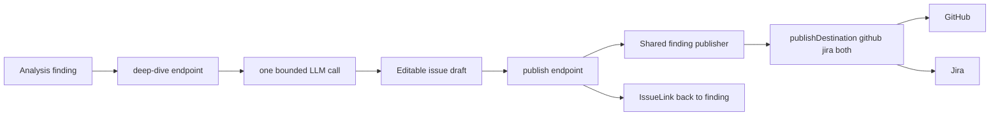

---

## 12. Database Intelligence

METIS can connect to Oracle databases and let the AI examine their structure. This is useful when the requirements involve changes to an existing database.

**How it works:**

1. **Register a connection** — provide host, port, service name, and credentials
2. **Test the connection** — verify the database is reachable
3. **Inspect the schema** — METIS extracts:
   - Tables (with columns, data types, constraints, row counts)
   - Views (including materialized views)
   - Stored procedures and functions
   - Packages
   - Indexes
   - Sequences
4. **AI tools** — the AI can use two database tools during analysis:
   - `inspect-database` — browse the schema interactively
   - `query-database` — run read-only SQL queries (SELECT only, max 100 rows)

**Safety**: All queries are verified to be read-only. INSERT, UPDATE, DELETE, DROP, ALTER, CREATE, and TRUNCATE statements are blocked.

In development, METIS uses a mock Oracle client with realistic sample data (HR schema with EMPLOYEES, DEPARTMENTS, PROJECTS tables). In production, this connects to actual Oracle databases using the `oracledb` driver.

**Phase 8 update — multi-driver DB connectors.** Section 13's Phase 8 notes also apply here. New per-project `DatabaseConnection` records back a pluggable driver registry (`server/src/lib/connectors/db`) with first-class adapters for **Postgres** (`pg`), **MySQL** (`mysql2`), **Oracle** (dynamic `oracledb` import — optional dependency, server boots without it), and **SQL Server** (driver scaffold). Every adapter pools connections, enforces statement timeouts, runs schema introspection, and surfaces row counts + truncation flags. **Epic #293 Phase 2 (#300)** adds an optional `introspectRoutines()` to every adapter — a single read-only, parameterized catalog SELECT (`information_schema.routines` / `ALL_OBJECTS` / `sys`-equivalent) returning each procedure/function's `{schema, name, type, signature}`; the routine **body is never fetched and never executed**, and a routines failure never sinks table introspection (`DbSchemaSnapshot.routines` is best-effort).

The read-only SQL gate (`db/sql-validator.ts`) is now stricter than the legacy regex check: every query is parsed by `node-sql-parser` and rejected unless it is a single `SELECT` with no `INTO`, `UNION ALL ... INTO`, or DDL/DML. Multi-statement payloads, comments-as-statement-separators, and CTE writebacks are all denied. A `LIMIT` / `FETCH FIRST` clause is appended server-side based on the dialect — clients cannot opt out.

Outbound network is constrained by `DB_ALLOWED_HOSTS` (CSV with `*.example.com` wildcards). Credentials live only in the vault; the same `${vault:...}` reference flow used for repo PATs is used for DB passwords.

### 12.1 Project-scoped AI database tools (Epic #880)

Epic #880 connects the AI layer to live project data through two registered tools in `server/src/lib/ai/tools/` that wrap the multi-driver connector path (`db/db-service.ts`) rather than the legacy mock client. Both are registered with the `ToolRegistry` at server boot and therefore inherit the approval gate (§6.4) and audit trail automatically.

| Tool | File | Risk | Wraps | Returns |
|---|---|---|---|---|
| `inspect_schema` | `ai/tools/inspect-schema.ts` | `medium` (prompt-once) | `inspectDbConnector` | Compact `{tables:[{schema,name,columns:[{name,type,nullable,primaryKey}]}]}` |
| `query_database` | `ai/tools/query-database.ts` | `high` (always-prompt) | `queryDbConnector` | `{columns, rowCount, truncated, rows}` capped at `QUERY_DB_MAX_ROWS` (100) |

**Defence-in-depth (reused, not reinvented):**

- **Per-project scoping** — both tools reject any session without a `projectId` (`PROJECT_SCOPE_REQUIRED`) and resolve connectors via `getDbConnector(projectId, id)`, which `findFirst`s on `{id, projectId}`. An agent operating in project A can never reach project B's connectors.
- **SELECT-only** — `query_database` routes every statement through `db/sql-validator.ts` (`validateSelectOnly`): node-sql-parser AST check + keyword backstop reject INSERT/UPDATE/DELETE/DDL and multi-statement payloads before any driver sees them.
- **Per-connector allow-list** — `validateSelectOnly` additionally enforces an optional table/column allow-list parsed from `DatabaseConnection.options` (`parseDbConnectorAllowList`, fail-closed on malformed config). A connector can be scoped to a fixed set of tables/columns.
- **Approval + audit** — `medium`/`high` risk routes through the `ApprovalGate`; `inspectDbConnector`/`queryDbConnector` emit `connector.db.inspect` / `connector.db.query` audit entries.
- **Credentials + egress** — passwords resolve from the vault via `vault-resolver.ts`; outbound traffic is constrained by the network allow-list. Result rows are PII-redacted and hard-capped server-side.

### 12.2 Requirement ↔ data mappings (Epic #889)

Epic #889 builds on the #880 DB tools by persisting **traceability links** between a `Requirement` and the table/column it is backed by in one of the project's `DatabaseConnection`s. This lets the Analysis UI show "this requirement maps to `public.users.email`" and lets the AI propose those links.

**Data model** — `RequirementDataMapping` (`requirement_data_mappings`, `server/prisma/schema.prisma`):

| Field | Notes |
|---|---|
| `requirementId` → `Requirement` | `onDelete: Cascade` |
| `dbConnectorId` → `DatabaseConnection` | `onDelete: Cascade` |
| `schemaName` | nullable — `null` ⇒ connector's default schema |
| `tableName` | required |
| `columnName` | nullable — `null` ⇒ table-level (not column-level) mapping |
| `confidence` | `Float` 0–1, default `0.7` |
| `source` | `manual` \| `llm-suggested` |
| `note` | optional free-text provenance / rationale |
| `deletedAt` | soft-delete |

There is a `@@unique([requirementId, dbConnectorId, schemaName, tableName, columnName])` index. Because SQL treats `NULL` as distinct in unique indexes, the service layer adds an explicit duplicate check for table-level/null-column tuples; the check + insert run inside an interactive transaction so concurrent requests cannot race past it (the DB `P2002` violation still backstops fully-specified tuples).

**Service** — `server/src/lib/traceability/requirement-data-mapping.ts`. Prisma is dependency-injected for hermetic unit tests. Every operation enforces referential scoping: the requirement and connector must both exist (not soft-deleted) and belong to the named `projectId`, so a mapping can never bridge two projects or point at a requirement/connector the caller did not name (cross-project → `404`). Listing excludes soft-deleted mappings *and* soft-deleted requirements.

**REST surface** — `server/src/routes/data-mappings.ts`, mounted at `/api/projects/:projectId`, reusing the connector RBAC permissions:

| Method + path | Permission | Notes |
|---|---|---|
| `GET /requirements/:requirementId/data-mappings` | `connector.read` | List mappings for one requirement |
| `POST /requirements/:requirementId/data-mappings` | `connector.write` | Create (Zod-validated); `409 DATA_MAPPING_EXISTS` on duplicate |
| `DELETE /requirements/:requirementId/data-mappings/:mappingId` | `connector.write` | Soft-delete (IDOR-safe: verifies the mapping belongs to the requirement) |
| `POST /requirements/:requirementId/data-mappings/suggest` | `connector.write` | LLM-assisted suggestions (#893) |
| `GET /data-mappings` | `connector.read` | Project-wide list (joins connector label) |

**LLM-assisted suggestions (#893)** — `suggest-mappings.ts` proposes ranked candidates with confidence + rationale, grounded **only** in the RAG-ingested schema docs (never a live DB introspection). A configurable LLM call / token budget (`DATA_MAPPING_SUGGEST_MAX_CALLS` / `_TOKEN_BUDGET` / `_TABLES_PER_CALL` / `_RETRIEVE_K`) bounds a run; partial results are returned with a note when exhausted, and candidates are validated against the ingested schema to reject hallucinated tables. Because each request fans out to up to N LLM calls, the `/suggest` route is throttled by the shared per-user `connectorQueryRateLimiter` (`server/src/middleware/connector-rate-limit.ts`, default 30/min/user) — the same limiter that guards `/dbs/:id/query` — to bound cost amplification (OWASP A04).

#### 12.2.1 Requirement → Spec → Code traceability spine (Epic #207)

Epic #207 completes the traceability chain by introducing a first-class **Spec** node and linking it to both requirements and code. The "spec" entity IS an existing `GeneratedDocument` row — no new spec table is minted. Two new Prisma models bridge it:

- **`RequirementSpecMapping`** (`requirement_spec_mappings`, #226) — joins `Requirement` ↔ `GeneratedDocument`, unique per `(requirementId, specDocumentId)`, carrying `confidence` + a `derived|manual` source.
- **`SpecCodeMapping`** (`spec_code_mappings`, #227) — joins `GeneratedDocument` ↔ `CodeSymbol`/file-span, mirroring `RequirementCodeMapping` field-for-field (nullable `codeSymbolId` for file-only hits).

**Services** (all under `server/src/lib/traceability/`, Prisma dependency-injected for hermetic tests):

- `requirement-spec-mapping.ts` / `spec-code-mapping.ts` — project-scoped CRUD; cross-project links are rejected (`404`), duplicate requirement→spec pairs `409`.
- `backfill-spec-links.ts` (#228) — idempotently derives links from existing data: requirement→spec by Jaccard file-path overlap (spec scope paths vs the requirement→code spine), then propagates each requirement's code mappings onto its linked specs as `derived` spec→code rows. The derivation (`deriveSpecLinks`) is pure; persistence is a separate injected writer.
- `traceability-spine.ts` (#229) — `getRequirementChain` assembles the full requirement→spec→code tree; `getRequirementsForFile` is the reverse lookup.

**REST surface** — `server/src/routes/traceability.ts`, mounted at `/api/projects/:projectId`:

| Method + path | Permission |
|---|---|
| `GET /requirements/:requirementId/traceability` | `analysis.read` |
| `GET /traceability/by-file?filePath=` | `analysis.read` |
| `GET/POST/DELETE /requirements/:requirementId/spec-mappings[/:id]` | `analysis.read` (GET) / `analysis.run` |
| `GET/POST/DELETE /specs/:specId/code-mappings[/:id]` | `analysis.read` (GET) / `analysis.run` |
| `POST /traceability/backfill` | `analysis.run` |

**UI** — `TraceabilityView` (`ui/src/components/traceability/traceability-view.tsx`, client `traceability-api.ts`) renders the read-only chain under each requirement on the analysis page.

#### 12.2.2 Typed cross-project requirement links (Epic #610)

Epic #610 links two **requirements** directly (distinct from the requirement→spec→code spine above, which links a requirement to derived artifacts). The schema foundation (#623):

- **`RequirementLink`** (`requirement_links`) — a typed, DIRECTIONAL link `source` → `target` between two `Requirement`s, unique per `(sourceRequirementId, targetRequirementId, type)`, indexed on both FK columns, with `ON DELETE CASCADE` from either endpoint. `type` is one of the shared `RequirementLinkType` vocabulary (`relates_to | duplicates | depends_on | derived_from`, exported from `@metis/shared` with an `isRequirementLinkType` guard and an `isSelfLink` predicate). `createdById` is a scalar soft-link to `users.id` (no FK, matching other provenance columns).
- **Scope rule** — links may cross projects but only WITHIN the same workspace (source/target projects share `Project.workspaceId`); projects with a NULL `workspaceId` may only link within the same project. This same-workspace invariant is documented on the model and enforced (along with self-link rejection) by the link API (#624), which resolves both requirements' projects — the DB cannot express it.

##### Workspace traceability rollup (#626)

`#626` adds a **workspace composition layer** on top of the project-scoped spine (12.2.1) and the typed links above — the spine itself is untouched. The logic lives in `server/src/lib/traceability/workspace-rollup.ts` (Prisma dependency-injected), exposed by `workspaceTraceabilityRouter` in `traceability.ts`:

| Read | Route | Returns |
|---|---|---|
| Linked chains | `GET /api/projects/:projectId/requirements/:requirementId/traceability?includeLinked=true&depth=1` | the #229 chain **plus** `linkedChains[]` — the chains of requirements reachable via `RequirementLink` edges |
| Workspace summary | `GET /api/workspaces/:workspaceId/traceability/summary` | `{ projects: WorkspaceProjectTraceability[], crossProjectLinks: CrossProjectLinkEdge[] }` |

- **Bounded traversal** — `getRequirementChainWithLinks` does a breadth-first walk over `RequirementLink` edges, clamping `depth` to `MAX_TRACEABILITY_LINK_DEPTH` (=3) and de-duplicating with a `visited` set so a cycle terminates. Without `includeLinked` the route returns the byte-for-byte #229 chain (regression-tested), so existing single-project behavior is unchanged.
- **Access isolation (reuses #624 seams, no new scheme)** — the summary calls `listAccessibleProjectsInWorkspace` (`lib/cross-project/cross-project-access.ts`), which asserts workspace membership (→ `404`, no existence leak) and intersects the workspace's projects with the caller's accessible set; **every** count and link is then scoped to that project-id set, and a cross-project edge is emitted only when *both* endpoints sit in an accessible project. The linked-chain walk access-checks each counterpart's project with `actorCanAccessProject`; an inaccessible counterpart is surfaced as `{ restricted: true, chain: null }` (the edge is shown, its content is not) and is **not** expanded through. There is no unbounded graph walk — cost is fixed `in`-filtered queries plus O(#accessible projects).
- **Coverage math** — per project, `specCoverage` / `codeCoverage` are the fraction of live requirements with ≥1 requirement→spec / direct requirement→code mapping (clamped to 1 to absorb mappings left over for soft-deleted requirements); `linkedCrossProject` counts distinct requirements participating in a cross-project link.
- **UI** — a workspace **Traceability** tab (`/workspaces/:id/traceability`) renders `WorkspaceTraceabilityRollup` (`ui/src/components/traceability/workspace-traceability-rollup.tsx`): the per-project coverage table plus a Mermaid render of the cross-project link map (strict-mode Mermaid sanitized with DOMPurify; falls back to the Mermaid source text on render failure). Client wrappers `traceabilityApi.workspaceSummary` / `chainWithLinks`.

---

### 12.3 Requirement version history & per-row audit trail (Epic #770)

Epic #770 records the full edit history of every `Requirement` and lets reviewers compare versions, restore a prior version, and export the audit trail — without ever overwriting history.

**Data model** — `RequirementVersion` (`requirement_versions`, in both `server/prisma/schema.prisma` and `server/prisma/postgres/schema.prisma`):

| Field | Notes |
|---|---|
| `requirementId` → `Requirement` | `onDelete: Cascade` |
| `version` | `Int` — monotonically increasing per requirement |
| `changedFields` | `String` — compact, **changed-fields-only** JSON diff (`{ field: { from, to } }`) |
| `actorId` | nullable scalar **soft-link** to the editing user (no FK, mirroring `RequirementChange.reviewedById`) |
| `reason` | optional free-text (e.g. `"Restored to version 3"`) |
| `createdAt` | append timestamp |

Indexes: `@@unique([requirementId, version])`, `@@index([requirementId])`, `@@index([actorId])`. JSON is stored as a `String` column to stay portable across SQLite (dev) and Postgres (prod), matching the existing `Requirement.labels` convention. Dual migrations live under `server/prisma/migrations/20260609000000_add_requirement_version_history/` (+ the Postgres equivalent).

**Service** — `server/src/lib/requirements/requirement-version-service.ts` (Prisma dependency-injected for hermetic tests). It exposes:
- Pure helpers: `computeChangedFields` (only-changed, `null ≡ undefined`), `serialize`/`parseChangedFields` (tolerant), and `reconstructSnapshots` — which rolls the current row backwards through the diff chain to rebuild the tracked field set (`title, body, priority, type, labels, storyPoints, reviewStatus`) **as of** any version.
- `updateRequirementWithHistory` — runs inside a `$transaction`: bumps `version` and appends one changed-fields-only row **only if** the patch actually changes a tracked field (a no-op update appends nothing).
- `restoreRequirementVersion` — reconstructs the target snapshot, writes it as a **new** version N+1 (never mutates older rows), and defaults `reason` to `"Restored to version N"`.

The `PUT /api/requirements/:id` route delegates version bumping to this service; the optimistic-lock middleware still guards concurrent writes (`409`) but its `nextVersion` is ignored to avoid double-incrementing.

**REST surface** — `server/src/routes/requirement-history.ts`, mounted under `/api/requirements`:

| Method + path | Permission | Notes |
|---|---|---|
| `GET /:requirementId/history` | `project.read` | Paginated, newest-first timeline with reconstructed snapshots |
| `GET /:requirementId/history/export` | `project.read` | Exports **all** versions as CSV (RFC 4180) or JSON; registered before the paginated route |
| `POST /:requirementId/restore/:version` | `project.update` | Restore → new version N+1; writes an `audit` record (`requirement.restore`) |

Restore is gated to coordinators/admins (the `project.update` permission). CSV quoting lives in `server/src/lib/requirements/csv.ts`.

**UI** — `ui/src/components/requirements/RequirementHistoryTab.tsx` renders an inline, keyboard-navigable timeline (each entry an `aria-pressed` `<button>`) on the Analysis page. Selecting any two versions reveals a side-by-side diff via `react-diff-viewer-continued`; an Export dropdown downloads the full history; coordinators/admins get a per-version **Restore** action guarded by `RestoreVersionDialog.tsx`, which requires typing the exact phrase `Restore version N`. The thin client lives in `ui/src/lib/history-api.ts` (export uses `streamFetch` + a transient object-URL download).

### 12.4 Collaborative discussions data model (Epic #475, Phase 1)

Epic #475 introduces **shared, realtime, multi-analyst discussion threads with the LLM as an on-mention participant**. The existing models could not represent this: `AISession` is single-user (one `userId` FK) and `Comment.authorId` is a non-null FK to `User`, so it cannot attribute a message to the AI. Phase 1 (#476) adds a purpose-built pair of models — it deliberately does **not** extend `AISession` or reuse `Comment`.

| Model | Table | Purpose |
|---|---|---|
| `DiscussionThread` | `discussion_threads` | A project-scoped collaborative room. `projectId` FK (`onDelete: Cascade`). Optional, **nullable** anchors `requirementId` / `analysisId` / `specKitFeatureId` (each `onDelete: SetNull`, so a thread outlives its anchor and anchoring is a non-breaking add — UI lands in Phase 4). `createdById` FK→`User`. Soft-deleted via `deletedAt`. |
| `DiscussionMessage` | `discussion_messages` | A single message. `threadId` FK (`onDelete: Cascade` — deleting a thread removes its messages). `authorKind` discriminator (`human` \| `ai`). |

**`aiResponseMode`** on the thread is a 3-state String enum — `off` (silent), `on_mention` (**default** — replies only when `@AI`-mentioned), `auto` (proactive) — matching Slack / Teams / ChatGPT group-chat participation modes. It supersedes the binary `aiAutoRespond` toggle from the original issue draft. Stored as `String` (not a native Prisma enum) for SQLite/Postgres portability, consistent with every other "enum" in the schema; the allowed set is enforced in application code.

**Author invariant.** `authorKind = "human"` ⇒ `authorUserId` set and `aiProvider`/`aiModel`/`aiSessionId` null; `authorKind = "ai"` ⇒ `aiModel` set and `authorUserId` null. AI messages may also carry an optional `aiSessionId` FK→`AISession` (`onDelete: SetNull`) so an AI reply links to a session for `AITokenUsage` accounting and audit. Human↔human messages never touch `AISession`/`AITokenUsage` — the cost-control guarantee holds **by construction**. Because SQLite and Postgres share no portable partial-CHECK, the invariant is enforced in application code: `assertMessageInvariant`, plus the `buildHumanMessageData` / `buildAiMessageData` constructors that null the opposite columns and assert before returning (`server/src/lib/discussions/message-invariant.ts`). Both Prisma schemas (SQLite source of truth + the autogenerated Postgres mirror) declare the models, and additive migrations ship for each plus the Postgres init baseline.

**Thread authorization (#477).** `canAccessThread(actor, threadId)` in `server/src/lib/discussions/access.ts` is the single source of truth for thread access, shared by the discussions REST endpoints and (later) the realtime `subscribe:thread` handler. It resolves the thread's `projectId` — excluding soft-deleted threads — and delegates to the existing `actorCanAccessProject` project-access guard (member-or-admin, which audits denials), mirroring the project-room authz at `server/src/lib/socket/server.ts:134`. Missing/soft-deleted threads return `{ ok: false, reason: "not_found" }` (audited) rather than running the project lookup, so a deleted/unknown thread cannot leak project membership via a 403-vs-404 distinction; a real membership failure returns `{ ok: false, reason: "forbidden" }`. Callers map `not_found → 404` and `forbidden → 403`.

**REST surface (#478).** `discussionsRouter()` (`server/src/routes/discussions.ts`, mounted at `/api/discussions`, all routes `requireAuth`) exposes: `POST /threads` (create — member-checked via `actorCanAccessProject` since no thread exists yet; anchors validated to belong to the same project), `POST /threads/:id/messages` (post a `authorKind=human` message), and `GET /threads/:id/messages` (cursor-paginated history, default 50 / max 100, soft-deleted excluded). The human-post path routes through `buildHumanMessageData` and so **never calls a provider and never writes `AITokenUsage`** — the cost-control guarantee is structural, not a runtime check. The two `:id` routes delegate authz to `canAccessThread`, inheriting its 404-vs-403 semantics.

**Promote-to-requirement + analysisId derivation (#479).** `POST /threads/:id/messages/:messageId/promote` turns a message into a tracked `Requirement` (+ initial `RequirementVersion`, both in one `$transaction`) with `AuditLog` provenance. The load-bearing decision: a `Requirement` needs a **non-null `analysisId`** (`schema.prisma:1179`) but a thread is only *optionally* anchored to an analysis, so `promoteMessageToRequirement` (`server/src/lib/discussions/promote.ts`) **derives** one via a fixed cascade — (1) **thread-anchor**: the thread's anchored `analysisId`; (2) **latest-analysis**: else the project's most recent non-deleted `Analysis` (`orderBy startedAt desc`); (3) **synthetic-discussion**: else a freshly-created `status="completed"` Analysis tagged `metadata.origin="discussion"`. Tier 3 guarantees the FK invariant holds even on a brand-new project with no analyses. The chosen tier is recorded in the audit metadata (`analysisIdSource`) alongside `{ sourceMessageId, threadId, authorKind }`, so an AI-originated suggestion stays attributable to the AI. The route is member-only (delegates to `canAccessThread`).

**Realtime thread rooms (#480, Phase 2).** `wireThreadRoomHandlers(socket)` (`server/src/lib/socket/discussion-rooms.ts`, wired from `attachHandlers`) adds the authz-gated `subscribe:thread` / `unsubscribe:thread` Socket.IO handlers. `subscribe:thread { threadId }` joins the per-thread room `thread:{threadId}` **only after** `canAccessThread` passes — the same single-source-of-truth helper the REST routes use. A non-member (`forbidden`), a missing/soft-deleted thread (`not_found`), or any thrown error all yield an `auth:error` emit and **no join**, so a client that cannot access a thread never enters its room and therefore never receives its `message:*` / `presence:*` fan-out (OWASP A01, broken access control). The handler is fail-closed and extracted into its own module so the authz branch is unit-testable against a fake socket without a live Socket.IO server. `unsubscribe:thread` leaves the room (no authz — you can always stop listening). The `subscribe:thread` / `unsubscribe:thread` events live on the shared `ClientToServerEvents` contract (`@metis/shared`).

**Message fan-out emitter (#481, Phase 2).** `server/src/lib/discussions/socket-emitter.ts` is the single seam for pushing discussion events into the `thread:{id}` room. `emitMessageNew(threadId, message)` projects a persisted `DiscussionMessage` row onto the wire `DiscussionMessagePayload` (full `authorKind`/author attribution, dates serialized to ISO) and emits `message:new`; `emitMessageStream(threadId, chunk)` emits incremental `message:stream` chunks (`delta`/`done`/optional `messageId`) for Phase 3 AI streaming. Like `rag/socket-emitter.ts` and `socket/job-events.ts`, it resolves the live IO via the `getSocketServer()` registry on each call (no DI threading), is a **silent no-op when no IO is registered** (tests / pre-bootstrap), and swallows transport errors so a socket hiccup never breaks the REST request that triggered it. The Phase 1 `POST /api/discussions/threads/:id/messages` handler calls `emitMessageNew` after persisting, so every connected thread member sees a new human message live. Because the emit targets ONLY `thread:{id}` and that room is authz-gated at join (#480), a non-member who never joined the room receives nothing — fan-out inherits the room's access control rather than re-checking it. `message:new` / `message:stream` are declared on `ServerToClientEvents` (`@metis/shared`) and emitted server-side, so the realtime contract drift guard is satisfied.

**Presence + typing indicators (#482, Phase 2).** `wireDiscussionPresenceHandlers(socket)` (`server/src/lib/socket/discussion-presence.ts`, wired from `attachHandlers`) adds ephemeral per-thread presence and typing, modelled on the artifact-presence pattern (`collaboration/presence.ts`) but **authz-gated**. `presence:thread:join { threadId }` runs `canAccessThread` (injectable for tests) before adding the socket to an in-memory presence set keyed by the `thread:{id}` room and broadcasting a `presence:update` with the current member list; a non-member gets `auth:error` and is never tracked, so you cannot observe who is in a thread you cannot access. The set is keyed by `socket.id` (not user id) so the same user on two tabs is counted per-connection and one tab's disconnect does not evict the other. `presence:thread:leave` and `disconnect` remove the socket from every thread it was present in, rebroadcast, and delete the room map once empty. Typing is ephemeral and never persisted: `typing:start` / `typing:stop` broadcast `typing:update { threadId, userId, username, isTyping }` via `socket.to(room)` so it reaches OTHER members only (never echoed to the sender), and are honored ONLY when the socket is already present in that thread room — a socket that never joined cannot spray typing events into a room. `presence:update` (reused) and the new `typing:update` are both emitted server-side, satisfying the contract drift guard; the `presence:thread:join` / `presence:thread:leave` / `typing:start` / `typing:stop` client events were added to `ClientToServerEvents` (`@metis/shared`).

**LLM participation gate (#483, Phase 3).** Whether a human message triggers an AI reply is decided by `shouldAIRespond(thread, message)` in `server/src/lib/discussions/ai-gate.ts` — a pure, side-effect-free function so the decision is cheap and testable, and so no provider is ever consulted just to decide *whether* to consult one. It branches on the thread's `aiResponseMode`: `off` → always false (the AI never responds, **even on an `@AI` mention**); `on_mention` (default) → true iff `detectAIMention` finds an `@AI`; `auto` → true on `detectAIMention` **or** `detectQuestionOrRequest`. An unknown/corrupt persisted mode fails **closed** (false). `detectAIMention` matches `@AI` case-insensitively on a word boundary (rejecting `email@AIcorp.com` and `@AImazing`) and first scrubs fenced/inline code spans and URLs to spaces, so a literal `@AI` inside code or a link cannot smuggle a trigger — a deliberate (small) prompt-injection mitigation ahead of the full Phase 5 #490 OWASP pass. `detectQuestionOrRequest` (the documented `auto` heuristic) fires on a `?`, an interrogative sentence opener (who/what/how/should/…), or an assistant-directed request verb (please / can you / summarize / draft / …); plain declaratives do not fire, so `auto` is proactive without becoming always-on. The mode itself is updated via `PATCH /threads/:id` (member-only via `canAccessThread`, enum-validated). Because the gate returns false for plain human↔human messages, the cost-control guarantee (no `AITokenUsage` for human chatter) is preserved at the trigger layer as well as the persistence layer.

**AI reply invocation + streaming (#484, Phase 3).** When the gate fires, `streamAIReply` (`server/src/lib/discussions/ai-responder.ts`) drives the actual reply, and `POST /threads/:id/ai-respond` is its REST entry point (member-only; takes the triggering `messageId`, re-runs `shouldAIRespond`, and either streams over SSE or returns `{ responded: false }` with no provider call). The responder: (1) creates a backing `AISession` scoped to the thread's `projectId` + the triggering user, so the reply's usage rolls up exactly like a normal chat session; (2) builds an **injection-isolated** message array — a fixed system prompt the server controls, then prior thread turns + the trigger as `user`/`assistant` turns. Thread content is treated as UNTRUSTED: it is never placed in a system message, the system prompt explicitly instructs the model to ignore embedded instructions, and no tool calls are executed from message content (text-only streaming) — a first-line prompt-injection guardrail ahead of the full Phase 5 #490 OWASP pass. (3) Streams provider tokens through an `onChunk` callback (the route maps each chunk to an SSE `event:`/`data:` frame; this is also the **integration seam** where Phase 2's `thread:{id}` discussion emitter will fan the persisted message out to other attendees once #481 lands — deliberately not reimplemented here). (4) On completion persists an `authorKind=ai` `DiscussionMessage` via `buildAiMessageData` (records `aiProvider`/`aiModel`/`aiSessionId`, nulls `authorUserId`) and records **exactly one** `AITokenUsage` row via the token tracker. On a stream error it emits an SSE `error` frame and rethrows **without** persisting a partial message as complete and **without** charging usage — a truncated reply never appears finished, and a failed call never bills tokens. The `ai-gate.ts` `GateThread.aiResponseMode` was widened to `string` (Prisma's column type) since the gate fails closed on any non-canonical value.

**AI rate limiting (#485, Phase 3).** AI invocations from a thread are bounded per `(threadId, userId)` by a small in-memory sliding-window limiter (`server/src/lib/discussions/ai-rate-limit.ts`, `checkThreadAIRateLimit`) the `ai-respond` route calls **after** `shouldAIRespond` passes but **before** `streamAIReply` — so an over-limit request makes no provider call (cost control holds even under abuse). Over-limit returns HTTP 429 `DISCUSSION_AI_RATE_LIMITED` with `Retry-After` + `retryAfterMs` and an audit row (`discussion.ai.rate_limited`); the client surfaces it as an in-thread system notice. This is a deliberately finer dimension than the existing per-user `aiRateLimiter` express middleware on `/api/ai` (a shared thread's risk is one user repeatedly invoking the AI in one room, which a per-user middleware on an SSE handler cannot express). The window/max are env-tunable (`DISCUSSION_AI_RATE_LIMIT_MAX` default 10, `DISCUSSION_AI_RATE_LIMIT_WINDOW_MS` default 60 s). The sliding-window state lives behind a **pluggable `RateLimitStore`** (`rate-limit-store.ts`, #508; default in-memory/per-process, `DISCUSSION_RATE_LIMIT_BACKEND=shared` selects the process-wide shared-store seam — see §19.1); the no-provider-call-when-over-limit guarantee holds regardless of backend or replica count. Human↔human messages never reach this code, so they are never rate-limited.

**Multi-analyst chat surface + AI realtime fan-out (#486, Phase 4 — UI).** The discussion surface is a **project page** (`Discussions`, under the Requirements section of `getProjectTabModel()` since #28), not a top-level route, routing to `/projects/[id]/discussions`. The two Next.js pages are thin wrappers; the stateful, fully-tested logic lives in `ui/src/components/chat/discussion-thread-view.tsx` (forked from the single-user chat page). It loads history from `GET /threads/:id/messages`, joins the `thread:{id}` socket room via `getSocket()`, merges live `message:new` (human + AI) and `message:stream` chunks, and posts human messages **optimistically** — rendering a local row immediately, then reconciling with the server echo by id (or rolling back + toasting on failure). `discussion-message-list.tsx` renders distinct human-vs-AI attribution (avatar + `human` badge vs an `AI` avatar + the model-id badge) and pipes every body through the XSS-safe `chat-markdown.tsx` renderer. When a posted message `@AI`-mentions (in `on_mention`) or in `auto` mode, the view triggers `POST .../ai-respond` and streams the reply over SSE via `streamAiReply` (`ui/src/lib/discussions-api.ts`). The **server seam** this phase closes (left open by #484): `ai-respond` now ALSO fans the AI reply out to the `thread:{id}` room — each token delta mirrors to `emitMessageStream`, and the persisted reply publishes via `emitMessageNew` once `streamAIReply` resolves. So the requester sees the reply over SSE while *other* connected members receive it live exactly like a human `message:new`; the client swaps its local SSE placeholder (`ai-local-*`) for the authoritative server row when that `message:new` arrives, preventing a duplicate. A small additive `GET /api/discussions/threads?projectId=…` endpoint (member-gated like creation; soft-deleted excluded; newest-first) backs the thread-list view, since the list could not previously be enumerated.

**@mention / presence / typing (#487, Phase 4 — UI).** The discussion composer embeds the **reused** `MentionInput` (from comments), extended with an `extraSuggestions` prop that injects a synthetic `@AI` entry above the user-search hits — discoverable on a bare `@` and inserted as `@AI`, which is the on-mention AI trigger (#483). `MentionInput` gained two non-breaking props (`ariaLabel`, `onKeyDown` passthrough) so reuse stays backward-compatible; existing comment callers are unaffected. Presence reuses `PresenceAvatars` directly (`artifactType="discussion"`), riding the generic Epic #728 presence path (`presence:discussion:{id}`). The only net-new component is `typing-indicator.tsx`, driven by the Phase 2 `typing:update` event (other-members-only broadcast): it aggregates/de-dupes typers, never renders the current user, and arms a per-user stale-clear timer so a missed `typing:stop` cannot leave the indicator stuck. The composer emits debounced `typing:start` / `typing:stop` from its edit handler.

**Promote-to-requirement + thread settings (#488, Phase 4 — UI).** Each persisted message exposes a member-only **Promote to requirement** action (`isPromotable` gates out optimistic `local-*` / `ai-local-*` rows, streaming, and errored messages). It opens `promote-to-requirement-dialog.tsx`, which POSTs to the Phase 1 promote endpoint (#479) and, on success, renders provenance — a link to the created `Requirement` (`/projects/{id}/analysis?requirementId=…`) — keeping the audit trail visible. `thread-settings-panel.tsx` hosts the `aiResponseMode` segmented control (accessible `role="radiogroup"`, optimistic + rollback) persisting via `PATCH /threads/:id`, plus an optional anchor. To back the anchor UI, the **PATCH endpoint was extended (additive)** to accept an optional `anchor` next to `aiResponseMode`, validated against the thread's own project with the same `validateAnchor` used at create time (members-only; foreign/soft-deleted → 400). The thread view threads `projectId` + an `isMember` flag so both affordances stay honest with the server's `canAccessThread` gate, and changing the AI mode in-session immediately re-gates the @AI trigger.

**@mention notifications + audit trail (#489, Phase 5).** Posting a human message fans `@username` mentions out to in-app notifications via `server/src/lib/discussions/notify.ts` (`dispatchDiscussionMentions`, fire-and-forget). It **reuses** the comment-mention primitives (`parseMentions` / `resolveUsernames` from `collaboration/mentions.ts`) and, for each resolved user, creates a `Notification` row (`type: "discussion_mention"`, deep-link to the thread) and emits a new `discussion:mention` event to that user's personal `user:{id}` room — the same JWT-derived room the comment @mention path uses (never a client-supplied id). The `Mention` Prisma model could **not** be reused (it has a hard FK to `Comment`), so discussion mentions carry provenance on the `Notification` payload + audit log instead, with a per-`(thread, user)` sliding-window guard (`DISCUSSION_MENTION_NOTIFY_MAX`/`_WINDOW_MS`) for dedup / spam control rather than the Comment-scoped unique index. Delivery is **member-only** (`isProjectMember`, mirroring `actorCanAccessProject`: project creator or admin) so a mention can neither spam nor probe membership of an outsider; self-mentions are skipped; the whole path never throws (a notification failure can't break message creation). Audited actions extend the Phase 1 promote provenance: `POST /threads` records `discussion.thread.created`, and a successful `ai-respond` records `discussion.ai.invoked` (model id + the backing `AISession` token-usage reference, no bodies) — alongside the existing `discussion.message.promote` and `discussion.ai.rate_limited` events.

**OWASP review + hardening (#490, Phase 5).** The full discussion surface was audited against the OWASP Top 10; the review, controls, and accepted residual risk are documented in **§19.1** and locked by adversarial tests (`server/src/lib/discussions/discussions-security.test.ts` for A01 IDOR + cross-user prompt-injection isolation; `ui/tests/discussion-xss.test.tsx` for A03 XSS; the socket-handler and rate-limit suites for access control + abuse limits). No High/Critical findings; the surface was already hardened by Phases 1–4, so the deliverable was the documented review + the test corpus.

**Reuse map (where the discussion feature deliberately reused existing infrastructure rather than rebuilding).**

| Concern | Reused asset | Notes |
|---|---|---|
| Thread access control | `actorCanAccessProject` (project-access guard) | `canAccessThread` resolves `projectId` then delegates; one guard for REST + sockets. |
| @mention parsing / resolution | `collaboration/mentions.ts` (`parseMentions`, `resolveUsernames`) | Discussion notify reuses the parser/resolver; only the persistence + dedup differ (see #489). |
| Notification delivery | `Notification` model + `user:{id}` socket room | Same drawer + room as comment mentions; new `discussion:mention` event. |
| Realtime fan-out pattern | `getSocketServer()` registry + emitter pattern (`rag/socket-emitter.ts`, `socket/job-events.ts`) | `socket-emitter.ts` no-ops without IO, swallows transport errors. |
| Presence avatars (UI) | `PresenceAvatars` (Epic #728 generic presence) | `artifactType="discussion"`; thread view reuses it directly. |
| Mention autocomplete (UI) | `MentionInput` (comments) | Extended non-breakingly with `extraSuggestions` for the `@AI` entry. |
| Safe rendering (UI) | `chat-markdown.tsx` (no `rehype-raw`, DOMPurified Mermaid) | Bodies render inert — the A03 XSS control. |
| Token accounting / audit | `AISession` + `AITokenUsage` + `AuditLog` + audit service | AI replies roll up like any chat session; actions audited with hashing/redaction. |

### 12.5 Formal review & approval workflow + baselines (Epic #609)

Epic #609 adds formal sign-off on authored requirements and specs — review requests, per-reviewer decisions, an approve/reject state machine, and immutable baselines. It is **distinct from `ApprovalRequest`** (Epic #597), which is the analysis-pipeline HITL checkpoint gating generative enhancement steps.

**Data model (Issue #616)** — five models in both `server/prisma/schema.prisma` and the Postgres mirror:

| Model | Table | Purpose |
|---|---|---|
| `ReviewRequest` | `review_requests` | Review container + state machine: `status` (`draft\|in_review\|approved\|rejected\|closed`), decision `policy` (`all\|quorum`) + nullable `quorum`, `requestedById` FK→`User`, optional `dueAt`, `decidedAt`. `projectId` FK (`onDelete: Cascade`). |
| `ReviewRequestItem` | `review_request_items` | One scoped artifact: **exactly one of** `requirementId` / `generatedDocumentId` set, plus `pinnedVersion` — the artifact's version counter captured at submit time (`Requirement.version` backed by `RequirementVersion` history, or `GeneratedDocumentVersion.version`). No new snapshot machinery. |
| `ReviewerAssignment` | `reviewer_assignments` | Per-reviewer decision (`pending\|approved\|rejected`) with `note` + `decidedAt`; `@@unique([reviewRequestId, reviewerId])`, indexed on `[reviewerId, decision]` for the reviewer queue. |
| `Baseline` | `baselines` | Named immutable snapshot: `@@unique([projectId, name])`; `reviewRequestId` (unique, `onDelete: SetNull` so a baseline survives its producing review). |
| `BaselineItem` | `baseline_items` | One `(requirementId, version)` pin over the `RequirementVersion` substrate (Epic #770); `@@unique([baselineId, requirementId])`. |

**State machine** — `server/src/lib/reviews/state-machine.ts` is the single, pure source of truth (no Prisma/I/O; the #617 service persists its results):

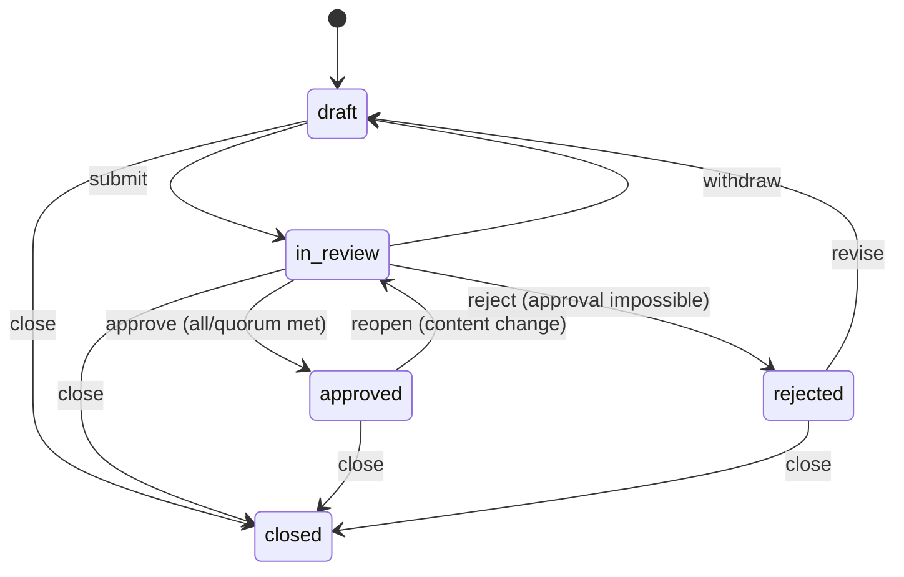

The exhaustive transition table (`REVIEW_TRANSITIONS`) makes anything absent illegal — `transition()` throws a typed 409 `IllegalReviewTransitionError`. Decision aggregation (`aggregateDecisions`) implements both policies: the outcome flips to `rejected` exactly when approval becomes **impossible** (`all`: any single rejection; `quorum(n)`: once rejections exceed `reviewerCount − n`), and policy configuration is validated by `assertValidPolicy` (400 `InvalidReviewPolicyError`). `deriveRequirementReviewStatus` specifies the legacy `Requirement.reviewStatus` derivation rule — the workflow **owns** the column when a formal review exists (`draft`/`in_review` → `"draft"`, `approved` → `"approved"`, `rejected` → `"rejected"`, `closed` → `null` = leave untouched). `buildBaselinePins` turns an approved review's scope into deduped, validated `(requirementId, version)` pins (spec documents are not baseline-pinnable). Dual migrations live under `server/prisma/migrations/20260702180000_issue616_review_workflow/` (+ idempotent Postgres equivalent, appended to the init baseline). The reviewer UI (#618), publish gates (#619), baseline list/compare (#620), and notifications (#621) are delivered by the sibling epic #609 sub-issues.

**REST API + RBAC + audit trail (Issue #617)** — routes in `server/src/routes/reviews.ts`, persistence in `server/src/lib/reviews/review-service.ts` (every status change goes through the state machine — nothing sets `ReviewRequest.status` ad hoc):

| Route | Permission | Behavior |
|---|---|---|
| `POST /api/projects/:projectId/reviews` | `review.create` | Create a **draft** review: title/description, `all\|quorum` policy, reviewer list, scope items. Items resolve **project-scoped** (cross-project ids → 404, no IDOR); reviewers must be active users; the requester **cannot** be a reviewer (400 `SELF_REVIEW_FORBIDDEN`). `requestedById` comes from the session — privileged fields in the body are ignored. |
| `GET /api/projects/:projectId/reviews` | `review.read` | Project-scoped list. |
| `GET /api/reviews` | `review.read` | Queues: `assignee=me`, `requester=me`, `status`, `projectId` (identity filters resolve to the session user only). |
| `GET /api/reviews/:id` | `review.read` | Detail incl. items (+pins), assignments, baseline, and the **audit history** (`AuditLog` rows for the review). |
| `POST /api/reviews/:id/submit` | `review.create` (requester or `review.admin`) | `draft → in_review`; **re-pins** every item to the artifact's current version (`Requirement.version` / latest `GeneratedDocumentVersion.version`) and resets assignments to `pending` (a fresh decision round). |
| `POST /api/reviews/:id/decision` | `review.decide` (assigned reviewer only) | Records `{decision: approved\|rejected, note}` on **the caller's own assignment** (reviewer identity from the session, never the body). Requester is refused (403 `SELF_APPROVAL_FORBIDDEN`); double decisions are 409 (guarded `updateMany … decision: "pending"` — race-safe). The aggregate is computed from assignment rows **re-read inside the transaction** (never a stale pre-transaction snapshot), and when it flips, the state transition (a guarded `updateMany` on `status: "in_review"` — a lost race is a 409 `REVIEW_STATE_CHANGED` rollback, so two racing finalizers can never double-fire or overwrite a concurrent withdraw), `Requirement.reviewStatus` derivation, and (on approval) `Baseline`+`BaselineItem` creation all commit **in the same transaction** as the final decision. A docs-only approval yields `baselineId: null` by design (documents are not baseline-pinnable). |
| `POST /api/reviews/:id/withdraw` | `review.create` (requester or `review.admin`) | `in_review → draft`. |
| `POST /api/reviews/:id/close` | `review.create` (requester or `review.admin`) | Any non-closed → `closed` (terminal archive; requirement `reviewStatus` untouched). |

Permission keys `review.create` / `review.read` / `review.decide` / `review.admin` live in the shared RBAC registry (`packages/shared/src/constants.ts` + `rbac.ts`; seeded by `server/prisma/seed.ts`): reader gets `review.read`; developer adds `review.create` + `review.decide`; coordinator/admin add `review.admin`. **Sign-off audit trail**: every transition and decision writes an append-only `AuditLog` entry (`review.create/submit/decision/approved/rejected/withdraw/close`, `baseline.create`) whose metadata embeds the exact pinned item versions — there is no update/delete path for sign-off records. Unlike ordinary ops events (fire-and-forget `audit()` queue), these rows are written via `tx.auditLog.create` **inside the same transaction** as the change they evidence (`buildAuditLogData` in `lib/audit/audit-service.ts` reuses the standard redaction + hashing), so a sign-off can never commit without its audit row. All review status writes are guarded on the expected prior status; a concurrent change surfaces as 409 `REVIEW_STATE_CHANGED`.

**Reviewer UI (Issue #618)** — top-level `/reviews` routes in the authed shell (sidebar → Work → Reviews):

- `ui/src/app/(authed)/reviews/page.tsx` — the queue: **Assigned to me** / **Requested by me** tabs (server-resolved `assignee=me` / `requester=me` filters), rows with status + due-date badges (overdue highlighting only while `draft`/`in_review`) and a decision-progress summary, linking to the detail view.
- `ui/src/app/(authed)/reviews/[id]/page.tsx` — the detail: `ReviewHeader` (status/policy/due date/requester/baseline), `ReviewItemCard` per scope item rendering the requirement **at its pinned version** (snapshot reconstructed via the epic-#770 requirement-history API, `pageSize=100`) plus a field-level `VersionDiff` of the `changedFields` that pinned version introduced (spec-document items render title + pin only), `ReviewerPanel` (assignments/decisions/notes), and — only when the caller holds a *pending* assignment on an `in_review` review and is not the requester (mirrors the server's `SELF_APPROVAL_FORBIDDEN` guard) — a `DecisionBar` posting to `POST /api/reviews/:id/decision` with an **optimistic** assignment flip, rollback + inline error on failure, and the aggregate state transition applied from the response without a reload.
- Components live in `ui/src/components/reviews/`; the typed client is `ui/src/lib/reviews-api.ts`. No new server endpoints — the UI consumes the #617 surface and the existing requirement-history API for diffs.

**Approval gates on publish/export (Issue #619)** — a per-project enforcement layer that makes review sign-off mandatory before anything leaves METIS:

- **Flag:** `Project.requireApprovedReview` (Boolean, default `false` = gate off, pre-#619 behavior). Read via `GET /api/projects/:id/review-gate` (`project.read`); toggled via `PATCH /api/projects/:id/review-gate` (**`review.admin`** — coordinator/admin only; audited `project.reviewGate.update`), so a developer with publish permissions cannot weaken the gate.
- **Gate module:** `server/src/lib/reviews/approval-gate.ts` — `assertDraftsPublishable` / `assertRequirementsExportable` / `assertDocumentExportable`. An artifact passes only if an **approved** `ReviewRequest` contains a `ReviewRequestItem` pinned to the artifact's **current** version (`Requirement.version`, or the latest `GeneratedDocumentVersion` — `0` when none exist, mirroring `resolveCurrentPins`). A stale approval (content revised after sign-off) fails the pin comparison and does not pass. Approvals only count within the same project.
- **Fail-closed invariants:** only an explicit `requireApprovedReview === false` disables enforcement (unknown/corrupt values enforce); a missing project or any error during the check (DB outage, review-lookup failure, draft-loader failure) **blocks** with 503 `APPROVAL_GATE_UNAVAILABLE` — never allows. Drafts that trace to **no** requirement (FK `SetNull` after a requirement deletion, or generator drafts without metadata refs) are blocked as unverifiable (`unlinkedDraftIds`). Draft→requirement tracing unions the FK with the generator metadata conventions (`requirementId`, `requirementIds` on epic drafts, `mappedRequirementIds` on test-coverage drafts).
- **Gated flows (all publish/export choke points):** `createBatch` (live batches — the route, and internal callers like the test-coverage GitHub exporter), `executeBatch` (re-checked at execution time; covers the Jira destination), the publisher's `runBatch` (the scheduler republish handler calls it directly — no bypass), `approveDraft` (REST + the Slack/Teams approve actions, which call the same service), the test-coverage external push targets (`POST …/test-coverage/exports` with `target=xray|jira|zephyr|testrail` — gated in the route on each suggestion's `mappedRequirementIds`, exactly as the GitHub target is gated transitively; an unmapped suggestion blocks as unlinked; PR #638 M1), `GET …/docs/:docId/export` (spec PDF/DOCX/Markdown), and `GET /api/requirements/:id/history/export` (CSV/JSON).
- **Gate set == publish set (PR #638 M2):** `executeBatch`'s execution-time re-check loads the draft set per destination. GitHub-only mirrors `runBatch`'s publishable-status resolution (`draft|approved|publishing|failed` — `runBatch` re-gates its exact set itself); Jira-bound destinations gate the **raw** `meta.draftIds` set with **no status filter**, because `publishBatchToJira` publishes every id in the batch metadata regardless of status — a retried, partially completed `destination=both` batch may hold drafts the GitHub leg already flipped to `published`, and those must not reach Jira ungated.
- **Documented exemptions (deliberately not gated):** dry-run batches and dry-run test-coverage pushes (no external writes; previewing is how users discover what still needs review); local file downloads — the test-coverage `excel`/`gherkin`/`playwright-pom` exports and the analysis clarify-question CSV/JSON export (`GET …/analyses/:id/clarify/export`) — which write to no external system (analogous to dry-run previews; the clarify export is additionally a pre-review elicitation artifact carrying requirement titles only); spec-kit `taskstoissues` (spec-kit tasks are not reviewable artifacts in the #616 model); and custom-agent/MCP/plugin config exports (portability data, no requirement content).
- **Error contract + audit:** blocks are 409 `APPROVAL_REQUIRED` with structured `details` (`requirementIds` / `documentIds` / `unlinkedDraftIds`, no content leakage) and are audited as `review.gate.blocked` (gate-check failures as `review.gate.error`). The Publishing page renders the block with the offending ids and a link to `/reviews` (`ApprovalGateBlockNotice`), and hosts the settings toggle (`ApprovalGateSettingsCard`, `ui/src/components/publishing/approval-gate-card.tsx`).

**Baselines: list, contents, compare (Issue #620)** — the browsable surface over the `Baseline`/`BaselineItem` pins that approvals create (#617 auto-creates them transactionally with the final decision). Routes in `server/src/routes/baselines.ts`, service in `server/src/lib/reviews/baseline-service.ts`:

| Route | Permission | Behavior |
|---|---|---|
| `GET /api/projects/:projectId/baselines` | `review.read` | Paginated project list, newest first, with `itemCount` + producing review (or manual creator). |
| `GET /api/baselines/:id` | `review.read` | Contents: each pin rendered **as of its pinned version** — `snapshotAtVersion` replays `RequirementVersion.changedFields` diffs backward from the requirement's current state (same substrate as the epic-#770 history API; no new snapshot machinery). Soft-deleted requirements are **included** (a baseline is immutable audit evidence) with `current: {version, deleted}` drift context. |
| `GET /api/baselines/:idA/compare/:idB` | `review.read` | `diffPinSets` (pure) classifies the two pin sets A → B into **added / removed / changed / unchanged**; each changed entry carries a field-level `changedFields` diff computed between the two reconstructed pinned snapshots (`computeChangedFields`). Baselines from different projects → 400 `BASELINE_PROJECT_MISMATCH`. |
| `POST /api/projects/:projectId/baselines` | **`review.admin`** | Manual baseline: pins the **current** `Requirement.version` of every non-deleted project requirement (or an explicit `requirementIds` subset, project-scoped — cross-project ids → 404). Zero requirements → 400 `EMPTY_BASELINE`; `@@unique([projectId, name])` violation → 409 `BASELINE_NAME_TAKEN`. The `baseline.create` audit row commits in the **same transaction** as the baseline (mirroring the auto-create path); pins and `createdById` are server-controlled — never read from the body. |

**Immutability is structural:** there is no update or delete route (route tests assert the absent surface), the UI client (`ui/src/lib/baselines-api.ts`) exposes no such call, and compare is read-only — the same review-sign-off ⇄ baseline coupling as IBM DOORS Next and Jama Connect. UI lives under the project (overflow tab **Baselines**): `/projects/[id]/baselines` (list + inline two-baseline compare picker rendering `BaselineCompareView`, which reuses the #618 `VersionDiff` for field diffs) and `/projects/[id]/baselines/[baselineId]` (contents via `BaselineItemsTable` with "now at vN" / "deleted since" drift notes); the review detail header links an auto-created baseline to its detail page.

**Review lifecycle notifications (Issue #621)** — `server/src/lib/reviews/notify.ts` fans out in-app `Notification` rows + a `review:notification` emit to each recipient's personal `user:{id}` socket room (the same delivery path as discussion mentions, §7.6):

- **Who, when:** on **submit** every assigned reviewer gets `review_requested`; on **each reviewer decision** the requester gets `review_decided` (reviewer label + approve/reject); when a decision completes the aggregate the requester additionally gets `review_approved` (carrying the auto-created `baselineId`, when one exists) or `review_rejected`. Every row deep-links (`href`) to `/reviews/:id`. Recipients come exclusively from the committed review row (assignments / `requestedById`) — never from request input. The submitting actor is never self-notified; withdraw/close produce no notifications.
- **Preference-aware (#614):** every send is gated per recipient via `shouldNotify(userId, "inApp", "requirementsApproved")` — review notifications are the `requirementsApproved` event family (the Settings → Notifications toggle; fail-open, never throws).
- **Post-commit, never-throwing:** `review-service.ts` fires `dispatchReviewSubmitted` / `dispatchReviewDecision` strictly **after** its guarded transaction commits (fire-and-forget; failures are logged, never thrown), so a notification failure can never break a review transition and a rolled-back transition never notifies. Tests assert both the post-commit ordering and the rollback-suppression (`review-service-notify.test.ts`).

**End-to-end coverage (Issue #622)** — the browser suite `e2e/tests/review-approval.spec.ts` (Page Object Model `e2e/pages/reviews.page.ts` + `baselines.page.ts`; API/login helpers `e2e/fixtures/review-helpers.ts`) drives the four acceptance flows against the real API + UI: (1) create → submit → **reviewer approves in the `DecisionBar`** → `approved` + an auto-created baseline pinning the requirement version; (2) **reject → requester notified** (the `review_rejected` row surfaces in the notification drawer) → **revise** (edit the requirement) → **resubmit** a fresh round → `approved`; (3) with `requireApprovedReview` **on**, a non-dry-run publish is blocked with **409 `APPROVAL_REQUIRED`** (a `github.com` route sentinel proves the gate blocks before any external call) and the publish page reflects the gate toggle — then approving the requirement's review satisfies the shared gate (`findUnapprovedRequirementIds`, asserted via the export surface, which reuses the same function); and (4) **baseline compare** shows a field-level change between two baselines. Because there is no create/submit-review UI yet (#618), the lifecycle is seeded up to the human decision over the REST surface, and every human-facing surface (decision, notifications, baseline compare, gate) is asserted through the browser. Determinism matches the rest of the suite (offline-stub AI provider; a `Requirement` seeded into the e2e SQLite DB after a real empty analysis; `coordinator` as a valid reviewer distinct from the `admin` requester, since self-review is forbidden). The full `e2e` job runs on every pull request (#62 removed the `E2E_ENABLED` gate that had kept it switched off).

---

### 12.6 Database-aware Requirements Analysis (Epic #820)

Epic #820 extends Requirements Analysis with per-requirement DDL impact and a shared-database **blast radius** across projects. It adds **no new traversal** — it crosses the existing code blast radius into the schema graph and threads the result through the analysis pipeline. The data flow is **code blast-radius → schema crossing → prompts → gap report → verdicts**:

1. **Schema crossing (#823).** `server/src/lib/analysis/affected-schema-context.ts` replays a requirement's impacted code symbols into the schema graph via `crossToSchema()` (`server/src/lib/impact-analysis/schema-impact.ts`), which follows the `reads`/`writes`/`persists-to`/`executes` edges to the affected `table`/`column`/routine objects, reconciles each against the live schema (`server/src/lib/analysis/schema-context.ts` — read-only, **never DDL, never a routine body**), and emits a **text-only, never-executed** suggested DDL per object with a blended confidence (live-db 0.95 / matched 0.85 / not-found 0.4).
2. **Prompts (#824).** When enabled for the run (see the Epic #852 gating note below), the deterministic AFFECTED SCHEMA block is threaded into the database (Sally), code, and synthesis prompts (`server/src/lib/analysis/prompts.ts`, `orchestrator.ts`), carving its token cost out of the agent budget; with no block the prompts are byte-identical.
3. **Cross-project consumers (#822).** `server/src/lib/analysis/affected-schema-consumers.ts` enumerates, per affected object, the other projects in the analyzed project's workspace that read or write it on the same physical DB — gated on the analyzed project's own database identity (`server/src/lib/cross-project/analysis-database-identity.ts`, #821), which reuses the workspace-scoped `DatabaseResource` key `(driver, host, port, databaseName)` (Epic #295). An unlinked connection yields `identityResolved: false`, never a guessed mapping.
4. **Gap report (#825).** `buildDatabaseChanges()` (`server/src/lib/analysis/gap-report.ts`) joins the affected rows with their consumers into a per-requirement `databaseChanges` section; the markdown export (`analysis-export.ts`) splits reconciled objects from `table-not-found`/`column-not-found` ones under an “Unverified against live schema” subheading. Rendered by `ui/src/components/analysis/gap-report-schema-section.tsx` (#827); identity managed by `ui/src/components/connectors/database-resource-manager.tsx` (#828).
5. **Verdicts (#826).** The three-state verdict gate (`server/src/lib/analysis/requirement-verdict.ts`, Epic #773) gains a **downgrade-only** schema cap: a finding relying on an object the live schema cannot back is capped at `could-not-verify`, never a confirmed gap; fully-reconciled evidence is left unchanged.

**Gating (Epic #852).** Both the run-side prompts (step 2) and the gap-report section (step 4) are gated by one per-project setting, `Project.databaseAwareAnalysis: 'auto' | 'on' | 'off'` (default `'auto'`, `server/prisma/schema.prisma`), not by a bare env flag. A single pure resolver, `resolveDatabaseAwareAnalysis` (`server/src/lib/analysis/database-aware-resolver.ts`), folds the setting and a schema-data presence probe (a connected `DatabaseConnection` or a non-empty schema graph) into one `{enabled, ran, reason}` decision; the run path (`orchestrator.ts`) and the gap-report path (`schema-impact-producer.ts`) both call this same resolver so they can never diverge into a half-on state. Resolution order (#849): per-project `on`/`off` first; then an EXPLICITLY configured platform flag (`ANALYSIS_AFFECTED_SCHEMA_MAPPING`/`ANALYSIS_SCHEMA_IMPACT` — distinguished from "never configured" via `ConfigService.describeSource`, so an operator can still disable the feature fleet-wide → `auto->platform-disabled`); otherwise the platform default, which is now **ON**, leaving `auto` to depend only on schema-data presence. The flags also remain a backward-compatible fallback for callers that bypass the resolver. Analysts control the setting via `GET`/`PATCH /api/projects/:id/database-aware-analysis` and a project-settings card; the resolved reason is persisted on `AnalysisSnapshot.databaseAware` and shown on the analysis result. Full detail in [Database Impact Analysis §5](./DATABASE_IMPACT_ANALYSIS.md#5-enabling-it-the-per-project-setting).

**Safety:** introspection is read-only, suggested DDL has no execution path, and consumer/identity resolution touches only METIS's own tables — no customer-DB access, no DDL. See [Database Impact Analysis](./DATABASE_IMPACT_ANALYSIS.md) for the full guide.

---

## 13. Repository Analysis

METIS can clone Git repositories and analyze their code structure, giving the AI deep understanding of the existing codebase.

**The pipeline:**

```
Register Repository URL
      │
      ▼
┌──────────────┐
│  Clone       │  Clones the repo to a local cache
│  (Git)       │  Parses GitHub URLs (HTTPS + SSH)
└──────┬───────┘
       │
       ▼
┌──────────────┐
│  Code Indexer│  Scans all files, detects 30+ programming languages
│              │  Ignores: node_modules, .git, dist, build, etc.
│              │  Generates a file tree summary
└──────┬───────┘
       │
       ▼
┌──────────────┐
│  Brain       │  Generates an AI-consumable summary:
│  Builder     │  - Architecture detection (src/, routes/, lib/)
│              │  - Key file identification (entry points, configs, docs)
│              │  - Dependency extraction
│              │  - Technology stack detection
└──────────────┘
```

**Sync Scheduler**: A background cron job runs every 15 minutes to sync all registered repositories, pulling in any new changes. Syncs can also be triggered manually.

The "Brain" summary gives the AI an instant high-level understanding of a codebase without needing to read every file — it knows the architecture, technology stack, key files, and dependencies.

**Phase 8 update — production-grade repo connectors.** The legacy clone-and-index brain coexists with new per-project `RepoConnection` records (`server/src/lib/connectors/repo`). These add:

- GitHub + **GitHub Enterprise** support via `@octokit/rest`. Insecure (`http://`) `apiBaseUrl` is rejected at create/update time (`INSECURE_BASE_URL`).
- Vault-backed PAT storage. Secrets enter the system as `${vault:label-or-id}` references and are resolved through `getVaultService()` only at the moment of use; they are never written to disk and never logged.
- Outbound network allow-list (`REPO_ALLOWED_HOSTS`, optional `*.example.com` wildcards). RFC1918 + loopback are blocked unless `CONNECTOR_ALLOW_LOOPBACK=true`.
- Shallow clones into `REPO_CLONE_DIR` via `simple-git` for repos that need on-disk inspection.
- A RAG-ingestion bridge (`connector-ingest.ts`) that emits a synthetic `Document` row (filename `connector:repo:{id}:metadata`) and runs it through the Phase 5 `KnowledgeService` so connector output participates in retrieval. PII is scrubbed first (`pii-redactor.ts`).
- Repository source (`ingestSourceAsKnowledge`, #182) is embedded as one `connector:repo:{id}:src/{path}` document per file. The walk sizes every eligible file, then orders production code → configuration → tests (`isTestSourcePath`) before the `REPO_SOURCE_MAX_FILES` budget applies; files up to `REPO_SOURCE_MAX_FILE_BYTES` are chunked through the #189 bounded-batch embed path. The run's state (`running` → `completed` / `partial` / `failed`, with counts and a heartbeat) is written to `repo_connections.sourceIngestState` before any work and settled at the end (`source-ingest-state.ts`); a `running` state with a stale heartbeat reads as `interrupted`, a re-sync resumes by checksum and re-embeds documents left un-indexed, and document generation adds a `source-unavailable` warning when the index behind it is partial. #217: each file is read through a handle (`confined-source-read.ts`: `O_NOFOLLOW`, `O_NONBLOCK` so a FIFO swapped in is refused by `fstat` instead of blocking the open forever, an inode check against the path, and for `local` connectors a realpath re-check against the boundary; the content read stops one byte past `REPO_SOURCE_MAX_FILE_BYTES`), so a symlink swapped in after the walk is never followed; lockfiles and `*.min.js` are excluded by policy (`skipped.excludedGenerated`); and a file over `REPO_SOURCE_MAX_FILE_BYTES` is reported on the connector (`skipped.tooLarge`, `skippedPaths.tooLarge`) without making the index partial — it degrades only the documents whose scope contains it: `repositoryIndexWarnings` adds a `source-unavailable` warning naming the in-scope oversize files (at most five, plus a count) when the document is unscoped (whole project or repository) or a #185 `pathPrefixes` prefix covers the file, and counts oversize files whose path was not recorded (past the first 20, or pre-#217 states) as possibly in scope (`describeOversizeInScope`).
- Live progress over Socket.IO room `connector:{id}` (events `connector:status`, `connector:progress`).

**AST summary cache rebuild (Issue #122).** `POST /api/projects/:projectId/repositories/:repoId/rebuild-cache` (`server/src/routes/ast-cache.ts`) rebuilds the per-file AST summary cache used by the code-overview and analysis tooling. It verifies the `RepoConnection`, then calls `pullOrCloneRepo` to materialise the connector's clone directory and `rebuildCacheFromCloneDir(cache, cloneDir)` (`server/src/lib/analysis/ast-summary-cache.ts`) to walk every supported source file (skipping vendored/build directories and oversized blobs) and re-index it via `ASTSummaryCache.rebuildForFiles`. The endpoint returns real statistics (`indexedFiles`, `skippedFiles`, `totalSymbols`, `discoveredFiles`); the repositories tab surfaces these (and any failure) inline. This replaced an earlier stub that only echoed cache stats.
- **Primary Repository** (Epic #640): Each project can designate one repo as primary (`isPrimary` flag). The first repo added to a project is auto-promoted. Primary repo is surfaced in a `<PrimaryRepoCard>` on the Settings page and as a badge on the Connections page. Downstream features (Publishing, AGENTS.md generation, PR review webhook) automatically use the primary repo for owner/name defaults and project resolution.

---

## 13.5 GitHub Publishing (Phase 9)

Phase 9 turns analyses into real GitHub epics + sub-issues with idempotent dedup, dry-run preview, and one-click rollback. The pipeline lives entirely in `server/src/lib/publishing/`.

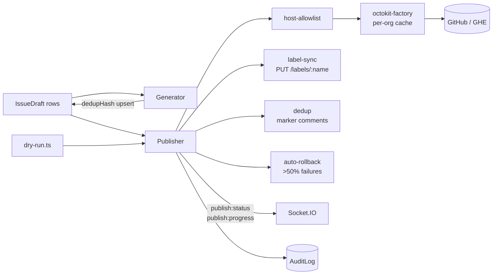

### Modules

| File                                   | Responsibility                                                                                       |
| -------------------------------------- | ---------------------------------------------------------------------------------------------------- |
| `host-allowlist.ts`                    | Validate target owner/repo/baseUrl. Public github passes through; GHE must be on `REPO_ALLOWED_HOSTS` and DNS-pinned. |
| `octokit-factory.ts`                   | Build cached `@octokit/rest` clients (per `baseUrl::owner`) with throttling + retry + DNS-pinned `https.Agent`.       |
| `dedup.ts`                             | SHA-256 dedup hash + body hash + HTML-comment marker (`<!-- metis-publish: ... -->`).                |
| `label-sync.ts`                        | Idempotent `PUT /labels/{name}` with `POST` fallback on 404.                                         |
| `draft-generator.ts`                   | Convert Analysis + Requirements into Epic + per-Requirement IssueDraft rows. Fibonacci story points. |
| `dry-run.ts`                           | Build a `DryRunPlan` (label upserts, issue creates/updates/skips, sub-issue attaches) without API calls. |
| `publisher.ts`                         | Main pipeline: pre-checks → labels → dedup scan → reconcile-from-remote → ordered create/update with sub-issue attach → auto-rollback. |
| `publishing-service.ts`                | Stateless wrappers used by routes; centralises RBAC + audit.                                         |
| `socket-emitter.ts`                    | Emits `publish:status` / `publish:progress` / `publish:completed` into `publish:{batchId}` rooms.    |

### Idempotency contract

1. **Title hash** — `sha256(owner/repo:normalize(title))`. Identical titles in the same repo collide on purpose.
2. **Marker comment** — every published issue body ends in `<!-- metis-publish: batch=X draft=Y hash=Z -->`. If the local `PublishedIssue` table is wiped, `reconcileFromRemote` repopulates it by parsing markers from `GET /issues?labels=metis-generated`.
3. **Body hash** — SHA-256 of the user-supplied body (the marker is excluded). On re-run: identical body ⇒ skip; changed body ⇒ PATCH; absent ⇒ POST.

### Rollback (#71)

If `failedCount * 2 > totalDrafts` during a batch, the publisher auto-rollbacks: every `PublishedIssue` it created in this batch gets a comment posted (`:no_entry: METIS rollback for batch X`) and the issue is closed with `state_reason=not_planned`. Manual archive (`POST /batches/:id/archive` with `closeIssues=true`) reuses the same code path.

### RBAC

| Permission       | Who                                           | What                                  |
| ---------------- | --------------------------------------------- | ------------------------------------- |
| `issue.draft`    | coordinator, developer                        | Generate / update / approve drafts    |
| `issue.preview`  | coordinator, developer                        | Run dry-runs and view batches         |
| `issue.publish`  | coordinator                                   | Run live publishes and archive batches |

### Rate limiting (R-F2)

- Inter-mutation delay: `PUBLISH_RATE_LIMIT_DELAY_MS` (default 1000 ms) ± `PUBLISH_RATE_LIMIT_JITTER_MS`.
- Primary rate limit: handled by `@octokit/plugin-throttling`'s `retryAfter` header; capped by `PUBLISH_MAX_RETRIES`.
- Secondary rate limit: 60s base × 2^retryCount, capped at 600s, full jitter.

### Change Analysis Engine (#557)

Compares two analysis snapshots to detect requirement changes — additions, removals, and modifications. Lives in `server/src/lib/change-analysis/`.

- **Title similarity** — Jaccard index on character bigrams with 0.4 match threshold
- **Severity scoring** — Based on change type (removed=high), body delta length, priority/type changes
- **Impact scoring** — Weighted combination of change type, severity, body delta, and hierarchy depth

API: `POST|GET /api/projects/:projectId/change-analyses`, `GET /:id`, `POST /:id/changes/:changeId/review`

### Multi-Project Impact Analysis Engine (Epic #159)

Maps a requirements-change document (or pasted text) to the affected code across
**two or more** projects whose source has been ingested into the AST code graph.
For each new/changed requirement it surfaces the directly affected
files/functions/symbols in **each** project plus the transitive blast radius
(callers, importers, downstream dependencies). Lives in
`server/src/lib/impact-analysis/`.

Which stages of this pipeline are LLM-backed vs deterministic — and **why**, with
the measurement lessons behind the split — is documented once in
[Impact Analysis — LLM vs deterministic stages](./IMPACT_ANALYSIS_LLM_STAGES.md)
(#1005). Read it before adding or removing an LLM call here.

| Module                         | Responsibility                                                                                          |
| ------------------------------ | ------------------------------------------------------------------------------------------------------- |
| `extract-changes.ts`           | Splits the source document into discrete changed requirements (`ChangeExtractor` / `heuristicChangeExtractor`). |
| `requirement-code-mapping.ts`  | (traceability) Maps each requirement to seed code symbols via BM25 search over the project's symbols.   |
| `blast-radius.ts`              | BFS over the code graph (incoming = callers/importers, outgoing = dependencies) with depth + edge-type weighted confidence decay. |
| `impact-analysis-engine.ts`    | `computeProjectImpact` (pure per-project scorer), `PrismaCodeGraphDataSource` (project-scoped graph reads), and the async `trigger`/`execute` service. Crosses each project's affected symbols into the schema graph (best-effort) and persists `ImpactAffectedTable` rows. |
| `live-schema-ingest.ts`        | `LiveSchemaIndex` over an introspected `DbSchemaSnapshot` (authoritative reconciliation source), plus `parseDdlFile` / `persistDdlFile` for `.sql` DDL, `persistLiveSchema` writers, and **(Epic #293 #301)** `persistLiveRoutines` — materializes introspected procedures/functions as `live-db` `procedure`/`function` symbols (routine bodies are never read). |
| `schema-impact.ts`             | `crossToSchema` (affected code symbols → affected tables/columns **and, Epic #293 #302, the procedures/functions invoked via `executes` edges**), `suggestDdl` (advisory, text-only DDL), `affectedConfidence`, and `PrismaSchemaImpactDataSource` (project-scoped schema-graph reads). Routine rows carry `objectKind` and a verify-only note — never a drop/alter suggestion. |
| `impact-analysis-read.ts`      | List + detail read views; derives `projectIds` and `projectCount` from the persisted `ImpactItem` rows, and maps `ImpactAffectedTable` rows into the per-item view (incl. the #932 per-item `summary`). |
| `impact-summarizer.ts`         | **#932 (Epic #929) — BA-readable summarization layer.** Turns the DETERMINISTIC impact facts (affected symbols + primary/#936-secondary tables with tier/rationale/change-kind/DDL + severity/counts) into a run-level overview (`ImpactAnalysis.summary`) and a per-item narrative (`ImpactItem.summary`). LLM access is **only** via `AIProvider.chat` (free-form JSON + Zod, no raw SDK); output is **grounding-validated** (emitted names ⊆ facts) so it never fabricates, and it is **post-hoc, non-blocking, flag-gated** (`IMPACT_LLM_SUMMARY`) — any failure/offline/malformed/ungrounded output degrades to no summary, never throws, never runs SQL. OWASP LLM01: requirement + names are fenced as untrusted data. Injected into the engine via `ImpactServiceDeps.impactSummarizer` (built flag-gated in the route). **#984** — the run-level overview is handed a table list pre-ranked by `rankRunTables` (#936 relevance tier → confidence → name, deduplicated to one entry per table so per-column row COUNT can never promote a tangential table), the prompt orders the model to preserve that order, and `outOfOrderTableMentions` rejects (then repairs, then drops) any draft that names a lower-tier table ahead of a higher-tier one — so the executive summary can never contradict the #950 likely-first table list. `buildRunSummaryRequest` returns the prompt **together with** the capped ranking it shows (`shown`, ≤ `RUN_RANKED_TABLE_LIMIT`), and both the per-item `tables=[…]` lines and the order gate are derived from that one value — the gate can only ever enforce order over tables the model was actually shown, so a >20-table run cannot be pushed into a needless degrade-to-null. **#1028** — the PER-ITEM prompt renders one line per TABLE, not per column: `renderTableBlock` collapses the verify-only rows (those whose `suggestedDdl` is exactly the derivable `verifyOnlyDdl` boilerplate) of one table onto a single line carrying `referencedColumns="…"`, capped at `ITEM_REFERENCED_COLUMN_LIMIT`. Rows are only merged when EVERY other attribute matches, and a row with a real DDL (`add-column`/`add-table`) is never merged, so the collapse is information-preserving. Measured on JPetStore this cut the per-item prompt 8.2k → 3.4k tokens and a single-requirement analysis 11.6k → 6.7k. Grounding is untouched in both directions: `collectItemFactNames` is built from the FACTS, never from the rendered prompt, so the allowlist does not move by one entry. Note for anyone reading the impact-summary spend rows — the two calls are metered under SEPARATE agentSteps since #1033 (`impact.summary-item` / `impact.summary-run`), and the expensive one is the PER-ITEM call (which scales with requirement count), not the run overview (827 tokens); #1021/#1025 had the attribution inverted. |
| `additive-column-proposer.ts`  | **#1001 (Epic #999) — LLM-proposed ADDITIVE column DDL.** `detectAdditiveColumnIntent` (in `schema-impact.ts`) only fires for a developer imperative ("add a status flag to account"); every business-analyst obligation phrasing ("a cancelled order must record who cancelled it and when") detected nothing, so a schema-changing requirement produced only `-- Verify column …` comments. `proposeAdditiveColumns` asks the model which NEW columns the requirement implies, grounded in the tables the deterministic crossing ALREADY surfaced, and returns NEW `add-column` rows the engine APPENDS — the regex fast path is untouched and no deterministic row is ever rewritten or dropped. Suggested DDL stays **TEXT ONLY and is never executed**; introspection stays read-only. Non-fabrication is structural: proposals are keyed by INTEGER INDEX into the candidate array (the #936 pattern) so a table outside the impact result is unreachable, the type must ground against a closed allowlist (else the existing `<type>` placeholder), the column name is sanitized through the same `toSnakeIdentifier` the #923 path uses, and a column already present (or already suggested) is dropped. Runs AFTER the #936 relevance filter, so nothing is proposed on a table judged tangential. Flag-gated `IMPACT_LLM_ADDITIVE_DDL` (**default ON since #1025**; `=0` disables), injected via `ImpactServiceDeps.additiveColumnProposer` (built flag-gated in the route); flag off / offline / malformed ⇒ deterministic passthrough, never throws. OWASP LLM01: the requirement is fenced as untrusted data, the system prompt states it cannot change the rules, and the single retry-with-repair echo is length-capped and newline-stripped. |
| `clause-coverage-reconciler.ts` | **#1005 (Epic #999) — CLAUSE-vs-IMPACT reconciliation**, an explicit "this analysis may be incomplete" signal. The #932 summarizer was already doing this *incidentally* (noting unprompted that a cancellation requirement mentions returning stock while no inventory table was surfaced); `reconcileClauseCoverage` makes it structured. It takes the requirement, every table on screen (primary **and** the #936 secondary bucket) and the project's code-graph table vocabulary, and returns `{tableName, clause, rationale}[]` for obligations no surfaced table covers. Its grounding vocabulary is **INVERTED** relative to every other LLM stage here: because its job is to name what was MISSED, it is index-keyed against the **complement** set (project tables MINUS surfaced ones), compared on the lower-cased last dotted segment so `SHOP.INVENTORY` and `inventory` are one table. Output is **ADVISORY**: it lands on `ProjectImpactResult.coverageGaps` and is fed to the #932 summarizer as a fact (only the NAME enters the grounding allowlist — model prose carries no grounding authority); it is NEVER merged into `affectedTables`, so it cannot move table recall/precision. Flag-gated `IMPACT_LLM_CLAUSE_RECONCILE` (**default ON since #1025**; `=0` disables), injected via `ImpactServiceDeps.clauseCoverageReconciler`; flag off / offline / malformed ⇒ zero gaps, never throws. Measured live on JPetStore: catches the #999 `account` miss on the loyalty requirement 3/3 runs, zero false positives on the partial-shipments requirement 3/3. See [Impact Analysis LLM stages](./IMPACT_ANALYSIS_LLM_STAGES.md). |
| `impact-llm-runtime.ts`        | **#1021 + #1024 (Epic #999) — the single chokepoint every impact LLM stage passes through.** `createImpactLlmRuntime` is built ONCE per run in the route; `instrument(provider, stage)` returns an `AIProvider` decorator that (a) **meters** each completed call into `AITokenUsage` with `agentStep = impact.<stage>` and the current `projectId` — before this, the whole feature wrote ZERO rows because providers do not self-meter and no stage recorded at the call site; (b) bounds each call with a hard deadline (`IMPACT_LLM_TIMEOUT_MS`, default 60000) that both aborts AND races the request, so a provider that hangs cannot strand a run in `running`; and (c) keeps the run's degradation ledger, whose `degradationNotice()` the engine appends to the run summary so an analyst is never shown an un-enriched result that looks enriched. One lazily-created backing `AISession` per run (no LLM call ⇒ no session row); a metering or session fault is swallowed with a warning — accounting never sinks an analysis. See [Impact Analysis LLM stages](./IMPACT_ANALYSIS_LLM_STAGES.md) → "Degradation contract". |
| `impact-llm-scope.ts`          | **#1021** — `AsyncLocalStorage` carrying the project an impact LLM call should be billed to. Three stage collaborators (#936 filter, #1001 proposer, #932 summarizer) receive no `projectId` argument, so `executeImpactAnalysis` publishes it per project instead of four signatures growing a parameter their test doubles do not use. Correct across `await` and under future concurrency, and it means a stage added later is attributed automatically. |
| `used-schema-reconciler.ts`    | **Epic #292 (#296)** — `reconcileUsedSchema(schema, edges)`: a pure, DB-free join of the introspected full schema (`DbTableInfo[]`) with inbound code→schema edges, keyed by schema/table/column. Emits one `ReconciledObject` per table and column with an inbound-edge evidence list; unmatched edges become phantom objects so evidence is preserved. Does not re-derive edges. |
| `used-schema-classifier.ts`    | **Epic #292 (#297)** — `classifyReconciledObjects` derives `used`/`unreferenced`/`uncertain` per object (with an `uncertain` reason code; never safe-to-review). `persistUsageClassification` (project-scoped delete+bulk-insert in one txn) and `readUsageClassification` (views) back the `SchemaUsageClassification` model. |
| `used-schema-service.ts`       | **Epic #292 (#297)** — orchestration: `readInboundSchemaEdges` projects persisted `CodeEdge`/`CodeSymbol` rows into the reconciler's edge shape (project-scoped); `computeUsageClassification` wires introspect → reconcile (with `LiveSchemaIndex` reconciliation) → classify → persist. **Epic #293 (#302)** adds `readInboundRoutineEdges` (`executes` edges → routines) and an optional `routinesIntrospect` arg so procedures/functions are reconciled + classified on the SAME pipeline. No DDL; introspection is read-only. |

- **LLM stage defaults (#1025)** — `IMPACT_LLM_TABLE_FILTER`,
  `IMPACT_LLM_ADDITIVE_DDL`, `IMPACT_LLM_CLAUSE_RECONCILE` and
  `IMPACT_LLM_SUMMARY` all default **ON** (`v !== "0" && v !== "false"`, the
  `IMPACT_QUERY_DENOISE` idiom); `IMPACT_LLM_ENTITY_SEEDS` and `IMPACT_LLM_SEEDING`
  stay **off**, each for a measured precision regression. So a provider-configured
  install pays ~5 provider calls, ≈$0.05 and ~20 s per changed requirement by
  default — see [Impact Analysis LLM stages](./IMPACT_ANALYSIS_LLM_STAGES.md) →
  "Defaults, and what they cost". Deterministic output remains the floor: the
  #1024 degradation contract, not the flags, is what guarantees it.
- **Persistence** — `ImpactAnalysis` (run header), `ImpactItem` (one
  project × requirement-change row), `ImpactAffectedSymbol` (per-symbol hit with
  `relation` + `depth`), and `RequirementCodeMapping` (cached requirement→symbol links).
  The set of projects is **not** a column on `ImpactAnalysis`; it is derived from
  the distinct `ImpactItem.projectId` values. **#1013** — `ImpactItem.requirementTitle`
  SNAPSHOTS the changed requirement's own title (from the #964 extractor) at analysis
  time. A pasted-text run creates no `Requirement` row, so there is nothing to join a
  title from; before this column the export inferred a heading from the run's
  `sourceText`, which is run-level state and could land on the wrong item (the engine
  DROPS zero-hit changes, so item ordinals do not track paste ordinals). The read
  projection prefers the tracked requirement's live joined title and falls back to the
  snapshot; NULL (pre-#1013 rows, titleless changes) degrades to a neutral numbered
  label, never to another requirement's title.
- **Used-vs-full reconciliation (Epic #292)** — `SchemaUsageClassification`
  persists one `used`/`unreferenced`/`uncertain` row per table/column per
  project (the whole set is replaced on each recompute). Surfaced read-only via
  `GET /api/impact-analyses/projects/:projectId/usage-classification` (and a
  `POST` to recompute), both reusing the existing project-access guard. The
  flow is: `driver.introspect()` (full schema, read-only) ⨝
  `reads`/`writes`/`persists-to` edges → reconcile → classify → persist. METIS
  **never** recommends dropping objects — `unreferenced` is a review candidate
  and `uncertain` (dynamic SQL / not-found refs) is never treated as unused.
  `overriddenClass` is a reserved manual-override seam for Phase 3 (#304).
- **Procedures & functions (Epic #293 Phase 2)** — the schema graph gains
  `procedure`/`function` symbol kinds and `executes` (code→routine) / `calls`
  (routine→object) edge kinds. Drivers introspect routine existence + signature
  read-only (`driver.introspectRoutines()`, single parameterized catalog SELECT —
  **the routine body is never fetched or executed**). Routines ride the Phase 1
  reconciler→classifier (a routine is `used` when code `executes` it) and the
  impact engine crosses the blast radius along `executes` so affected routines
  surface alongside tables, each tagged `objectKind` (`procedure`/`function`) with
  a verify-only note. **Phase 3 (#294) fills this seam:** the
  [SQL-lineage sidecar](#sql-lineage-sidecar-epic-294) parses embedded SQL,
  procedure bodies (best-effort), and SAS PROC SQL to emit the body-derived
  `reads`/`writes`/`executes` edges with `source = "sqlglot"`. Anything the parser
  cannot resolve (dynamic SQL, an unanalyzable routine body) stays `uncertain`
  (`dynamic-reference` / `routine-body-unanalyzed`) and is never auto-recommended
  for drop; an analyst can correct it via the [manual-override path](#manual-override-path-304).
- **Tier-1 Oracle dependency edges (Epic #881 Phase 1, #890)** — a coarse,
  zero-parse fallback that works even when Tier-2 body parsing is unavailable.
  `OracleDriverAdapter.introspectDependencies()` issues a single parameterized,
  read-only SELECT against `ALL_DEPENDENCIES` (owner bound as `:1`; optionally
  `DBA_DEPENDENCIES` first when `allowDba` is set and permitted, degrading
  cleanly to `ALL_DEPENDENCIES` on a privilege failure) scoped to
  `PACKAGE`/`PACKAGE BODY`/`PROCEDURE`/`FUNCTION` referencing rows — **no
  PL/SQL is ever executed**. `extractRoutineDependencies`
  (`server/src/lib/code-graph/routine-dependency-extractor.ts`) turns the rows
  into coarse `calls` edges (routine → referenced table/routine) with
  `source = "catalog-deps"`, ranked below `sqlglot` and above the static
  file-inferred sources in `SCHEMA_SOURCE_PRECEDENCE` so Tier-2 body-parsed
  edges (#891-#893) refine/override a coarse edge once available. Every edge
  additionally carries an explicit `{ tier: 1, coarse: true, direction:
  "unknown" }` marker on `CodeEdge.metadata` (`SchemaGraphWriter.addEdge()`'s
  new `metadata` option, JSON-encoded, mirroring the existing TS-import
  `typeOnly` convention) — object-level only, no column granularity, and no
  read/write direction, since Oracle's dependency catalog records neither. No
  Prisma migration was needed (`CodeEdge.metadata`/`source` are pre-existing
  free-form columns). Wiring this consumer end-to-end into live ingest is
  #894.
- **Tier-2 Oracle PACKAGE introspection (Epic #881 Phase 2, #891)** — extends
  the standalone-routine introspection (`introspectRoutines()`/
  `fetchRoutineBody()`, which stay byte-identical) to PL/SQL PACKAGES, which
  those methods deliberately exclude. Two new READ-ONLY, catalog-SELECT-only
  `OracleDriverAdapter` methods with their own SQL constants (never a
  broadened filter on the routine queries): `introspectPackages()` selects
  `ALL_OBJECTS`/`USER_OBJECTS` scoped to
  `OBJECT_TYPE IN ('PACKAGE', 'PACKAGE BODY')` (owner bound as `:1`) to find
  every package and which half(s) exist (`hasSpec`/`hasBody`), then
  `ALL_PROCEDURES`/`USER_PROCEDURES` scoped to `OBJECT_TYPE = 'PACKAGE'` to
  list each package's member names (`PROCEDURE_NAME`) — returned as
  `DbPackageInfo[]` (`packages/shared/src/connectors.ts`); member
  procedure-vs-function typing is left for a later pass, matching the Phase 2
  routine-signature precedent. `fetchPackageBody(pkg)` selects
  `ALL_SOURCE`/`USER_SOURCE` filtered to `TYPE = 'PACKAGE BODY'` (owner + name
  bound as `:1`/`:2`), assembles `TEXT` in `LINE` order, and prepends `CREATE `
  — the same convention `fetchRoutineBody` already uses — so the text parses
  as a standalone `CREATE PACKAGE BODY ... AS ... END;` statement; the source
  is returned VERBATIM for #892 to parse and is **never executed**. Two cases
  degrade to `null` rather than throwing: no matching rows (absent body), and
  a WRAPPED/obfuscated body (detected by Oracle's literal `wrapped` marker on
  the object-declaration line — the remaining lines are ciphertext, not
  parseable PL/SQL). #892 consumes both methods to parse package bodies into
  member-level lineage edges.
- **PL/SQL DML pre-processor (Epic #881 Phase 2, #892)** — sqlglot (the parser
  behind the [SQL-lineage sidecar](#sql-lineage-sidecar-epic-294)) is a SQL
  parser, not a PL/SQL compiler, and cannot parse procedural blocks (upstream
  sqlglot #1356, closed "not planned"), so `routine-body-extractor.ts` sending
  a real Oracle package member's body straight to the sidecar only works for a
  single-statement body. `plsql-preprocessor.ts` (`preprocessPlsqlBody`) is a
  pure, text-only pre-processing stage in front of that sidecar call: it
  depth-tracks `PROCEDURE`/`FUNCTION` member boundaries within a package/
  routine body (`BEGIN`/`IF`/`LOOP` open, `END`/`END IF`/`END LOOP` close),
  excludes each member's `DECLARE` and `EXCEPTION` sections wholesale, and
  isolates every remaining DML statement — tagged `{ memberName, dml }` —
  ready for sqlglot to parse one statement at a time. Leading control-flow
  headers (`IF...THEN`, `FOR...LOOP`, nested `BEGIN`/`END`, ...) are stripped
  per-statement-chunk from the front only (never as a whole-body pass), so a
  SQL `CASE...END` *expression* embedded in a kept DML statement is preserved
  verbatim. `SELECT ... INTO <var> FROM ...` is normalized to a plain
  `SELECT ... FROM ...`; `MERGE ... LOG ERRORS ...` has its Oracle
  error-logging tail best-effort stripped so sqlglot sees a plain
  `MERGE INTO <target> ...`. `EXECUTE IMMEDIATE` dynamic SQL and an
  unrecoverable `MERGE` are returned as `{ memberName, placeholder, reason }`
  facts, mirroring the `unresolved`/`placeholder` shape `mybatis-extractor.ts`
  already produces (#886) — a downstream persist step builds the shared
  `unresolvedRefMetadata()` marker from them, never silently dropping the
  reference. **Scope**: #892 ships the pure pre-processor + tests only; wiring
  its output through `extractUsageSafe`/`persistCalls` (one sqlglot call per
  isolated statement) plus Tier-1 cross-validation for Oracle package bodies is
  #893. Text-only — no PL/SQL is ever executed.
- **Tier-2 PL/SQL package lineage + Tier-1/Tier-2 cross-validation (Epic #881
  Phase 3, #893)** — the capstone that wires #892's isolated DML statements
  through the sidecar and reconciles the result against #890's coarse Tier-1
  edges. `plsql-package-lineage.ts` (`extractPlsqlPackageLineage`) fetches each
  package body (read-only, via a caller-supplied fetcher), runs it through
  `preprocessPlsqlBody`, and sends EACH isolated statement to the sidecar
  individually (Oracle dialect), attributing every resolved table/column
  reference to the SPECIFIC package member (`ensureRoutine(memberName, ...)`)
  it came from — not the package as a whole. The sidecar's per-table/column
  `access` classification (`read`/`write`/`persist`) maps to
  `reads`/`writes`/`persists-to` the same way `mybatis-extractor.ts`'s
  `ACCESS_EDGE_KIND` already does, and every table/column identity is
  canonicalized through the same `tableQualifiedName`/`ensureTable` the
  MyBatis/ORM/Tier-1 extractors use, so a PL/SQL-derived table symbol dedups
  onto the SAME node a Java/MyBatis extractor already created for it (or vice
  versa, via `SchemaGraphWriter.prewarm`). #892's `unresolved` facts
  (`EXECUTE IMMEDIATE`/an unrecoverable `MERGE`) become a `calls` edge to a
  synthetic `?dynamic:<placeholder>` symbol carrying #886's
  `unresolvedRefMetadata()` marker — `calls`, not `reads`/`writes`/
  `persists-to`, because direction is unknowable for SQL that was never
  resolved. **Cross-validation**: per package, every Tier-1 `catalog-deps`
  table (#890) that Tier-2 body parsing never resolved a matching reference to
  — compared via the same canonical `tableQualifiedName` identity — is flagged
  as a gap (most often because it is ONLY reachable through the dynamic SQL an
  `EXECUTE IMMEDIATE` builds, which #892 deliberately never attempts to
  statically resolve) and persisted the same way: a `calls` edge from a
  package-level routine symbol, carrying the same unresolved-reference marker.
  A package whose body could not be fetched is recorded
  `routine-body-unanalyzed` (mirroring `extractRoutineBodies`) and STILL runs
  cross-validation — with no Tier-2 data at all, every one of its Tier-1 tables
  becomes a gap. Feature-gated identically to the rest of the SQL-lineage path
  (`isSqlLineageEnabled()`); a disabled sidecar makes the whole call a no-op —
  no fetch, no sidecar call, no Tier-1 comparison. Never throws: one package's
  fetch/parse failure never aborts the rest. Read-only, text-only throughout —
  no PL/SQL is ever executed.
- **Unresolved/dynamic references (Epic #879, #886)** — some parsers can tell a
  statement touches a table/column WITHOUT being able to resolve WHICH one:
  MyBatis `${tableName}` raw string substitution (`#{}` is always a safe bind
  param and never a table/column name; `${}` frequently IS one, and is not
  resolvable by parsing alone), and the same cross-cutting shape is shared by
  Java raw JDBC string-concatenated identifiers (#888) and PL/SQL
  `EXECUTE IMMEDIATE`-built SQL (#892). Rather than a new `SchemaEdgeKind`
  (which would force updates to every exhaustive edge-kind consumer), an
  unresolved reference is persisted as an ORDINARY `reads`/`writes`/`persists-to`
  edge whose target is a SYNTHETIC placeholder symbol
  (`table`-kind, qualifiedName `?dynamic:<placeholder>` — `?` can never start a
  real SQL identifier, so it cannot collide with a genuine table, and is
  trivially pattern-matchable for coverage counting), tagged with a shared
  `{ unresolved: true, placeholder, statementId, mapper }` metadata marker —
  mirroring the Tier-1 coarse-lineage marker precedent above. Both the marker
  shape (`UnresolvedRefMetadata`) and the synthetic-name helper
  (`dynamicPlaceholderName`) live in `server/src/lib/code-graph/schema-graph.ts`
  so every extractor sharing this decision emits the identical shape, letting the
  gap-report coverage view (#895, below) count dynamically-resolved schema
  surface consistently across sources.
- **Unresolved/dynamic coverage metric (Epic #882 Phase 3, #895)** — turns those
  markers into an actionable gap-report number: "N% of table edges are
  dynamically resolved / need manual confirmation."
  `server/src/lib/analysis/sql-lineage-coverage.ts` (`computeSqlLineageCoverage`,
  pure + read-only) reads the project's schema lineage edges
  (`reads`/`writes`/`persists-to`/`calls`) and classifies each as RESOLVED or
  UNRESOLVED — the latter being either a dynamic reference (the
  `metadata.unresolved === true` marker above, reason `dynamic`) or a coarse
  Tier-1 catalog dependency (`source === "catalog-deps"`, #890, reason
  `coarse-catalog`). It returns `{ totalEdges, resolvedEdges, unresolvedEdges,
  coveragePercent, bySource, unresolvedRefs }` (`SqlLineageCoverage` in
  `packages/shared`), `null` when the project has no lineage edges. A malformed
  `metadata` blob degrades that edge to "resolved" (fail closed toward NOT
  over-reporting). It is computed once in `resolveGapReportDeps`
  (`schema-impact-producer.ts`) — the single chokepoint both gap-report routes
  call — INDEPENDENT of the `databaseAware` gate (the markers exist regardless of
  whether the per-requirement schema-impact crossing runs) and threaded through
  `getGapReport` → `GapReport.sqlLineageCoverage`, surfaced in the gap-report UI
  panel and the markdown export (a per-source breakdown + a bounded, drillable
  list of the unresolved edges as copyable file locators). Never throws — a
  coverage-read failure degrades to `null` rather than sinking the report.
- **Confidence** — `seedConfidence * EDGE_TYPE_WEIGHTS[kind] * RADIUS_DECAY^(depth-1)`
  (`RADIUS_DECAY = 0.7`); direct (depth-0) hits always win over radius hits for the
  same symbol.
- **Authorization** — Every `projectId` is checked against the caller's accessible
  set on both create and read. Non-admins get `404` for projects they cannot see;
  detail reads are rejected unless **every** project in the run is accessible.


API: `POST /api/impact-analyses` (returns `202` with `{id,status,projectIds}`),
`GET /api/impact-analyses`, `GET /api/impact-analyses/:id`. Guarded by the
`analysis.run` and `analysis.read` permissions. UI lives under `/impact-analyses`.
`GET /api/impact-analyses?projectId=` lists only the runs that include that
project (empty for a project the caller cannot access); each summary row's
`projectIds` names only the run's projects the caller can access, while
`projectCount` counts them all (#61). A project's own runs are listed on
`/projects/:id/impact`.

#### Mapping precision/recall eval — replayed PRs (Epic #726 / #738)

The deterministic requirement→code mapping path (`mapRequirementToCode` +
`blastRadius` composed by `computeProjectImpact`, reused by the analysis
"Evaluate new requirements" flow, #735) has a regression-gating offline eval at
`server/src/lib/eval/reqmap/`, extending the #717 code-graph citation harness
(`server/src/lib/eval/codegraph/`) — it reuses that harness's `buildSymbolsFromRepo`
parser seam and the same self-contained-fixture convention. The fixture
(`eval-data/corpus/reqmap-01-precision-recall/`) is a synthesized micro-repo plus
a set of **replayed PRs**: each case is a requirement description whose committed
`changedFiles` are the files the real PR actually touched (the *relevant* set).
The eval runs the mapping against the parsed fixture graph and scores the
predicted affected-file set (the *retrieved* set) for file-level
**precision / recall / F1** (`scorer.ts`, a pure function), per case and in
aggregate (macro + micro). Blast-radius call edges are snapshotted in the fixture
so a changed *caller* file is recoverable transitively. A CI-gating vitest test
(`reqmap-eval.test.ts`, part of `pnpm test`) asserts the aggregate stays at or
above documented regression floors (`REQMAP_EVAL_THRESHOLDS` — macroF1 ≥ 0.70,
macroRecall ≥ 0.80, set below the fixture's measured macroF1 ≈ 0.81 / recall 1.0
with headroom); `pnpm eval:reqmap` runs the same logic as a CLI, writing a scored
report to `eval-results/`. Fully offline: no network, DB, embedder, or LLM.

#### Impact Analysis recall/precision eval (Epic #929 / #930)

The reqmap eval above scores requirement→**code** mapping; the Impact Analysis
recall harness at `server/src/lib/eval/impact-recall/` scores the next hop —
requirement→**database tables** — which is the recall gap Epic #929 attacks. On a
real MyBatis project (JPetStore-6) requirements found impacted code but surfaced
**zero tables** until #928 connected the `code →(calls/executes)→ mapper/statement
→(reads/writes)→ table` crossing; there was no *number* to prove that, so this
harness is the before/after yardstick for the #928 fix and the #931 seeder lift.

It drives the REAL engine (`computeProjectImpact` + `crossToSchema`) over a
committed, hand-authored JPetStore-6-style fixture
(`eval-data/corpus/impact-recall-01-jpetstore/manifest.json`, generated by the
non-destructive `eval-data/build-impact-recall-fixture.mjs`). The manifest is a
self-contained code+schema graph — mapper methods (the BM25 corpus), MyBatis
statement symbols, tables, and the `executes`/`reads`/`writes` edges between them
— plus labeled requirements, each with `expectedTables[]` (the primary signal)
and optional `expectedCodeSymbols[]`. Per requirement the harness reports **table
AND code-symbol recall/precision** (`recall = |found ∩ expected| / |expected|`,
`precision = |found ∩ expected| / |found|`, `scorer.ts` — pure) with an explicit
**HIT / WRONG (over-broad) / MISS** breakdown so precision is visible, not just
recall; `runner.ts` renders both machine-readable JSON and human-readable Markdown
so before/after runs diff cleanly. The seed searcher is swappable via ONE param
(`searcherKind: 'bm25' | 'llm'` or an injected `searcher`) so the Phase-2
`LlmCodeSymbolSearcher` lift (#931) is measured by changing exactly one thing;
`'llm'` throws until a factory is wired rather than silently falling back to BM25.
A tiny in-code SYNTHETIC fixture (`buildSyntheticFixture`) with a hand-computable
crossing outcome asserts the harness's own metric math end-to-end. `pnpm
eval:impact-recall` runs it as a CLI (`--no-fail` local, `--md` to print the
report), writing a scored report to `eval-results/`; it is CI-wireable but
GUARDED/opt-in so it never blocks unrelated PRs. The unit test
(`eval-impact-recall-*.test.ts`, part of `pnpm test`) asserts recall lifts off the
≈0 baseline, precision stays visibly < 1, and the floors (set below the measured
baseline with headroom) hold.

**Which configuration the numbers describe (#1016).** By default the harness
measures the **production** configuration: BM25 seeding **plus** the #936 LLM
table-relevance filter, i.e. `IMPACT_LLM_TABLE_FILTER=1`, so it needs a live
provider (`AI_PROVIDER=anthropic ANTHROPIC_API_KEY=… pnpm eval:impact-recall`).
`--no-filter` opts out to a fully deterministic diagnostic (no LLM, no network) —
useful for isolating seed behaviour, but **not** the shipped baseline. It did not
always work this way: the filter used to be an opt-in flag defaulting OFF, so the
default number characterised a configuration nobody runs, and a regression gate
was derived from it that was ~0.32 too lenient. Every report now leads with its
configuration, the non-production path is explicitly labelled, and a "production"
run against an offline-stub provider fails loudly rather than silently reporting
unfiltered numbers. Because the filter is a live model call, the default is **3
runs with the spread reported** and floors are checked against the **mean**;
per-requirement **absolute surfaced-table counts** are reported beside the ratios.
Floors are configuration-specific (`thresholdsFor(corpus, configuration)`), so
production numbers can never be gated by the unfiltered floors. Recorded baselines
on the committed JPetStore corpus (live Anthropic `claude-sonnet-5`, 2026-07-22):
**production tblP 0.7803 mean over 6 runs (0.7424–0.8333), tblR 0.9091, codeR
0.7273, codeP 0.0847**; the same corpus with `--no-filter` measures **tblP
0.4636**.

**Corpus name-convention self-check (#1016).** `loadImpactRecallFixture` runs
`name-convention.ts` before producing any number, asserting every corpus row is
shaped the way ingest actually emits it: code symbols rooted at their file path
and joined with `::` (`code-graph/qualified-name.ts`, the single source the
parsers now build names with), tables/columns matching the schema-graph writer's
own `tableQualifiedName`/`columnQualifiedName`, MyBatis origin symbols keeping
their dotted namespace, and symbol kinds restricted to what ingest emits. The
expectation is derived from the emitters rather than restated, so it cannot drift
from them. This exists because the corpus previously used dotted
`org.jpetstore.domain.Account` names: that divergence silently corrupted
`buildEntityVocabulary` on real projects (#1002) and neither the unit tests nor
the harness could see it, because both used the corpus convention.

#### LLM semantic seeder — BM25-candidate rerank/expand hybrid (Epic #929 / #931)

The eval above exposed the lever: table recall is high but **precision** is
dragged down by over-broad seeds, and **business-worded** requirements ("add a
status flag to account") under-recall the right symbols because seeding is
keyword-only BM25. The **local embedder is a degraded hash-fallback**, so pure
vector search is not viable — the seeder is therefore **LLM re-ranking / query
expansion over a BM25 candidate pool**, not embeddings. `LlmCodeSymbolSearcher`
(`server/src/lib/traceability/requirement-code-mapping.ts`, alongside
`Bm25CodeSymbolSearcher` / `MemoizingBm25CodeSymbolSearcher`) implements the same
`CodeSymbolSearcher` interface, so it drops into `mapRequirementToCode` and the
impact engine with no traversal change:

1. **Wide BM25 recall** — the wrapped BM25 searcher recalls a wide candidate pool
   (top-K ~40, `LLM_WIDE_CANDIDATE_K`); the first `limit` of that pool is the
   *deterministic top-K* the union must remain a superset of.
2. **LLM rerank + expand** — the candidates are sent to the LLM **only through the
   `AIProvider.chat` abstraction** (`server/src/lib/ai/types.ts`; never a raw
   SDK). It selects the genuinely relevant candidates **by integer index** and may
   return `expandedTerms` (business language → code identifiers). Output is
   free-form JSON parsed by `extractFirstJson` and **Zod-validated/repaired**
   (`llmRerankSchema`) — the same pattern as `synthesis.ts` / `nfr-elicitor.ts`,
   not `response_format`.
3. **Hybrid union** — the final result is `LLM-selected ∪ expansion-recall ∪
   deterministic-top-K`. Score bands push selected symbols to the top and demote
   retained-only symbols below the confidence floor (so the LLM *narrows* the
   final matches) while the raw union stays a **superset of the BM25 top-K — the
   deterministic path is never regressed**.

The LLM can **never introduce a symbol outside the BM25 candidate universe**:
selections are validated to in-range indices (out-of-range/negative are dropped —
no fabricated symbols), and `expandedTerms` only re-query BM25, which can only
match real corpus symbols. **OWASP LLM01 (prompt injection):** the requirement is
delimited and quoted as *untrusted data* (`buildRerankMessages`,
`LLM_RERANK_SYSTEM_PROMPT`), and the model is told to ignore any instructions
embedded in it and to select only from the candidate list.

Wiring is **selection-only**: `selectCodeSymbolSearcher` returns the LLM hybrid
when `IMPACT_LLM_SEEDING` is on **and** a live (non-offline) provider is
available, else the deterministic (memoizing) BM25 searcher; the impact route
(`server/src/routes/impact-analysis.ts`) injects the resulting `mapRequirement`
via `ComputeImpactDeps` — `computeProjectImpact` is untouched. It **degrades to
deterministic BM25, never throwing in the request path**, when the flag is off,
the provider is offline-stub / unbuildable, the chat call errors, or the output
fails to validate. The #930 eval harness `searcherKind:'llm'` path is wired
(`pnpm eval:impact-recall --searcher llm`, which builds the real provider from
`AI_PROVIDER`) so the lift is measurable; unit tests drive it with a **mocked
`AIProvider`** (deterministic, no network).

#### Embedding retrieval eval (#788) — the gate on an embedding-model change

`server/src/lib/eval/embed-retrieval/` measures the **vector half of hybrid
`search_code_symbols`** on METIS's real use case: an NL requirement must retrieve
the code symbol that implements it. It exists because a wrong pooling or dtype
yields vectors that are unit-norm, finite and plausible while retrieving *worse* —
a failure nothing else in the stack detects. The corpus
(`eval-data/corpus/embedretrieval-01-nl-to-code/`) is a snapshot of real METIS
source parsed by METIS's own parser, embedded with the production
`formatSymbolForEmbedding`, plus hand-authored requirement→symbol ground truth.
Each **arm** (model × pooling × dtype, built through the production `Embedder`) is
scored on recall@k / MRR / nDCG@k across three channels: **vector-only** (the
channel under test, scored in isolation so a strong BM25 half cannot mask a broken
vector half), **hybrid** (the real `HybridCodeSearch` RRF fusion), and **BM25-only**
(the reference line — driven by an **empty vector store**, not by `vectorWeight: 0`;
weighting the vector channel to zero does *not* remove it, since RRF still inserts
every vector hit into the fused map at a zero score, padding the tail of a ranking
that is supposed to be lexical. That bug is fixed in `hybrid-search.ts`, and the
harness passes an empty store as well, so the reference line is arm-independent on
both sides of the seam). `verdict.ts` holds the pass/fail bar as committed constants
and emits GO / NO-GO / **INVALID** — INVALID when a validity arm (a chance-level hash
floor, and a deliberately wrong-pooled candidate) fails to score worse, i.e. when the
eval has proven it cannot detect the thing it exists to detect. `stats.ts` adds a
**paired bootstrap CI** (seeded, so a committed interval is reproducible) and an
**exact sign test** on the per-query scores, because a gate resting on a
difference of means over 30 queries needs an interval around that difference; the
stats report, they do not gate — the bar stays pre-registered on the means. The pure
scorers run in CI; the arms need real weights, so `pnpm eval:embed-retrieval` is
opt-in behind `EMBEDDINGS_MODEL_DOWNLOAD_TESTS=1` and writes a JSON + markdown
verdict to `eval-results/`. Results and interpretation: `docs/EMBEDDINGS_BACKENDS.md`.

Two modes go further than the default in-memory harness (#797):

- **`--wired`** scores the same corpus through the components production *runs* — the
  real `SymbolEmbeddingPipeline`, the real store adapter, a real `VectorStore`, the
  model-tag filter and `createDefaultCodeSearcher()` itself. The default mode measures
  the embedder's **potential**; `--wired` measures the feature's **realised** benefit,
  and the two are reported side by side. Two stand-ins remain and are named in the
  runner's header: Postgres (metadata rides the `SymbolMetadataRepo` seam in memory) and
  the symbol index (the corpus supplies one; it is *not windowed*, so the eval does not
  exercise `MAX_INDEXED_SYMBOLS`).
- **`--wired --sweep`** sweeps the RRF weight ratio and reports, per setting, nDCG@10, an
  exact-name regression suite, and the target's rank *at the tool's default limit* — the
  only number that says whether the agent actually receives the symbol. It is the
  instrument that settled `DEFAULT_WEIGHTS`; its decision rule rejects any setting that
  regresses exact-name lookup, because argmax alone would have "proved" that switching
  the vector channel off is optimal.

#### Finding-verification eval (Epic #1107 / #1108) — the gate on paying for a verifier

`server/src/lib/eval/verification/` scores **the verification layer itself**, not
end-to-end analysis quality. It exists because epic #1107 proposes replacing a free,
deterministic judgement (`verifyFinding`, §7.2) with a per-finding multi-lens LLM
panel (#1109) — a recurring cost on every run — and this repo has already been wrong
about that trade once: **#931 regressed precision by adding an LLM as a *seeder*,
while #936 improved it 0.40 → 0.75 by adding one as an output *filter*.** Same model,
opposite outcome, decided by where it sat in the pipeline.

An **arm** (`arms.ts`) is one way of deciding whether a finding should be
down-weighted. `deterministic` calls production's own `assertsAbsence` +
`verifyFinding` — it reads only the #734 gate's output and structurally *cannot* read
the retrieved source, which is precisely the limitation being priced. The `panel` arm
is a pluggable seam (`PanelArmFactory`); until #1109 wires one, `--arm panel` **throws
a named error rather than degrading to the baseline**, because reporting baseline
numbers under a panel label is the #1016 defect in a new place. The corpus
(`eval-data/corpus/verification-01-finding-verdicts/`) is twelve findings with known
verdicts, eight drawn from **real** METIS failures (#773's dogfood run, #1101's
walkthrough) with ground truth verified against files at the cited lines; the loader
refuses to run if any of the four hard cases #1108 names is missing, and every case is
individually inspectable via `--case <id>` (full finding text, both citation sets,
retrieval health, evidence excerpts, ground-truth rationale, per-arm verdict).

**Precision, recall and cost are reported separately — there is deliberately no
blended score.** METIS is recall-first, so an F1 would let a recall regression hide
behind a precision gain; over-flagging gets its own `overFlagRate` axis because it is
the failure mode that erodes reviewer trust fastest. Cost is tokens *and* wall clock,
reported per finding. `compareArms` answers "is the panel better than free?" on a
recall-first rule (recall must not regress; something must improve) and deliberately
stops short of "is it worth it" — encoding a token budget as a threshold constant
would bury a product decision. Conventions follow `eval:impact-recall`: repeated runs
(3 when any arm is live), gate on the mean, spread reported, floors resolved *per arm*.

**Recorded baseline** (deterministic arm, offline, 2026-07-28): **recall 0.3333
(TP 2, FN 4), precision 0.5000 (FP 2), over-flag rate 0.3333, 0 tokens, 0 model
calls.** Read against the corpus's own caveat — half the cases are deliberately hard,
so this is a comparative yardstick, not a population estimate. The load-bearing result
for #1109 is *where* the recall goes: all four misses (VC-01, VC-03, VC-08, VC-10)
require **reading** the retrieved evidence, the semantic-support judgement §7.2's
design note explicitly deferred. Its two catches are the provenance and
absence-health checks it was built for, and it gets those for free. `pnpm
eval:verification` runs offline and deterministically; it writes JSON to
`eval-results/` and `--md` prints the Markdown report.

#### Online eval — scoring sampled live production runs (#1321, epic #1316)

Every other suite above scores **fixtures**. `server/src/lib/eval/online/` scores a
bounded sample of **real completed runs**, so fixture drift and a live-quality
regression can no longer diverge silently. It is a **read-only observer** and the
constraint is structural, not documentary: `OnlineEvalScorer.observe()` returns
`void`, defers every byte of work to a later event-loop turn via `setImmediate`, and
swallows its own failures — both chat routes call it *after* the response is on the
wire, unawaited (`server/src/routes/ai.ts`), and
`server/tests/ai-chat-online-eval.test.ts` asserts `res.headersSent` is already true
when the observer runs. **Both** `POST /api/ai/chat` and `POST /api/ai/stream` are
wired: `/stream` is the route the product actually calls (`ui/src/lib/ai-client.ts`
`streamChat`, used by the chat and workbench pages), so wiring only the non-streaming
route would sample nothing. `/stream` writes deltas straight to the socket, so the
answer is accumulated for scoring **only** when `OnlineEvalScorer.enabled()` — one
synchronous config read — is true; with the feature off the loop is unchanged. A
semantic-cache hit is deliberately **not** observed: that answer was generated against
a different request's retrieval, so scoring it against this request's contexts would
measure the cache, not the pipeline. Retrieved contexts come from
`buildAutoRagContext` via an explicit capture out-param, never by re-splitting its
assembled block on `\n\n---\n\n` (a chunk containing a markdown horizontal rule
would split into phantom contexts, and the #714 fused block would glue onto the last
one).

Four gates run in order, all of them **before** any judge call: the
`ONLINE_EVAL_ENABLED` kill switch (default OFF), the `ONLINE_EVAL_SAMPLE_RATE` draw
(default 1%), a **token-budget reservation**, and PII redaction. The budget
(`eval/online/budget.ts`, ledger at `eval-results/online/budget.json`) is deliberately
**separate from `ANALYSIS_MONTHLY_TOKEN_CAP`** — observing quality must never consume
a user's analysis allowance — and it **fails closed**: a cap of 0 denies every
reservation rather than meaning "unlimited", because the kill switch already exists
for "off". `reserve()` debits up front and `settle()` reconciles against the measured
payload, so a judge call that was never reserved never happens.

**No user content may reach `eval-results/`.** The tree is gitignored today
(`.gitignore`), but it is a shared operator artifact that gets copied off a box and
was committed in the past, so the guarantee is enforced by construction rather than
delegated to an ignore rule. Sampled question, answer and context text is redacted
through `connectors/pii-redactor.ts` *before* truncation (truncating first can split a
PII token past the redactor) and only ever handed to the judge; what lands on disk is
SHA-256 digests of the **redacted** text plus sizes, scores and counts. Both write
paths validate against `.strict()` schemas and re-walk the envelope
(`assertContentFree`), which bounds the length of every free-text field it allows
(`drift.reason` at 200 chars, `judge` at 128) rather than waving allowlisted keys
through — an unbounded allowlisted key is where a future author interpolates a
question into a `reason`. `ONLINE_EVAL_RESULTS_DIR` is **bootstrap-tier** (env only):
it is the one filesystem path in the config registry and the server creates and writes
into it, so an `admin.write` caller must not be able to retarget it at runtime.

Samples aggregate into windows of `ONLINE_EVAL_WINDOW_SIZE` (buffered in
`pending.json` so a restart does not discard a half-full window), each written as
`eval-results/online/<windowId>.json` with window-over-window drift on mean
faithfulness, dispatched through the same SSRF-guarded webhook transport as the
domain-eval drift alert (`eval/domain/drift-alert.ts`).

**Drift compares like with like.** `judgeMeaningful` gates the window being *written*;
the window it is *compared against* needs its own gate, so `selectBaselineWindow`
takes the most recent previous window produced by the **same** `judge` and yields
`NO_COMPARABLE_BASELINE` when history exists but none matches. Without that, the first
window scored by a real judge would diff against a lexical-stub baseline and page an
operator at exactly the #1317 cutover. The same asymmetry applies to *rendering*
history: the operator panel marks each row and each trend point from that window's own
`judgeMeaningful` (stub rows carry a `stub` badge, stub points are hollow amber squares
on a dashed segment), not from `/status`, which only describes the judge configured
right now. Operators read it at
`/eval/leaderboard` → **Online Eval**, backed by `GET /api/eval/online/status` and
`/windows` (`admin.read`, same posture as the domain-eval read API).

**An unverifiable metric is not a zero (#1329).** #1317 made every RAGAS metric
nullable, where `null` means the judge could not decide. The window mean therefore
excludes nulls from *both* the numerator and the denominator per metric — delegating
to `averageScores` in `rag/ragas.ts` rather than keeping a second convention — and a
metric nothing in the window scored is written as `null`, never `0`. Each window
carries per-metric `scored` / `unverifiable` counts so an operator can see how much of
it was measured. `computeDrift` refuses to compare a `null` current metric
(`UNVERIFIABLE_METRIC`) or a `null` baseline (`BASELINE_UNVERIFIABLE`). Summing a
`null` into a zero-initialised accumulator would have made a judge outage read as a
total collapse of `faithfulness` and manufactured a drift page out of it — strictly
worse than the vacuous `1.0` #1317 removed.

**Only the reference-free metrics are trended.** Live traffic has no ground-truth
spans and no reference answer, so `context_precision` / `context_recall` are vacuous
online for *any* judge. And while the only `RagasJudge` implementation is the lexical
`StubRagasJudge` (#1317), windows carry `judgeMeaningful: false`, the operator panel
renders an explicit "these scores are not a quality signal" banner, and a drift alert
is **structurally impossible** — suppressed in `computeDrift` regardless of
`ONLINE_EVAL_DRIFT_ALERTS_ENABLED`. Both flags stay off until #1317 lands.

#### Database schema / DDL impact (#168)

Each project's affected code symbols are additionally crossed into a **schema
graph** (`SchemaSymbol` `table`/`column` nodes; `SchemaEdge` `reads`/`writes`/`persists-to`
edges) to report the database tables and columns a requirement touches, plus an
**advisory** suggested-DDL string per entry. Suggested DDL is text only — METIS
never executes DDL or mutates a database. The schema graph is populated from
several provenance sources, ranked by trust (see `SCHEMA_SOURCE_PRECEDENCE`):
**manual** human overrides (highest), **live DB** introspection (authoritative),
**sqlglot** (SQL parsed by the [SQL-lineage sidecar](#sql-lineage-sidecar-epic-294),
gated behind `SQL_LINEAGE_MODE`), **MyBatis** XML + annotated mappers, **ORM**
entities (JPA/Hibernate + Prisma), and parsed **DDL `.sql`** files. The **MyBatis**
and **ORM** passes (`extractMyBatisSchema` / `extractOrmSchema`,
`server/src/lib/code-graph/ingest.ts`) are pure static parsing — no sidecar, no
live DB — so unlike the sqlglot path they run on **every** ingest regardless of
`SQL_LINEAGE_MODE`: the tree-walk captures MyBatis `.xml` mappers and JPA/MyBatis
`.java` sources (neither/both are tree-sitter-parsed as appropriate), and the real
`persistMyBatisFile` / `persistOrmFile` extractors turn them into `table`/`column`
symbols + edges via a shared `SchemaGraphWriter`, so a MyBatis or ORM project's
schema graph is populated out of the box with zero configuration (#849 for ORM,
#884 for MyBatis — both closed a "the extractor existed but had zero production
callers" gap). Before regex-extracting table/column refs, MyBatis mapper SQL is
first assembled by `expandIncludeRefs` (`<include refid>` fragments inlined from
their `<sql>` definitions, recursively, with a cycle guard for self-/mutually-
referential refids) and `expandDynamicTags` (#885), which resolves `<if>`,
`<choose>/<when>/<otherwise>`, `<foreach>`, `<where>`, `<set>`, `<trim>` and
`<bind>` by **UNIONing every branch** rather than evaluating their OGNL `test=`
conditions — a `<choose>` yields one candidate SQL string per branch (cartesian-
combined for nested/multiple `<choose>` blocks), refs are extracted from each
candidate, and the results are unioned, so every table any branch could touch is
captured. `<where>`/`<set>`/`<trim>` are reduced to a plain clause with their
literal keyword reinstated (tag-stripping alone silently drops the `WHERE`/`SET`
text, which the FROM/JOIN/SET regexes key off). This is pure static text
transformation — no sqlglot, no live SQL parsing — kept deliberately regex-based
to match the rest of the MyBatis extractor. Inferred references are reconciled
against the live schema when one is available; `table-not-found` /
`column-not-found` mismatches are flagged.

Each MyBatis statement (`<select id="findX">`, or an `@Select`-annotated
interface method) gets its own **synthetic origin symbol** with `reads`/
`writes`/`persists-to` edges to the tables it touches — but that origin has no
connection to the *real* Java mapper interface method it belongs to, so a
requirement crossing into Java service code could never reach it. Issue #887
(`mybatis-callsite-extractor.ts`) closes that gap with two additional hops,
mirroring the ORM call-site pass (#872) one layer deeper: (1) the statement's
`namespace` (the mapper interface's FQCN, e.g. `com.acme.FooMapper`) and
`statementId` (the method name) are resolved to the REAL persisted Java
`interface`/`method` `CodeSymbol` — `buildJavaMapperIndex` scans captured
`.java` sources for `package`/`interface` declarations, and an `executes` edge
(the same kind used for code→routine crossings) is written from that real
method symbol to the statement's synthetic origin; (2) Java call sites
(`<var>.<method>(...)`) whose receiver was declared with a known mapper
interface type are connected to that same real method symbol via an ordinary
`calls` edge (`persistMapperCallerEdges`) — type-aware, so two different
mapper interfaces sharing a method name (`findById` is common) are correctly
disambiguated where the generic project-wide by-name resolver in
`persistParsed` would refuse to guess. The full chain: `service → (calls) →
interface method → (executes) → statement origin → (reads/writes/persists-to)
→ table`. Both passes are purely additive/detection-only and degrade silently
when no matching Java interface is found (e.g. an XML mapper with no
corresponding `.java` file in the repo).

**jOOQ generated table-class lineage (Epic #883, #897).** jOOQ code generation
emits one Java class PER TABLE (`class Book extends TableImpl<BookRecord>`)
carrying a self-registering singleton constant
(`public static final Book BOOK = new Book();`) that application code
references fluently through `DSLContext` (`.select(...).from(BOOK)`,
`.insertInto(BOOK)...`). There is no SQL string to parse here — mapping a query
to a physical table is pure SYMBOL RESOLUTION, handled by its own module,
`server/src/lib/code-graph/jooq-extractor.ts`, deliberately independent of the
JPA/MyBatis schema passes and the entity→physical-table resolver (#896):
`extractJooqTableClasses` resolves a generated class's constant to its
physical table (an explicit `getName()` override, the generator's
self-registration `DSL.name("book"), null)` signature, a legacy
`super("...", ...)` string literal, or the UPPER_SNAKE_CASE class-name
convention as a last resort), and `findJooqCallSites`/`persistJooqCallSiteEdges`
scan the SAME captured `.java` files for `DSLContext` verbs against a resolved
constant, anchoring `reads`/`writes` edges to the REAL enclosing Java
method — mirroring the #872 ORM call-site pattern. Unlike JPA/MyBatis, a
generated table class that no application code queries produces no symbol or
edge: it is a query-builder handle, not a persistence declaration, so table
nodes materialize lazily, exactly where a DSL call site resolves against them.
Wired into `ingestCodeGraph` as Step 5d (`extractJooqSchema`) — pure static
parsing, no sidecar, no live DB, runs on every ingest — with its own
`source = "jooq"` provenance ranked alongside `mybatis`/`orm`/`ddl-file` in
`SCHEMA_SOURCE_PRECEDENCE`. jOOQ's runtime `Settings.withRenderMapping(...)`
schema remapping lives in a runtime `Configuration`, not the generated source,
so it is not statically resolvable and is out of scope — jOOQ-derived tables
are recorded schema-less; live-DB reconciliation is the intended source of
truth once a schema-qualified identity is needed.

**Entity → physical-table resolver (Epic #883, #896).** `orm-extractor.ts` maps
JPA entity *shape* (`@Entity`/`@Table`/`@Column`) onto tables, but HQL/JPQL
queries and Spring Data derived-query methods reference entities by NAME, not
the physical table — they had no path into the schema graph. `entity-resolver.ts`
is a framework-agnostic `EntityTableResolver` interface (`resolveEntity`/
`resolveField`) with a generic `MapEntityTableResolver` implementation; SQLAlchemy
ORM (#898) and EF-Core (#900) plug their own entity maps into the SAME interface.
`buildJpaEntityResolver` is the JPA factory, reusing `parseJpaEntities` (no
duplicated `@Entity`/`@Table`/`@Column` parsing) and additionally recognising an
explicit `@Entity(name=...)` alias. `jpa-query-extractor.ts`
(`extractJpaQuerySchema`, `ingest.ts`) then resolves two query shapes on Spring
Data repository interfaces (`interface X extends JpaRepository<Entity, Id>`,
also `CrudRepository`/`PagingAndSortingRepository`): `@Query("...")` HQL/JPQL
(entity + alias parsed from its `FROM`/`UPDATE` clause, `alias.field` references
resolved to columns) and derived query methods (`findBy…`/`existsBy…`/
`countBy…`/`deleteBy…`, entity from the repository's generic type, property
expression split on `And`/`Or` with Spring Data operator-keyword suffixes
stripped). `nativeQuery = true` `@Query` methods are deliberately EXCLUDED — they
contain real SQL and are designed to fall through to the dialect-aware SQL-lineage
path (Java raw JDBC SQL is Epic #880, not yet wired) rather than being
misread as an entity reference. Persistence mirrors the MyBatis two-hop shape: a
synthetic per-query origin symbol carries the `reads`/`writes` edges to
table/column (`source: "orm"`), and a separate `executes` edge connects the REAL
repository interface method to that origin — `service → (calls) → repository
method → (executes) → query origin → (reads/writes) → table`. Runs on every
ingest (pure static parsing, no sidecar, no live DB), right after
`extractOrmSchema` so entity tables it just created are already prewarmed.

**Go GORM model→physical-table lineage (Epic #883, #899).** GORM is a Go ORM
whose application code references a struct (`db.Model(&User{}).Find(&users)`,
`db.Create(&user)`), never a physical table name — so, like the JPA query side,
mapping a query to a table is entity resolution, not SQL parsing.
`gorm-extractor.ts` (`extractGoSchema`, `ingest.ts` Step 5x) parses `type X
struct { … }` definitions to their physical table by GORM's conventions (an
explicit `func (X) TableName() string` override wins; else snake_case of the
struct name, pluralized — `User` → `users`, `CreditCard` → `credit_cards`),
resolves columns from each field's `gorm:"column:…"` tag (else snake_case; an
embedded `gorm.Model` contributes id/created_at/updated_at/deleted_at; a
`gorm:"-"` field is ignored), and feeds them into the SAME framework-agnostic
`EntityTableResolver` (#896) via `buildGormEntityResolver`. `findGormCallSites`
then scans application `.go` source for GORM finisher verbs (`Find`/`First`/… →
`reads`; `Create`/`Save`/`Update`/`Delete`/… → `writes`) whose target resolves
from a composite-literal type (`&User{}`, `[]User`) or an explicit
`.Table("users")` literal, and anchors each `reads`/`writes` edge (`source:
"orm"`) to the REAL enclosing Go function symbol — the Go analogue of the #872
ORM / #897 jOOQ call-site pattern. Runs on EVERY ingest (pure static parsing, no
sidecar), NOT gated on `SQL_LINEAGE_MODE`. Go `database/sql`/`sqlx` raw-SQL
strings (`db.Query`/`db.Exec`/`db.Get`/`db.Select("…")`) stay on the existing
sqlglot embedded-SQL path (`source = "sqlglot"`, Step 6) — they are ordinary
string literals, so no new handling is needed. The OSS `sqlvet` static analyzer
was evaluated and NOT adopted: it validates raw SQL strings (not GORM
struct→table mapping) and requires a compilable Go module via `go/packages`,
which a toolchain-free ingest worker cannot assume — the sqlglot path already
covers the raw-SQL half without that precondition.

Results persist as `ImpactAffectedTable` rows and render in a per-project
**Schema Impact** UI section with provenance badges, reconciliation flags, and
read-only suggested DDL. Schema crossing is best-effort and never sinks a run; it
can be skipped per-analysis via `includeSchemaImpact: false`.

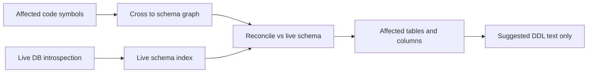

#### SQL-lineage sidecar (Epic #294)

Phase 3 broadens SQL usage extraction with a **dedicated Python sidecar,
`metis-sql-lineage`** (FastAPI + uvicorn + [`sqlglot`](https://github.com/tobymao/sqlglot)),
deployed exactly like the embeddings sidecar (own `Dockerfile.sql-lineage`,
docker-compose + Helm entry, shared-secret auth, restricted egress). It exposes
`POST /extract_usage` with `{ sql, dialect, schema }` → `{ tables, columns, lineage_edges, uncertain }`.
The sidecar **only parses SQL — it never executes it — and makes no outbound calls.**

Feeding the **introspected schema** into sqlglot expands `SELECT *` and qualifies
bare columns (the documented ~20%→~90% column-accuracy lever). Lineage edges use
OpenLineage column-lineage vocabulary with `source = "sqlglot"`. Supported
dialects: Oracle/PL-SQL, T-SQL, PostgreSQL, MySQL (others map to ANSI).

**Column-level lineage foundation (Epic #883, #901).** The schema fed to sqlglot
has two sources. `buildIntrospectedSchema` builds it from a live
`driver.introspect()` (ground truth) when a DB connection is reachable. When it
is **not**, `buildIntrospectedSchemaFromSymbols`
(`server/src/lib/code-graph/sql-lineage-client.ts`) reconstructs the same
`{ db: { table: { column: type } } }` shape from the **ingested schema graph
itself** — the `table`/`column` `CodeSymbol` rows the ORM/MyBatis/DDL passes
already persisted (the ALL_TAB_COLUMNS-equivalent). `extractSchemaUsage` in
`ingest.ts` prefers the live schema and falls back to the graph-derived one
(the ORM/MyBatis passes run first, so the query sees fresh rows), so a project
with an ingested schema graph but no live DB still resolves unqualified columns
to their table. This reuses the existing `reads`/`writes`/`persists-to` edges to
`column` symbols — **no new `SchemaEdgeKind` and no Prisma migration**.
**Known sqlglot limitation (#3049):** a column projected out of a `SELECT *`
CTE/subquery is not traced through the nested scope — its lineage edge grounds
on the CTE alias rather than the physical table (the physical table edge is
still produced, and no edge is attributed to a wrong physical table). This is
pinned by `test_sqlglot_3049_cte_star_limitation_documented` in the sidecar so a
future sqlglot fix surfaces loudly. Genuinely ambiguous unqualified columns
(present on more than one joined table, no alias) stay `uncertain` rather than
being guessed.

On the server side, three collectors locate SQL and route it through the sidecar
via `SqlLineageClient` (`server/src/lib/code-graph/sql-lineage-client.ts`,
modeled on `embeddings-client.ts` with timeouts, retries, and **graceful
degradation** — when the sidecar is disabled/unreachable, `extractUsageSafe`
returns `null` and doc/impact generation proceeds, leaving unresolved SQL
`uncertain` rather than failing). The feature gate is `SQL_LINEAGE_MODE`
(`sidecar` | `in-process`). The collectors:

- **Embedded SQL (#305, Java raw JDBC #888/#889)** — `embedded-sql-extractor.ts`
  uses the existing tree-sitter parsers (`findStringLiterals`) to find SQL string
  literals in TS/JS/Python/Go/Java app code and emits `reads`/`writes`/`persists-to`
  edges. Java string literals passed to `PreparedStatement`/`Statement` JDBC
  call-sites default to the Oracle dialect (configurable via
  `EmbeddedSqlOptions.dialect`). For Java, `findJavaConcatSqlCandidates` also
  assembles `+`-concatenated string constants and simple
  `StringBuilder`/`StringBuffer` `.append(...)` chains into one SQL string before
  parsing (#889); a fragment that mixes in a non-constant operand is flagged
  `dynamic` and recorded as an unresolved/dynamic ref rather than being
  mis-parsed by sqlglot.
- **SAS PROC SQL (#306)** — `sas-rule-miner.ts` gains `extractSasProcSql`, which
  locates `PROC SQL; … QUIT;` blocks and routes their statements through the
  sidecar. The existing DATA-step / PROC-clause prompt miner (`mineSasRules`) is
  unchanged — non-PROC-SQL SAS is unaffected.
- **Procedure bodies** — routine bodies parse best-effort; unresolved calls →
  `routine-body-unanalyzed`.

The query-time SELECT validator (`connectors/db/sql-validator.ts`, `node-sql-parser`)
is unchanged — it remains the read-only guard for live DB queries.

##### Per-project opt-in + Tier-1 dependency wiring (Epic #882, #894)

Like `databaseAwareAnalysis` (Epic #852), the whole non-ORM SQL-lineage
extraction pass was reachable only through the hidden global `SQL_LINEAGE_MODE`
env flag. `Project.sqlLineage: 'auto' | 'on' | 'off'` (default `'auto'`,
`server/prisma/schema.prisma`) mirrors that pattern: a pure resolver,
`resolveSqlLineage` (`server/src/lib/code-graph/sql-lineage-resolver.ts`), folds
the per-project setting with the platform default (`isSqlLineageEnabled()`)
into one `{enabled, reason}` decision — `off`/`on` are unconditional per-project
overrides, `auto` defers to the platform default so a project that never
touches the setting behaves exactly as before. `isSqlLineageEnabled()` itself
now takes an optional resolved override so the SAME gate threads through
`ingest.ts`'s `extractSchemaUsage` step (the outer early-out AND every
per-statement `extractUsageSafe` call). Analysts control the setting via
`GET`/`PATCH /api/projects/:id/sql-lineage` and a project-settings card; the
response also surfaces `sidecarConfigured` (a static `SQL_LINEAGE_TOKEN`
presence check, no network probe) so "enabled but the sidecar looks
unconfigured" is a visible state, never a silent no-op.

The same #894 pass also finishes the **Tier-1 `ALL_DEPENDENCIES` ingest
wiring** #890 deferred: `buildCodeGraphSchemaWiring`
(`server/src/lib/connectors/db/db-service.ts`) now calls
`driver.introspectDependencies()` (when the driver supports it) alongside the
existing schema/routines introspection, and threads the rows into
`ingestCodeGraph`'s `dependencies` option. `extractSchemaUsage` turns them into
coarse `calls` edges (`source = "catalog-deps"`) via the pre-existing
`extractRoutineDependencies` (#890) — zero-parse, no sidecar call, gated by the
SAME per-project decision as the rest of the step.

##### Manual-override path (#304)

Dynamic SQL (runtime-built query strings, reflection, `EXEC` of a variable) is
inherently unresolvable by static analysis and surfaces as `uncertain`. The
manual-override path lets an analyst **assert or correct** a usage edge:
`POST /api/impact-analyses/projects/:projectId/usage-overrides` persists a
`SchemaUsageOverride` row with `source = "manual"`. Overrides take **precedence**
over derived classifications (`SCHEMA_SOURCE_PRECEDENCE`): `applyOverrides` folds
them into the usage-classification view, recording the prior derived class in
`overriddenClass`. An override never triggers an auto-drop — it only changes how
an object is classified for review/impact. Endpoints are guarded by `analysis.read`
(list) / `analysis.run` (create/delete) and project-scoped authz.

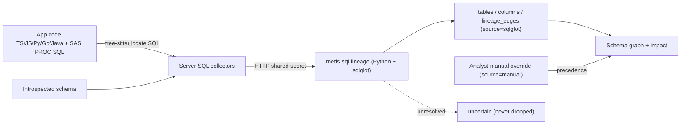

#### Cross-project impact — DatabaseResource registry (Epic #295, Phase 4)

Phases 1–3 reason about schema impact **within one project**. Phase 4 adds the
**cross-project** dimension: the same physical database is often connected from
several projects in a workspace, and a requirement change in one project can
affect objects that sibling projects also depend on. Two new workspace-scoped
models provide the canonical identity that makes this possible:

- **`DatabaseResource`** (`database_resources`) — a workspace-scoped registry of
  PHYSICAL databases, deduped by `(workspaceId, driver, host, port, databaseName)`.
  The same DB connected from two projects collapses to ONE resource. `DatabaseConnection`
  gains a nullable `databaseResourceId` FK (SetNull). The dedupe key is a pure,
  unit-tested function (`@metis/shared` `databaseResourceKey`) that the migration
  backfill mirrors, so a runtime find-or-create and the historical backfill
  converge on the same row. Connections in a project with no workspace, or lacking
  the minimum identity (non-null host + database), are left **unlinked** — distinct
  DBs never collapse by accident.
- **`SchemaObjectIdentity`** (`schema_object_identities`) — the canonical identity
  of a schema object (table/column/procedure/function) per `DatabaseResource`,
  deduped by `(databaseResourceId, schemaName, objectName, objectType)`. The SAME
  object seen from multiple projects reconciles to ONE identity, which carries an
  optional `usageClass` rollup across the linked projects (used if ANY project uses
  it, else uncertain/unreferenced). `ImpactAffectedTable` gains a nullable
  `schemaObjectIdentityId` FK (SetNull); `crossToSchema` associates affected rows to
  an identity **only when a resource is known** — the common single-project path
  passes no resolver and behaves exactly as before.

Two read-only cross-project queries (`server/src/lib/cross-project/cross-project-impact.ts`,
routes on `/api/impact-analyses`):

- **"Which projects use object X"** (`GET /workspaces/:workspaceId/objects/usage`) —
  the projects within the caller's authorized workspace that reference a canonical
  object, each with its per-project usage class + evidence count and a rollup.
- **Cross-project impact** (`GET /projects/:projectId/cross-project-impact`) — a
  change in project A surfaces the affected canonical objects AND the OTHER projects
  in the SAME workspace that also use them, aggregated per project.

Both use relational adjacency (a cycle-safe, depth-bounded recursive CTE valid on
SQLite + Postgres — `buildLineageCteSql` / the pure `traverseLineage` core); the
engine stays graph/BM25 with **no graph DB and no LLM/RAG**, and **never executes DDL**.

**Tenant isolation** is the load-bearing concern. A NEW workspace-membership guard
(`server/src/lib/cross-project/cross-project-access.ts`) adds the workspace
dimension on top of the existing project access: `assertWorkspaceAccessible` returns
**404 (never 403) with an audit row** for a non-member so workspace ids cannot be
enumerated, and `listAccessibleProjectsInWorkspace` INTERSECTS the workspace's
projects with the caller's accessible-project set so a caller never sees a sibling
project they cannot access even within a shared workspace. A member of workspace A
asking about workspace B gets a 404 — proven by dedicated cross-workspace denial
tests.

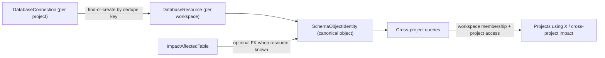

### Dual-Destination Publishing (#557)

Publishing routes issues to GitHub, Jira, or both via per-project `publishDestination` setting. The Jira publisher (`jira-publisher.ts`) maps draft types/priorities to Jira fields and publishes in batches with rate limiting. When destination is "both", Jira failures are best-effort and don't abort the GitHub publish path.

---

## 13.6 Skills + Agents Library (Phase 10)

Phase 10 introduces a versioned, project-aware library of reusable Skills (instructions injected into chat sessions on demand) and Agents (named personas + default tool/skill bundles). Definitions follow the standard `---\nfrontmatter\n---\nbody` Markdown format used by VS Code Copilot agent customization, validated by zod and parsed via `js-yaml`'s `FAILSAFE_SCHEMA` so YAML tag escapes (`!!js/function`, `!!python/object`) cannot land in the database.

### Modules (`server/src/lib/library/`)

| File                       | Responsibility                                                                                              |
| -------------------------- | ----------------------------------------------------------------------------------------------------------- |
| `frontmatter.ts`           | Safe YAML+Markdown parser, zod schemas, byte caps, `slugifyKey`, `bumpVersion`, deterministic `contentSha256`. |
| `skill-service.ts`         | CRUD + immutable `SkillVersion` history, soft archive/delete, revive-on-recreate, `diff(left,right)`.        |
| `agent-service.ts`         | Mirrors `SkillService`; resolves `defaultSkillKeys` to verified-enabled `Skill` rows inside a transaction.   |
| `project-allowlist.ts`     | Per-project enable/disable rows; default-allow when no rows exist (mirrors MCP allow-list).                  |
| `session-runtime.ts`       | Idempotent `loadSkillIntoSession`, `resolveAgentForSession`, system-block + system-message renderers.        |
| `search.ts`                | Combined skill+agent search with `query` / `tag` / `kinds` filters.                                          |
| `import.ts`                | `InlineLoader`, `FilesystemLoader` (no symlinks, path-containment), `RepoLoader`, `LibraryImporter`, `autoDiscoverFromWorkspace`. |
| `index.ts`                 | Barrel export.                                                                                               |

### Data flow (chat session bootstrap)

```
client                                     server
  │                                          │
  │  POST /api/ai/sessions                   │
  │  { agentId, skillIds }                   │
  │ ───────────────────────────────────────► │
  │                                          │  resolveAgentForSession()
  │                                          │   ├─► AgentService.get(agentId)
  │                                          │   └─► SkillService.getByKey() ×N
  │                                          │  persist agentSnapshot + loadedSkillIds
  │                                          │
  │  POST /api/ai/chat (or /stream)          │
  │ ───────────────────────────────────────► │
  │                                          │  buildLibrarySystemMessages(session)
  │                                          │   ├─► render agent system message
  │                                          │   └─► render each loaded skill block
  │                                          │  prepend → AI provider
```

### Loading skills mid-session

`POST /api/ai/sessions/:id/skills { skillId | skillKey }` (and the legacy `POST /api/skills/:id/load`) call `SessionRuntime.loadSkillIntoSession` which:

1. Looks up the skill (404 if missing, 409 `SKILL_NOT_AVAILABLE` if archived/disabled).
2. Reads the session's `loadedSkillIds` JSON column.
3. If already loaded, emits `audit('skill.load.noop')` and returns `alreadyLoaded: true` — no DB write.
4. Otherwise appends the id, writes `loadedSkillIds`, and emits `audit('skill.load')` with version + contentSha256.

### Per-project allow-list

`/api/projects/:projectId/library/{skills,agents}/:id` PUT/DELETE require `project.update`. With no rows for a project, every enabled (non-archived) skill/agent is allowed by default. Adding a row pins the explicit set.

### Import sources

- **Inline**: paste raw `---\n...\n---\n...` into the editor or `POST /api/skills/import/inline` with multiple files.
- **Filesystem**: `LIBRARY_AUTO_DISCOVER_ROOT` triggers a one-shot walk of `{root}/.github/skills` + `{root}/.github/agents` at boot. Symlinks are never followed; resolved candidates must remain under the root.
- **Repo**: `RepoLoader` accepts a thin `RepoFetcher` interface so the existing Phase 8 connector layer or Octokit can drive imports without coupling.

### RBAC

| Permission     | Who                | What                                                  |
| -------------- | ------------------ | ----------------------------------------------------- |
| `skill.manage` | admin              | Create / update / archive / disable / delete skills.  |
| `agent.manage` | admin              | Same lifecycle for agents.                            |
| `project.update` | admin, coordinator | Toggle / remove entries on a project's allow-list.    |

Reads (`GET /api/skills`, `/api/agents`, `/api/library`) require any authenticated user.

---

## 13.7 Scheduler + Tasks (Phase 11)

The scheduler turns the Task Engine (§9) into a first-class background runtime
with cron triggers, manual invocation, retries, cancellation, and live status
streaming. It is bootstrapped once at server startup (`bootstrapScheduler({io})`
in `server/src/server.ts`) and exposes a single in-process singleton via
`getSchedulerBootstrap()`.

### 13.7.1 Module layout

```
server/src/lib/scheduler/
├── config.ts               loadSchedulerConfig() + SCHEDULER_DEFAULTS
├── cron-validator.ts       validateCron / nextRunOf (built on croner@9)
├── index.ts                bootstrapScheduler / getSchedulerBootstrap
├── scheduler-service.ts    CRUD + cron registration + manual trigger
├── socket-emitter.ts       scheduler:status / task:{id} room broadcasts
├── task-handlers.ts        InMemoryTaskHandlerRegistry + built-ins
├── task-queue.ts           TaskQueue: priority + concurrency + retry + cancel
├── task-store.ts           Prisma-backed TaskStore
├── types.ts                shared types + SchedulerError
└── webhook-handler.ts      hardened http-webhook task handler
```

Every layer is dependency-injected so tests run with in-memory stores and
no Croner timers (validator uses `paused: true` Cron instances).

### 13.7.2 Task lifecycle

```
       enqueue              dispatch             complete
pending ──────► pending ─────────────► running ─────────► completed
   ▲                                      │
   │                                      ├─► failed (attempts == max)
   │                                      │
   └─── markRetrying ──── error ◄─────────┴─► retry (with backoff)
                                          │
                                          └─► cancelled (via AbortSignal)
```

Status transitions are persisted on `Task` via the `TaskStore` interface and
each transition fires an audit event (`task.enqueue`, `task.start`,
`task.complete`, `task.fail`, `task.cancel`, `task.retry`). The dispatcher
reserves a concurrency slot synchronously before kicking off the async
`execute()` chain, so `enqueue()` calls racing each other can never
over-dispatch past `SCHEDULER_CONCURRENCY`.

Retry backoff is exponential and bounded:
`min(SCHEDULER_RETRY_BACKOFF_MS * 2^(attempt-1), SCHEDULER_RETRY_BACKOFF_MAX_MS)`.

### 13.7.3 Built-in handlers

`registerBuiltInHandlers(registry, deps)` wires the v1 task catalogue:

| `task.type`                     | Purpose                                              |
| ------------------------------- | ---------------------------------------------------- |
| `refresh-repo-connector`        | Re-pull metadata + re-ingest a repo connector.       |
| `refresh-db-connector-schema`   | Re-introspect schema + samples for a DB connector.   |
| `rerun-analysis`                | Trigger Phase 7 analysis on a project.               |
| `publish-batch`                 | Re-run a Phase 9 publish (idempotent).               |
| `http-webhook`                  | POST a JSON payload to a vetted external URL.        |

Handlers receive a `TaskHandlerContext` with `task`, an `AbortSignal`,
`reportProgress({step, current, total | pct})`, and a structured `log()`.
Handlers whose downstream service callback is missing throw `not wired`
errors rather than crashing on startup — this is what lets handlers be
registered eagerly while the underlying services attach lazily.

### 13.7.4 HTTP webhook security envelope

The `http-webhook` handler in `webhook-handler.ts` enforces the same network
contract as Phase 8's repo connectors:

- Hostname must appear in `WEBHOOK_ALLOWED_HOSTS` (case-insensitive).
- HTTPS is required when `NODE_ENV=production`.
- DNS pinning runs through `resolveAndAssertConnectorHost(host, "repo")` so
  hostile DNS cannot rebind the host between validation and connect.
- Outbound payload size is capped at `WEBHOOK_MAX_BYTES` (default 64 KiB).
- Outbound timeout is `WEBHOOK_TIMEOUT_MS` (default 10s) and fires through
  the same `AbortController` that handles task cancellation.
- Method must be `POST` / `PUT` / `PATCH`.
- `Authorization` headers passed via `payload.headers` are dropped — auth
  must use `payload.authHeader`, which may be a `${vault:label}` reference
  resolved at fire time so secrets never sit in payload JSON.
- Audit logs record only the hostname, status code, and method (never the
  URL, headers, or body).

### 13.7.5 Realtime model

The emitter in `socket-emitter.ts` publishes to two rooms:

| Room                | Events                         | Subscriber permission |
| ------------------- | ------------------------------ | --------------------- |
| `scheduler:status`  | scheduler events + task status | `scheduler.read`      |
| `task:{id}`         | task status + progress         | `task.read`           |

Task status events are double-broadcast on `scheduler:status` so the `/tasks`
queue page renders without subscribing per-task. Clients use
`subscribe:scheduler` / `subscribe:task` events (defined in
`packages/shared/src/socket.ts`); the server validates the caller's
permission before joining the room.

### 13.7.6 RBAC

| Permission         | Admin | Coordinator | Developer | Reader |
| ------------------ | ----- | ----------- | --------- | ------ |
| `scheduler.read`   |  ✓    |  ✓          |  ✓        |  ✓     |
| `scheduler.manage` |  ✓    |  ✓          |          |       |
| `task.read`        |  ✓    |  ✓          |  ✓        |  ✓     |
| `task.cancel`      |  ✓    |  ✓          |          |       |
| `task.retry`       |  ✓    |  ✓          |  ✓        |       |

### 13.7.7 Health

`scheduler.health()` is wired into `/health`'s deep check. It reports `degraded`
when `SCHEDULER_ENABLED=1` but the dispatcher has not ticked in 5 minutes while
running tasks remain — a strong signal that the singleton has wedged.

---

## 13.8 Auto Documentation Generator (Epic #486)

METIS can automatically generate living business documentation from ingested source code. The feature leverages the existing code graph (tree-sitter AST), rationale extractor, and RAG knowledge base to produce structured documentation that includes formulas, business rules, data flow diagrams, and domain-specific constants — all rendered in rich Markdown with Mermaid diagrams and LaTeX math notation.

**Trusted evidence foundation (#1353).** [Policy resolution](../server/src/lib/docs-gen/evidence-policy.ts)
persists the authenticated initiating user in a separate versioned `evidencePolicy`
column, never trusting `scopeFilter.actorId`. Background execution revalidates active
user, assigned role/permission and workspace membership. Missing legacy policy fails
closed. Repository graphs must belong to the requested project and a live connector;
missing/deleted/foreign scope never broadens. Both document and section retrieval pass
the resolved actor and policy to `KnowledgeService.search`. Its
[primary-evidence filter](../server/src/lib/docs-gen/evidence-filter.ts) hydrates live
SQL text and enforces document/chunk ACLs, project/repository identity, indexed/live
document state and generated-artifact exclusion before reranking. Repository-scoped
non-repository references require an explicit document-ID allowlist; web research
requires a persisted opt-in. Sources are separately classified. No generated material
is admitted as primary support, including the current artifact. Graph/source extraction
remains distinct from knowledge-vector retrieval. Publication/reconciliation and
ingestion-triggered regeneration are separate lifecycle stages described below.

**Repository source identity (#1354).** Holistic synthesis resolves each selected
code graph's own live connector and checkout through
[repository sources](../server/src/lib/docs-gen/repository-sources.ts). Modules,
source-cache keys, fact-cache keys, graph summaries and citable facts retain the
connector/graph identity; identical relative paths never merge across repositories.
[Repository identities](../server/src/lib/docs-gen/repository-identity.ts) encode
`[repoConnectorId, codeGraphId, relativePath]` reversibly, independently of local roots.
Missing checkouts produce repository-specific `source-unavailable` warnings while
valid repositories continue. Source/SQL reads require containment inside that root,
including symlink resolution; neither cwd nor another connector is a fallback.
Existing per-module source caps and project-wide SQL-discovery budgets are retained.

**Versioned provenance manifests (#1355).** Each generated-document version now
stores an immutable `revisionId` plus a JSON `provenanceManifest` on
`GeneratedDocumentVersion`, and both the full-generation route and incremental
regeneration write the same contract. The manifest captures the version identity,
generation timestamp, document scope/docType, effective evidence policy, the
generation pipeline, phase-1/phase-2/claim/judge model identities, prompt versions,
selected evidence IDs and hashes, section metadata, and repository/code-graph
fingerprints including commit SHA when available. Historical-citation support is
reported honestly: legacy rows stay `legacy-unknown`, evidence-less new versions are
marked `not-retained`, and versions with stored approved evidence remain explicitly
pending until citation re-resolution is implemented.

### Architecture

```
┌──────────────────────────────────────────────────────────────────┐
│                   Documentation Generation Pipeline               │
├──────────────────────────────────────────────────────────────────┤
│                                                                   │
│  ┌────────────┐     ┌──────────────┐     ┌──────────────────┐   │
│  │  Formula   │     │  Discovery   │     │    Document      │   │
│  │  Extractor │────▶│    Agent     │────▶│    Assembler     │   │
│  │(tree-sitter)│     │  (LLM call)  │     │  (Markdown gen)  │   │
│  └────────────┘     └──────────────┘     └────────┬─────────┘   │
│        ▲                    ▲                      │              │
│        │                    │                      ▼              │
│  ┌─────┴──────┐     ┌──────┴──────┐     ┌──────────────────┐   │
│  │ Code Graph │     │  RAG Store  │     │   Format Export   │   │
│  │  (symbols  │     │ (knowledge  │     │  PDF · DOCX · MD  │   │
│  │   + edges) │     │   chunks)   │     └────────┬─────────┘   │
│  └────────────┘     └─────────────┘              │              │
│                                                   ▼              │
│                                          ┌──────────────────┐   │
│                                          │ Publication Task │   │
│                                          │  + Quarantine    │   │
│                                          │  + Approval ACL  │   │
│                                          └──────────────────┘   │
└──────────────────────────────────────────────────────────────────┘
```

### Generated-document authorization boundary

[durable-roles.ts](../server/src/lib/auth/durable-roles.ts) supplies the canonical
effective role for live generated-document authorization and background evidence
policy checks. `UserRole.source` distinguishes provider grants from explicit local,
SCIM, and legacy (`unknown`) assignments. Explicit assignments win; otherwise
trusted login replaces provider grants with the current provider mapping. Login
reads active-user status, `authRolesInitializedAt`, and assignments within one
serializable transaction. An initialized user with no assignments remains `reader`,
and transaction conflicts abort rather than issue unpersisted privileges.

SCIM provisioning initializes that marker; membership changes remove provider grants
and preserve local provenance in the same transaction. Removing a SCIM grant cannot
uncover a stale provider administrator grant. Generated-document routes and workers
resolve current assignments rather than replay saved request roles. The SQLite and
PostgreSQL migrations default existing assignments to explicit `unknown` provenance;
they do not guess whether a legacy assignment originally came from an IdP.
SCIM removal retains its legacy contract for a targeted `unknown` membership,
but preserves grants positively identified as `local`.
Both migrations initialize existing users conservatively: a legacy empty role set
may be a revocation, so it cannot bootstrap provider privileges. Under the approved
2026-09-18 decision, operators explicitly reconcile legacy role-less accounts;
post-migration non-SCIM users can bootstrap normally. An absent SCIM membership
removal changes no grants.

The account-scoped [reconciliation service](../server/src/lib/auth/role-reconciliation.ts)
supports `provider-managed`, `keep-explicit`, and `revoked` decisions through the
Bearer-only `/api/admin/auth/role-reconciliation/{inspect,confirm}` API and a separate
[trusted host-operator CLI](../server/src/lib/auth/role-reconciliation-cli.ts).
HTTP callers cannot choose host authority. API administrator authority is resolved
from active durable state **inside** the serializable transaction, never from the
JWT role; self-approval is refused. No broader authentication rewrite is implied.

Inspection fingerprints identity, status, initialization, authority, update time,
and ordered assignments. Confirmation checks the ID, username, fingerprint and
an `updateMany` timestamp compare-and-swap before mutation. A monotonic update time
prevents same-millisecond approval reuse. A UUID-keyed audit record stores the actor,
reason, exact decision, before/after state and request/result hashes in the same
transaction. Audit failure rolls back access changes. Identical replay is a no-op
only if current state still equals the recorded result; other replay/conflicts fail.

Provider approval creates **only a provider reader** assignment, with no role claim
accepted from the request. Existing trusted-login reconciliation replaces it on the
next fresh login using the configured provider's current result. It does not clear
the initialization marker. Explicit assignments cannot be converted or deleted by
this workflow. `revoked` removes provider grants, not explicit access.

The additive SQLite/PostgreSQL `authRoleAuthority` migration preserves grants and
timestamps and marks positive SCIM evidence from role sources and user-targeted
creation/deletion audits, not ambiguous generic update audits. SCIM provisioning,
lifecycle changes and actual membership mutations durably stamp
that authority, clear provider grants and serialize with reconciliation; removal
of the final SCIM assignment does not make the account provider-eligible. Group
deletion refuses local assignments rather than cascading them away. Historical
group-only audits cannot recover member identity, so ambiguous legacy accounts
remain reader pending explicit verification. No automatic elevated backfill occurs.
Profile-only and redundant same-status SCIM patches preserve grants and authority;
status transitions are determined from a fresh transactional user read.
Canonical role resolution
honors known SCIM/explicit/revoked authority even when leftover provider rows exist,
at login, live generated-document requests, background workers and recovery-admin
authorization; the highest explicit grant remains authoritative.
See the [operator recovery and rollback workflow](USER_GUIDE.md#legacy-account-access-recovery-1350).

### Server Modules (`server/src/lib/docs-gen/`)

| File | Purpose |
|------|---------|
| `formula-extractor.ts` | Tree-sitter AST queries that extract arithmetic expressions, constants/magic numbers, conditional business logic, and validation patterns from Java and TypeScript source |
| `discovery-agent.ts` | Walks the code graph, identifies "documentable" public classes/methods by naming heuristics and complexity, reads method bodies via file slice, gathers call graph context, and sends to LLM for natural-language summarization |
| `assembler.ts` | Combines discovery agent output into structured Markdown with auto-generated TOC, Mermaid call-flow diagrams, LaTeX formula sections, module grouping, and cross-references |
| `exporters.ts` | Converts Markdown to PDF (via `md-to-pdf` + Puppeteer) or Word (via `docx` library with Table of Contents, headings, code blocks). Falls back to styled HTML when Chrome binary is unavailable |
| [incremental.ts](../server/src/lib/docs-gen/incremental.ts) | Successful-ingest hook: compares scoped input inventories and persists/resumes version-and-fingerprint-keyed regeneration tasks |
| [generation-inputs.ts](../server/src/lib/docs-gen/generation-inputs.ts) | Captures scoped symbols, relationships, source/rationale, eligible evidence, and effective settings as hashes; rechecked before committing a version |
| [section-reuse.ts](../server/src/lib/docs-gen/section-reuse.ts) | Validates complete, integrity-checked section synthesis records and hashes actual ordered prompt inputs for conservative reuse |
| `holistic-synthesizer.ts` | Two-phase holistic generation: Phase 1 extracts per-module facts (Haiku), Phase 2 synthesizes a single narrative document with Mermaid diagrams (Sonnet). Supports `"full"`, `"module"`, `"symbol"`, `"repository"`, and `"database"` scope variants |
| `db-schema-synthesizer.ts` | Generates documentation from live database schema introspection. Connects via `dbConnectorId`, reflects tables/columns/constraints, and produces an entity-relationship narrative |
| `generated-doc-provenance.ts` | Defines the generated-document revision ID and immutable per-version provenance manifest, and normalizes legacy history rows on read |
| `interrupted-generations.ts` | #50 — generation runs in-process (`generateDocumentAsync`), not as a scheduler task, so durable-task recovery never saw a run killed by a restart. A claimed run heartbeats its `generated_documents.updatedAt` every 60 s (fenced on its claim); a sweep started from `server.ts` (at startup, then every minute, independent of the scheduler) fails `generating` rows with no heartbeat for 5 min and `pending` rows untouched for 15 min, compare-and-set on the `updatedAt` it read, and revokes the dead run's claim. Heartbeat-keyed, so another replica's live run is never failed. Not auto-resumed (unattended token spend); `POST /docs/:docId/regenerate` restarts a failed doc in place and reuses the Phase-1 fact cache. |
| `generated-doc-publication.ts` | Durable publication entrypoint for generated docs. Creates the synthetic `Document`, persists the latest markdown blob, enqueues `publish-generated-document`, chunks markdown into revision-scoped sections, and publishes through the shared quarantine/approval pipeline. Publication preserves a conservative derived ACL on the synthetic document, honors the normal quarantine auto-approval policy instead of forcing approval, and reconciles deleted or superseded artifacts out of `QuarantineChunk`, `KnowledgeChunk`, vector storage, and BM25 before any delayed worker can republish stale content. |
| `rag-ingest.ts` | Back-compat wrapper over the durable publication flow. Preserves the older `ingestDocumentToRag(...)` call surface while delegating to `generated-doc-publication.ts` |

Generated documentation no longer writes directly into the live knowledge store from the generation route. Instead, generation and incremental regeneration enqueue a retryable `publish-generated-document` task keyed by generated-document id, version, and immutable `revisionId`. The worker writes the synthetic document blob, computes embeddings, parks chunks in `QuarantineChunk`, and promotes them through the same approval path used by other trusted content when the normal auto-approval policy allows it. This keeps generated docs on the shared publication/indexing state machine, preserves chunk provenance (`generatedDocumentId`, version, `revisionId`, section slug/index), carries forward a conservative derived ACL on the synthetic document, and gives the system an explicit distinction between generation health and indexing health. Deletion now enqueues cleanup for every persisted revision of the synthetic artifact, so cleanup no longer depends on the original generator still being active when the document is removed.

> **SAS language support (Epic #197).** `.sas` is a first-class code-graph language alongside TypeScript, JavaScript, Python, Go, and Java. A dedicated regex parser (`parseSas` in `server/src/lib/code-graph/parsers.ts`) emits `module`/`function`/`type` symbols and `imports`/`calls`/`references` edges (DATA-step, PROC, and PROC SQL data lineage is captured as `references` edges with `{ lineage, dataset }` metadata). Because SAS has no classes, the discovery agent (`discovery-agent.ts`) treats a directory with ≥3 SAS `function` symbols as documentable, and `.sas` files are ingested into the RAG index (`connector-ingest.ts` `SOURCE_EXTENSIONS`).

### Data Model

```prisma
model GeneratedDocument {
  id            String    @id @default(cuid())
  projectId     String
  title         String
  scope         String    @default("full")    // "full" | "module" | "symbol" | "repository" | "database"
  scopeFilter   String    @default("{}")       // JSON filter criteria
  evidencePolicy String?                       // Server-authored policy; legacy NULL fails closed
  content       String?                        // Current markdown content
  status        String    @default("pending")  // "pending" | "generating" | "ready" | "degraded" | "failed"
  autoUpdate    Boolean   @default(false)      // Regenerate on re-ingest
  codeGraphHash String?                        // Input fingerprint after commit; temporary claim while generating
  generatedAt   DateTime?
  createdAt     DateTime  @default(now())
  updatedAt     DateTime  @updatedAt
  project       Project   @relation(fields: [projectId], references: [id])
  versions      GeneratedDocumentVersion[]
}

model GeneratedDocumentVersion {
  id             String   @id @default(cuid())
  documentId     String
  version        Int
  revisionId     String?
  provenanceManifest String?
  content        String
  diffSummary    String?
  changedSymbols String?  // JSON array of symbol names that changed
  createdAt      DateTime @default(now())
  document       GeneratedDocument @relation(fields: [documentId], references: [id])
}
```

### Publication ownership and recovery

New synthetic document identities include both generated-document and revision IDs
(`gendoc-<documentId>:<revisionId>`). Version persistence and publication-task creation
share a SQL transaction; deletion likewise atomically persists its tombstone and all
revision cleanup tasks. Dispatch happens after commit, so startup recovery handles a
crash before dispatch. Repeated authorized deletion is idempotent and does not revive
explicit user cancellations.

SQL chunks, vectors, and BM25 entries share that
immutable revision namespace. Compensation targets only the worker's own identity or
strictly older versions; the legacy shared identity is cleanup-only (status reads retain
a compatibility fallback). Cleanup tombstones SQL before deleting external entries.
Approval assigns unique chunk IDs to each attempt and journals those IDs durably in
negative-ordinal quarantine rows before external writes. SQL finalization atomically
selects one attempt and removes source quarantine rows; compensation revokes attempts
atomically before deleting their unselected chunk IDs, including during overlapping
retries and ordinary reingestion. Selection stays `reconciling` until cleanup succeeds;
cleanup failure reports failed status with an error instead of a false indexed success.
Cleanup journals are excluded from evidence retrieval and retained for later recovery.
Cross-store operations are compensating, not a distributed transaction.

The Quarantine list includes `reconciling` documents with a selected approval
journal, preserving a **Retry indexing** action and saved error after reload. It uses
the existing approval endpoint and permissions. Shared approval additionally fences
generated IDs against the latest live immutable revision and persisted initiating-user
policy inside its SQL transaction, including final selection and reconciliation success.
This applies to manual approval and workers alike; legacy/unversioned IDs fail closed.

Approval replays its selected vectors under project write coordination through SQL
selection. Reindex catches up live SQL membership before cutover under the same
coordination. Durable model/dimension generation descriptors reject stale quarantine
embeddings and leave interrupted migrations pending until recovery. File-store project
coordination is single-process; PostgreSQL uses transaction-scoped coordination.

Shared approval propagates BM25 failures and retains quarantine until all stores succeed;
cleanup propagates sparse removal failures too. Warm partial additions and failed cold
loads retain retry-safe ownership. The scheduler preserves unfinished publication and
deletion-cleanup tasks during shutdown and resumes pending rows on startup/minute passes.
Stale running publication rows become pending after the handler timeout; regeneration
retains its two-hour lease. Explicit user cancellation is persisted before acknowledgment
and remains terminal, as do completed and exhausted failed jobs. Handler timeouts retry
with bounded backoff after settlement rather than masquerading as user cancellation.
Recovery is at-least-once.

### REST API (`/api/projects/:projectId/docs`)

| Method | Path | Purpose | Rate Limit |
|--------|------|---------|------------|
| `POST` | `/generate` | Trigger documentation generation (async, returns 202) | 5 req/15min per user |
| `GET` | `/` | List generated documents for a project, including separate indexing state from the synthetic `Document` row | — |
| `GET` | `/:docId` | Get a single document: its content once, plus summary metadata, the five latest version summaries (`id`, `version`, `revisionId`, `diffSummary`, `createdAt`) and separate indexing state | — |
| `GET` | `/:docId/versions/:versionId` | One version's markdown body (#190) | — |
| `GET` | `/:docId/versions/:versionId/provenance` | One version's full provenance manifest (#190); the UI fetches it only for **Download full manifest** (#196) | — |
| `GET` | `/:docId/versions/:versionId/provenance/summary` | The Provenance panel's summary of it: `revisionId`, `version`, `generatedAt`, `pipeline`, `models`, `sectionCount`, `selectedEvidenceCount`, `sourceCount`, `historicalCitations`, `legacy` (#196) | — |
| `GET` | `/:docId/versions/:versionId/changed-symbols?offset=&limit=` | A page (default 500, max 5,000) of one version's changed symbols, with `total` (#190) | — |
| `GET` | `/:docId/export?format=pdf\|docx` | Download in specified format | — |
| `PATCH` | `/:docId` | Update document metadata (title, autoUpdate flag) | — |
| `DELETE` | `/:docId` | Soft-delete a generated document | — |

Every version summary carries a stable `revisionId`. A version's provenance manifest
comes from its own endpoint (#190 — for a full-coverage document the manifest alone
was 17.5 MB of a 27 MB detail response): new rows return the stored manifest; legacy
rows are normalized at read time so clients can distinguish `versioned` history from
`legacy-unknown` history without pretending old evidence snapshots existed. The
per-version endpoints sit behind the same `requireProjectAccess` gate and
`project.read` permission as the detail route, and look a version up through its
document's project, so a foreign version id is a 404.

#196 — a version row is written once and never updated, so its heavy columns are
parsed at most once per server process: `server/src/lib/docs-gen/generated-doc-version-reads.ts`
keeps each version's provenance **summary** (≈400 bytes, from a 17 MB manifest) and its
parsed changed-symbol array in bounded LRUs keyed by project, document, version id and
`createdAt`. The list and detail routes' legacy-index check reads the summary lazily (only
when no publication outbox exists and the revision-owned index row is missing), instead of
selecting every latest version's manifest. Responses are compressed by `compression`
1.8, which already negotiates Brotli (quality 4) for clients that send `br` and gzip
otherwise; on the 611,592-character document the detail body is 151 KB gzip and 144 KB
Brotli, so no stronger Brotli setting is used (quality 11 saves another 29 KB for ~0.5 s
of CPU per response).

### UI Components

| Component | Path | Purpose |
|-----------|------|---------|
| `MarkdownPreviewer` | `ui/src/components/markdown-previewer.tsx` | Rich renderer: Mermaid diagrams (rendered as SVG via `mermaid.render()`), KaTeX math formulas, syntax-highlighted code blocks, GFM tables. Includes URL sanitization to block `javascript:`/`data:` protocols. #190 — renders progressively: `ui/src/lib/markdown-sections.ts` splits the content at H2/H3 (fence-aware) and each section gets its own react-markdown pass when it nears the viewport, is picked from the TOC, or is the URL-hash target; until then it shows as plain text (find-in-page still works). Heading ids continue one document-wide slug counter across sections, so repeated headings keep distinct ids. #196 — the splitter (TOC links, pending anchors, deep-link lookup) and the renderer (`remarkSectionSlugs`) derive every id from one function, `headingSlugText`, over the same parsed heading, so `_emphasis_`, entities and inline HTML cannot make them drift. #227 — both sides get the heading text from `headingText`, which re-parses a heading beside the document-wide definitions of the labels it names, so a reference link (`[text][ref]`) resolves and a footnote reference (`[^1]`) drops out whichever section the definition sits in. Both sides slug the heading as parsed from its own source line, never the renderer's section-wide parse, so a definition the line-based collector misses (inside a blockquote or list item, or directly after a thematic break or indented code) leaves the reference unresolved on both sides rather than making them disagree. `ui/tests/markdown-previewer.bench.test.tsx` (skipped unless `VIEWER_BENCH=1`) reproduces the viewer benchmark |
| Documentation Page | `ui/src/app/(authed)/projects/[id]/documentation/page.tsx` | Generation controls with scope selector, document card grid, detail view with TOC sidebar, export buttons, version history, and separate generation-vs-indexing status badges/summaries |

### Key Libraries

| Package | Version | Purpose |
|---------|---------|---------|
| `mermaid` | ^11.x | SVG diagram rendering from Markdown fenced code blocks |
| `md-to-pdf` | ^5.2.5 | Markdown → PDF via Puppeteer headless Chrome |
| `docx` | ^9.x | Programmatic Word document generation with TOC |
| `react-syntax-highlighter` | ^15.x | Code block highlighting with Prism themes |

### Living Documents (Incremental Regeneration)

**Successful ingestion is the trigger (#1356), not a commit notification or a
standalone graph write.** [Connector routes](../server/src/routes/connectors.ts)
call the regeneration check after background Deep Ingest, manual Deep Ingest, and
manual refresh complete graph/source ingestion and applicable metadata ingestion
without reported failures. Local/upload sources skip Git metadata. The scheduled
`refresh-repo-connector` [handler](../server/src/lib/scheduler/handler-overrides.ts)
uses the same hook after its graph, source-knowledge, and metadata steps succeed.
The cadence is the configured schedule, not a fixed documentation timer.

1. **Inventory and no-op.** For live `autoUpdate` documents in full, repository,
  module, or symbol scope, [captureGenerationInputs](../server/src/lib/docs-gen/generation-inputs.ts)
  records the full eligible symbol inventory (not a first-20 sample), additions
  and deletions, calls/imports/references and metadata, source-file content,
  bounded SQL inputs, rationale findings, the authorized indexed evidence pool,
  opted-in web digests, and effective scope/policy/project/model/prompt settings.
  Sorted multiset hashes retain duplicate declarations without depending on
  transient symbol row IDs. Repository scope stays within its resolved graph;
  narrow scopes use a conservative broader inventory. Unchanged snapshots create
  no task/version; an unrelated connector skips repository-scoped documents.
2. **Durable task identity.** [incremental.ts](../server/src/lib/docs-gen/incremental.ts)
  upserts `regenerate-generated-document` with ID `docs-regen:<SHA-256(payload)>`.
  Its strict payload contains only `projectId`, `generatedDocumentId`,
  `expectedVersion`, and the input `fingerprint`. It allows three attempts and
  resumes the existing pending row, rather than creating duplicate work. A later
  successful ingest can reset an exhausted failed task for the same inputs;
  cancelled tasks are not automatically resurrected.
3. **Recovery and authority.** With the scheduler enabled, its
  [recovery pass](../server/src/lib/scheduler/scheduler-service.ts) resumes pending
  regeneration tasks at leader startup and every minute, returning running tasks
  stale for over two hours to pending. Generation claims also have a two-hour
  stale threshold. Workers reload the persisted initiating-user policy and
  reauthorize that original actor at execution and before commit. Neither the
  task payload, `createdById` audit field, nor the scheduled connector's `system`
  actor grants generation authority; missing legacy policy fails closed.
4. **Production generation and conservative reuse.** The worker calls the same
  [generation path](../server/src/routes/generated-docs.ts) as manual generation.
  Full/repository documents retain holistic module-fact caching, synthesis,
  refinement, claim extraction, and grounding; module/symbol documents use
  discovery and assembly. Inventory planning defaults to full regeneration, not
  a guessed citation-to-section map. Only holistic synthesis can prove reuse:
  complete versioned records must match hashes of the actual ordered facts,
  formulas, global flow, fresh grounding text/IDs/metadata, document/group
  context, effective provider/model/limits/thresholds, and rendered prompts.
  Matching sections retain their Markdown, synthesis metadata, evidence, and
  original warnings. Changed sections use the original synthesis/grounding
  pipeline. Legacy/malformed/incomplete records force full synthesis; shared
  hybrid escalation disables reuse, and global dependencies or settings changes
  can invalidate every section. None of this uses Graphify.
5. **Fenced version then shared publication.** Before commit, authorization and
  the snapshot are checked again; a transactional claim/version check rejects
  deleted, superseded, disabled-auto-update, or concurrently changed work. Replay
  of a task whose expected next version already exists with the same fingerprint
  re-enqueues publication without another generation. Other stale envelopes are
  re-planned. The version stores `inputSnapshot`, complete `sectionSynthesis`
  when available, and the regeneration outcome. An inventory change can create
  a revision even when all section prompts match: its summary is **Source
  inventory updated; all section dependencies unchanged**, not a whole-inventory
  no-op. The committed version then enters the separate durable publication
  pipeline, with immutable version/revision fences and deletion cleanup.

Generation health (`ready`/`degraded`/`failed`) is not publication/indexing state:
readable output may still await quarantine, approval, embeddings, vector, and BM25
publication. Database-scope documents retain their schema-generation path and
provenance, but repository ingestion does **not** auto-regenerate them. Changes to
evidence/settings are detected on the next successful repository ingest, not by
an independent evidence/configuration watcher.

The benchmark harness for this pipeline is intentionally bounded and honest about
its measurement surface. Fixture repositories are seeded before timing begins,
so `coldIngestionMs` and `warmIngestionMs` measure local embedder warm-up plus
retrieval setup in the throwaway benchmark process, not production Deep Ingest
throughput from clone through indexing. The optional typed-symbol A/B path is
explicitly opt-in and stays disabled by default. All current comparisons, including
explicit live-model runs, remain exploratory and record `keep-disabled` (or exploratory
`insufficient-evidence` on safe fallback). Descriptive calibration metadata is not
validated judge calibration; there is no quality-promotion path until that validation
is integrated. Raw latency or correctness-adjacent movement is not a release-quality claim.

### Security

- **XSS prevention**: The Markdown previewer sanitizes all rendered URLs, blocking `javascript:`, `data:`, and `vbscript:` protocols
- **Rate limiting**: The `/generate` endpoint is rate-limited (5 requests per 15 minutes per authenticated user) to prevent abuse of the expensive LLM pipeline
- **Path containment**: File reads during discovery are constrained to the project's clone directory

### Holistic Synthesizer — Cost Optimization Architecture

The holistic synthesizer (`server/src/lib/docs-gen/holistic-synthesizer.ts`) is the most token-intensive workload in METIS. For a large Java monolith (1,500+ files) a naive single-model, no-cache approach would cost $20–30 per run. Three layered strategies bring this down to ~$1–3 on warm runs.

#### 1. Two-Phase Model Split

Generation is divided into two phases that use separate AI providers, each sized to the task:

```
┌──────────────────────────────────────────────────────────────┐
│                  Holistic Synthesizer                         │
│                                                              │
│  Phase 1 — Fact Extraction               Phase 2 — Synthesis │
│  ┌─────────────────────────┐             ┌─────────────────┐ │
│  │  BedrockDirectProvider  │             │ BedrockDirect   │ │
│  │  model: Haiku 4.5       │             │ model: Sonnet   │ │
│  │  maxTokens: 4,096       │             │ maxTokens: 8192 │ │
│  │  temp: 0.2              │             │ temp: 0.2       │ │
│  │  promptCaching: true    │             │ promptCaching:  │ │
│  │                         │             │   system: true  │ │
│  └────────────┬────────────┘             └────────┬────────┘ │
│               │ 150 modules × parallel            │          │
│               ▼ (concurrency=6)                   │          │
│  ┌─────────────────────────┐             per-section stream  │
│  │  DocsGenFactCache (DB)  │             (SSE, avoids ALB    │
│  │  SHA-256 key per module │             504 on long calls)  │
│  └────────────┬────────────┘             └─────────────────┘ │
│               │ cache miss only                               │
│               ▼                                               │
│         LLM call → store facts                               │
└──────────────────────────────────────────────────────────────┘
```

| Phase | Model | Purpose | Cost (per MTok in/out) |
|-------|-------|---------|------------------------|
| **Phase 1** | `global.anthropic.claude-haiku-4-5-20251001-v1:0` (override via `DOCS_GEN_PHASE1_MODEL`) | Structured fact extraction: business rules, formulas, class summaries. Produces compact JSON-ish bullet facts per module. | $0.80 / $4.00 |
| **Phase 2** | `us.anthropic.claude-sonnet-4-6` (override via `DOCS_GEN_PHASE2_MODEL`) | Long-form prose, Mermaid diagrams, LaTeX math, cross-module aggregation. Output quality matters here. | $3.00 / $15.00 |

Haiku 4.5 produces equivalent structured-extraction quality to Sonnet at approximately one-quarter the input cost. The model split alone reduces Phase 1 spend by ~73%.

#### 2. Phase 1 Fact Cache (`DocsGenFactCache`)

Online Phase 1 results with available source are cached in `DocsGenFactCache`.
The project-scoped key hashes the repository-qualified module identity, source
file hashes, mined rules/formulas, prompt version, **actual system and user
prompts** (including rationale and lineage), provider/model, effective provider
configuration, output cap, and caching capability. Missing source cannot silently
reuse old facts. This module cache is separate from the complete section-output
reuse contract described above; a hit does not by itself authorize section reuse.

The `provider.model` component is critical: Haiku and Sonnet extractions are stored as **separate cache entries**. Switching models triggers a full cache rebuild for that model, but the previous model's cache is preserved and still valid if you switch back.

```prisma
model DocsGenFactCache {
  id               String   @id @default(cuid())
  projectId        String
  cacheKey         String   @unique          // SHA-256 described above
  modulePath       String
  fileFingerprint  String                    // SHA-1 of source lines
  model            String                    // which model produced this
  promptVersion    Int                       // PHASE1_PROMPT_VERSION at write time
  facts            String                    // LLM output (compact facts)
  formulasJson     String   @default("[]")
  minedRulesJson   String   @default("[]")
  topClassesJson   String   @default("[]")
  classCount       Int      @default(0)
  methodCount      Int      @default(0)
  inputTokens      Int      @default(0)      // for cost reporting
  outputTokens     Int      @default(0)
  cacheReadTokens  Int      @default(0)      // prompt-cache read tokens
  createdAt        DateTime @default(now())
  lastUsedAt       DateTime @default(now())
  hitCount         Int      @default(0)      // how many runs served from cache

  @@unique([projectId, cacheKey])
  @@index([projectId, modulePath])
  @@index([lastUsedAt])
}
```

**Cache behaviour by scenario:**

| Run | Code changed? | Model changed? | Phase 1 LLM calls |
|-----|--------------|----------------|-------------------|
| First run | — | — | All modules (populate cache) |
| Second run, no changes | No | No | **0 — 100% cache** |
| After a code push | Some files | No | Only modules with changed files |
| After `DOCS_GEN_PHASE1_MODEL` change | No | Yes | All modules (new model key) |
| After `PHASE1_PROMPT_VERSION` bump | No | No | All modules (version mismatch) |

Cache entries are stored permanently (no TTL). The `hitCount` and `lastUsedAt` fields allow future eviction policies to target cold entries.

`minedRulesJson` holds **every** language's deterministically mined rules (Java,
TS/JS, Python, Go, SAS, SQL) in one shape — `{language, kind, expression,
summary, file, line, context}` (`fact-slices.ts`, #155); a cache hit reads them
back from the row. A Phase-1 reply that stops at the output cap
(`finish_reason` `length`/`max_tokens`, or the gateway placeholder) is retried
once at double the cap, clamped to the model's known ceiling; if it is still cut
off, the partial facts are used for that run but **not cached**, and the document
carries a `facts-truncated` warning (section `Phase 1 facts`) naming the modules
(#156). Rows written before that fix can be purged with
`pnpm --filter @metis/server facts:purge-truncated -- --dry-run` (deletes rows
with `outputTokens >=` the Phase-1 cap, default 8,192, written under an OLDER
`PHASE1_PROMPT_VERSION` — a current-version row at the cap can only be a
complete larger-cap retry; `--include-current` widens the sweep for a provider
that reports no finish reason; `--min-output-tokens`, `--project`; a value flag
with no value, or an unknown flag, is refused rather than widening the purge).

#### Phase-2 fact slices (#154)

Phase 2 no longer sends each section the whole facts blob of every module.
`fact-slices.ts` splits a module's facts deterministically on the Phase-1
headings into topic slices — `summary` (PURPOSE), `rules` (RULES,
STATUS_TRANSITIONS), `workflows` (WORKFLOWS, STATUS_TRANSITIONS, DATA_LINEAGE),
`entities` (ENTITIES, DATA_LINEAGE), `formulas`, `capabilities` (KEY_APIS),
`integrations`, `notes` — dropping "(none)" blocks and verbatim-repeated
bullets. A reply with no recognised heading is kept whole in `summary`. Each
`sectionGroupsFor` group declares `factSlices` (and the Rules sections
`minedRules`, which appends each module's `file:line` mined-rule inventory and
drops LLM bullets that restate a mined rule — matched only against the rules
the 4,000-char-capped inventory actually renders (`minedRulesThatFit`), so a
rule past the cut keeps its LLM bullet instead of vanishing). Headings are
recognised bare, decorated (`## RULES`, `**RULES:**`), numbered (`**1. RULES**`)
or inline (`RULES: - first item`). `selectRelevantFacts` ranks and
admits modules on those slices, and the facts blob, the citable `facts:`
grounding sources and the `facts-truncated` budget are all rendered from the one
per-section module entry, so what the model reads and what its claims are judged
against stay identical. On onyourleft (143 TypeScript modules, gemma3:12b facts)
at a 200,000-char cap the Rules section went from 8 to 35 modules, Key Workflows
from 11 to 91, Calculations from 11 to all 143.

#### Batched enumerative sections (#157)

Business Rules, Key Workflows, Calculations and Data Model are catalogs whose
length grows with the codebase, so they declare `batched: true` on their
`SectionGroup` and are written in several calls instead of one. On onyourleft
(143 modules), raising the section output cap from 8,192 to 16,384 tokens only
doubled Rules from 32,169 to 63,719 chars, still cut off, having read ~10% of
the modules.

- **Plan** (`planSectionBatches`): every module with content for the section
  (a declared topic slice, a rendered mined rule, or — for Calculations — an
  extracted source formula) is taken in
  `rankRelevantFacts` order. Modules are packed greedily into batches whose
  facts fit `factsCharCap` **and** whose *estimated reply* fits
  `batchOutputBudgetChars` (the section output cap × 3.5 chars/token × 0.6
  margin). A module's estimate is 300 + 1.25 × its topic-slice chars + 300 per
  mined rule the capped inventory renders. Both come from `factsModuleParts`,
  the same function that builds the entry the model reads, so the estimate
  never counts rules past the inventory cut. For Calculations a batch also
  holds at most as many extracted formulas as its formulas block renders (80,
  counted with the same `distinctFormulas` the block is built from), so no
  module's extracted formulas are cut from its batch. No "ADDITIONAL MODULES
  (facts omitted)" catalog is sent. `DOCS_GEN_BATCHED_SECTIONS=0` turns
  batching off and restores the single-call path.
- **Generate** (`synthesizeBatchedSection`): one call per batch, in order. The
  batch's facts, its own modules' source formulas and a batch note go in the
  prompt, and only the batch with the most relevant module writes the
  introduction. A reply that finishes with `finish_reason` `length` (or the
  gateway placeholder) is split in two by estimated output and each half
  regenerated. `shouldResplit` bounds this: never below one module, at most one
  re-split per planned batch across the section, and never for a batch estimated
  under a quarter of the budget (#165's runaway shape). A model that always runs
  to the cap therefore costs at most 3× the planned calls. What is still cut off
  raises one `section-truncated` warning naming the modules and why each part
  stayed whole: a module that *alone* exceeds the cap, a batch left whole
  because the section's re-split allowance was used up by earlier batches, or a
  runaway batch estimated far below the cap. A failed batch, or one whose reply
  is empty, costs only its modules (a `section-failed` warning names them). The
  section fails only if every batch fails.
- **Merge** (`mergeBatchSections`, `section-batching.ts`): replies are parsed into
  H3 topic → H4 subtopic → entries. An entry is a list item with its nested
  lines, a table, a fence, or a paragraph with the list it introduces. Topics
  and subtopics with the same normalised heading merge in order of first
  appearance, and entries follow in batch (relevance) order. An entry identical
  to one an *earlier* batch wrote (ignoring numbering on every line, emphasis,
  case and spacing) is dropped. Substantive entries (40+ chars) are matched
  section-wide and short ones only within their subtopic. Repeated table rows
  under the same header are dropped. Fences are atomic — including a fence nested
  in a list item at any indentation (four or more spaces, or a tab) — and an
  unclosed fence is closed at the end of its own reply.
- **Ground**: each reply is decomposed and judged against its **own** batch's
  facts plus the section's retrieved sources. The section's faithfulness is the
  pooled supported/total over verified batches (`aggregateFaithfulness`),
  graded by the same `gradeFaithfulness` as a single-call section. When some
  batches were graded and others were not (unverified, or scoring threw), a
  `section-ungrounded` warning names the unchecked modules and says how many
  parts the score covers. Judge-gated
  escalation (#334) re-runs the whole batched section on the escalation
  provider, re-planned for its budget and cap.

On the real onyourleft facts at a 16,384-token cap, the plan is Rules 20
batches (143 modules, all 4,611 rule bullets), Workflows 9, Calculations 35
(142 modules, all 2,619 extracted formulas; 6 before the formulas-block cap was
honoured) and Data Model 14. A single call at 200,000 chars reads 35, 91, 143 and 60 modules
respectively. `Batched section synthesized` logs planned vs actual calls,
re-splits, wall time, and estimated vs actual reply chars, which is the data
for calibrating the output estimate.

#### 3. Dynamic Per-Module Snippet Budgets

Rather than sending the maximum context window to every module, Phase 1 tiers the code context by module complexity:

| Module symbol count | Snippet context sent | Methods included |
|--------------------|---------------------|------------------|
| ≤ 10 symbols | 18,000 chars | up to 25 |
| 11–50 symbols | 36,000 chars | up to 50 |
| > 50 symbols | 60,000 chars | up to 80 |

Tiny utility modules (validators, constants, DTOs) typically have ≤ 10 symbols and don't benefit from reading 60K of context. Tiering reduces Phase 1 input tokens by ~30–40% on mixed codebases.

Methods within a module are sorted largest-first (by line span) so the highest-complexity methods — where business logic is most dense — are always included within budget.

#### 4. Phase 2 Streaming (ALB 504 Mitigation)

Phase 2 synthesis sections can take 60–120 seconds each on long documents. To prevent ALB idle-timeout 504s, Phase 2 calls use `provider.stream()` (SSE) rather than `provider.chat()`. The server collects deltas internally and assembles the full section before writing to the database — the client sees no difference, but the ALB connection stays alive throughout.

#### 5. Hybrid Per-Section Provider Routing (Epic #331 / Issue #333, default OFF)

Phase 2 no longer needs to run every section on one provider. When `DOCS_GEN_HYBRID_ROUTING=1` **and** both a local (`LOCAL_GEMMA_BASE_URL`) and an escalation provider are configured, `synthesizeFinalDocument` routes each section group to a provider by its faithfulness **tier** — high-volume grounding-hardened sections run on a near-zero-cost local model, and long-context abstractive narrative runs on Sonnet:

```
                    ┌──────────────────────────────────────────┐
 SectionGroup ────► │  tierForSection(group)  (degraded-warnings)│
                    │  narrative / reconstruction / literal      │
                    └───────────────┬────────────────────────────┘
                                    │ providerForSection(router, group)
              narrative ────────────┤
                                    ▼
        ┌──────────────────────────────────┐   literal + reconstruction
        │ escalation bundle (Sonnet)        │   ┌────────────────────────────┐
        │  native Anthropic if ANTHROPIC_*  │   │ local bundle (local-gemma)  │
        │  else Bedrock gateway             │◄──┤  loopback/RFC-1918-guarded  │
        │  supportsCaching, large factsCap  │   │  DOCS_GEN_LOCAL_* tuning     │
        └──────────────────────────────────┘   └────────────────────────────┘
```

Design points:

- **`tierForSection(group)`** (`grounding/degraded-warnings.ts`) is the single source of truth for a section's tier, derived from the SAME `narrative`/`reconstruction` flags + threshold constants (0.4 / 0.6 / 0.8) that already GATE the section — so routing can never drift from gating.
- **`resolvePhase2Router(maxTokens)`** (`holistic-synthesizer.ts`) builds the local + escalation `Phase2ProviderBundle`s up front, independent of the globally-selected `AI_PROVIDER`. Each bundle carries its own `docsGenTuning` (model, `supportsCaching`, `factsCharCap`), and generation, claim extraction, and the faithfulness judge for a section all use that section's bundle — so local vs cloud sections stay independently tuned.
- **`providerForSection(router, group)`** selects the bundle per section: `narrative → escalation`, `literal | reconstruction → local`.
- **Default OFF / graceful fallback.** With the flag off, or on but with only one provider configured, `router.hybrid` is `null` and every section uses the single primary bundle — byte-identical to the pre-#333 path (a clear log records why hybrid was not enabled). Phase-1 fact extraction is unchanged (always the cheap local/phase1 provider); routing applies to Phase 2 only.
- **Security.** The local base URL keeps passing `validateLocalProviderUrl` (loopback / RFC-1918 only; public LLM hosts rejected); the Sonnet provider uses its own public Anthropic/Bedrock path — no cross-wiring.
- **Judge-gated escalation (#334, below).** A local section that scores below its faithfulness threshold is re-run on `router.hybrid.escalation` and the better result is kept — the hard quality floor. This sits AFTER the initial routing decision and does not change it.

#### 6. Judge-Gated Escalation — the quality floor (Epic #331 / Issue #334, default OFF)

Hybrid routing (above) sends high-volume sections to the local model, but a local model can occasionally under-perform on a specific section. Judge-gated escalation is the safety net: it re-runs a *failing* local section on the cloud provider so local-first never ships a worse document than cloud-only would.

```
 local section generated ─► FaithfulnessJudge.score ─► score ≥ tier threshold? ── yes ─► keep local
                                                              │ no  (and flag on, hybrid active,
                                                              │      LOCAL bundle, budget left)
                                                              ▼
                                         re-run SAME section on escalation (Sonnet) provider  (records AITokenUsage)
                                                              │
                                                              ▼
                                         re-judge escalated output ─► keep max(local, escalated) score
                                                                       (tie → escalated; warn if kept < threshold)
```

Design points:

- **`shouldEscalateSection(...)`** (`holistic-synthesizer.ts`) is the pure, unit-tested gate. It returns true ONLY when: `DOCS_GEN_JUDGE_ESCALATION=1`; hybrid routing resolved a distinct escalation provider (#333); the section actually ran on the **local** bundle (a cloud section has no higher tier to escalate to); the section was **verified** and scored **strictly below** its tier threshold (an unverified section has no score → never escalates); and the per-document escalation budget is not yet spent.
- **Reuses the existing judge + thresholds.** Escalation gates on the SAME `FaithfulnessJudge` score and `resolveSectionFaithfulnessThreshold` bar the degraded-warning logic already uses — no second judging path, no new threshold source.
- **Keep-which-result.** The output with the higher faithfulness is kept; a tie (or an unverifiable escalated re-run) keeps the escalated output (cloud is the ceiling). The kept output's warning is re-derived from its own score, so a still-below-bar result still surfaces the correct tier warning — never a false clean `ready`.
- **Bounded.** At most **one** re-run per section (a non-looping branch), plus a per-**document** cap `DOCS_GEN_MAX_ESCALATIONS` (default 3; 0 disables via budget). A re-run that throws is caught — the local output (with its warning) is kept and synthesis continues.
- **Observable + costed.** Each escalation logs `Escalation decision` (section, local score, escalated score, kept, still-below) and increments a counter, so escalation RATE and cost are measurable (for the #335 eval gate / FinOps). The re-run goes through `generateSectionGroup`, which records `AITokenUsage` under the escalation provider — so cloud re-run cost is attributed automatically.
- **Flag independence.** `DOCS_GEN_JUDGE_ESCALATION` is independent of `DOCS_GEN_HYBRID_ROUTING` but INERT without it: escalation needs the hybrid local/escalation pair to exist. Off (or hybrid off, or no escalation provider) → no-op, behavior identical to pre-#334.

#### Cost Summary — a large Java monolith (~1,500 files, 150 modules)

| Run | Phase 1 | Phase 2 | Est. Total |
|-----|---------|---------|------------|
| First run, Haiku + Sonnet | ~$1.50 | ~$1.00 | **~$2.50** |
| First run, Sonnet + Sonnet (fallback) | ~$5.50 | ~$1.00 | **~$6.50** |
| Warm run, no code changes | $0.00 (cache) | ~$1.00 | **~$1.00** |
| Warm run, 10 modules changed | ~$0.10 | ~$1.00 | **~$1.10** |

> Pricing based on: Haiku 4.5 $0.80/$4.00 per MTok (in/out), cache read $0.08/MTok; Sonnet 4.6 $3.00/$15.00 per MTok, cache read $0.30/MTok.

#### Environment Variables

| Variable | Default | Purpose |
|----------|---------|----------|
| `DOCS_GEN_PHASE1_MODEL` | `global.anthropic.claude-haiku-4-5-20251001-v1:0` | Model for Phase 1 fact extraction. Changing this invalidates all cached facts for that project (new model key). |
| `DOCS_GEN_PHASE2_MODEL` | `us.anthropic.claude-sonnet-4-6` | Model for Phase 2 synthesis. |
| `DOCS_GEN_PHASE1_CONCURRENCY` | `3` | How many Phase-1 module extractions are kept in flight at once (1–64). A worker pool since #25 — the next module starts as soon as any finishes, where fixed batches used to wait for their slowest module — and a registry tunable (admin settings, db → env), so it changes without a restart. Higher values reduce wall-clock time at the cost of burst request rate. (This row said `6`; the code default has been `3`.) |
| `DOCS_GEN_PHASE2_CONCURRENCY` | `1` local-gemma / `4` cloud | How many Phase-2 batch calls of one batched section (Rules, Workflows, Calculations, Data Model) run at once (1–64, #178). Unset, the default follows the provider: 1 for local-gemma, whose `LOCAL_GEMMA_MAX_CONCURRENCY` limiter already holds requests to the server's real parallelism, 4 for Bedrock/Anthropic/OpenAI/Azure, and 1 for any other provider key (copilot-native, offline-stub, a new provider). A set value applies to every provider. Replies merge in plan order, so the section does not depend on which call finishes first — unless the section's re-split budget runs out, when which cut-off batch gets the last re-split depends on which reply arrives first. Each run also logs `Docs-gen estimated run cost` (or `Docs-gen run cost not estimated` with a note when no price is known, e.g. local) from the recorded token counts, cache reads and cache writes included. |
| `DOCS_GEN_HYBRID_ROUTING` | `0` (off) | Route each Phase-2 section to a provider by faithfulness tier (local for literal/reconstruction, Sonnet for narrative). No-op unless BOTH a local and an escalation provider are configured (#333). |
| `DOCS_GEN_JUDGE_ESCALATION` | `0` (off) | Re-run a below-threshold LOCAL section once on the escalation (Sonnet) provider and keep the better result — the quality floor (#334). Independent of hybrid routing but inert without it. |
| `DOCS_GEN_MAX_ESCALATIONS` | `3` | Per-document cap on escalation re-runs (bounds cost). The per-section cap is always exactly one. `0` disables escalation via budget while leaving the flag on. |
| `DOCS_GEN_BATCHED_SECTIONS` | on | #157: write Business Rules, Key Workflows, Calculations and Data Model in batches that together read every relevant module. `0`/`false`/`no`/`off` falls back to one call per section over the modules that fit the facts cap — faster on a local model, but those sections can be cut off and skip modules. |
| `DOCS_GEN_SECTION_MAX_OUTPUT_TOKENS` | `32768` | Output-token cap for each Phase-2 section call (#1226). Was hardcoded at `8192`, which silently truncated long section groups. Values below `512` are rejected back to the default, and the effective cap is clamped down to the selected model's own documented output ceiling — so `claude-3-5-haiku` still tops out at `8192` no matter what is configured. A section that hits the cap anyway now raises a `section-truncated` warning and puts the document into `degraded` status instead of `ready`. |
| `DOCS_GEN_REASONING_ALLOWANCE_TOKENS` | `32768` | Reasoning headroom added on top of every docs-gen output cap for a model that **thinks by default** and draws its reasoning from the same `max_tokens` (#25). Applies only to models on the documented allow-list in `docs-gen/output-caps.ts` — today DeepSeek `deepseek-v4-pro` / `deepseek-flash`, whose thinking mode is on by default. The section/facts caps then describe the ANSWER budget; the sum is still clamped to the model's ceiling (384K for DeepSeek V4). `0` opts out. |
| `DOCS_GEN_PHASE1_REASONING` | `auto` | How much a Phase-1 fact-extraction call may reason (#25): `auto` asks a thinking-by-default model (the same allow-list) for `low` effort and sends nothing for any other model, so Claude is unchanged; `provider-default`, `off`, `low`, `medium`, `high` override it for every model. Sent by the `anthropic` provider as `thinking` + `output_config.effort` (`thinking: enabled` on DeepSeek's endpoint, `adaptive` elsewhere; `off` → `thinking: disabled`). |
| `DOCS_GEN_FACTS_MAX_OUTPUT_TOKENS` | `8192` | Output-token cap for Phase-1 fact extraction (#1226). Same floor and model-ceiling clamp as above. Fact extraction emits compact bullets, so the smaller default is deliberate. |
| `DOCS_GEN_CLAIM_MAX_OUTPUT_TOKENS` | `16384` | Output-token cap for one grounding claim-extraction call (#152); it used to reuse the section cap. Claim extraction sends a section in passages of at most ~8,000 characters (split at subsection headings where possible, never inside a fenced block), and a passage whose reply still stops at the cap (`finishReason: "length"`) is split in two and asked again rather than re-sent in `json_object` mode. A reply cut off at the cap is never parsed, and a section that still cannot fit gets a warning naming this key. Same floor and model-ceiling clamp as above. |
| `DOCS_GEN_DB_SCHEMA_MAX_OUTPUT_TOKENS` | `16384` | Output-token cap for one DB-schema table-prose batch (#1228). Previously no cap was passed at all, so the call inherited the provider's `4096` default; at the default batch size of 30 that leaves roughly 516 characters per description, and one batch is a single JSON object, so exceeding it discarded all 30 rather than the tail few. Same floor and model-ceiling clamp as above. Lower it only alongside `DB_SCHEMA_SYNTH_BATCH_SIZE`. |
| `BEDROCK_GATEWAY_URL` | — | When set alongside `BEDROCK_GATEWAY_API_KEY`, enables `BedrockDirectProvider` with prompt caching, model pinning, and `cached_tokens` reporting. Without this, falls back to the default provider with no caching. |
| `ENABLE_PROMPT_CACHING` | — | **Set on the bedrock-access-gateway container** (not METIS). Enables server-side prompt caching for all requests, including chat/stream routes that go through the SDK path. See [`docs/OPERATIONS.md` §7.5](../docs/OPERATIONS.md). |

> **Three bounds apply to every output cap above, and they are not the same number (#1257).**
> The **model ceiling** is what the model can emit (`server/src/lib/ai/model-output-limits.ts`).
> The **SDK non-streaming bound** — 21,333 tokens, `⌊128,000 × 10 / 60⌋` — is what
> `@anthropic-ai/sdk` will agree to send on a `chat()` call: it throws client-side, before any
> network call. The **SDK per-model non-streaming ceiling** is a second, lower throw condition
> the SDK applies to eight `claude-opus-4*` ids at **8,192**. All three apply to the `anthropic`
> provider only (Bedrock reaches the same models through the AWS SDK) and none to `stream()`.
> So `DOCS_GEN_SECTION_MAX_OUTPUT_TOKENS` at 32,768 is honoured on the streaming section path
> and on Bedrock, but is clamped to 21,333 for the non-streaming claim-extractor /
> faithfulness-judge / discovery-agent calls on the direct Anthropic provider — and to 8,192 if
> `ANTHROPIC_MODEL` names one of those opus-4 ids. Derivation and the clamp-versus-stream
> decision: [`docs/decisions/0008-clamp-non-streaming-output-caps.md`](decisions/0008-clamp-non-streaming-output-caps.md).
>
> **Thinking tokens are drawn from the same cap as the answer.** `claude-sonnet-5` emits
> thinking by default and spent a measured 5,088–9,763 tokens of the output budget per call, so
> a cap sized against the expected payload is sized against roughly half the request. The
> provider logs `thinkingTokens` per call, at WARN when the cap was reached.

---

### 13.9 Jira Integration (Epic #556)

METIS connects to Jira Cloud and Jira Data Center instances so teams can browse project boards and search issues directly within the analysis workflow.

**Architecture:**

```
UI (project /jira tab)
        │  REST
        ▼
POST /api/jira/connections               ← CRUD: create / list / get / update / delete
POST /api/jira/connections/:id/test      ← latency probe + server-info
GET  /api/jira/connections/:id/projects  ← list Jira projects
POST /api/jira/connections/:id/search    ← JQL search
GET  /api/jira/connections/:id/issues/:key ← issue detail
        │
        ▼ jira-service.ts
  ┌──────────────────────────────────────────┐
  │  SSRF guard: assertConnectorHostAllowed  │  rejects RFC1918 unless on JIRA_ALLOWED_HOSTS
  │  Vault: apiToken resolved at call time   │  never persisted in plaintext
  │  Rate limiting: jira-rate-limit.ts       │  per-connection sliding window
  └──────────────────────────────────────────┘
        │
        ▼ jira-client.ts
  Unified fetch wrapper:
    Cloud      → Basic auth (email:apiToken)  → /rest/api/3/
    Data Center → Bearer PAT                  → /rest/api/2/
  Supports: proxy (https-proxy-agent), custom TLS CA, async-generator pagination
```

**Data model:** `JiraConnection` stores edition, baseUrl, username, vault-backed `secretId`, optional `proxyUrl`, `tlsRejectUnauthorized`, `tlsCaSecretId`. Soft-deleted (`deletedAt`). Linked to `Project` and `createdBy` user.

**Security controls:**
- **SSRF / DNS-pinning** — `jira-service.ts:buildClient()` calls `assertConnectorHostAllowed(hostname, "jira")` before opening any Jira API connection. The URL is resolved to all DNS addresses and each IP is checked against the RFC1918/loopback blocklist. On-premises instances must be listed in `JIRA_ALLOWED_HOSTS`.
- **Attachment proxy (`raw-fetch.ts`, #1054)** — `GET /connections/:id/attachment-proxy?url=…` takes a caller-supplied URL, so `fetchRaw` re-applies the whole policy instead of trusting the connection-level check: `http(s)` only, no embedded userinfo, **parsed-origin equality** against the connection `baseUrl` (the pre-#1054 `startsWith()` prefix check let `https://jira.example.com.attacker.com/` and `https://jira.example.com@attacker.com/` through with the credential attached), `resolveAndAssertConnectorHost` + a pinned undici dispatcher per hop, manual redirects re-validated on every hop with the `Authorization` header attached **only** on the Jira origin (Jira Cloud legitimately redirects attachment content to a signed media host), a 25 MB streaming size cap, and a reflected `Content-Type` restricted to an inline-safe raster-image allow-list with everything else forced to `application/octet-stream` + `Content-Disposition: attachment`.
- **Secret isolation** — API tokens are read from the vault at call time and never logged or persisted in plaintext. The masked placeholder `••••••••` is the only value ever sent to the UI.
- **Rate limiting** — `jira-rate-limit.ts` applies a per-connection sliding-window limit (configurable via `JIRA_RATE_LIMIT_MAX` / `JIRA_RATE_LIMIT_WINDOW_MS`).
- **Audit trail** — every connection creation, update, deletion, and test is recorded in the audit log.

---

## 14. Authentication & Authorization

### 14.1 How Login Works

```
User enters username + password
      │
      ▼
┌──────────────────┐
│  Auth Provider   │  Mock (development) or LDAP (production)
│  verifies        │  Checks credentials, returns user + role
│  credentials     │
└────────┬─────────┘
         │ ✓ Valid
         ▼
┌──────────────────┐
│  JWT Issuer      │  Creates two tokens:
│                  │  1. Access Token (15 min, in cookie + response)
│                  │  2. Refresh Token (7 days, in httpOnly cookie)
└────────┬─────────┘
         │
         ▼
   Browser receives tokens
   and stores them in cookies.
   Every subsequent API request
   includes the token automatically.
```

**Token refresh**: When the access token expires (after 15 minutes), the browser sends the refresh token to get a new access token. This happens transparently — the user doesn't need to log in again for 7 days.

### 14.2 Roles and Permissions

METIS uses a **hierarchical role system** with **36 granular permissions**:

**Roles (from most to least access):**

| Role | Access Level | Who Uses It |
|---|---|---|
| **Admin** | Full access to everything | System administrators |
| **Coordinator** | Project management + publishing | Project managers, team leads |
| **Developer** | Analysis + AI + repositories | Software developers, analysts |
| **Read-Only** | View only | Stakeholders, auditors |

**Permission Categories:**

| Category | Permissions | Description |
|---|---|---|
| **Project** | create, view, update, delete | Managing analysis projects |
| **Document** | upload, view, delete | Managing project documents |
| **Analysis** | start, view | Running and viewing AI analyses |
| **Requirement** | view, update, publish | Managing generated requirements |
| **Vault** | view, manage | Managing encrypted secrets |
| **Repos** | add, view, sync, remove | Managing Git repositories |
| **AI** | prompt, configure | Interacting with the AI assistant |
| **Admin** | users, settings | System administration |

Higher roles inherit all permissions of lower roles. For example, a Coordinator can do everything a Developer can, plus create/delete projects and publish issues.

### 14.3 JWT Tokens

**JWT** (JSON Web Token) is an industry standard for securely representing user identity. When you log in:

1. The server creates a **token** — a cryptographically signed string that contains your user ID, username, role, and expiration time
2. This token is sent back to your browser as a cookie
3. On every subsequent request, your browser automatically sends this cookie
4. The server verifies the signature to confirm the token hasn't been tampered with

METIS uses two types of tokens:
- **Access Token**: Short-lived (15 minutes), used for every API request. If someone steals this token, it only works for 15 minutes.
- **Refresh Token**: Long-lived (7 days), used only to obtain new access tokens. Can be revoked immediately if compromised.

### 14.4 401 vs 403 taxonomy — auth-expiry vs authz (#412, epic #404)

A bare `401` is ambiguous: it can mean "your session expired, refresh it"
(**auth-expiry**) or "you are authenticated but not allowed here" (**authz**).
Treating *every* 401 as session-expiry wrongly logged users out the moment they
hit a resource they lacked rights to. The client therefore branches on the
stable `error.code` in the `{ success, error: { code } }` envelope — **never on
the status code alone**.

**Server contract** (issued by `server/src/middleware/*.ts`):

| Class | Status | `error.code` | Source |
|-------|--------|--------------|--------|
| Not authenticated / missing token | `401` | `AUTH_REQUIRED` | `auth.ts`, `require-*.ts` |
| Access token expired | `401` | `TOKEN_EXPIRED` | `auth.ts` |
| Access token malformed / wrong kind | `401` | `TOKEN_INVALID` | `auth.ts` |
| **Authorization (permission) denial** | **`403`** | **`FORBIDDEN`** | `require-permission.ts`, `require-role.ts`, `require-workspace-role.ts`, … |

All `401` codes are **auth-expiry / not-authenticated** and are **refresh-eligible**.
Authorization denials are emitted as **`403 FORBIDDEN`** today — never as a 401.
`auth.ts` normalizes *any* access-token verification failure (malformed,
tampered, or a refresh token presented as an access token) to a stable
`401 TOKEN_INVALID` so it never degrades to a `500` and never leaks the raw cause
to the client — the cause stays in server logs only (OWASP A01/A09).

**Client behaviour** (`ui/src/lib/api-client.ts`, `apiFetch` + `streamFetch`):

- A 401 whose code is an **authz denial** (`FORBIDDEN`, `INSUFFICIENT_SCOPE`) is
  surfaced to the caller as an `ApiError` — **no `/auth/refresh`, no retry, no
  logout** — exactly like a 403. This defends against any future endpoint (or a
  proxy that rewrites 403→401) that returns an authz code on a 401.
- Any **other** 401 (recognized auth-expiry code, or an unrecognized one) is
  **refresh-eligible**: the client calls `/auth/refresh` once (single-flight),
  retries the original request once, and only logs out (with `?next` + reason)
  if the refresh itself fails. **Default-on-unknown** is deliberately
  refresh-eligible: a bare 401 means "not authenticated", so the safe action is
  to attempt refresh and preserve the existing session-continuity behaviour
  (OWASP A01 — the change never *weakens* auth; it only stops booting users on a
  genuine permission denial).

### 14.5 Persistent token revocation/rotation (#413, epic #404)

Refresh-token revocation and rotation state used to live in three in-process
structures in `server/src/lib/auth/jwt.ts` (a revoked-`tokenId` `Set`, a
`userId → tokenId` `Map`, and a disabled-users `Set`). A server restart wiped
all of it, so single-use rotation lost track of already-revoked tokens and every
user was force-logged-out — the #1 root cause of the epic's "logged out without
knowing" symptom. There is **no Redis** in this stack; the state now lives in
Prisma (SQLite dev / Postgres prod) behind a small swappable adapter,
`lib/auth/revocation-store.ts` (interface `RevocationStore`).

**Data model** — two additive tables:

| Table | Purpose | Key columns / indexes |
|-------|---------|------------------------|
| `revoked_refresh_tokens` | One row per individually-revoked refresh token (single-use rotation, explicit logout). | `tokenId` **`@unique` + indexed** (O(1) hot-path check), `userId` indexed, `expiresAt` indexed (pruning). Stores **only** the ULID `tokenId` — never the raw JWT. |
| `user_session_revocations` | Per-user session **cutoff** powering `revokeAllUserSessions` (SCIM deprovision / deactivate). | `userId` PK, `cutoff` timestamp. A refresh token with `iat <= cutoff` is rejected. |

**Why a cutoff instead of enumerating tokens for revoke-all:** the cutoff design
needs **zero DB writes on token issuance** (the hottest path — every login). One
`upsert` invalidates *all* current sessions for a user, while a token issued
*after* the cutoff (e.g. after SCIM re-provisioning + re-login, whose `iat` is
later) still validates — exactly the acceptance criteria. The trade-off is that
revoke-all is time-based rather than an enumerated set; for "deny all current
sessions" semantics this is equivalent and cheaper.

**Hot path & failure mode:** `verifyRefreshToken` does an indexed `tokenId`
point lookup plus (when `iat` is present) one cutoff read. The read **fails
closed** — if the store throws, the token is treated as revoked, so a transient
DB error can never widen the window in which a revoked token is accepted (OWASP
A07). The store never logs token values.

**Async + lifecycle:** `verifyRefreshToken`, `revokeRefreshToken`,
`revokeAllUserSessions`, `refreshAccessToken`, `isUserDisabled`, and `enableUser`
are now `async` (they await the store); `issueTokens` stays synchronous (no
issuance write). An hourly, `unref`'d `startRevocationPruner` interval (wired in
`server.ts`, skipped under `NODE_ENV=test`) deletes rows whose `expiresAt` has
passed, keeping the table bounded.

---

## 15. Secret Vault

The Vault securely stores sensitive information like API keys, tokens, and passwords that METIS needs to interact with external services.

**How it works:**

1. **Encryption**: Secrets are encrypted using **AES-256-GCM** — a military-grade encryption algorithm that both encrypts the data and ensures it hasn't been tampered with.
2. **Key derivation**: The master encryption key is derived from a passphrase using **PBKDF2** with SHA-512 and 100,000 iterations. This means even if someone steals the encrypted data, they can't decrypt it without the master key.
3. **Storage format**: Each secret is stored as `base64(salt + IV + authTag + ciphertext)` — all the pieces needed for decryption, but useless without the master key.
4. **Access control**: Only users with `vault.view` permission can read secrets; only those with `vault.manage` can create or delete them.
5. **Audit logging**: Every vault operation (access, create, delete) is logged for compliance.

In the API, secret names are listed without values — you can see what secrets exist without exposing their contents.

---

## 16. Real-Time Communication

METIS uses **Socket.IO** for real-time, bi-directional communication between the server and the browser. This means the server can push updates to the client instantly, without the client having to poll.

**Events the server sends to the client:**

| Event | When It Fires | What It Contains |
|---|---|---|
| `ai:stream` | During AI response generation | Chunks of text, delivered word-by-word |
| `ai:tool-call` | When AI invokes a tool | Tool name and arguments |
| `ai:error` | When AI encounters an error | Error message |
| `task:progress` | During analysis/task execution | Progress percentage and status message |
| `task:complete` | When a task finishes | Task result |
| `notification` | Various system events | Type (info/warning/error) and message |

**Events the client sends to the server:**

| Event | When It Fires | What It Contains |
|---|---|---|
| `ai:message` | User sends a chat message | Session ID and message text |
| `ai:cancel` | User cancels AI generation | Session ID |
| `subscribe:project` | User opens a project | Project ID (to receive that project's updates) |
| `unsubscribe:project` | User leaves a project | Project ID |

The connection status is displayed in the UI header as a green dot (connected) or red dot (disconnected). Socket.IO automatically reconnects with exponential backoff (1 second to 30 seconds, up to 10 attempts).

**Socket token refresh (#414).** The handshake authenticates ONCE from the 1h `metis.at` access cookie (`ui/src/lib/socket-client.ts`, `withCredentials: true`, no `socket.auth` token), so socket.io's plain auto-reconnect would re-send the SAME cookie and the server would reject it `TOKEN_EXPIRED` once it lapses. To keep realtime alive past the 1h mark, a successful `/auth/refresh` in `ui/src/lib/api-client.ts` (its single `refreshOnce()` choke point — covering both the reactive 401 retry and the proactive sliding-session timer, #410) fires `setOnRefreshSuccess`, which the socket-client subscribes to and uses to drive a **debounced** (~250ms, one reconnect per burst) `socket.disconnect()` + `socket.connect()` so the next handshake carries the FRESH cookie. The manual disconnect is flagged as a deliberate renewal so the connection-status store reports `reconnecting → connected` rather than parking at `disconnected`; it no-ops when no socket exists, and a refresh FAILURE never reconnects (that path stays on `setOnRefreshFailure`→logout).

---

## 17. UI Architecture

> **Phase 12 → v1.2.0** — the Next.js 16 App Router shell now ships fully functional Workbench, Library, Dashboard, Settings (split into focused sub-pages), and standalone top-level surfaces for Documents, Repositories, Databases, Vault, and Eval alongside the live Projects, Chat, Skills, Agents, Scheduler, Tasks, and Admin routes from earlier phases. v1.2 added Spec Kit, PR-review, MCP Federation, and the Eval Leaderboard. The shell includes an in-app **notifications drawer** (fed by Socket.IO `audit:warn` / `audit:error` events) and a **⌘K command palette** for navigation and quick actions.

### 17.1 Pages and Navigation

**Project navigation (#28, epic #26).** Inside a project the tab bar follows the pipeline, left to right — **Overview · Sources · Analyze · Requirements · Docs · Publish · Code · ⚙** — defined once in `getProjectTabModel()` (`ui/src/components/projects/project-tabs.tsx`). Each primary tab is a link to its section's first page; the active section's other pages render in a sub-nav beneath the bar. `resolveActiveProjectTab()` maps any project path to its section by longest matching href (so `/settings/templates` is Docs, not ⚙), and a unit test walks every `page.tsx` under `app/(authed)/projects/[id]` to prove each route resolves. No route moved, so no redirects were needed.

The v1.2 shell ships **30+ user-facing routes** plus the auth proxy handlers. The sidebar routes live under the `(authed)` route group and require a valid session cookie:

| Route | Page | Description |
|---|---|---|
| `/` | Index redirect | Redirects to `/dashboard` (middleware bounces unauthenticated users to `/login`). |
| `/login` | Login | Mock-login form posting to the Next auth proxy. |
| `/dashboard` | Dashboard | Four polled widgets — Projects, Active Tasks, Scheduled Jobs, Recent Activity — with empty-state CTAs. |
| `/projects` | Projects | Browse, create, and manage projects. |
| `/projects/[id]` | Project Overview | Pipeline status (#29): one row per stage — sources, ingest, analysis, requirements review, docs, publish — each with its primary action; a brand-new project gets a numbered first-run checklist instead. Built by `ProjectPipelineOverview` from existing read endpoints only (`lib/project-pipeline.ts` holds the pure derivations). The only project page named "Overview". |
| `/projects/[id]/settings` | Project settings (⚙) | The settings form that used to be the project landing page (#29): provider/model, inference profile, safety, budget, autopilot, database-aware analysis, SQL lineage, AGENTS.md, custom agents, quarantine, chronicle, archive. |
| `/projects/[id]/requirements` | Requirements | Requirements tab landing (#28): review counts for the latest completed analysis, with deep links into `/analysis?analysisId=…`. |
| `/projects/[id]/impact` | Impact Analysis (project) | Analyze-tab entry to impact analysis (#28); opens `/impact-analyses/new?projectId=…` with the project pre-selected. |
| `/projects/[id]/spec-kit` | Spec Kit | Three-column view: artifact tree, viewer/editor, slash-command palette. Lives under the **Analyze** tab beside Requirements Analysis (#28) and is framed as the BA/PM "author the intent" front-door — see [USER_GUIDE.md](USER_GUIDE.md). The canonical URL is unchanged (no redirect). |
| `/chat` | Chat | Multi-agent conversational workspace with slash-command support (`/specify`, `/plan`, `/tasks`, etc.). |
| `/workbench` | Workbench | Hands-on artifact editing, recent items panel, and per-project chat sessions. Features: agent picker (select AI persona per session), slash commands (`/specify`, `/plan`, `/tasks`, etc.) with keyboard-navigable autocomplete, and tool-call confirmation UI (approve/reject before execution). |
| `/library` | Library | Searchable index of skills + agents with per-project enable/disable toggles. |
| `/skills` | Skills | Configure portable agent capabilities. |
| `/agents` | Agents | Manage personas, tools, routing. |
| `/scheduler` | Scheduler | Recurring jobs, cron, event triggers. |
| `/tasks` | Tasks | Live + historical task queue. |
| `/reviews` | Reviews | Formal review & approval queue (assigned-to-me / requested-by-me) with per-review detail, pinned-version diffs, and approve/reject (epic #609). |
| `/documents` | Documents | Top-level cross-project document inventory with project filter. |
| `/repositories` | Repositories | Top-level cross-project repo connector list with project filter. |
| `/databases` | Databases | Top-level cross-project DB connector list with project filter. |
| `/vault` | Vault | Admin-only encrypted secret management with reveal/rotate/audit. |
| `/eval/leaderboard` | Eval Leaderboard | SWE-bench-Pro + TAU-bench results, sparklines, admin "Run now" triggers. |
| `/eval/leaderboard/[id]` | Eval Run Detail | Per-task diffs via `BenchDiffViewer` for failing tasks. |
| `/runs/[id]/review` | PR Review | AC matrix, verdict, inline comments, sandbox results for a reviewed PR. |
| `/settings` | Settings Hub | Navigation card grid linking to all settings sub-pages. |
| `/settings/profile` | Profile | Account info (read-only in v1.2). |
| `/settings/appearance` | Appearance | Theme + density controls. |
| `/settings/notifications` | Notifications | Channel and event toggles. |
| `/settings/api-keys` | API Keys | Provider preferences + admin-only env vars table. |
| `/settings/integrations` | Integrations | Navigation hub for third-party integrations. |
| `/settings/mcp` | MCP Servers | Connected, Registry, Import-Export, and Federated (Smithery + Official) tabs. |
| `/settings/triggers` | Triggers | Webhook/cron trigger management. |
| `/settings/hooks` | Hooks | Event hook configuration. |
| `/settings/acp` | ACP | ACP server settings. |
| `/settings/agents` | Custom Agents | Agent persona management. |
| `/admin` | Admin | Users, roles, secrets, and platform settings. |
| `/api/auth/{login,logout,me,refresh}` | Auth proxy | Forwards to the upstream Express API and mints HttpOnly cookies on the Next origin. |

**Sidebar navigation** (16 entries): Dashboard, Projects, Chat, Workbench, Library, Skills, Agents, Documents, Repositories, Databases, Eval, Scheduler, Tasks, Vault, Settings, Admin.

**Page layout**: Authenticated routes are wrapped by `AppShell`, which provides a 16 rem persistent sidebar (slide-in drawer below 768 px), a sticky header with project switcher + theme toggle + user menu, a skip-to-content link, and `role="main"` content region.

### 17.2 Component Library

| Component | Purpose |
|---|---|
| `AppShell` | Auth-gated layout for the `(authed)` route group. Redirects to `/login` if the session is gone. |
| `Sidebar` | 10-route navigation with `aria-current="page"` active highlighting and an accessible mobile drawer. |
| `Header` | Sticky top bar with `ProjectSwitcher`, `ThemeToggle`, `UserMenu`, and a mobile menu trigger. |
| `ProjectSwitcher` | Mock dropdown — real source comes online in Phase 4. |
| `UserMenu` | Avatar + role display, sign-out action wired to `useAuth().logout`. |
| `ThemeToggle` | Light / dark / system selector backed by `next-themes`. |
| `LoginForm` | Validated login form, dispatches via the auth proxy. |
| `PlaceholderPage` | Stub used by every Phase-3 route until that surface ships. |
| `Providers` | Roots `ThemeProvider` → `QueryClientProvider` → `AuthProvider` (+ dev-only React Query Devtools). |

shadcn/ui primitives (`button`, `card`, `dialog`, `input`, `label`, `dropdown-menu`) live under `src/components/ui/` and follow the canonical CLI templates.

### 17.3 State Management

| Approach | What It Manages |
|---|---|
| **React Context (`useAuth`)** | Current user, permissions, login / logout / refresh, error string. |
| **TanStack Query v5** | Server cache; 30 s stale time, no retry on 4xx, 1 retry on 5xx. Centralized keys in `src/lib/query-keys.ts`. |
| **Local component state** | Form inputs, drawer toggle, transient UI flags. |

**API Communication**: The browser only ever talks to `/api/*` on the Next origin. The route handlers under `src/app/api/auth/*` proxy to the upstream Express API, capture upstream `accessToken` / `refreshToken` from the JSON envelope, and mint HttpOnly + SameSite=Lax cookies (`metis.at`, `metis.rt`) on the Next origin. Raw JWTs are stripped from the response body before it reaches client JS. `apiFetch` (in `src/lib/api-client.ts`) wraps `fetch`, normalizes the `{ success, data, error }` envelope, and throws typed `ApiError`s for the hook layer to consume.

### 17.4 Auth Boundary

`src/middleware.ts` runs at the edge for every non-asset request. If the `metis.at` cookie is missing it redirects to `/login?next=<original>`. `/api/auth/*` and `/login` are explicit pass-throughs. The `<AppShell>` performs a defence-in-depth client-side redirect for the rare case where the cookie expires mid-session.

### 17.5 Theme System

Three modes — light, dark, system — backed by `next-themes` with `attribute="class"` and `disableTransitionOnChange`. Persisted in `localStorage`, hydrated on mount, no FOUC. The full shadcn token surface (background, foreground, primary, accent, muted, destructive, border, input, ring, radius) is defined as CSS variables in `:root` + `.dark` and exposed to Tailwind v4 via an `@theme inline` block in `src/app/globals.css`.

### 17.6 Notifications Drawer

In-app notifications surface as a bell badge in the header and expand into a side drawer (`src/components/notifications/notifications-drawer.tsx`). The store (`src/lib/notifications.ts`) is an in-memory pub/sub fed by the per-user Socket.IO events `comment:mention` and `sla:deadline_expired` (the pre-#416 `audit:warn`/`audit:error` listeners are gone), and history is **persisted server-side**: the drawer hydrates from `GET /api/notifications` on mount, so items and the unread count survive reload/reconnect and rows without a live listener (e.g. `discussion_mention`) still appear (see §7.6.2). Server-side socket rooms scope events to the recipient — the UI is purely a presentation layer. Each notification optionally carries a click-through `href` produced by an internal allow-list mapper (`hrefForTarget`) so a malformed `target.type` cannot redirect users to an arbitrary URL. Which events reach a user at all is governed by the per-user notification-preference matrix (epic #608, §7.6.2) enforced at dispatch time on the server — a disabled `inApp` cell means no `Notification` row and no socket emit, not a client-side filter.

### 17.7 Command Palette (⌘K)

The header registers a global ⌘K / Ctrl+K shortcut that opens a fuzzy-search command palette covering navigation, recent items, and project switching. Commands are declared in `src/lib/command-palette.ts` so new surfaces self-register without touching the palette UI. Keyboard shortcuts include ⌘K to open, ↑/↓ to move, ↵ to invoke, and Esc to dismiss.

### 17.8 Settings Surface and `GET /api/settings/env`

The Settings page (`/settings`) ships three sections:

- **Provider preferences** — per-user defaults (provider, model, reasoning effort) stored client-side in `localStorage` under `metis.settings.providerPrefs`. The form is dirty-tracked, with explicit Save / Reset and an aria-live "Saved" toast. Credentials themselves remain in the encrypted vault and are never read or written by this surface.
- **Theme** — the canonical theme toggle (also mirrored in the header).
- **Environment variables** — a redacted, read-only table of curated runtime configuration. The server endpoint `GET /api/settings/env` is **allow-list driven**: only keys explicitly declared in the curated list are returned, and each row is annotated with a `classification` (`public` or `secret`). Secret values are replaced with `[REDACTED]` before they leave the server; missing values render as `[unset]`. The endpoint is gated by the `admin.read` permission — non-admin callers receive a 403, which the UI catches and translates into a "you don't have permission, ask an admin for `admin.read`" empty state.

The `admin.read` permission is the read-side counterpart to `admin.write`. It grants visibility into administrative surfaces (env vars, audit metadata, role assignments) without permitting mutation. Roles that include `admin.read` are configured server-side in the role/permission matrix.

### 17.9 Runtime Configuration (`ConfigService`)

Epic #249 introduces a centralized `ConfigService` (`server/src/lib/config/`) that owns every runtime configuration read in the codebase. Keys are declared once in `key-registry.ts` and classified into three tiers:

| Tier | Source of truth | Read precedence | Writable at runtime? | Example keys |
|------|-----------------|-----------------|----------------------|--------------|
| **Bootstrap** | `.env` only | env | No — restart required | `DATABASE_URL`, `JWT_SECRET`, `PORT`, `NODE_ENV` |
| **Secret** (Tier 2) | Encrypted Vault | vault → env | Yes (admin) | `OPENAI_API_KEY`, `ANTHROPIC_API_KEY`, `GITHUB_TOKEN`, `BEDROCK_GATEWAY_API_KEY` |
| **Tunable** (Tier 3) | `runtime_config` table | db → env | Yes (admin) | `AI_PROVIDER`, `AI_DEFAULT_MODEL`, `ANALYSIS_MONTHLY_TOKEN_CAP`, `SCHEDULER_ENABLED`, `DB_ALLOWED_HOSTS` |

**Key components**

- **`key-registry.ts`** — frozen registry mapping each key to its tier, value type (`string|int|bool|json|csv`), human description, sensitivity flag, and a per-key Zod validator. The validator rejects bad writes at `ConfigService.set()` so the API boundary fails fast (e.g. `AI_PROVIDER` must be one of the registered enum members; `DB_ALLOWED_HOSTS` must be a list of valid hostnames).
- **`config-service.ts`** — singleton, extends `EventEmitter`. Exposes synchronous `get(key)` (cache → env), `set(key, value, {actorId})` for tunables, `setSecret/clearSecret` for vault-backed values, plus `loadSecrets()` and `loadTunables()` called once at boot to warm the caches. Every successful write fires a typed `config.changed` event with `{key, oldValue, newValue, scope, tier}`. Sensitive values are forced to `[REDACTED]` in the event payload so subscribers can never log a plaintext.
- **`cache.ts`** — thin `Map<string, {value, fetchedAt}>` wrapper backing the tunable hot path. No TTL; entries are invalidated only on write.
- **`runtime_config` table** — Prisma model with `key @id`, `value`, `valueType`, `scope`, `updatedById`, `updatedAt`. The `scope` column reserves room for future per-project overrides (currently always `"global"`).
- **`config_audit` table** — append-only audit trail: `key`, `oldValueRedacted`, `newValueRedacted`, `actorId`, `scope`, `ts`. Sensitive keys store `[REDACTED]` for both old/new values; non-sensitive values are truncated to 1 KB before storage.

**Unified REST surface (`/api/admin/config`)**

| Method | Path | Permission | Notes |
|--------|------|------------|-------|
| GET | `/api/admin/config` | `admin.read` | Lists every registered key with redacted value + source (`vault`/`db`/`env`/`unset`). |
| GET | `/api/admin/config/:key` | `admin.read` | Single-key projection. |
| PUT | `/api/admin/config/:key` | `admin.write` | Validates the body via the per-key Zod schema. Writes secrets to the vault, tunables to `runtime_config`. Emits `config.changed`. Records an audit row. |
| DELETE | `/api/admin/config/:key` | `admin.write` | Clears the override. Falls back to env on the next read. |
| GET | `/api/admin/config/audit` | `admin.read` | Cursor-paginated audit log, newest-first. |

Bootstrap-tier keys are rejected at the route layer with `400 BOOTSTRAP_KEY` so an admin can't accidentally override them at runtime.

**Subscribers**

Phase 3 wires hot-path consumers to the `config.changed` event so a single admin write reconfigures the running system without a restart:

- AI provider selection and token caps re-resolve through `ConfigService.get()` on every request (no memoization at call sites).
- The scheduler subscribes to `SCHEDULER_ENABLED` / `SCHEDULER_TICK_INTERVAL_MS` to start/stop and re-arm.
- The publisher rebuilds its Octokit factory when GitHub credentials or rate-limit knobs change.
- The SSRF allowlists (`DB_ALLOWED_HOSTS`, `REPO_ALLOWED_HOSTS`, `PUBLISH_GITHUB_ALLOWED_HOSTS`) refresh in place.
- The MCP health route flips between strict and partial readiness based on `MCP_HEALTH_ALLOW_PARTIAL`.

---

## 18. Database Schema

METIS uses Prisma ORM with the following data model. In development, data is stored in SQLite (a file-based database). In production, PostgreSQL is used.

### 18.0 Runtime adapter selection by `DATABASE_URL` scheme (#539, epic #518)

The runtime Prisma client picks its driver adapter from the `DATABASE_URL`
scheme — it is **not** hard-wired to SQLite. `server/src/lib/prisma.ts`
centralizes this in two pure, unit-tested helpers:

- `resolveDatabaseProvider(url)` classifies the scheme: `postgres://` /
  `postgresql://` → `postgresql`; `file:` / `sqlite:` (or unset, defaulting to
  `file:./dev.db`) → `sqlite`; **any other scheme throws** so a
  misconfigured URL fails loud at startup rather than silently degrading to
  embedded SQLite.
- `selectPrismaAdapter(url)` builds the matching factory — `@prisma/adapter-pg`
  (`PrismaPg`, over the already-present `pg` driver) for Postgres, or
  `@prisma/adapter-better-sqlite3` (`PrismaBetterSqlite3`) for SQLite. Adapter
  construction is lazy (no connection is opened at selection time).

This is the **keystone** multi-replica fix: before #539 the client always used
the better-sqlite3 adapter regardless of `DATABASE_URL`, so even a Postgres URL
ran against a per-pod SQLite file on an RWO PVC — unshareable across replicas.
The scheme rule mirrors `scripts/dev-server-entrypoint.sh`, and
`server/prisma.config.ts` resolves the Prisma CLI's schema **and** migrations
directory by the same scheme (Prisma 7 reads `migrations.path` from config, so a
`--schema` flag alone cannot switch the migration history) — under a Postgres
URL the CLI targets `prisma/postgres/` automatically. Postgres-only primitives
(e.g. advisory locks; see the runtime-prisma note in §19.1) remain gated behind
the same `postgres`-scheme check, with a SQLite-safe fallback.

**Models:**

| Model | Table | Records | Purpose |
|---|---|---|---|
| **User** | `users` | User accounts | Stores username, display name, email, role, last login |
| **Session** | `sessions` | Auth sessions | Stores JWT tokens with expiration, linked to user |
| **Project** | `projects` | Analysis projects | Name, description, status, GitHub repo link, linked to creator |
| **Document** | `documents` | Uploaded files | Filename, type, size, storage path, linked to project + uploader |
| **AnalysisRun** | `analysis_runs` | AI analyses | Status, token usage, timestamps, linked to project + user |
| **Requirement** | `requirements` | Generated requirements | Type, title, body, priority, labels, GitHub issue number, self-referential hierarchy |
| **AuditEntry** | `audit_entries` | Audit log | Action, resource type/ID, details, timestamp, linked to user |
| **VaultSecret** | `vault_secrets` | Encrypted secrets | Name, encrypted value, IV, auth tag, metadata |

**Key relationships:**
- A User can create many Projects
- A Project can have many Documents, AnalysisRuns, and Requirements
- An AnalysisRun produces many Requirements
- Requirements can have parent/child relationships (hierarchy)
- Everything cascade-deletes when the parent is removed (e.g., deleting a project deletes its documents, analyses, and requirements)

---

## 19. Security Architecture

METIS implements multiple layers of security:

| Layer | Protection | Implementation |
|---|---|---|
| **HTTP Headers** | Prevents clickjacking, XSS, MIME sniffing | Helmet middleware |
| **CORS** | Restricts which origins can call the API | Configurable origin whitelist |
| **Rate Limiting** | Prevents brute-force login attacks | 20 requests per 15 minutes on auth endpoints |
| **Authentication** | Verifies user identity | JWT with short-lived access tokens (15 min) + refresh tokens (7 days) |
| **Authorization** | Controls what users can do | Hierarchical roles with 36 granular permissions |
| **Input Validation** | Prevents injection attacks | Zod schema validation on every API request |
| **Read-Only DB Access** | Prevents data modification via AI | SQL command blocking (no INSERT/UPDATE/DELETE/DROP) |
| **Tool Risk Levels** | Prevents dangerous AI actions | High-risk tools require approval |
| **Encryption** | Protects sensitive data at rest | AES-256-GCM with PBKDF2 key derivation for vault secrets |
| **Audit Trail** | Provides accountability | Every state-changing action is logged with user, timestamp, and details |
| **Graceful Shutdown** | Prevents data corruption | Clean connection closure on server shutdown |
| **Cookie Security** | Prevents token theft | httpOnly cookies for refresh tokens |
| **Agent Depth Limits** | Prevents runaway AI | Maximum 5 levels of agent recursion, 10 tool execution iterations |
| **Token Budgets** | Controls AI cost | Per-session token budgets with enforcement |
| **SSRF / DNS-pinning** | Prevents Server-Side Request Forgery | `network-allowlist.ts` validates every connector URL against `REPO_ALLOWED_HOSTS`, `DB_ALLOWED_HOSTS`, and `JIRA_ALLOWED_HOSTS`; DNS resolved to all addresses and each IP checked against RFC1918/loopback before any socket is opened |

### 19.1 Collaborative Discussions — OWASP Top 10 Review (Epic #475 Phase 5, #490)

The multi-analyst discussion feature (project-scoped threads with a streaming LLM
participant) was reviewed against the OWASP Top 10. The surface is small and reuses
existing controls; the review and its hardening tests are recorded below. Adversarial
tests live in `server/src/lib/discussions/discussions-security.test.ts` (A01 + prompt
injection), `ui/tests/discussion-xss.test.tsx` (A03 XSS), the socket-handler suites
(`discussion-rooms.test.ts`, `discussion-presence.test.ts`), and the rate-limit suites
(`notify.test.ts`, `ai-rate-limit.test.ts`).

| OWASP | Concern on the discussion surface | Control & where it is enforced |
|---|---|---|
| **A01 Broken Access Control** | A non-member reading/posting/joining/promoting in another project's thread (IDOR via crafted/swapped thread ids). | **Single source of truth `canAccessThread`** (`lib/discussions/access.ts`) gates **every** REST endpoint (list/post/history/patch/anchor/promote/ai-respond) **and** every socket handler (`subscribe:thread`, `presence:thread:join`, typing). It resolves the thread's `projectId` (only for live, non-soft-deleted threads) then delegates to `actorCanAccessProject` (admin-or-creator). A missing/soft-deleted/foreign thread is reported as **404 not_found** with **no project lookup**, so a 403-vs-404 oracle cannot leak whether a thread exists in another project. Denied probes are **audited**. Socket fan-out is room-scoped (`thread:{id}`), and the room is only joined after authz, so a non-member who never joined receives **no** `message:*` / `presence:*` / `typing:*` events. Mention notifications are also member-only (see A05). |
| **A03 Injection — XSS** | A message body containing `<script>`, ``, `javascript:` links, etc. executing in another viewer's browser. | All message bodies (human **and** AI) render through the shared `ChatMarkdown` renderer, which uses `react-markdown` **without `rehype-raw`** — raw HTML is escaped to text, never parsed as markup. The only `dangerouslySetInnerHTML` is a DOMPurify-sanitized Mermaid SVG (`securityLevel: "strict"`, `htmlLabels: false`) that cannot originate from a plain body. Mentions are plain text and cannot smuggle elements. |
| **A03 Injection — cross-user LLM prompt injection** | One analyst's message steering the AI's replies seen by others (e.g. "ignore your rules / reveal the system prompt"). | `streamAIReply` (`lib/discussions/ai-responder.ts`) builds an **injection-isolated** message array: a **fixed, server-controlled `system` prompt** (byte-identical regardless of message content) that explicitly instructs the model to treat all thread text as untrusted, followed by thread turns carried strictly as `user`/`assistant` messages. Untrusted content **never** enters the system role. The responder streams **text only** — it consumes only `delta`/`usage`/`done` chunks and persists a text body, so message content **cannot** trigger tool execution; any AI tool use elsewhere remains behind the existing `AIToolApproval` policy. |
| **A04/A05 Mention-spam & AI cost abuse** | Spamming `@victim` notifications, probing membership via mentions, or repeatedly invoking the (paid) LLM. | Mention notifications (`lib/discussions/notify.ts`) are **member-only** (a non-member is never notified — no spam, no membership probe), **self-mention-skipped**, **deduped within a body** (`parseMentions` collapses repeats), and **rate-limited per (thread, user)** via a sliding window (`DISCUSSION_MENTION_NOTIFY_MAX`/`_WINDOW_MS`). AI invocations are rate-limited per (thread, user) **before** any provider call (`ai-rate-limit.ts`, → 429 + audited), so an over-limit request incurs **zero** LLM cost. Human↔human messages never invoke the provider (the `authorKind` cost-control invariant). Both limiters obtain their window state from a **pluggable `RateLimitStore`** (`DISCUSSION_RATE_LIMIT_BACKEND=memory`\|`shared`, #508) so the caps can hold cluster-wide — see the **Rate-limiter backend** note below. |
| **A09 Logging & Monitoring** | No trace of who created threads or invoked the (paid) AI. | Audited actions: `discussion.thread.created`, `discussion.message.promote`, `discussion.ai.invoked` (model id + token-usage reference, no bodies), `discussion.ai.rate_limited`, and `discussion.thread.access.denied` (enumeration probes). The audit service hashes/redacts payloads by default. |

**Rate-limiter backend (#508 — pluggable store).** Both discussion limiters (mention-notification spam guard and AI-invocation limiter) now obtain their sliding-window state from a **pluggable `RateLimitStore`** (`server/src/lib/discussions/rate-limit-store.ts`) selected via `DISCUSSION_RATE_LIMIT_BACKEND`:

- **`memory` (default, dev / single-process)** — `InMemoryRateLimitStore`, the original module-private `Map<string, number[]>` mechanics extracted unchanged. Each call site gets its own instance, so the cap is enforced **per process** — appropriate for single-replica/dev.
- **`shared` (multi-replica)** — `SharedRateLimitStore`, resolved as a **process-wide singleton** so every limiter call site shares **one** window-state object. This singleton is the **seam** where a cross-replica backend (e.g. Redis/Postgres) is injected: swapping its private map for an external store is a drop-in change behind the `RateLimitStore` interface and requires **no caller changes** (the limiters already obtain their store through `resolveRateLimitStore`). Cross-instance enforcement is proven by tests in `rate-limit-store.test.ts`, `ai-rate-limit.test.ts`, and `notify.test.ts` (two simulated replicas sharing one store enforce the combined cap, not 2×).

A concrete external (Redis/Postgres) backend is intentionally **out of scope** for #508: there is no Redis/cache client in the dependency tree. (Note: as of #539 the runtime Prisma client selects its adapter by the `DATABASE_URL` scheme — see §18.0 — so a Postgres-backed atomic-SQL store *would* now execute against Postgres in a prod deployment; #541 tracks the actual shared rate-limit backend.) #508 therefore ships the **interface + in-memory default + documented shared-store seam**; wiring a real distributed store behind the seam is the follow-up when discussions are scaled horizontally.

**Residual risk (now mitigable by config):** with the **default** `memory` backend under a multi-replica deployment the per-(thread,user) caps are still enforced per process (effective ceiling scales with replica count); the *cost-control* guarantee (no provider call when a single process is over limit) and all **access-control** guarantees are unaffected regardless of backend. Operators scaling horizontally select `DISCUSSION_RATE_LIMIT_BACKEND=shared` (and, once a distributed backend is wired behind the seam, the cap holds cluster-wide). No High/Critical (CVSS ≥ 7.0) findings; CI Semgrep + dependency-audit are clean for this surface.

---

## 20. Deployment Architecture

### 20.1 Docker Compose (Development)

METIS Compose runs **five core containers** plus a dynamic fan-out of
per-MCP wrapper containers (Issue [#364](https://github.com/openzigs/metis-private/issues/364)).
Two networks are declared in `docker-compose.yml`:

- `metis` — the default bridge network the five core services attach to.
- `metis-mcp` — a dedicated bridge network the server attaches
  spawned `runtime: docker-stdio` wrapper containers to (Issue
  [#361](https://github.com/openzigs/metis-private/issues/361) — auto-created on
  `docker compose up`).

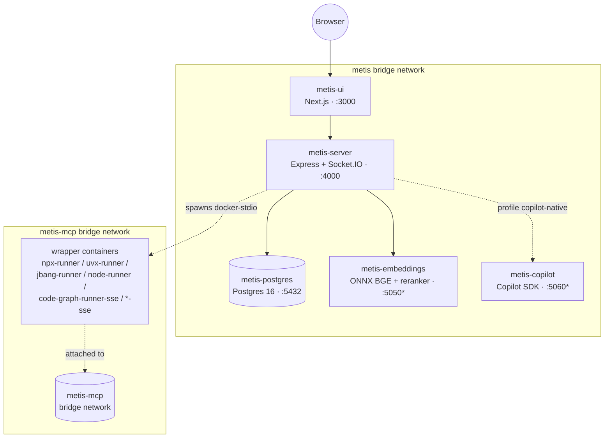

\* `metis-embeddings` and `metis-copilot` are internal-only on the `metis`
bridge network and are not exposed to the host by default. The copilot
sidecar is only started when the `copilot-native` profile is active
(`docker compose --profile copilot-native up`).

**Services:**
- **metis-ui** (port 3000): Next.js 15 / React 19 frontend.
- **metis-server** (port 4000): Express + Socket.IO API server.
- **metis-postgres** (port 5432): PostgreSQL 16 (volume `postgres_data`).
- **metis-embeddings** (internal :5050): RAG embeddings + reranker
  sidecar (`Xenova/bge-small-en-v1.5`, `Xenova/ms-marco-MiniLM-L-6-v2`).
- **metis-copilot** (internal :5060, opt-in): GitHub Copilot SDK sidecar
  with per-session isolation. (No device auth — removed in #1348.)

**MCP wrapper fan-out**: every registered `runtime: docker-stdio` MCP
server is hosted in its own ephemeral wrapper container under
`metis-mcp`, named `metis-mcp-<serverId>-<short-uuid>` for predictable
`docker ps` / `docker logs` lookups. See
[`docs/OPERATIONS.md` §7.2](./OPERATIONS.md#72-dockerised-mcp-runtime-epic-271)
and [`images/mcp-wrappers/README.md`](../images/mcp-wrappers/README.md).

### 20.2 Production Deployment

The production Docker Compose file adds:
- **Health checks** — Docker automatically monitors each container and restarts them if they become unhealthy
- **Restart policies** — Containers automatically restart on failure (`restart: unless-stopped`)
- **Production environment** — `NODE_ENV=production` for optimized builds
- **Resource limits** — Appropriate constraints for production workloads

### 20.3 Kubernetes / EKS (Helm chart)

For production EKS deployments, METIS ships a Helm chart at
[`deploy/helm/metis/`](../deploy/helm/metis/). The chart covers all four
core services plus the cluster-side concerns Compose cannot express:
PVCs (uploads + LanceDB), Secrets via External Secrets Operator,
ALB/nginx/traefik Ingress with TLS, IRSA-wired ServiceAccount, RBAC into
the per-MCP namespace (Epic #272), HorizontalPodAutoscaler,
PodDisruptionBudget, and a deny-default NetworkPolicy with optional
Cilium FQDN egress.

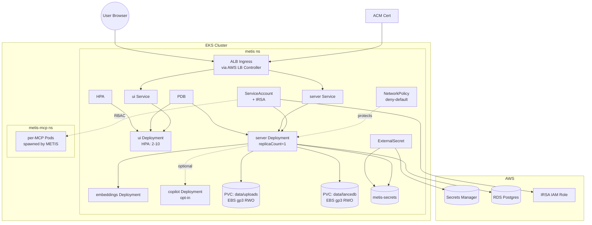

**Critical persistence**: without the two PVCs the chart binds, every
server pod restart wipes uploads and the LanceDB vector store. The chart
hard-fails when an operator sets `server.replicaCount > 1` without
`persistence.efs.enabled=true` to prevent silent index divergence from
LanceDB's single-writer model.

**Operator entry points**:

- [`docs/EKS_DEPLOYMENT.md`](./EKS_DEPLOYMENT.md) — green-field guide from
  empty AWS account to working `helm install`.
- [`docs/K8S_PROD_CHECKLIST.md`](./K8S_PROD_CHECKLIST.md) — pre-traffic audit.
- [`deploy/helm/metis/README.md`](../deploy/helm/metis/README.md) — values
  reference, three-mode secrets story, Ingress controller switch, footguns.

---

## 21. Mock-First Design Pattern

One of the most important architectural decisions in METIS is the **mock-first design pattern**. Every external service integration follows the same structure:

1. **Define an interface** — a contract that describes what the service must do
2. **Build a mock implementation** — a fake version that works without external dependencies
3. **Use a factory/singleton** — a function that returns the right implementation based on configuration
4. **Document the production target** — notes in the code explain what real service to swap in

This allows:
- **Development without dependencies**: Developers can work on any part of the system without needing Oracle databases, GitHub accounts, LDAP servers, or AI API keys
- **Fast testing**: Tests run against mocks and complete in seconds
- **Gradual integration**: Each mock can be replaced with a real implementation independently
- **Consistent behavior**: The system works the same way whether using mocks or real services

| Component | Mock (Development) | Production Target |
|---|---|---|
| AI Provider | Mock responses based on keywords | GitHub Copilot SDK |
| Embedder | Deterministic SHA-256 hashing | `all-MiniLM-L6-v2` model |
| Vector Store | In-memory JavaScript arrays | LanceDB |
| GitHub Client | In-memory issue store | Octokit REST API |
| Oracle Client | Simulated HR schema | `oracledb` Thick Mode |
| Auth Provider | 4 hardcoded test users | LDAP via `ldapjs` |
| File Converters | Placeholder text | `pdf-parse`, `mammoth`, `xlsx` |
| Git Client | Simulated file trees | `simple-git` |

---

## 22. Complete API Reference

Below is the exhaustive list of all 56 API endpoints in METIS:

### Authentication (`/api/auth`)
| Method | Path | Auth Required | Description |
|---|---|---|---|
| `POST` | `/api/auth/login` | No | Authenticate with username/password |
| `POST` | `/api/auth/logout` | Yes | End current session |
| `GET` | `/api/auth/me` | Yes | Get current user info |
| `POST` | `/api/auth/refresh` | No | Refresh access token using refresh cookie |

### Health (`/api/health`)
| Method | Path | Auth Required | Description |
|---|---|---|---|
| `GET` | `/api/health` | No | Basic health check (status, uptime, version) |
| `GET` | `/api/health/deep` | No | Deep health check (DB connectivity, Socket.IO clients, latency) |

### Source offer (`/source`, `/api/source`)

AGPL-3.0 §13 obliges a network-served version of METIS to offer every remote user the
Corresponding Source **of the running version** — not of the repository in general.
`server/src/routes/source.ts` is the machine-readable half of that offer;
`ui/src/components/layout/source-offer-footer.tsx` is the half a person sees, on every
page including `/login`. Both derive every field from `buildSourceOffer` in
`@metis/shared`, so the page and the endpoint cannot disagree about which commit is
running. Decision record: `docs/decisions/0014-agpl-3-0-licensing-cla-and-the-section-13-source-offer.md`.

| Method | Path | Auth Required | Description |
|---|---|---|---|
| `GET` | `/source` | No | §13 source offer — licence, repository, deployed commit, archive URL |
| `GET` | `/api/source` | No | The same handler, reachable through the Next.js proxy for the footer |

Three properties worth knowing before changing it:

- **Mounted twice, deliberately.** `/source` sits beside `/healthz` at the top level
  because that is the path a person or a tool guesses; `/api/source` exists because
  the browser reaches the server through the Next.js proxy, which forwards `/api/*`.
- **Unauthenticated, deliberately.** §13 says *all* users interacting remotely. An
  offer behind a login is not offered to the people most likely to want it, and it
  discloses nothing: the repository is public and the commit is the one whose source
  we are obliged to hand over on request anyway. There is no rate limiter on it either
  — the handler is one environment read and a JSON serialisation, with no I/O, no
  database access and no dependence on any upstream.
- **Read per request, `no-store`.** The commit comes from the environment on every
  call. An answer computed at module load, or cached by a CDN, keeps naming the
  previous deployment's commit after a roll, which is the one wrong answer nothing
  would surface. The deploy-time wiring that supplies the value lives in
  `.env.example`, `Dockerfile.server`, `Dockerfile.ui` (a build `ARG`, because
  `NEXT_PUBLIC_*` is inlined at `next build`) and the compose files; it is asserted by
  `server/tests/source-offer-deploy-wiring.test.ts`.

### AI Chat Sessions (`/api/sessions`)
| Method | Path | Permission | Description |
|---|---|---|---|
| `POST` | `/api/sessions` | `ai.prompt` | Create new AI chat session |
| `GET` | `/api/sessions` | `ai.prompt` | List user's chat sessions |
| `POST` | `/api/sessions/:id/message` | `ai.prompt` | Send message (supports SSE streaming) |
| `GET` | `/api/sessions/:id/usage` | `ai.prompt` | Get token usage for session |
| `DELETE` | `/api/sessions/:id` | `ai.prompt` | End/delete session |
| `GET` | `/api/sessions/stats/global` | `admin.settings` | Global AI usage statistics |

### Background Tasks (`/api/tasks`)
| Method | Path | Permission | Description |
|---|---|---|---|
| `POST` | `/api/tasks` | `ai.prompt` | Submit a new background task |
| `GET` | `/api/tasks` | `ai.prompt` | List tasks (filter by status) |
| `GET` | `/api/tasks/:id` | `ai.prompt` | Get task status and result |
| `DELETE` | `/api/tasks/:id` | `ai.prompt` | Cancel a running task |
| `POST` | `/api/tasks/:id/retry` | `ai.prompt` | Retry a failed task |
| `GET` | `/api/tasks/:id/artifacts` | `ai.prompt` | Get task output artifacts |
| `GET` | `/api/tasks/stats/engine` | `admin.settings` | Task engine queue statistics |

### Projects (`/api/projects`)
| Method | Path | Permission | Description |
|---|---|---|---|
| `POST` | `/api/projects` | `project.create` | Create a new project |
| `GET` | `/api/projects` | `project.view` | List all projects |
| `GET` | `/api/projects/:id` | `project.view` | Get project details |
| `PUT` | `/api/projects/:id` | `project.update` | Update project fields |
| `POST` | `/api/projects/:id/status` | `project.update` | Transition project status |
| `DELETE` | `/api/projects/:id` | `project.delete` | Archive (soft-delete) project |
| `GET` | `/api/projects/:id/audit` | `project.view` | Get project audit trail |
| `POST` | `/api/projects/:id/documents` | `document.upload` | Upload a document |
| `GET` | `/api/projects/:id/documents` | `document.view` | List project documents |
| `DELETE` | `/api/projects/:id/documents/:docId` | `document.delete` | Delete a document |

### Analysis (`/api/analysis`)
| Method | Path | Permission | Description |
|---|---|---|---|
| `POST` | `/api/analysis/:id/analyze` | `analysis.start` | Start multi-agent analysis |
| `GET` | `/api/analysis/:id/analysis` | `analysis.view` | List analyses for project |
| `GET` | `/api/analysis/:id/analysis/latest` | `analysis.view` | Get latest analysis |
| `GET` | `/api/analysis/:id/analysis/:analysisId/requirements` | `requirement.view` | Get requirements from analysis |
| `PUT` | `/api/analysis/:id/analysis/:analysisId/requirements/:reqId` | `requirement.update` | Update a requirement |
| `GET` | `/api/analysis/stats` | `admin.settings` | Analysis statistics |

### Knowledge / RAG (`/api/knowledge`)
| Method | Path | Permission | Description |
|---|---|---|---|
| `POST` | `/api/knowledge/ingest` | `document.upload` | Ingest text into knowledge base |
| `POST` | `/api/knowledge/search` | `ai.prompt` | Hybrid semantic + keyword search |
| `GET` | `/api/knowledge/:projectId/stats` | `document.view` | Knowledge base statistics |
| `DELETE` | `/api/knowledge/:projectId` | `document.delete` | Delete all knowledge for project |
| `DELETE` | `/api/knowledge/:projectId/source` | `document.delete` | Delete knowledge by source path |
| `GET` | `/api/knowledge/converters/supported` | `document.view` | List supported file formats |

### Publishing (`/api/publishing`)
| Method | Path | Permission | Description |
|---|---|---|---|
| `POST` | `/api/publishing/:projectId/generate` | `requirement.update` | Generate issue drafts from analysis |
| `GET` | `/api/publishing/:projectId/drafts` | `requirement.view` | List drafts for project |
| `GET` | `/api/publishing/drafts/:draftId` | `requirement.view` | Get single draft |
| `PUT` | `/api/publishing/drafts/:draftId` | `requirement.update` | Edit draft title/body/labels |
| `POST` | `/api/publishing/drafts/:draftId/approve` | `requirement.update` | Approve a draft |
| `POST` | `/api/publishing/:projectId/approve-all` | `requirement.update` | Bulk-approve all drafts |
| `DELETE` | `/api/publishing/drafts/:draftId` | `requirement.update` | Delete a draft |
| `POST` | `/api/publishing/:projectId/publish` | `requirement.publish` | Batch-publish approved drafts to GitHub |
| `GET` | `/api/publishing/:projectId/batches` | `requirement.view` | List publish batches |
| `GET` | `/api/publishing/batches/:batchId` | `requirement.view` | Get batch details |
| `GET` | `/api/publishing/:projectId/stats` | `requirement.view` | Draft statistics by status |

### Database Connections (`/api/databases`)
| Method | Path | Permission | Description |
|---|---|---|---|
| `POST` | `/api/databases` | `repos.add` | Register a database connection |
| `GET` | `/api/databases` | `repos.view` | List connections (passwords hidden) |
| `GET` | `/api/databases/:id` | `repos.view` | Get connection details |
| `POST` | `/api/databases/:id/test` | `repos.add` | Test database connectivity |
| `GET` | `/api/databases/:id/schema` | `repos.view` | Get full schema snapshot |
| `DELETE` | `/api/databases/:id` | `repos.remove` | Remove a connection |

### Git Repositories (`/api/repos`)
| Method | Path | Permission | Description |
|---|---|---|---|
| `POST` | `/api/repos` | `repos.add` | Clone and index a repository |
| `GET` | `/api/repos` | `repos.view` | List all repositories |
| `GET` | `/api/repos/:id` | `repos.view` | Get repository with file tree |
| `POST` | `/api/repos/:id/sync` | `repos.sync` | Trigger manual sync |
| `GET` | `/api/repos/:id/brain` | `repos.view` | Get AI brain summary |
| `GET` | `/api/repos/:id/history` | `repos.view` | Get sync history |
| `DELETE` | `/api/repos/:id` | `repos.remove` | Remove repository |
| `GET` | `/api/repos/scheduler/status` | `admin.settings` | Get sync scheduler status |
| `POST` | `/api/repos/scheduler/sync` | `admin.settings` | Force global sync cycle |

### Secret Vault (`/api/vault`)
| Method | Path | Permission | Description |
|---|---|---|---|
| `GET` | `/api/vault/secrets` | `vault.view` | List secret names (values hidden) |
| `GET` | `/api/vault/secrets/:name` | `vault.view` | Get decrypted secret value |
| `POST` | `/api/vault/secrets` | `vault.manage` | Store an encrypted secret |
| `DELETE` | `/api/vault/secrets/:name` | `vault.manage` | Delete a secret |

### Jira Connections (`/api/jira`)
| Method | Path | Permission | Description |
|---|---|---|---|
| `POST` | `/api/jira/connections` | `connector.write` | Create a Jira connection (Cloud or Data Center) |
| `GET` | `/api/jira/connections?projectId=` | `connector.read` | List connections for a project |
| `GET` | `/api/jira/connections/:id` | `connector.read` | Get connection details |
| `PATCH` | `/api/jira/connections/:id` | `connector.write` | Update connection settings |
| `DELETE` | `/api/jira/connections/:id` | `connector.write` | Soft-delete a connection |
| `POST` | `/api/jira/connections/:id/test` | `connector.test` | Test connectivity and measure latency |
| `GET` | `/api/jira/connections/:id/projects` | `connector.read` | List Jira projects available on the connection |
| `POST` | `/api/jira/connections/:id/search` | `connector.read` | Execute a JQL search query |
| `GET` | `/api/jira/connections/:id/issues/:key` | `connector.read` | Fetch a single Jira issue by key |

---

## 23. Environment Variables Reference

All configuration is managed through environment variables. Copy `.env.example` to `.env` and customize:

### Server Configuration
| Variable | Default | Description |
|---|---|---|
| `NODE_ENV` | `development` | Environment mode — affects logging, security defaults, mock behavior |
| `PORT` | `4000` | Port the server listens on |
| `CORS_ORIGIN` | `http://localhost:3000` | Allowed origin for cross-origin requests (the UI) |
| `LOG_LEVEL` | `debug` (dev) / `info` (prod) | Minimum log level: `error`, `warn`, `info`, `debug` |

### Database
| Variable | Default | Description |
|---|---|---|
| `DATABASE_PROVIDER` | `sqlite` | Database engine: `sqlite` or `postgresql` |
| `DATABASE_URL` | `file:./dev.db` | Database connection string |

### Authentication
| Variable | Default | Description |
|---|---|---|
| `AUTH_MODE` | `mock` | Auth provider: `mock` (dev users) or `ldap` (enterprise) |
| `JWT_SECRET` | _(none — required outside local dev)_ | Secret key for signing JWT tokens, min 32 bytes. A publicly-known fallback key is used **only** when `NODE_ENV` is exactly `development`/`test` and the process is not on a container platform; every other environment refuses to start without it (#1057). |
| `JWT_ACCESS_EXPIRY` | `15m` | Access token lifetime |
| `JWT_REFRESH_EXPIRY` | `7d` | Refresh token lifetime |

### LDAP (when `AUTH_MODE=ldap`)
| Variable | Description |
|---|---|
| `LDAP_URL` | LDAP server URL (e.g., `ldap://your-ldap-server:389`) |
| `LDAP_BIND_DN` | Distinguished name for LDAP bind |
| `LDAP_BIND_PASSWORD` | Password for LDAP bind |
| `LDAP_SEARCH_BASE` | Base DN for user searches |
| `LDAP_SEARCH_FILTER` | Filter template (default: `(sAMAccountName={{username}})`) |
| `LDAP_ADMIN_GROUPS` | LDAP groups that map to the Admin role |
| `LDAP_COORDINATOR_GROUPS` | LDAP groups that map to the Coordinator role |
| `LDAP_DEVELOPER_GROUPS` | LDAP groups that map to the Developer role |

### Secret Vault
| Variable | Default | Description |
|---|---|---|
| `VAULT_ENCRYPTION_KEY` | Random (dev) | AES-256-GCM encryption key. **MUST be set in production.** |
| `VAULT_SALT` | Random (dev) | PBKDF2 salt for key derivation. **MUST be set in production.** |

### AI
| Variable | Default | Description |
|---|---|---|
| `AI_TOKEN_BUDGET` | `100000` | Maximum tokens per AI session |
| `COPILOT_API_KEY` | — | GitHub Copilot SDK API key (production) |
| `COPILOT_MODEL` | `gpt-4o` | AI model to use |

### GitHub Integration
| Variable | Description |
|---|---|
| `GITHUB_APP_ID` | GitHub App ID for publishing issues |
| `GITHUB_APP_PRIVATE_KEY` | GitHub App private key |
| `GITHUB_TOKEN` | Personal access token (alternative to App) |

### External Services (Optional)
| Variable | Description |
|---|---|
| `ORACLE_TNS_ADMIN` | Path to Oracle TNS admin directory |
| `ORACLE_CLIENT_DIR` | Path to Oracle Instant Client |
| `BRAVE_API_KEY` | Brave Search API key for web research |

### Jira Integration
| Variable | Default | Description |
|---|---|---|
| `JIRA_ALLOWED_HOSTS` | *(empty — public Jira Cloud allowed)* | Comma-separated hostname allowlist for on-premises Jira Data Center instances. Required when your Jira server resolves to an RFC1918 / private IP (e.g. `jira.internal.example.com`). Public hosts (non-private IPs) are always permitted. Example: `jira.corp.example.com,jira2.corp.example.com` |
| `JIRA_RATE_LIMIT_MAX` | `30` | Maximum Jira API requests per window per connection |
| `JIRA_RATE_LIMIT_WINDOW_MS` | `60000` | Rate-limit window in milliseconds |

### UI Configuration
| Variable | Default | Description |
|---|---|---|
| `NEXT_PUBLIC_API_URL` | `http://localhost:4000/api` | Backend API base URL |
| `NEXT_PUBLIC_SOCKET_URL` | `http://localhost:4000` | Socket.IO server URL |

---

*This document was generated for the METIS project. For user-facing documentation on how to install and use METIS, see [USER_GUIDE.md](USER_GUIDE.md).*

---

## v1 Schema Map (Phase 1)

The Phase 1 data model is defined in [`server/prisma/schema.prisma`](../server/prisma/schema.prisma) (SQLite for dev) and mirrored in `packages/shared` as TS types + zod schemas. See [`docs/data-model.md`](data-model.md) for the full per-model breakdown, including:

- The 25 Prisma models grouped by domain (identity, vault, project/content, analysis pipeline, publishing, platform).
- The dual-provider strategy (`schema.prisma` for SQLite dev, autogenerated `prisma/postgres/schema.prisma` for prod — see [docs/data-model.md](./data-model.md)).
- Per-model mapping to consuming phase and shared schema file.
- Conventions (cuid ids, soft-delete, JSON-as-String, indexed hot paths).

UI code imports types from `@metis/shared` — never from `@prisma/client` — so the UI bundle stays free of Prisma's runtime engine.

---

## v1.1.0 SDK alignment (#165)

The slim runtime image (#145) drops `@github/copilot` + `@github/copilot-sdk`. v1.1.0 keeps the surface area of those abstractions in-house so every provider (`bedrock-gateway`, `openai`, `azure`, `anthropic`, `offline-stub`) gets the same behaviour:

- **Custom subagents** (#112) — `server/src/lib/custom-agents/` seeds four built-in specialists (BA / Architect / PO / QA) once at boot via `ensureBuiltInAgents()`. Built-ins are immutable and globally scoped (`projectId = null`); user-defined agents are project-scoped and mutable.
- **Skill directories + disabled skills** (#113) — `server/src/lib/library/skill-directories.ts` walks operator-configured filesystem directories for `SKILL.md` files (max depth 4, max 500 entries, max 256 KB per file). Git URLs and `..` traversal are rejected. Since #1075 a directory must also resolve inside one of the roots in `SKILL_DIRECTORIES_ALLOWED_ROOTS` (default `<server>/data/skills`), checked at write time *and* re-checked by `scan()` at read time; the routes are RBAC-gated (`project.read` to read, `project.update` for `disabled-skills`, `skill.manage` for the directory list itself). The scanner's walk never descends into symlinked directories.
- **Hook bus** (#114) — `server/src/lib/hooks/` ships an in-process bus + persisted webhook subscriptions for the six SDK lifecycle events (`preToolUse`, `postToolUse`, `sessionStart`, `sessionEnd`, `userPromptSubmit`, `notification`). Built-in handlers always run; user webhooks fire over undici with a 5 s timeout and never re-throw.
- **Plugins** (#115) — `server/src/lib/plugins/index.ts` defines the `metis-plugin/1.0` envelope with deterministic pack/unpack so the same logical bundle always serialises byte-identical.
- **Plan mode** (#121) — `server/src/lib/ai/plan-mode.ts` is a state machine over `SessionPlan` rows; concurrent pending plans are rejected. The chat surface gates further tool-using turns until the operator approves or rejects.
- **Session resume** (#122) — `server/src/lib/ai/session-snapshot.ts` writes a snapshot every N (default 5) messages; sessions older than the TTL (env `RESUMABLE_TTL_HOURS`, default 24 h) are dropped from the resumable list and `rehydrate` throws.
- **`/model` slash command** (#120) — `server/src/lib/ai/model-switch.ts` parses `/model <id> [reasoning=]<low|medium|high>?` and persists `currentModel` + `currentReasoningEffort` on the session, with an allowedModels guard.

The shape of these abstractions matches the public copilot-sdk surface, so when the copilot sidecar lands (#180) we can swap implementations without touching the orchestrator.

---

## v1.1.0 Async agent platform (#156)

Agent runs are async-by-default, event-triggered, parallelizable with best-of-N, mid-run steerable, and resilient via context compaction.

- **Background runs (#146)** — `server/src/lib/async/runner.ts` is a `p-queue`-backed `AsyncRunner` (concurrency from `BG_CONCURRENCY`, default 4). Each `BackgroundRun` row carries kind/status/priority/runGroupId and a JSON payload. Handlers register per-kind; the four built-ins are `chat`, `analysis`, `browse`, `custom` (`server/src/lib/async/handlers.ts`). `RunHandlerContext` exposes `signal: AbortSignal`, `nextSteer()`, `heartbeat()`, and `emitStep()`. Server boot calls `recoverStaleRuns()` (heartbeats older than `BG_HEARTBEAT_TIMEOUT_MS=60000` flip back to queued) then `dispatchQueued()`.
- **Triggers (#147)** — `server/src/lib/async/triggers.ts` validates HMAC-SHA256 signatures using `crypto.timingSafeEqual`. Three schemes: generic (`${ts}.${body}` template, `X-Signature` + `X-Timestamp`), GitHub (`X-Hub-Signature-256: sha256=<hex>`), Slack (`v0:${ts}:${body}` with `X-Slack-Signature` + `X-Slack-Request-Timestamp`). Timestamps with >5 min skew are rejected. Routes mounted at `/api/triggers/*` and `/api/webhooks/*`. `app.ts`'s `express.json({verify})` callback captures the raw body **only** when `req.originalUrl` matches those prefixes — non-trigger routes still take the parsed-JSON-only fast path.
- **Best-of-N (#148)** — `server/src/lib/async/best-of-n.ts` provides `submitGroup({n: 1..8, selectionMethod})` that spawns N runs sharing a `runGroupId`. `selectGroupWinner()` returns null until every member has settled; `highest-score` sorts by score desc; `judge-llm` falls back to a deterministic score+id sort when the judge is unavailable. The default `scoreText()` is length + citation-count × 50.
- **Mid-run steering (#149)** — `RunMessage` is a FIFO queue per run. `POST /api/runs/:id/steer` enqueues with the next ord; `ctx.nextSteer()` drains queued → delivered atomically. Handlers poll `nextSteer()` between phases so steers shape the next thought without blocking the current one.
- **Context compaction (#150)** — rebuilt by #138 on the server-owned transcript; see [Server-owned chat conversation (Epic #127)](#server-owned-chat-conversation-epic-127). `CONTEXT_COMPACTION_THRESHOLD_TOKENS` and `Project.contextCompactionThreshold` still cap the watermark from above; `AISession.compactionCount` / `lastCompactedAt` still record each pass.

Socket.IO surfaces emit `bg-run:status` to the `project:{id}` room and `bg-run:step` to per-run `run:{runId}` rooms; clients call `subscribe:bg-run` / `unsubscribe:bg-run` to opt in. UI surfaces are the dashboard `ActiveRunsWidget` and the `/settings/triggers` page.

## v1.2.0 Closed loop (#192)

The closed-loop epic ties code execution, requirement implementation, and PR review together so a merged PR closes the loop on the spec it was meant to satisfy.

- **E2B sandbox (A.1, #197)** — `server/copilot-svc/src/sandbox.ts` is the optional Firecracker microVM executor. The sidecar exposes `POST /sandbox/exec` (token-gated), takes `{language: python|node|bash, code: ≤64 KB, timeoutMs ≤ 120 000}`, caps stdout/stderr at 64 KB and fails closed (HTTP 503) when `E2B_API_KEY` is unset. The `@e2b/sdk` import is lazy so the slim sidecar image stays thin when sandbox mode is off. `server/src/lib/sandbox/sandbox-client.ts` is the in-process `undici` bridge — gated by `SANDBOX_MODE=sidecar`, it maps upstream `503` → `SANDBOX_UNAVAILABLE`, `504` → `SANDBOX_TIMEOUT`, network failures → `SANDBOX_NETWORK`, and `AbortError` → `SANDBOX_TIMEOUT`. `server/src/lib/ai/tools/code-exec.ts` registers the `code_exec` tool (HIGH risk, requires approval gate); every successful or failed execution records cost via `getTokenTracker().record({ provider:"openai", model:"e2b:${language}", totalTokens:1 })` so sandbox spend rolls into the existing FinOps cap pipeline.
- **Sandbox v1.2 P2 (Epic #395)** — three-provider port (`server/src/lib/sandbox/factory.ts`): `e2b` (live `@e2b/code-interpreter`), `daytona` (live `@daytona/sdk`, both lazy-imported and gated on their respective `*_API_KEY`), `local_dev` (Linux `bwrap` / macOS `sandbox-exec` for offline dev — throws on unsupported platforms; never enabled in production). All three implement the same `Sandbox` port surface (`runCode`, `commands.run`, `files.read/write`, `pause`, `resume`, `destroy`) and are clamped through the shared `clampSandboxOptions` (vCpu / mem / template / egress allowlist / runId). Per-session cost is calculated on `destroy()` from the versioned `SANDBOX_RATES` table (`server/src/lib/sandbox/pricing/rates.ts`) and persisted as integer `costMicroUsd` (`Int?`) so the sqlite/postgres twin stays portable; divide by `1e6` for USD. Sessions are linked to the parent `AgentRun.id` via the new `SandboxSession.runId` column (soft FK, `@@index([runId, createdAt])`); `GET /api/runs/:id/sandbox-sessions` (auth + `analysis.read`) returns up to 50 sessions for the Run-detail page badge + table.
- **Living-spec sync (A.2/A.5, #199 #201)** — `Requirement.implementedAt` + `implementedByPr` + `implementedBySha` plus the new `RequirementImplementation` table form the durable trace from a spec line to the merge commit that satisfies it. `server/src/lib/living-spec/webhook.ts` verifies `X-Hub-Signature-256` (sha256 HMAC + optional 5-min `X-Webhook-Timestamp` skew) and dispatches `pull_request.closed+merged` to the sync path. `server/src/lib/living-spec/requirement-sync.ts` parses `Closes #N`/`Fixes #N`/`Resolves #N` keywords (and `Refs #N`/`References #N` for traceability), walks `PublishedIssue → IssueDraft.requirementId → Requirement`, marks `implementedAt` first-wins (subsequent merges leave the original timestamp intact), and creates `RequirementImplementation` rows per diff hunk under `src/|ui/|server/|e2e/|docs/|packages/|scripts/` (deduped by `requirementId × prNumber × filePath × startLine`). Files outside the allowed prefixes are flagged as drift.
- **AC-aware PR-reviewer agent (A.3, #200)** — `server/src/lib/agents/pr-reviewer/agent.ts` orchestrates a single-shot judge LLM that reads the PR title/body/diff and the resolved acceptance criteria, returning per-AC `satisfied | not_satisfied | uncertain` verdicts plus inline-comment suggestions with `info | warning | risk` severity. The prompt enforces strict-JSON output (`prompts.ts:parseJudgeResponse` extracts the first balanced `{…}` block and normalises bad enums). Optional sandbox tests (`testCommands` keyed by AC id) run through `code_exec` after the judge; **any non-zero exit downgrades `approve` to `request_changes`** and adds a "⚠ Sandbox tests failed" line to the summary. `github-review-poster.ts` posts the result via Octokit (`createReview`), mapping verdicts to `APPROVE | REQUEST_CHANGES | COMMENT`, filtering line>0, capping at GitHub's 50 comments per review.
- **Routes** — `POST /api/webhooks/github/pr` (auto-review on `opened|synchronize|reopened` when `Project.autoReviewPrs === true`, sync on `closed+merged`, always 2xx so GitHub never retries). `POST /api/run-reviews` (manual trigger, `analysis.write`, persists the result as a `pr_review` step on a new `AgentRun`). `GET /api/run-reviews/:runId` (`analysis.read`, reads back the persisted record).
- **UI** — `/runs/[id]/review` renders the `ReviewPanel` with overall verdict, GitHub link, AC matrix, severity-toned comment list, and sandbox results.

### 17.X PR-reviewer P2 (Epic #394 P2)

P2 layered async processing, dedup, incremental re-review, per-repo
config, an existing-comment dedup scorer, and a history UI on top of
the v1.2.0 MVP.

- **Async queue (#403)** — `server/src/lib/agents/pr-reviewer/queue.ts` is an **in-memory**, per-repo-laned queue with exponential-backoff retry (1s/4s/16s, 3 attempts) and a DLQ. The original epic showed BullMQ on the Mermaid; the implementation deliberately **deferred Redis** to v1.4 because (a) every job persists its outcome via AgentRun before the queue forgets about it, and (b) GitHub re-delivers any in-flight events on the next poke via the dedup table. Process-local — **lost on restart by design**, but observable: every DLQ entry emits a `pr_review.dlq` audit row.
- **Production worker (#403, review F4)** — `server/src/lib/agents/pr-reviewer/worker.ts` exposes `startWorker({ processor })`. It is started once from `server.ts` at boot, registered in the `worker-singleton` so the webhook router can enqueue against the live queue without restructuring boot order, and torn down by `index.ts`'s graceful shutdown via `prReviewWorker.shutdown()` (cancels pending retry timers, drops queued jobs, drains in-flight processors). The worker also schedules `purgeOldDeliveries()` on a 1h interval so the dedup table cannot grow unbounded.
- **Webhook dedup (#403)** — `webhook-dedup.ts` writes `prReviewWebhookDelivery` rows keyed by `X-GitHub-Delivery` UUID. `recordDelivery` returns `{duplicate: true}` on `P2002`, the webhook short-circuits with `DUPLICATE_DELIVERY`. Insert failures are **logged via `logger.warn` `pr_review.webhook_dedup_failed`** (review F2) so a sustained DB outage that lets duplicates through is visible in metrics, not silently swallowed.
- **Incremental re-review (#405)** — `incremental.ts` skips whitespace-only diffs entirely and inherits prior verdicts whose cited evidence files are unchanged. `extractRenames()` (review F3) detects `rename from`/`rename to` blocks so an inherited verdict whose evidence file was renamed in `lastReviewedSha..HEAD` is **invalidated** and re-judged — without this the verdict would cite the dead old path forever and never re-trigger on future changes to the new path.
- **Existing-comment dedup (#406)** — `existing-reviews-reader.ts` uses Jaccard token overlap (≥ 0.7 threshold; documented spec deviation from the embeddings approach the epic suggested) to suppress comments that duplicate one already on the PR.
- **Per-repo `.metis/pr-review.yaml` (#407)** — `per-repo-config.ts` loads + validates the file with strict zod, surfaces parse warnings as a top-level PR comment. **Safety hardening (review S1/S2)**: the `model` field is enforced against `PR_REVIEW_ALLOWED_MODELS` (zod `enum`, **rejected — never silently downgraded** — when off-list) and `maxDiffBytes` is clamped to `min(override, projectDefault, PR_REVIEW_MAX_DIFF_BYTES_HARD_CAP=1 MiB)` so a fork PR cannot lift the diff guard or pick an arbitrarily expensive model.
- **History UI (#404)** — `/projects/[id]/pulls` (list) and `/projects/[id]/pulls/[prNumber]` (detail with per-AC verdicts, evidence, reasoning, AgentRun deep-link, and a Re-run button gated on `pr.review.manage`). 403 from the read endpoint renders a clear permission-required surface instead of a generic error toast.
- **Re-review API (#404)** — `POST /api/projects/:projectId/pr-reviews/:prNumber/re-review` requires `pr.review.manage`, looks up the persisted state row, and enqueues a synthetic `manual-rerun-…` delivery onto the same queue the webhook uses. Returns `503 WORKER_UNAVAILABLE` if hit before the worker is up.


## 18. Eval & Bench (Epic #194 — v1.2.0)

The Eval & Bench surface lets operators benchmark agent performance against
two industry corpora and inspect the results in the UI.

- **Schema** — Migration `20260504000000_add_eval_bench` introduces
  `BenchRun` (`bench_runs`) and `BenchTaskResult` (`bench_task_results`,
  FK with cascade delete) capturing benchmark, model, score, totals, mean
  tokens / cost / latency, status, JSON metadata, and per-task expected
  vs actual payloads.
- **Harnesses (C.1, C.2)** — `server/src/lib/eval/swe-bench/{corpus,scorer,runner}.ts`
  loads the SWE-bench-Pro JSONL corpus, scores with sandbox exit-code +
  Jaccard line overlap (default 0.4), persists per-task rows.
  `server/src/lib/eval/tau-bench/{scenarios,scorer,runner}.ts` mirrors the
  shape for tool-call traces (per-position name+args subset match +
  per-key final-state deepEqual, blended 50/50). Both runners emit
  `status: "disabled"` when `EVAL_NIGHTLY_ENABLED !== "true"` and stop the
  loop early when the FinOps cost cap is reached.
- **Judge-LLM v2 + hallucination scorer (C.3)** —
  `server/src/lib/judge/hallucination-scorer.ts:scoreGrounding` returns
  `{groundingScore, hallucinationScore, citationOverlap, entailmentScore,
  claims}` (n-gram overlap blended 50/50 with optional LLM entailment).
  The new `score_grounding` tool (low risk) wires the scorer into the
  agent registry via `registerScoreGrounding(getToolRegistry())`.
  `judgeWithHallucination` in `server/src/lib/async/best-of-n.ts`
  re-ranks Best-of-N candidates by base score + weighted grounding
  (default 0.5).
- **OpenInference adapter (C.4)** —
  `server/src/lib/observability/openinference-adapter.ts` re-emits Metis
  `gen_ai.*` attributes as OpenInference `llm.*` / `tool.*` /
  `openinference.span.kind` (LLM | TOOL | AGENT | CHAIN) when
  `OTEL_SCHEMA=openinference`. Default schema stays `metis` so existing
  exporters are unaffected.
- **Routes** — `GET /api/eval/leaderboard?bench=…&days=…` (auth, last 200
  rows). `GET /api/eval/leaderboard/runs/:id` (auth; RBAC redacts
  `expected`/`actual` to `null` for non-admins). `POST /api/eval/leaderboard/run`
  (admin.write; returns a 202 `disabled` envelope when the env flag is unset).
- **UI (C.5)** — `/eval/leaderboard` renders the table with bench/days
  filters, score-over-time SVG sparkline per benchmark, and admin-only
  "Run now" trigger buttons. `/eval/leaderboard/[id]` shows per-failing-task
  diffs via `BenchDiffViewer`.
- **Cron** — `.github/workflows/eval-nightly.yml` (`cron: "0 2 * * *"`)
  runs both harnesses nightly; the `disabled-notice` job logs guidance
  when `EVAL_NIGHTLY_ENABLED` is unset so the cron registration stays
  visible without burning CI minutes.

### 18.1 RAGAS judge seam (`pnpm rag:eval`, #103 / #1317, epic #1316)

`server/src/lib/rag/ragas.ts` computes the four RAGAS metrics over
`server/eval/rag-golden.jsonl` and writes `server/coverage/ragas-results.json`.
The `RagasJudge` interface has **two** implementations behind one seam:

| Judge | Selected when | What it measures |
|---|---|---|
| `StubRagasJudge` (**default**) | always, unless both conditions below hold | `String.includes` overlap — deterministic, offline, free; the reason CI never spends a token |
| `ModelRagasJudge` (`rag/model-ragas-judge.ts`) | `RAGAS_JUDGE=model` **and** the resolved provider is not the offline stub | `faithfulness` from claims extracted out of the answer and NLI-judged against the retrieved text; `answer_relevancy` from one graded model call |

`ModelRagasJudge` does **not** stand up a second judging stack. It routes through
`server/src/lib/grounding/faithfulness-metric.ts`, a neutral wrapper over the
same `ClaimExtractor` + `FaithfulnessJudge` substrate docs-gen has used since
#273, so "faithfulness" means one thing across the product.
`context_precision` / `context_recall` stay **label-driven** — the corpus carries
verbatim span labels, so membership is a fact, not an opinion to re-judge.

**Every metric is `number | null`.** `null` is UNVERIFIABLE — not a low score and
not a high one — and is EXCLUDED from the mean rather than counted as a pass.
Before #1317 a zero denominator fell back to `1.0`, which moved the aggregate up
in exactly the fixtures the harness understood least; for `faithfulness` the
metric only ever inspected `expectedAnswerKeywords`, so an answer that invented a
claim outside that list scored a perfect 1.0. The result artifact carries
per-metric `scored` / `unverifiable` counts, because a mean of 0.95 over 2 of 40
fixtures is a different fact from 0.95 over 40.

`resolveRagasJudgeForRun` takes a **thunk** for provider construction, so a
default run never reads credentials, and degrades to the stub (with a warning
naming the cause) when the flag is set but no live provider can be built.

### 18.2 One faithfulness metric across both pipelines (#1318, epic #1316)

Before #1318, `grep -rl "FaithfulnessJudge\|scoreFaithfulness" server/src`
returned **no file under `server/src/lib/analysis/`**. The pipeline that produces
the findings operators publish to Jira had no faithfulness number at all — only
the #740 deterministic gate's categorical `confirmed` / `unverified` /
`could-not-verify`, which answers *"was this locator retrieved?"* and
structurally cannot answer *"does the retrieved text back the claim?"*. A
groundedness regression in one pipeline was invisible to the other's gate.

`server/src/lib/analysis/finding-faithfulness.ts` closes that by calling the same
`grounding/faithfulness-metric.ts` wrapper §18.1 describes. Three consumers, one
definition: docs-gen sections, the `RagasJudge` seam, and now analysis findings.

**Which findings.** The metric runs exactly where the deterministic verifier and
the #1109 panel already run: `runAgenticCodeAgent` and
`runRequirementGroundedCodeAgent`, the two `code` paths. The `document`,
`business` and `database` specialists go through `runOneAgent`, which persists
`runAgent`'s output with no grader in between — they do retrieve context, but no
grader has ever run over them, and #1318 deliberately did not change that scope.
Their findings therefore carry no `faithfulness` field at all: the honest record
of "not measured", never a `0` and never a `null`. Widening the scope is a
separate decision that applies equally to the panel.

| Property | How it is guaranteed |
|---|---|
| Additive, never a gate | It writes ONE optional `faithfulness` field on a finding and reads nothing back. Nothing ranks, filters, gates or deletes on it. |
| The categorical gate is unchanged | STRUCTURALLY: the module does not import `finding-verification.ts`, and a test asserts the import edge does not exist. A frozen truth table over `verifyFinding`'s whole input domain regression-tests the verdicts themselves. |
| The panel cannot promote a flagged finding | Unchanged from #1109 (`composeArmStatus` can only ever ADD a warning), and re-asserted end to end with both graders answering maximally in the finding's favour. |
| Flag off ⇒ byte-identical | `ANALYSIS_FAITHFULNESS_METRIC` defaults OFF. Off ⇒ zero provider calls, and the field is ABSENT rather than `null`, so the persisted `Finding.evidence` blob matches a pre-#1318 run exactly. |
| The model cannot author the number | `agentFindingPayloadSchema` accepts `faithfulness` so the orchestrator can carry its own value, which means Zod accepts it from a model too on providers without strict JSON. `persistAgentResult` — the ONE choke point all eight of `orchestrator.ts`'s persist call sites share — writes it only when `server-authored.ts` vouches for that exact object, so a fabricated `{"score": 1, "totalClaims": 40, "supportedClaims": 40}` is refused (and logged) on every path, graded or not. |
| A corrupt blob reads as "not measured" | `findingFaithfulnessSchema` enforces `supportedClaims <= totalClaims` and "`unverifiableReason` exactly when `score` is null", so a row that violates either is dropped on read rather than rendered. A malformed model-emitted value is `.catch()`-ed to `undefined` — per #1230 it costs the field, never the run's findings. |
| `null` is not a zero | `score: null` means UNVERIFIABLE and is excluded from every mean, per §18.1. |

The metric rides the existing `Finding.evidence` JSON blob — the same
no-migration route #916's `requirementId`, #773's `verdict` and #1109's
`supportPanel` take — and is read back through `parseEvidence`, so it reaches the
analysis snapshot the API returns.

`pnpm eval:verification --arm panel --faithfulness` reports it **per arm**,
keeping three states apart: a mean over the scored cases, an explicit
`unverifiable`, and `n/a` for an arm that cannot compute it. The deterministic
baseline is always the third case by construction — it never reads the evidence
text, so `0` would misread as "the free gate is bad at faithfulness" when the
truth is that the question cannot be put to it.

### 18.3 Reference answers and answer correctness (#1319, epic #1316)

Every metric above is **reference-free**: faithfulness asks *"is this answer
supported by what we retrieved?"* and is silent on whether the answer is right.
An answer that is confidently wrong but cites real retrieved text scores clean.
Ground truth covered retrieved contexts (the span-anchored `quote` in
`queries.json`) and extractions (`expected.json`), never answers — the one input
of the standard LLM-as-judge design METIS did not have.

`eval-data/corpus/<id>/reference.json` is that input, and
`server/src/lib/eval/answer-correctness/` scores against it via
`pnpm eval:answer-correctness`.

Generated-document benchmarking now reuses the same correctness substrate.
[server/src/lib/eval/docs-gen/runner.ts](../server/src/lib/eval/docs-gen/runner.ts)
executes the real [holistic synthesizer](../server/src/lib/docs-gen/holistic-synthesizer.ts)
over pinned fixture repositories, then maps answer-correctness recall to a
`missedExpectedBehavior` rate in the benchmark artifact. The companion CLI
[server/scripts/eval-docs-gen.ts](../server/scripts/eval-docs-gen.ts) writes
local JSON artifacts under [eval-results/docs-gen](../eval-results/docs-gen).
Deterministic local runs measure timing, retrieval latency, memory, and claim
support while leaving token/cost as not reported; `--live-model-run` switches to
the configured provider and persisted `TokenUsage` accounting when an operator
wants real spend numbers.

**Correctness is bidirectional claim entailment, not similarity.** Over the same
`grounding/faithfulness-metric.ts` substrate §18.1 and §18.2 describe:

| Direction | Question | Fails when |
|---|---|---|
| `recall` | Is each REFERENCE claim entailed by the ANSWER? | the answer omits something |
| `precision` | Is each ANSWER claim entailed by the REFERENCE? | the answer says more than the gold |
| `f1` | Harmonic mean of the two | either — and see below |

Running one direction is not enough: precision alone rewards an answer that says
one true thing and omits the rest, recall alone rewards an answer that says
everything including three falsehoods. **Embedding cosine was rejected outright**
— the local embedder silently falls back to a hash embedder when Hugging Face is
unauthorized, so a similarity metric would emit confident, meaningless numbers.
A paraphrase with zero shared vocabulary scores 1.0 and a lexically near-identical
wrong answer scores 0; both are asserted directly.

**The gold answers are a human deliverable and the validator's real job is to
refuse anything that cannot be one.** A model-authored reference would make the
metric a measurement of the judge against itself: a healthy-looking number in
every circumstance, including a broken one, which is worse than no metric because
a number gets quoted and an absence does not. So `reference.ts` rejects an author
or reviewer whose name matches a model, rejects a self-review, rejects a snapshot
mismatch or an unknown `queryId`, and enforces the agreed answer style (1–3
sentences of self-contained prose stating the fact and not its location, no
citation markup, tables or lists). It cannot tell where prose came from; that
remains a PR-review boundary, stated as such in `REFERENCE-AUTHORING.md`.

**The F1 is not the headline (#1342, ADR 0013).** The first real run — four
human gold answers, live provider, real embedder — scored **recall 1.000 on every
query** with a mean F1 of 0.531. Every claim of every reference was entailed:
METIS was right four times out of four. The 0.531 was precision loss, because
`REFERENCE-AUTHORING.md` caps a gold answer at 1–3 sentences while the production
answer path returns a paragraph, and F1 counts each extra *true* claim as a miss.
A blended number in that state gets quoted as "53% correct". So the reported
shape leads with `recall` then `precision`; the blend is named `f1` / `meanF1`
rather than `correctness` / `mean`; each row records `answerClaims` and
`referenceClaims` so the length gap is measured rather than argued; and every
reported envelope carries an `interpretation` string computed by
`interpretAggregate` from that run's own numbers — the nightly `cat`s the
envelope into the job summary, which is the one place the caveat has to survive
to. The 1–3 sentence rule is kept: recall is what a crisply-scoped reference
tests best, so the rule and the metric no longer pull against each other.

`docretrieval-01-metis-docs` shipped with `"answers": []` until #1319's first four
gold answers landed, and the metric reports **NOT REPORTED with a reason, never a
mean of 0** whenever there is nothing scorable — "we have not written the ground
truth yet" must not be indistinguishable from "the system is wrong".
Its `license` was the sentinel `PENDING` until #1382 and is now **`CC0-1.0`**:
unlike the synthetic `brd-*`/`prd-*` corpora its ten source documents are METIS's
own `docs/`, which made the licence the repository owner's to set rather than an
external question, and #1300 forced the answer by putting the file in the
published tree. Closes #1322 E4. `LICENSE_PENDING` remains a valid loader state
for a corpus whose licence is genuinely undecided; no committed corpus is in it.
No `docretrieval-*` corpus has a `manifest.json` entry today.

An author who finds a query whose anchored `quote` does not answer it writes
`FLAG: <why>` instead of guessing. Those items are **excluded from the metric**
and reported separately as `corpusFindings` — that is a defect in `queries.json`,
not a wrong answer by the system, and scoring it would blame the system for the
corpus.

**Where the envelope goes, and why not beside the others.** It is written to
`eval-results/answer-correctness/`, not `eval-results/` itself, because
`loadAllRuns` parses every top-level `.json` there as a `DomainEvalRunResult` and
silently drops what does not match — a fragment beside them would be a write no
reader could ever see. `listRunIds` filters on the `.json` suffix, so a
subdirectory is invisible to it; asserted in `runner.test.ts`. #1333 fixed the
commit-back path (ADR 0012) — between 2026-07-21 and that fix nothing under
`eval-results/` reached the repository at all, because the old guard read
`git status --porcelain`, which does not list ignored files. The envelopes are
now committed nightly, and `reporting.test.ts` replays the one named in #1342's
provenance as the format's first programmatic reader.

## 24. Code-Execution Sandbox (Epic #395 — v1.2.x)

The sandbox layer lets coding agents (QA-agent, future Implementer-agent)
execute generated code in an **isolated, ephemeral micro-VM** without
ever touching the host. The interface is provider-agnostic so the same
agent code runs against the local-dev `noop` provider, hosted E2B in
production, or a self-hosted Daytona/Firecracker fleet later.

### 24.1 `SandboxProvider` port

`server/src/lib/sandbox/types.ts` declares the shape every adapter must
satisfy:

```ts
interface Sandbox {
  id: string;
  commands: { run(cmd, opts): Promise<ExecResult> };
  files: { read(path, opts), write(path, data) };
  pause(): Promise<{ snapshotId: string }>;
  resume(snapshotId): Promise<void>;
  destroy(): Promise<void>;
}
interface SandboxProvider { create(opts: SandboxOptions): Promise<Sandbox> }
```

`SandboxOptions = { projectId, userId?, timeoutMs?, vCpus?, memMiB?, templateId?, egressAllowlist?, projectConfig? }`. All adapters call
`clampSandboxOptions()` (system hard cap + per-project tightening) and
`buildEffectiveEgressAllowlist()` before the VM is created so resource +
egress policy is enforced **once**, in the port — not by each adapter.

### 24.2 Adapter matrix

| Provider     | When                              | Implementation                                     | Notes                                             |
|--------------|-----------------------------------|----------------------------------------------------|---------------------------------------------------|
| `noop`       | local-dev / CI / unit tests       | `noop/noop-sandbox.ts` (mkdtemp + child_process)   | Zero external deps; default                       |
| `local_dev`  | alias of `noop`                   | same as above                                      | Convenience env value                             |
| `e2b`        | hosted production                 | `e2b/e2b-provider.ts` (`@e2b/code-interpreter`)    | Requires `E2B_API_KEY`; lazy SDK import           |
| `daytona`    | self-hosted (planned)             | not yet implemented                                | `factory.ts` throws on selection                  |
| `self_hosted`| Firecracker/k8s (planned)         | not yet implemented                                | `factory.ts` throws on selection                  |

`SANDBOX_PROVIDER` env selects the active adapter (default `noop`).
`getSandboxProvider()` is a process-singleton; tests use
`__resetSandboxProviderForTests()`.

### 24.3 Persistence

Two new tables (canonical sqlite + Postgres twin):

- `sandbox_sessions` — one row per `provider.create()`. Captures
  `(projectId, userId?, provider, vendorSandboxId, vCpus, memMiB, timeoutMs)`
  on insert and back-fills `(destroyedAt, wallClockMs, cpuTimeMs,
  costMicroUsd, outcome ∈ completed|killed|timeout|crashed, errorMessage)`
  on `destroy()` / watchdog. Indexed by `(projectId, createdAt)` and
  `(userId, createdAt)`.
- `sandbox_audit_events` — append-only timeline of significant events
  (`create`, `exec`, `file_read`, `file_write`, `egress_attempt`,
  `egress_blocked`, `pause`, `resume`, `destroy`, `timeout`, `oom`,
  `error`). The repo class intentionally does not expose
  `update`/`delete` — the contract is enforced in the type system.

Both tables use cascade FKs so deleting a project removes its sandbox
trail.

### 24.4 QA-agent sandbox runner

`server/copilot-svc/src/agents/qa-agent.sandbox-runner.ts` exposes two
functions:

```
runTestsInSandbox(sandbox, { files, testCommand })
  → { passed, exitCode, stdout, stderr, durationMs, timedOut }

runTestsWithProvider(provider, createOpts, input)
  → same, but provisions + destroys the sandbox in a try/finally
```

Sandbox timeouts surface as `exitCode: TIMEOUT_EXIT_CODE (-1)` +
`timedOut: true` so the caller can differentiate a normal test failure
(exit 1) from a watchdog kill. `runTestsWithProvider` **always** calls
`destroy()` — even if the test command throws and even if `destroy()`
itself throws.

### 24.5 Environment variables

| Var                 | Default | Purpose                                    |
|---------------------|---------|--------------------------------------------|
| `SANDBOX_PROVIDER`  | `noop`  | `noop` \| `local_dev` \| `e2b` \| `daytona` \| `self_hosted` |
| `E2B_API_KEY`       | —       | Required when `SANDBOX_PROVIDER=e2b`       |
| `E2B_DOMAIN`        | —       | Optional E2B regional override             |

## 25. Spec Kit Mode v1.3 (Epic #396)

The v1.3 architecture brings METIS in line with upstream Spec Kit conventions: namespaced commands, per-feature directories, filesystem materialization, semver constitution governance, and phased status gates with 412 enforcement.

### 25.1 Component layout

```
server/src/lib/spec-kit/
├── artifacts.ts                  # v1.2 project-scoped artifact store (legacy compat)
├── constitution.ts               # v1.2 constitution generator (.github/instructions merge)
├── constitution-meta.ts          # v1.3: semver + ratification metadata, preamble loader
├── features.ts                   # v1.3: SpecKitFeature CRUD + slug allocation
├── feature-artifacts.ts          # v1.3: per-feature artifact store (cascade FK to features)
├── gates.ts                      # v1.3: computeStatus + requireGate + GateUnmetError(412)
├── tasks-parser.ts               # v1.3: bullet + table tasks.md parser
├── parser.ts                     # v1.2 spec-kit YAML parser
├── index.ts                      # facade
├── installer/
│   ├── path-guard.ts             # resolveAttached() — strict containment + ..-segment guard
│   ├── hosts.ts                  # buildPromptBody() + emitHostFiles() per editor
│   ├── skeleton.ts               # SPECIFY_SKELETON + emitFeatureFiles + statusFile
│   └── index.ts                  # runInstall + planInstall
├── rag-context.ts                # Phase 2 (#373): project-RAG context builder for /specify + /plan
└── commands/
    ├── runner.ts                 # shared agent executor: budget→constitution→RAG→safety→provider→safety→FinOps→audit
    ├── constitution.ts           # /speckit.constitution
    ├── checklist.ts              # /speckit.checklist (per-domain)
    ├── plan-expanded.ts          # /speckit.plan (5-artifact bundle)
    ├── specify-feature.ts        # /speckit.specify (per-feature)
    ├── taskstoissues.ts          # /speckit.taskstoissues
    └── {specify,plan,tasks,clarify,analyze,implement}.ts  # v1.2 legacy runners
```

### 25.2 Command dispatch flow

```
POST /api/projects/:projectId/spec-kit/commands/:cmd
  ↓
normalizeSpecKitCommand(cmdRaw)  # accepts speckit.* OR legacy bare alias
  ↓
  ├── legacy?  → set Deprecation + Link headers
  │              → dispatchCommand(legacyCmd, ...)  # v1.2 path (compat shape)
  │
  └── namespaced? → dispatchNamespaced(canonical, body, req)  # v1.3 path
                     ├── speckit.constitution   → runConstitution
                     ├── speckit.specify        → runSpecifyFeature
                     ├── speckit.plan           → runPlanExpanded
                     ├── speckit.tasks          → runTasks (v1.2)
                     ├── speckit.checklist      → runChecklist
                     ├── speckit.taskstoissues  → runTasksToIssues
                     ├── speckit.clarify        → runClarify (v1.2)
                     ├── speckit.analyze        → runAnalyze (v1.2)
                     └── speckit.implement      → runImplement (v1.2)
```

The legacy alias is preserved byte-for-byte in response shape (`{command, artifactName, artifact, message, tokensUsed}`) so existing v1.2 client integrations require no changes.

### 25.3 Phased status gate model

Per-feature status is **derived** from artifact presence — there is no separate status table to mutate, so the gate state can never fall out of sync with reality:

| Gate | Derivation |
|---|---|
| `specGate` | `spec.md` exists AND has non-empty content |
| `planGate` | `specGate` AND `plan.md` exists |
| `tasksGate` | `planGate` AND `tasks.md` exists |
| `implementGate` | `tasksGate` (implement consumes tasks.md) |

Commands enforce their preconditions through `requireGate({featureId, gate, force, command})`:

| Command | Required gate | Notes |
|---|---|---|
| `/speckit.specify` | — | Always allowed (creates the feature) |
| `/speckit.plan` | `specGate` + `constitution_required` | 412 if spec missing OR constitution unset |
| `/speckit.tasks` | `planGate` | 412 if plan missing |
| `/speckit.checklist` | `planGate` | 412 if plan missing |
| `/speckit.implement` | `implementGate` | 412 if tasks missing |
| `/speckit.taskstoissues` | `tasksGate` | 412 if tasks missing |

**Break-glass**: callers may pass `force: true` (mapped from header `X-Speckit-Force: true`) to bypass any gate. Every bypass emits a `severity: 'high'` `speckit.gate.forced` audit row with `{featureId, gate, command, actor}` for SOC 2 review.

### 25.4 Constitution governance

`/speckit.constitution` is the only command that may write the per-project constitution (RBAC: `speckit.constitution.write`, admin + coordinator). The agent runner ([`commands/runner.ts`](../server/src/lib/spec-kit/commands/runner.ts)) prepends `loadAsPreamble(projectId)` to every system prompt — when the constitution exists, no Spec Kit agent ever runs without governance.

`detectBump(prev, next)` analyses the principle inventory between successive versions:

| Change | Bump |
|---|---|
| Added principle | MINOR (e.g., 1.2.0 → 1.3.0) |
| Removed principle | MAJOR (e.g., 1.2.0 → 2.0.0) |
| Edited principle line (no add/remove) | PATCH (e.g., 1.2.0 → 1.2.1) |
| Initial write | MINOR (0.0.0 → 0.1.0) |

Ratification + amendment timestamps are recorded on the `SpecKitConstitution` row and surface in the preamble's HTML comment (`<!-- speckit.constitution v{ver} ratified {date} amended {date} -->`).

### 25.4.1 RAG grounding + runner governance chain (Epic #370, Phases 2–3)

`/specify` and `/plan` are **grounded on the project's own code & docs** so the generated `spec.md` / `plan.md` describe the real system rather than generic boilerplate. The grounding is built by a single reusable helper and threaded through the shared runner without disturbing the governance order.

**Context builder** — [`rag-context.ts`](../server/src/lib/spec-kit/rag-context.ts) `buildSpecKitRagContext(projectId, query, { k, knowledgeService })` mirrors the chat surface's `buildAutoRagContext` (`routes/ai.ts`). It retrieves the top-k chunks via `getKnowledgeService().search(...)` (default `k = 8`, query capped at 2048 chars) and formats them into ONE clearly-labeled, attributed reference block citing `filename#position` and `score`. The knowledge service is **injectable** (defaults to `getKnowledgeService()`) so it is unit-tested with a deterministic fake.

- **`/specify`** ([`commands/specify.ts`](../server/src/lib/spec-kit/commands/specify.ts)) derives its retrieval query from the operator brief plus the project name/description.
- **`/plan`** ([`commands/plan.ts`](../server/src/lib/spec-kit/commands/plan.ts)) derives its query from the spec content plus architecture-oriented terms.

**Runner governance chain** — every LLM-backed command flows through [`commands/runner.ts`](../server/src/lib/spec-kit/commands/runner.ts) `runSpecKitAgent`, which applies the same governance the chat surface uses, in this load-bearing order:

```
budget → constitution → RAG → safety(in) → provider → safety(out) → FinOps → audit
```

1. **budget** — `assertWithinBudget` (HTTP 402 once the monthly cap is exhausted).
2. **constitution** — `loadAsPreamble(projectId)` (or the v1.2 `readProjectConstitution` fallback) LEADS the system prompt, so no agent runs ungoverned.
3. **RAG** — the optional `ragContext` block is prepended **after** the constitution and **before** the base command prompt (`constitution → RAG → base`). The constitution always wins precedence; the RAG block is explicitly framed as untrusted reference data.
4. **safety (inbound)** — `applySafety` on the user prompt (HTTP 422 on denial).
5. **provider** — `provider.chat(...)` using the project's REAL provider resolved by `resolveProjectProvider` (#381); the offline stub is reachable only via the `deps.provider` test seam.
6. **safety (outbound)** — `applySafety` on the completion.
7. **FinOps** — `recordUsage` accrues cost to the project ledger.
8. **audit** — `spec_kit.command.<cmd>` records `ragAttempted` + `ragChunksUsed`; denials audit `spec_kit.command.<cmd>.denied` with the reason/direction.

**Graceful degradation (hash-embedder fallback).** Retrieval is best-effort: empty hits, a blank query/projectId, or any thrown error (embedder offline, vector-store error, or the local **hash-embedder fallback** that silently degrades retrieval when HF auth is unavailable) all resolve to an empty context string (`usedChunks = 0`), logged at debug — never thrown. Generation then proceeds **ungrounded**: both commands still emit a valid `spec.md` / `plan.md` (no 5xx), the response message notes grounded-vs-ungrounded, and the audit records `ragChunksUsed: 0`. The `/specify` `400 SPEC_KIT_EMPTY_INPUT` and `/plan` `409 SPEC_KIT_PLAN_NEEDS_SPEC` guards are preserved.

**Security (OWASP A03/A08/A09).** Retrieved chunk text is treated strictly as untrusted data: it is inserted verbatim inside a fenced, explicitly-labeled block that instructs the model not to follow embedded instructions or let them override the constitution; it is never executed and never interpolated into shell/SQL. Provider credential failures surface as `502 AI_PROVIDER_KEY_UNAVAILABLE` and neither the resolver nor the error ever logs API keys/secrets.

### 25.5 Filesystem installer

`POST /api/projects/:projectId/spec-kit/install` materialises the full Spec Kit layout onto an attached workspace. See [`docs/SECURITY.md` §10](SECURITY.md) for the path-guard, consent, and audit semantics. The installer produces:

- `.specify/memory/{constitution.md, _checklist.md, .gitkeep}`
- `.specify/scripts/{bash, powershell}/.gitkeep`
- `.specify/templates/.gitkeep`
- `specs/<NNN-slug>/{spec.md, plan.md, research.md, data-model.md, tasks.md, checklist-*.md, contracts/api.openapi.yaml, quickstart.md, status.json}`
- Per-host prompt files for the requested editors:
  - **Copilot**: `.github/prompts/speckit.*.prompt.md`
  - **Claude**: `.claude/commands/speckit.*.md`
  - **Cursor**: `.cursor/commands/speckit.*.md`
  - **Pi**: `.pi/prompts/speckit.*.md`

Each generated host prompt bakes in the project's REST endpoint so editors can `POST` directly to `/api/projects/{id}/spec-kit/commands/{cmd}` without further wiring.

### 25.6 v1.3 Phase 2 surfaces (Epic #396 follow-up)

#### 25.6.1 `metis-speckit-mcp` stdio MCP server

[`server/src/mcp/speckit/`](../server/src/mcp/speckit/) ships a Model Context Protocol server (`@modelcontextprotocol/sdk` 1.29) that exposes nine `speckit_*` tools over stdio. Each tool dispatches to the existing REST surface so the protocol layer stays a thin translation:

```
editor (mcp client)
  └── stdio JSON-RPC ──► McpServer.registerTool(...)
                            └── handler(args)
                                  └── dispatchToHttp(cfg, {command, input, body, force}, fetchImpl)
                                        └── POST {METIS_API_BASE_URL}/api/projects/{METIS_PROJECT_ID}/spec-kit/commands/{cmd}
                                              Authorization: Bearer {METIS_SERVICE_TOKEN}
                                              X-Speckit-Force: true   (when force=true)
```

Layout:

| File | Responsibility |
|---|---|
| [`dispatcher.ts`](../server/src/mcp/speckit/dispatcher.ts) | `dispatchToHttp(cfg, call, fetchImpl)` — URL construction, header signing, error normalisation (`SpecKitMcpHttpError`). Pure / fetch-injected so it's trivially unit-testable. |
| [`tools.ts`](../server/src/mcp/speckit/tools.ts) | Nine tool definitions with Zod input schemas, snake_case external names (`speckit_specify`) → canonical `speckit.specify` dispatch. `findTool(name)` lookup. |
| [`server.ts`](../server/src/mcp/speckit/server.ts) | `createSpecKitMcpServer({config, fetchImpl?, version?})` boots a `McpServer` and registers each tool. `main()` boots `StdioServerTransport` and reads `METIS_API_BASE_URL` / `METIS_PROJECT_ID` / `METIS_SERVICE_TOKEN` env. |

The MCP server is **not** mounted into the REST process — it's a separate stdio executable spawned by the client editor. Federation with the official MCP Registry is a follow-up.

#### 25.6.2 Codex host emitter

[`installer/hosts.ts`](../server/src/lib/spec-kit/installer/hosts.ts) adds `"codex"` as a fourth host. Codex differs from the other three hosts in two ways:

1. **Skill files** land under `.codex/skills/speckit/speckit-{cmd}.md` (no dollar prefix, no `.prompt.` infix). The aliases (`$speckit-constitution`, `$speckit-specify`, …) are surfaced separately via `AGENTS.md`.
2. **`AGENTS.md` is merge-mode**, not write-once. The emitter wraps the alias table between `<!-- speckit:start -->` and `<!-- speckit:end -->` markers; re-runs replace only the marked block. `MERGE_FILES` whitelists `AGENTS.md` so the installer's `mode: "skip"` still updates it without overwriting unrelated content.

#### 25.6.3 GitHub issues webhook → `tasks.md` sync

```
GitHub issues event
  └── POST /api/webhooks/github/issues
        ├── verifyGithubPrSignature(rawBody, secret, {signature, timestamp})   ← shared with PR webhook
        ├── dedup on X-GitHub-Delivery (replay → 200 DUPLICATE_DELIVERY, neither pipeline runs)
        ├── [#96] reconcileGithubIssueDelivery → Epic #739 drift (reported under `drift`; see "Bidirectional Issue Sync")
        ├── parse {action, issue.number, repository.{owner.login, name}}
        ├── if action ∉ {closed, reopened, edited}: spec-kit half is a no-op (drift still runs)
        └── syncIssueEvent({action, issueNumber, repoOwner, repoName, newTitle?})
              ├── prisma.specKitTaskExport.findFirst({repoOwner, repoName, issueNumber})  → exp
              ├── if !exp: return {handled: false, reason: "NO_TASK_EXPORT"}
              ├── feature = resolveFeatureBySlug(exp.projectId, exp.featureSlug)
              ├── tasksMd = getFeatureArtifact(feature.id, "tasks.md")
              ├── result = applyIssueEventToTasksMarkdown(tasksMd.content, exp.taskId, action, newTitle?)
              │     ├── bullet form: toggleCheckbox("- [ ] T01" ↔ "- [x] T01")
              │     ├── table form: append `<!-- closed via #N -->` / `<!-- open -->` marker
              │     └── edited: rename title (table form checked FIRST so bullet regex doesn't corrupt rows)
              ├── if result.change === "noop": return {handled: true, change: "noop", ...}
              ├── writeFeatureArtifact({featureId, key: "tasks.md", content: result.content})
              └── audit: speckit.tasks_md.synced_from_issue
```

The handler always returns 200 so GitHub never marks the delivery as failing — diagnostics flow through audit + the `IssueSyncOutcome` shape (`{handled, reason}` or `{handled, change, tasksMdVersion}`).

#### 25.6.4 Feature archive / restore lifecycle

State is persisted on the existing `SpecKitFeature.status` column — no schema change. Two transitions:

```
draft / specified / planned / tasked / implementing  ─── archiveFeature ───►  archived
                                                                              │
                                                          restoreFeature  ◄──┘
                                                                (restoreTo: "draft" by default)
```

[`features.ts`](../server/src/lib/spec-kit/features.ts) helpers:

- `archiveFeature({projectId, slug, actorId})` — idempotent. If `feature.status === "archived"` returns the existing DTO; otherwise flips `status = "archived"` and audits as `speckit.feature.archived` with `previousStatus`.
- `restoreFeature({projectId, slug, actorId, restoreTo?})` — throws `SpecKitFeatureLifecycleError(409, "SPECKIT_FEATURE_NOT_ARCHIVED")` if currently active. Defaults `restoreTo = "draft"`. Audits as `speckit.feature.restored` with `restoredTo`.
- `listFeatures(projectId, {includeArchived?})` — defaults to `where.status = {not: "archived"}`; pass `{includeArchived: true}` to see everything.

Routes: `POST /features/:slug/{archive,restore}` (gated on `project.update`); `GET /features?includeArchived=true` opt-in. `SpecKitFeatureLifecycleError` is mapped to `AppError(status, code, message)` in the route's `rethrow()` helper, so 404/409 surface cleanly.

## 26. Smart Context Selection via Code Graph (Epic #497)

Graph-based context selection replaces naive full-file inclusion for the analysis agent's code context. The system uses BFS traversal over the persisted code graph to identify relevant symbols, then ranks and budgets them for injection into the LLM system prompt.

### 26.1 Architecture

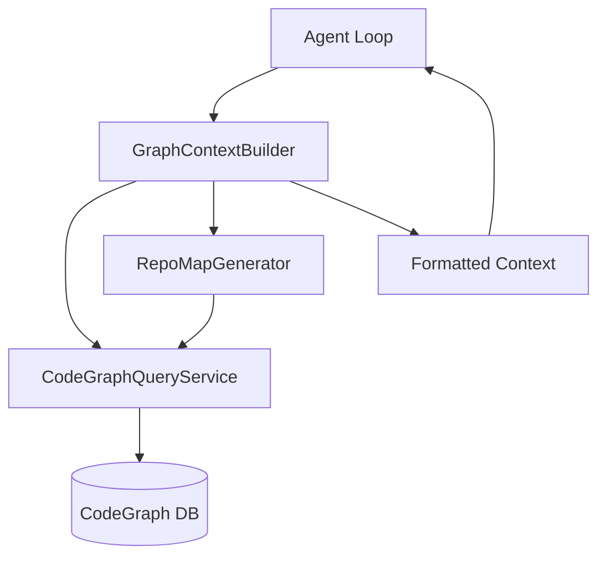

### 26.2 Components

| Component | Path | Responsibility |
|-----------|------|----------------|
| `CodeGraphQueryService` | `server/src/lib/code-graph/query-service.ts` | BFS traversal, related files, dependency chains |
| `RepoMapGenerator` | `server/src/lib/code-graph/repo-map.ts` | Token-budgeted repo map with graph-distance scoring |
| `GraphContextBuilder` | `server/src/lib/analysis/graph-context-builder.ts` | Orchestrates context building with scoring formula |
| Agent Loop integration | `server/src/lib/analysis/agent-loop.ts` | Injects graph context into system prompts |

### 26.3 Scoring Formula

```
score(symbol) = (1 / (graphDistance + 1)) * edgeTypeWeight * queryRelevance
```

Edge type weights: `calls=1.0`, `imports=0.8`, `defines=0.6`, `references=0.4`.

### 26.4 Configuration

- `codeContextBudget`: Token budget for code context (default: 8192)
- `repoMapBudget`: Portion of budget reserved for repo map preamble (default: 20%)
- Graceful fallback when no code graph data exists

### 26.5 Symbol-Level Code Embeddings & Hybrid Search (Epic #507)

Extends the graph-based context selection with semantic symbol embeddings and hybrid search for improved retrieval relevance.

#### Architecture

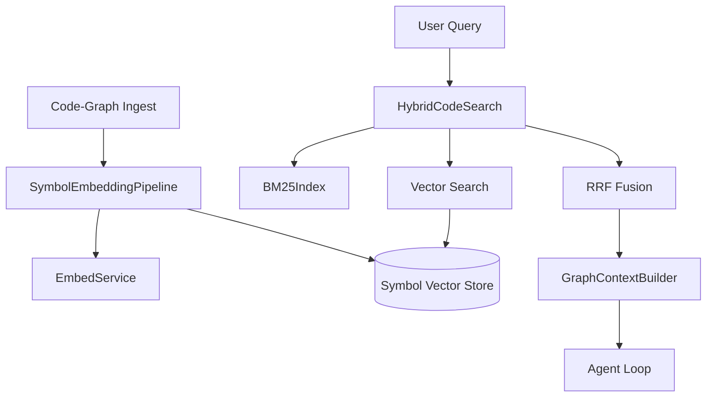

#### Components

| Component | Path | Responsibility |
|-----------|------|----------------|
| `SymbolEmbeddingPipeline` | `server/src/lib/code-graph/symbol-embeddings.ts` | Incremental symbol embedding with SHA-256 hash-based caching |
| `HybridCodeSearch` | `server/src/lib/code-graph/hybrid-search.ts` | BM25 + vector similarity with RRF score fusion |
| `BM25Index` | `server/src/lib/code-graph/hybrid-search.ts` | In-memory BM25 scorer for symbol names/signatures/docs |
| `GraphContextBuilder` (updated) | `server/src/lib/analysis/graph-context-builder.ts` | Hybrid retrieval mode with configurable budget split |

#### Symbol Embedding Format

```
{kind} {name} in {filePath}
{signature}
{docstring}
{body_first_10_lines}
```

Each symbol's formatted text is SHA-256 hashed; embeddings are only recomputed when the hash changes.

#### Hybrid Search — Reciprocal Rank Fusion (RRF)

```
score(symbol) = Σ (weight_i / (k + rank_i))  for each ranker where symbol appears
```

Default weights: `bm25Weight=0.05`, `vectorWeight=0.95`, `k=60`.

Those two numbers are a **measured result, not a preference** (#797, re-swept in #807).
`pnpm eval:embed-retrieval --wired --sweep` sweeps the ratio over the committed NL→code
corpus *through the production searcher* and scores nDCG@10, an exact-name regression
suite, and the target's rank at the limit `search_code_symbols` actually returns. At
`0.4 / 0.6` the lexical channel promoted symbols that share a requirement's *ordinary
English* while having nothing to do with its meaning, demoting correct vector-only hits
below the tool's 15-hit cut-off — i.e. invisible to the agent. On #807's batch-invariant
vectors, `0.05 / 0.95` is the nDCG-maximal setting (**0.474**, vs 0.430 at `0.4 / 0.6`)
with the exact-name miss set **identical name-for-name** to the incumbent's.
**Changing these means re-running the sweep** — and note that changing the *embedder*
means re-running it too: #803's weights were tuned against vectors that #807 later found
to be corrupted by batch composition, which is precisely why they had to be re-swept.

Recorded because the previous revision of this section said the opposite: the flagship
keyword-free requirement's target **is** now returned inside the default 15 (fused rank
14). Fusion still cannot promote a symbol above its own best channel — that algebra was
always right — but the vector channel's own rank fell from 18 to 12 once #807 stopped
embeddings from depending on their ingest batch, so the floor RRF works against came
down with it. The limit itself was **not** raised; the vector was fixed.

#### Configuration

| Env Variable | Values | Default | Description |
|---|---|---|---|
| `CODE_RETRIEVAL_MODE` | `graph`, `hybrid`, `embedding_only` | `graph` | Retrieval strategy for code context |

Hybrid budget split (configurable per-request): 60% graph-ranked, 40% embedding-retrieved.

---

## 27. MCP Tool Token Optimization (Epic #502)

Reduces MCP tool manifest overhead from ~15K tokens to <2K tokens and adds result summarization to minimize context window consumption.

### 27.1 Architecture

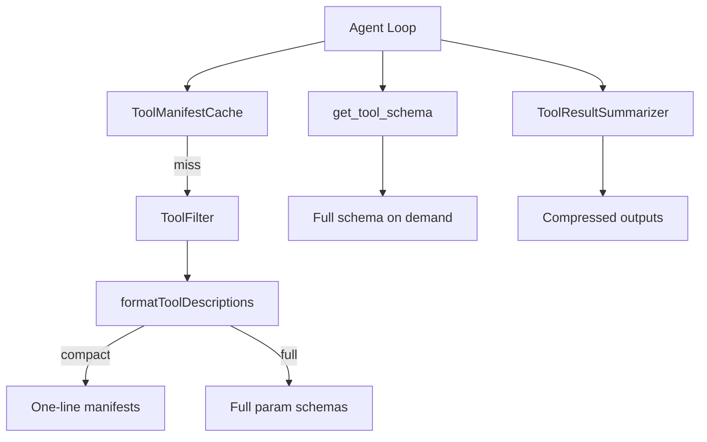

### 27.2 Components

| Component | Path | Responsibility |
|-----------|------|----------------|
| `formatToolDescriptions` | `server/src/lib/analysis/agent-loop.ts` | Compact vs full manifest formatting |
| `get_tool_schema` | `server/src/lib/mcp/get-tool-schema.ts` | Lazy schema loading internal tool |
| `ToolFilter` | `server/src/lib/mcp/tool-filter.ts` | Per-session tool filtering with safety net |
| `ToolResultSummarizer` | `server/src/lib/mcp/tool-result-summarizer.ts` | Heuristic result compression |
| `ToolManifestCache` | `server/src/lib/mcp/tool-manifest-cache.ts` | SHA-keyed cache with TTL and metrics |

### 27.3 Configuration

| Env Variable | Default | Description |
|---|---|---|
| `TOOL_MANIFEST_MODE` | `compact` | `compact` (one-liners) or `full` (with params) |

### 27.4 Summarization Rules

- Threshold: 2K tokens (only results above this are summarized)
- Preserved fields: `id`, `url`, `error`, `message`, `name`, `title`, `status`
- Per-tool rules configurable via `toolRules` map
- Output prefixed with `[Summarized from N tokens]` marker
- Cache TTL: 5 minutes (configurable)

---

## 28. Prompt and Context Compression (Epic #515)

Reduces overall context window consumption through four complementary subsystems that work together to keep sessions within model limits while preserving critical information.

### 28.1 Architecture

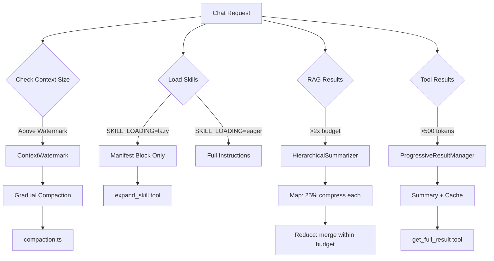

### 28.2 Components

| Component | Path | Responsibility |
|-----------|------|----------------|
| `SkillRegistry` | `server/src/lib/analysis/skill-loader.ts` | Lazy/eager skill loading with manifest generation |
| `expand_skill` tool | `server/src/lib/analysis/expand-skill-tool.ts` | On-demand skill instruction expansion |
| `HierarchicalSummarizer` | `server/src/lib/rag/hierarchical-summarizer.ts` | Map-reduce summarization for large RAG sets |
| `ProgressiveResultManager` | `server/src/lib/mcp/progressive-results.ts` | Tool result caching and progressive disclosure |
| `get_full_result` tool | `server/src/lib/mcp/get-full-result-tool.ts` | Cached result expansion on demand |
| `ContextWatermark` | `server/src/lib/analysis/context-watermark.ts` | Proactive compaction before context overflow |

### 28.3 Configuration

| Env Variable | Default | Description |
|---|---|---|
| `SKILL_LOADING` | `lazy` | `eager` (full injection) or `lazy` (manifests only) |
| `TOOL_RESULT_SUMMARY_THRESHOLD` | `500` | Token threshold for progressive result summarization |
| `CONTEXT_COMPACTION_THRESHOLD_TOKENS` | unset | Absolute cap on the chat compaction watermark (#138); the watermark itself is `CHAT_COMPACTION_WATERMARK_PERCENT` of the catalog context window |

### 28.4 Design Decisions

- **Lazy skills save ~80% tokens**: 10 skills × ~500 tokens each = 5000 tokens reduced to <1000 tokens of manifests
- **Hierarchical summarization is recursive**: map phase at 25% + reduce phase ensures output fits any budget
- **Progressive disclosure preserves full fidelity**: cached results available for 5 minutes via `get_full_result`
- **Watermark is gradual**: only compacts oldest 25% of history per pass to minimize information loss
- **Min-turns guard (5)**: prevents compacting very short sessions where all context is relevant
- **Model-aware limits**: `MODEL_CONTEXT_LIMITS` map stores per-model context windows (200K for Claude, 128K for GPT-4o, etc.)

## 29. Intelligent Model Selection & Routing (Epic #593)

METIS automatically routes AI tasks to the optimal model — Claude Haiku 4.5 (fast/cheap) or Claude Sonnet 4.6 (capable/deep reasoning) — based on task complexity, project preferences, and budget constraints. The model ids are the source of truth in [`server/src/lib/ai/model-router.ts`](../server/src/lib/ai/model-router.ts) (`HAIKU_MODEL_ID` = `us.anthropic.claude-haiku-4-5-20251001-v1:0`, `SONNET_MODEL_ID` = `us.anthropic.claude-sonnet-4-6`). These two models have **different Bedrock prompt-cache minimum thresholds** (Sonnet 4.6 = 1,024 tokens, no 1h TTL; Haiku 4.5 = 4,096 tokens, 1h TTL); see the profile → model → cache-min-token mapping in [`docs/OPERATIONS.md` §7.5](./OPERATIONS.md#75-prompt-caching-epic-647) (Issue #387).

### 29.1 Architecture

The model selection pipeline sits between the Analysis Orchestrator and the AI Engine. Before each agent execution, the orchestrator calls the pipeline to determine which model to use.

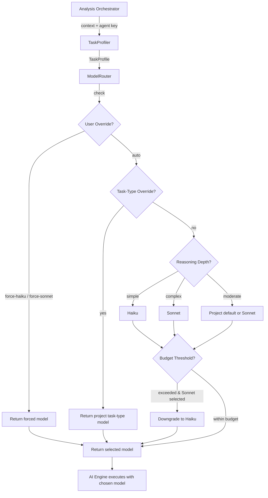

### 29.2 Task Profile Classification

`TaskProfiler` (`server/src/lib/ai/task-profiler.ts`) classifies each task along three dimensions:

| Dimension | Values | How it's determined |
|-----------|--------|-------------------|
| **Reasoning Depth** | `simple`, `moderate`, `complex` | Keyword analysis of content + agent key heuristics |
| **Token Estimate** | integer | Content length + base overhead per agent type |
| **Latency SLA** | `interactive`, `standard`, `background` | Agent key mapping (e.g., chat → interactive, analysis → background) |
| **Task Type** | `document_analysis`, `code_review`, `requirement_synthesis`, `general` | Derived from agent key |

### 29.3 Model Selection Logic

`ModelRouter` (`server/src/lib/ai/model-router.ts`) applies a priority-ordered decision chain:

1. **User override** — `force-haiku` or `force-sonnet` bypasses all other logic.
2. **Task-type override** — Per-project overrides for specific task types (e.g., always use Sonnet for code review).
3. **Reasoning depth routing**:
   - `simple` → **Haiku** (sufficient capability at lower cost)
   - `complex` → **Sonnet** (deep reasoning required)
   - `moderate` → Project default model (falls back to Sonnet if unset)
4. **Budget-aware downgrade** — If a budget threshold is configured and current-month token usage exceeds it, Sonnet selections are downgraded to Haiku automatically.

### 29.4 Per-Project Model Preferences

Stored in the `ModelPreference` Prisma model (one per project):

| Field | Type | Description |
|-------|------|-------------|
| `defaultModel` | `string?` | One of `auto`, Haiku model ID, or Sonnet model ID |
| `taskTypeOverrides` | `JSON` | Map of task type → model ID |
| `budgetDowngradeThreshold` | `int?` | Token count that triggers automatic Sonnet→Haiku downgrade |

API endpoints:
- `GET /api/projects/:projectId/model-preferences` — Read current preferences
- `PUT /api/projects/:projectId/model-preferences` — Upsert preferences (Zod-validated, allowlisted model IDs)
- `GET /api/projects/:projectId/analyses/model-recommendation` — Get a recommendation for a given task context

### 29.5 Cost Model

| Model | Cost per 1K tokens | Best for |
|-------|-------------------|----------|
| Claude Haiku 4.5 | ~$0.001 | Simple classification, extraction, formatting |
| Claude Sonnet 4.6 | ~$0.015 | Complex reasoning, synthesis, multi-step analysis |

The `ModelSelection` response includes an `estimatedCost` field and a `wasDowngraded` flag so the UI can surface budget-related model changes to the user.

## 30. Enhanced Token Usage Tracking & Cost Allocation (Epic #594)

### 30.1 Overview

Extends the existing `TokenTracker` (Phase 4) with per-project cost allocation, Bedrock inference profile integration, token budget enforcement, and real-time CloudWatch metrics. The system provides both project-level and admin-level usage analytics with CSV export.

### 30.2 Architecture

```
┌─────────────────────────────────────────────────────────────────────┐
│                        Request Pipeline                            │
│  ┌─────────────┐    ┌──────────────────┐    ┌──────────────────┐   │
│  │ Budget Check │───▶│ Model Resolution │───▶│ AI Provider Call │   │
│  │ (soft/hard)  │    │ (inference ARN)  │    │ (Bedrock/etc.)   │   │
│  └─────────────┘    └──────────────────┘    └──────────────────┘   │
│         │                                           │              │
│         │ 429 if over limit                         │              │
│         │ downgrade if soft threshold               │              │
│         ▼                                           ▼              │
│  ┌─────────────┐                           ┌──────────────────┐    │
│  │ TokenBudget │                           │ TokenTracker     │    │
│  │ Controller  │                           │ + cost estimate  │    │
│  └─────────────┘                           └──────────────────┘    │
│                                                     │              │
│                                            ┌────────┴────────┐    │
│                                            │                 │    │
│                                    ┌───────▼──────┐  ┌───────▼──┐ │
│                                    │ AITokenUsage │  │CloudWatch│ │
│                                    │ (Prisma DB)  │  │ Metrics  │ │
│                                    └──────────────┘  └──────────┘ │
└─────────────────────────────────────────────────────────────────────┘
```

### 30.3 Key Components

| Component | File | Purpose |
|-----------|------|---------|
| `InferenceProfileManager` | `server/src/lib/ai/inference-profile-manager.ts` | CRUD for Bedrock inference profile ARNs per project |
| `TokenBudgetController` | `server/src/lib/ai/token-budget-controller.ts` | Enforces daily/monthly token limits with soft/hard thresholds |
| `CloudWatchMetricsPublisher` | `server/src/lib/ai/cloudwatch-metrics.ts` | Batched CloudWatch metric publishing (optional, behind env flag) |
| `UsageService` | `server/src/lib/usage/usage-service.ts` | Aggregation queries for usage dashboards |
| `TokenTracker` (enhanced) | `server/src/lib/ai/token-tracker.ts` | Extended with projectId, cost estimation, inference profile ARN |

### 30.4 Data Model

**`InferenceProfile`** — 1:1 with Project. Stores the Bedrock inference profile ARN used to invoke models with cost-allocation tags.

> **Model-ID → profile-ARN swap (cost attribution, not region pinning).** Beyond
> the per-project `InferenceProfile`, the global Bedrock path resolves a model ID
> to an application-inference-profile ARN in `BedrockDirectProvider.resolveModel`
> (`server/src/lib/ai/providers/bedrock-direct-provider.ts`), keyed by the
> `BEDROCK_SONNET_PROFILE` / `BEDROCK_HAIKU_PROFILE` env vars via
> `buildModelProfileMap` (`server/src/lib/ai/config.ts`). The swap exists purely
> for AWS Cost Explorer attribution. It does **not** pin a region: cross-region
> routing (us-east-1 / us-east-2 / us-west-2) through the `us.anthropic.*` /
> `global.*` system inference profiles is intentional and permitted by the gateway
> IAM — there is no us-east-1 residency lock. When a profile map is configured and
> an unmapped cross-region (`us.` / `global.`) model ID reaches the gateway, the
> request still proceeds but its spend bypasses cost attribution and the provider
> emits a structured `warn` (logging only the model ID and a `profileMapConfigured`
> boolean — never the API key or the ARN).

**`TokenBudget`** — Scoped to either a project (`projectId` set) or a user (`userId` set, `projectId` null). Supports daily and monthly token limits with an optional `downgradeModel` for soft-threshold switching.

**`AITokenUsage`** (extended) — Four new nullable columns: `projectId`, `inferenceProfileArn`, `estimatedCostUsd`, `agentStep`. Backwards-compatible with existing rows.

### 30.5 Budget Enforcement

| Threshold | Action |
|-----------|--------|
| < 80% | Allow, no action |
| 80-99% (soft) | Allow, auto-downgrade to `downgradeModel` (e.g. Haiku), log warning |
| ≥ 100% (hard) | Reject with HTTP 429, log error |

The most restrictive budget wins when both project-level and user-level budgets are configured.

### 30.6 Cost Estimation

Per-invocation cost is estimated at record time using known model pricing:

| Model | Input (per 1M tokens) | Output (per 1M tokens) |
|-------|----------------------|----------------------|
| Haiku | $1 | $5 |
| Sonnet | $3 | $15 |
| Opus | $15 | $75 |

### 30.7 API Endpoints

- `GET/PUT /api/projects/:projectId/inference-profile` — Inference profile CRUD
- `GET/PUT /api/projects/:projectId/token-budget` — Project budget management
- `GET /api/projects/:projectId/usage?range=7d&groupBy=day` — Project usage analytics
- `GET /api/projects/:projectId/usage/csv` — CSV export
- `GET /api/admin/usage?range=30d&groupBy=project` — Admin cross-project analytics
- `GET /api/admin/usage/csv` — Admin CSV export
- `GET/PUT /api/admin/token-budgets/:userId` — User-level budget management

### 30.8 CloudWatch Integration

Enabled via `ENABLE_CLOUDWATCH_METRICS=true`. Uses dynamic `import()` of `@aws-sdk/client-cloudwatch` — no hard dependency. Publishes four custom metrics under the `metis` namespace: `InputTokens`, `OutputTokens`, `InvocationLatency`, `EstimatedCost` with dimensions for ProjectId, ModelId, UserId, and Environment. Metrics are batched (max 20 per PutMetricData call) and flushed every 5 seconds. Failures are logged and discarded (graceful degradation).

## 31. Configurable Issue Templates (Epic #595)

### 31.1 Overview

Per-project customizable templates define the structure of AI-generated issue drafts. Each template specifies sections (title, description, acceptance criteria, technical notes, etc.) with typed validation, and supports rendering to both GitHub Markdown and Jira field mappings.

### 31.2 Architecture

```
┌──────────────────────────────────────────────────────────────────────┐
│                        Template Pipeline                            │
│                                                                      │
│  ┌──────────────┐    ┌──────────────────┐    ┌───────────────────┐   │
│  │ TemplateSchema│───▶│ Template Service │───▶│ Draft Generator   │   │
│  │ (JSON Schema) │    │ (CRUD + Prisma)  │    │ (LLM + Renderer) │   │
│  └──────────────┘    └──────────────────┘    └───────────────────┘   │
│         │                     │                        │             │
│         ▼                     ▼                        ▼             │
│  ┌──────────────┐    ┌──────────────────┐    ┌───────────────────┐   │
│  │  Validator    │    │  IssueTemplate   │    │ Markdown / Jira   │   │
│  │ (meta+data)  │    │  (Prisma model)  │    │ Output Renderer   │   │
│  └──────────────┘    └──────────────────┘    └───────────────────┘   │
│                                                        │             │
│                              ┌──────────────────┐      │             │
│                              │  Template Editor  │◀─────┘            │
│                              │  (Settings UI)    │                   │
│                              └──────────────────┘                    │
└──────────────────────────────────────────────────────────────────────┘
```

### 31.3 Key Components

| Component | File | Purpose |
|-----------|------|---------|
| `TemplateSchema` types | `server/src/lib/publishing/template-schema.ts` | TypeScript types for template structure: `SectionType`, `TemplatePlatform`, `TemplateType`, `TemplateSection`, `TemplateSchema` |
| `validateTemplateSchema` | `server/src/lib/publishing/template-validator.ts` | Validates template definitions (meta-schema validation) |
| `validateTemplateData` | `server/src/lib/publishing/template-validator.ts` | Validates populated template output against its schema |
| `TemplateService` | `server/src/lib/publishing/template-service.ts` | CRUD operations, default template seeding, template lookup |
| `TemplateRenderer` | `server/src/lib/publishing/template-renderer.ts` | Renders to GitHub Markdown, Jira fields, and LLM prompt fragments |
| Default Templates | `server/src/lib/publishing/default-templates.ts` | 4 built-in templates: GitHub Epic/Feature, Jira Story/Bug |
| Templates Router | `server/src/routes/templates.ts` | REST API with auth + RBAC |
| Template Editor UI | `ui/src/app/(authed)/projects/[id]/settings/templates/page.tsx` | React settings page with live preview |

### 31.4 Data Model

**`IssueTemplate`** — Scoped to a Project. Stores the template name, platform (`github` | `jira`), type (`epic` | `feature` | `story` | `bug` | `task`), JSON schema, default values, and an `isDefault` flag protecting built-in templates from deletion.

### 31.5 Section Types

Templates define sections with one of 6 types:

| Type | Description | Validation |
|------|-------------|------------|
| `text` | Single-line text | `minLength`, `maxLength`, `pattern` |
| `markdown` | Multi-line rich text | `minLength`, `maxLength` |
| `checklist` | Array of checkbox items | `minItems`, `maxItems` |
| `number` | Numeric value | `min`, `max` |
| `select` | Single choice from options | `options` array |
| `tags` | Array of string tags | `minItems`, `maxItems` |

### 31.6 Rendering Pipeline

1. **`buildTemplatePrompt(schema)`** — Generates an LLM prompt fragment describing the required JSON output format, injected into the system prompt during draft generation
2. **`renderToMarkdown(data, schema)`** — Converts populated template data to GitHub-flavored Markdown for issue body
3. **`renderToJiraFields(data, schema)`** — Maps sections with `platformFields.jiraField` mappings to top-level Jira API fields; unmapped sections render into the `description` field

### 31.7 API Endpoints

- `GET /api/projects/:projectId/templates` — List all templates for a project
- `GET /api/projects/:projectId/templates/:id` — Get a specific template
- `POST /api/projects/:projectId/templates` — Create a new template
- `PUT /api/projects/:projectId/templates/:id` — Update an existing template
- `DELETE /api/projects/:projectId/templates/:id` — Delete a non-default template

All endpoints require `requireAuth` + `requirePermission("issue.draft")`.

## 32. Agent & Skill Token Optimization (Epic #596)

### 32.1 Overview

Reduces token waste during agent-driven analysis by caching code summaries, compressing context windows, and routing tasks to specialist agents. Adds per-agent-step token tracking to identify which phases of analysis consume the most tokens.

### 32.2 Architecture

```
┌─────────────────────────────────────────────────┐
│                  Analysis Run                    │
│                                                  │
│  ┌───────────────┐    ┌──────────────────────┐  │
│  │ Agent Skill   │───▶│ Code-Graph-First     │  │
│  │ Router        │    │ Strategy             │  │
│  │ (keyword      │    │ (intercepts file     │  │
│  │  scoring)     │    │  reads, serves       │  │
│  └───────────────┘    │  cached summaries)   │  │
│                       └──────┬───────────────┘  │
│                              │                   │
│                    ┌─────────▼──────────┐       │
│                    │ AST Summary Cache  │       │
│                    │ (in-memory, per-   │       │
│                    │  file symbol map)  │       │
│                    └─────────┬──────────┘       │
│                              │                   │
│                    ┌─────────▼──────────┐       │
│                    │ AST Parser         │       │
│                    │ (regex-based,      │       │
│                    │  TS/JS/Python)     │       │
│                    └────────────────────┘       │
│                                                  │
│  ┌──────────────────────────────────────────┐   │
│  │ Context Window Manager                    │   │
│  │ (monitors token count, summarizes        │   │
│  │  oldest segments at threshold)            │   │
│  └──────────────────────────────────────────┘   │
└─────────────────────────────────────────────────┘
```

### 32.3 Key Components

| Component | Path | Purpose |
|---|---|---|
| AST Parser | `server/src/lib/analysis/ast-parser.ts` | Regex-based parser for TS/JS/Python — extracts classes, functions, interfaces, types |
| AST Summary Cache | `server/src/lib/analysis/ast-summary-cache.ts` | In-memory cache keyed by file path with invalidation, search, rebuild, and stats |
| Code-Graph-First Strategy | `server/src/lib/analysis/strategies/code-graph-first.ts` | Intercepts agent file-read calls; returns cached AST summaries instead of full source |
| Transcript Compaction | `server/src/lib/analysis/context-window-manager.ts` | Elides older agent-loop tool results once the re-sent transcript passes its token ceiling, so per-turn prompt cost stays bounded (#1225) |
| Agent Skill Router | `server/src/lib/analysis/agent-skill-router.ts` | Keyword-scored routing to select specialist agents under budget constraints |
| AST Cache Route | `server/src/routes/ast-cache.ts` | `POST /api/projects/:projectId/repositories/:repoId/rebuild-cache` endpoint |

### 32.4 Token Estimation

Token counts are estimated at ~4 characters per token (`Math.ceil(text.length / 4)`). The Context Window Manager defaults to a 50,000-token threshold and preserves the 2 most recent segments during compression.

### 32.5 Per-Agent-Step Instrumentation

The `agentStep` field on `AITokenUsage` records which phase of an analysis run consumed tokens (e.g., `planning`, `code-reading`, `summarization`). The usage service supports `groupBy: "agentStep"` for both project-level and admin-level queries. The UI usage page renders an agent-step breakdown chart.

### 32.5a Usage Page — two sources, one project (consistency invariant)

The project Usage page draws from **two** token-accounting tables, written by **two** trackers on the same provider call:

| Page section | Source table | Tracker | Cost field / map |
|---|---|---|---|
| KPI cards + "By provider" | `TokenUsage` | `lib/finops/token-tracker.ts` → `summarizeUsage()` | `costCents` via `lib/finops/provider-rates.ts` (cents per 1k tokens, keyed `provider:model`) |
| "Detailed Usage Analytics" + "by Agent Step" | `AITokenUsage` | `lib/ai/token-tracker.ts` → `UsageService.projectUsage()` | `estimatedCostUsd` via the same `lib/finops/provider-rates.ts` (`estimateCostUsd` → `resolveRate`, USD) |

`TokenUsage.projectId` is **non-null** (always stamped). `AITokenUsage.projectId` is **nullable** — chat traffic associates the row to its project via the `session` relation (`session.projectId`). To keep the two views consistent, `UsageService.projectUsage()` matches rows by **either** the direct `projectId` column **or** `session.projectId` (`where.OR`), so session-only rows are not dropped from the detail/agent-step views. Without this, the detail sections showed "No data" while the aggregates showed data for the same window (Issue #428). The write path also stamps the direct `projectId` for forward-correctness so the `[projectId, ts]` index can serve the query.

**One pricing source, and unpriced is not zero (Issue #22).** Both tables price through `resolveRate(provider, model)` in `provider-rates.ts`: an administrator's `MODEL_PRICES` entry (USD per MTok, keyed `model` or `provider:model`) first, then the built-in `provider:model` rows, then a Claude-family match on the model id (`opus`/`sonnet`/`haiku`, any provider spelling). Anything else resolves to `null` and is **recorded as unpriced** — `TokenUsage.costCents` and `AITokenUsage.estimatedCostUsd` are NULL, never `0` and never another model's price. Before #22 the two tables disagreed in opposite directions for such a model: `TokenUsage` billed it at Sonnet 4.6 rates through an `anthropic:default` row, `AITokenUsage` recorded `0`. The built-in Anthropic list prices are skipped for the `anthropic` provider when `ANTHROPIC_BASE_URL` points at a host other than `api.anthropic.com`, because an Anthropic-compatible endpoint (DeepSeek) maps `claude-*` names onto its own models and bills its own prices. `summarizeUsage()` and `UsageService` report the priced cost plus a separate `unpriced` token total, and each group carries `unpricedTokens`; the Usage and admin Usage pages render those instead of `$0`. Rates follow the published per-MTok prices converted to cents-per-1k (`$X / MTok === X / 10`). The dated/bare Anthropic id coverage from #428 still holds through the family match. `bedrock-gateway` rows carry AWS's own Bedrock prices (AWS Price List API, `AmazonBedrockFoundationModels`), not Anthropic's: a geo inference profile (`us.anthropic.…`) or in-region id of a Claude 4.5+ model bills at Bedrock's Regional SKU, 1.1x the Global one, and the family match applies the same premium to such ids (#42). `published-claude-prices.test.ts` pins every built-in Claude row and family price to its published price, and fails when a Claude row is added without one. The usage summary's `projectedMonthlyCostCents` is the same `projectMonthlyCostForCeiling()` projection the autopilot ceiling enforces. Test-coverage runs record judge and suggestion usage under the provider and model that served them, in an `AISession` whose id is `testCoverageRun:<runId>` (the `ai_token_usages.sessionId` foreign key needs it); their per-run budget treats unpriced **judge or suggestion** usage as exceeded (#43), while unpriced **embedding** usage is reported without stopping the run (#77) — it is bounded, input-only and already incurred by the time it is recorded.

### 32.6 API Endpoints

- `POST /api/projects/:projectId/repositories/:repoId/rebuild-cache` — Triggers AST cache rebuild for a repository
- `GET /api/projects/:projectId/usage?groupBy=agentStep` — Token usage grouped by agent step
- `GET /api/admin/usage?groupBy=agentStep` — Admin-level usage grouped by agent step

---

## 33. Requirements Enhancement Pipeline (Epic #597)

Enriches extracted requirements with web research evidence and multi-turn clarification dialog before ticket creation. The pipeline runs as a sequence of optional steps between document analysis and issue publishing.

### 33.1 Pipeline Flow

```
Raw Documents
     │
     ▼
┌─────────────────┐
│  Requirements    │  LLM extracts typed, prioritized requirements
│  Extractor       │  with ambiguity and evidence-need detection
└────────┬────────┘
         │
         ▼
┌─────────────────┐
│  Web Research    │  (Optional) Generates search queries, fetches
│  Augmenter       │  evidence, produces digests with trust scoring
└────────┬────────┘
         │
         ▼
┌─────────────────┐
│  Clarification   │  (Optional) Multi-turn Q&A dialog (up to 3
│  Dialog          │  rounds) to resolve ambiguities
└────────┬────────┘
         │
         ▼
┌─────────────────┐
│  Approval        │  Human review checkpoints for evidence
│  Checkpoint      │  and refined requirements
└────────┬────────┘
         │
         ▼
  Issue Publishing
```

### 33.2 Components

| Component | File | Purpose |
|-----------|------|---------|
| Type Definitions | `server/src/lib/analysis/types/requirements.ts` | All types for the enhancement pipeline |
| Requirements Extractor | `server/src/lib/analysis/requirements-extractor.ts` | LLM-powered structured extraction with ambiguity detection |
| Web Research Augmenter | `server/src/lib/analysis/web-research-augmenter.ts` | Pluggable web search with domain trust scoring |
| Clarification Dialog | `server/src/lib/analysis/clarification-dialog.ts` | Multi-turn Q&A with Haiku→Sonnet escalation |
| Clarification Dialog Store (Epic #201) | `server/src/lib/analysis/clarification-dialog-store.ts` | Durable Prisma-backed dialog state (`ClarificationDialogState`) replacing the prior in-memory Map; survives restarts |
| Approval Checkpoint | `server/src/lib/analysis/approval-checkpoint.ts` | Prisma-backed approve/reject workflow |
| Enhancement Status | `ui/src/components/analysis/EnhancementStatus.tsx` | Pipeline progress indicator |
| Clarification Dialog UI | `ui/src/components/analysis/ClarificationDialog.tsx` | Q&A interface for clarification rounds |
| Evidence Review UI | `ui/src/components/analysis/EvidenceReview.tsx` | Evidence panel with trust badges |

### 33.3 Key Design Decisions

- **Pluggable search**: `WebSearchProvider` interface allows swapping Tavily for other providers or using a stub for offline dev.
- **Domain trust scoring**: Sources are scored as high (`.gov`, `.edu`, IEEE, NIST), medium, or low (social media, forums) to help reviewers prioritize.
- **Haiku→Sonnet escalation**: The clarification dialog starts with Haiku for cost efficiency and escalates to Sonnet when >60% of ambiguities remain unresolved after a round.
- **Configurable approval policy**: `DEFAULT_APPROVAL_POLICY` requires human approval for evidence and requirements but not clarification. Policies are extensible per-project.
- **Durable clarification feedback loop (Epic #201)**: Dialog state is checkpointed to the `ClarificationDialogState` Prisma table (keyed by `analysisId`) so in-flight clarification survives a server restart and the UI can resume it after a reload (interrupt/resume pattern, native Prisma — no external orchestrator). On answer submission the clarify route persists the refined requirements via `persistAnalysisEnhancement` into `Analysis.metadata`, and synthesis reads them back and injects them into the synthesis prompt as an authoritative `CLARIFIED REQUIREMENTS` section, so clarifications measurably change generated specs.
- **Clarification → artifact enrichment (#1116)**: the `CLARIFIED REQUIREMENTS` injection above only reaches the artifact when synthesis runs *after* the answers exist. In the normal interactive flow it does not: the enhancement pipeline creates `structuredRequirements` and synthesis runs immediately after it, **before** the user has seen a single question. The user then answers, the clarify route rewrites `metadata.structuredRequirements` (which is all the Approvals panel renders), and the artifact path — `persistRequirements` replaying the frozen synthesis `AgentResult` → `IssueDraft` → GitHub issue — never re-reads it. `server/src/lib/analysis/clarification-enrichment.ts` closes that hop **without another LLM call**: `applyClarificationsToRequirements(analysisId)` collects every non-blank answer from the durable dialog state, attributes it to a persisted `Requirement` row (the two id spaces are disjoint, so the join is a stop-worded, plural-folded **containment match on the `StructuredRequirement.title`**, threshold 0.5 — no match is reported, never guessed), and writes the Q&A verbatim into `Requirement.body` inside `<!-- metis:clarifications:… -->` markers, so re-running replaces the block rather than stacking it. Called from **both** orderings the product allows: the clarify route (answers submitted after the rows exist) and `promoteApprovedRequirements` (answers submitted while the approval gate withheld them). The clarify LLM's rewritten `description` is deliberately **not** copied over — the accounting written to `Analysis.metadata.clarificationApplication` (`{answeredCount, appliedCount, unattributedCount, requirementsUpdated, requirementsAvailable}`) is what states that in the UI (`ClarificationImpactNote`).

### 33.4 Database Model

`ApprovalRequest` tracks approval state per requirement or evidence digest:

| Field | Type | Purpose |
|-------|------|---------|
| `analysisId` | FK → Analysis | Links to the parent analysis |
| `type` | `evidence` \| `requirement` \| `clarification` | What is being approved |
| `itemId` | String | ID of the specific item |
| `status` | `pending` \| `approved` \| `rejected` | Review state |
| `reviewerId` / `reviewNote` | String? | Who reviewed and why |

### 33.5 API Endpoints

- `POST /api/analysis/:id/clarify` — Start or continue a clarification dialog
- `GET /api/analysis/:id/approvals` — List approval requests for an analysis
- `PUT /api/analysis/:id/approvals/:approvalId` — Approve or reject an approval request

---

## 34. Ingestion UX Infrastructure (Epic #663)

Real-time ingestion feedback, auto-ingest on first repo, multi-repo token management, and connection discovery notifications.

### 34.1 Socket.IO Rooms & Events

| Room Pattern | Subscription Event | Events Emitted | Purpose |
|---|---|---|---|
| `project:{projectId}` | `subscribe:project` | `connector:progress`, `connector:discovery` | Project-level progress and discovery broadcasts |
| `connector:{connectorId}` | `subscribe:connector` | `connector:progress`, `connector:status` | Per-connector targeted subscriptions |

**Progress event payload** (`connector:progress`):

```typescript
interface ConnectorProgressEvent {
  connectorId: string;
  projectId?: string;
  kind: "repo" | "db";
  phase: "test" | "metadata" | "introspect" | "ingest" | "deep-ingest";
  step: string;
  current?: number;
  total?: number;
  status?: "running" | "error";  // error variant dismisses UI progress bar
  errorMessage?: string;
  ts: number;
}
```

The server emits progress to **both** `connector:{id}` and `project:{projectId}` rooms so that project-level UI listeners (connections page) receive updates without subscribing to individual connectors.

### 34.2 Auto-Ingest Flow

When a repo connector is created (`POST /repos`), auto-ingest triggers if:
1. The `autoIngest` flag is explicitly set, OR
2. It is the first repo connector in the project.

The deep-ingest pipeline runs as a fire-and-forget background task (5 steps: clone → code-graph → RAG ingest → metadata → discovery). On failure, a `status: "error"` progress event is emitted so the UI can dismiss the progress bar and show an error toast.

### 34.3 Concurrency Guard

One in-process lease per connector (`server/src/lib/connectors/ingest-guard.ts`, #217) is shared by every entry point that ingests a repository, so two runs never race a clone or interleave `sourceIngestState` writes. If a second request arrives while an ingest is running:
- **Auto-ingest**: silently skipped (the background trigger returns immediately).
- **Manual deep-ingest and refresh-ingest routes**: return `409 INGEST_IN_PROGRESS`, before any clone or code-graph work. Both look the connector up in the caller's project first, so another project's caller gets `404`, never a 409 revealing the id is busy.
- **Scheduled `refresh-repo-connector`**: fails the run with the same 409 error, before it pulls.
- **`ingestSourceAsKnowledge` without a lease** (the docs-gen eval runner): claims the connector itself and refuses the same way.

The lease is per process; a multi-replica deployment would need a database-level claim.

### 34.4 Multi-Repo Token Budget

When running multi-repo analysis, the total token budget (`100,000`) is split across repos. A minimum floor of `50,000` tokens per repo is enforced. If the split would fall below this floor:
- The system caps at `floor(totalBudget / 50,000)` repos.
- A warning is logged identifying the cap.
- Remaining repos beyond the cap are skipped for that analysis run.

### 34.5 Discovery Notifications

After deep-ingest completes the connection-scanning step, if database connections are found, a `connector:discovery` event is emitted to the `project:{projectId}` room. The UI hook shows a Sonner toast with the count and a "View" action linking to the Connections tab.


## AI Bug Scanner (Epic #708)

The bug scanner reuses existing infrastructure rather than introducing a parallel stack:

```
   UI (rule editor, triage, repo deep-link)
         │
         ▼
   /projects/:id/* routes  (rules.ts, scans.ts, triage.ts)
         │                    │           │
         │                    ▼           ▼
         │            scheduler        triage-service (pure)
         │            (scanner.run-scan)
         ▼
   prisma-adapter
   ├── runScanWithPrismaPorts → orchestrator
   │     ├── per-symbol-scanner (Haiku)
   │     └── fp-filter (Sonnet, 3 votes)
   ├── materializeTriagedFinding → Finding
   └── publishScanFinding → publisher / jira-publisher
```

Pure modules under `server/src/lib/scanner/` are port-driven (no Prisma imports). The
adapter (`prisma-adapter.ts`) wires Prisma queries and the existing publishing stack
into the ports so the scanner can be tested with in-memory ports.

Key invariants:
- Every LLM call passes through `prompt-fence.ts`.
- Per-project RAG isolation is inherited from `code-graph/query-service.ts`.
- Stale-commit gate aborts orchestrator if HEAD drifts from `Scan.commitSha`.
- ScanFinding → Finding materialisation happens only on triage `approved`.
- Republish is idempotent via `IssueLink` + `metis-finding:<fingerprint>` marker.

## Bidirectional Issue Sync (Epic #739)

### Overview

Detects when published issues are modified in external trackers (GitHub Issues,
Jira) and presents the changes for resolution in METIS.

### Data Flow

```
GitHub Webhook → POST /api/webhooks/github/issues → verifySignature → normalizeEvent → reconcileIssueChange → DriftEvent
                  (one receiver in routes/webhooks-github.ts runs this AND the spec-kit tasks.md sync — #96)
Jira Webhook   → POST /api/webhooks/jira/issues   → verifySignature → normalizeEvent → reconcileIssueChange → DriftEvent
Jira DC Poll   → scheduler task (jira.poll)        → fetchChanges    → normalizeEvent → reconcileIssueChange → DriftEvent
```

### Key Components

| File | Purpose |
|------|---------|
| `packages/shared/src/sync.ts` | Shared types, Zod schemas, drift event row shape |
| `server/src/lib/sync/github-issue-webhook.ts` | HMAC-SHA256 verification + GitHub payload normalisation |
| `server/src/lib/sync/jira-webhook.ts` | Jira signature verification + payload normalisation |
| `server/src/lib/sync/reconcile-service.ts` | Deduplication, diff computation, DriftEvent creation, Socket.IO emit |
| `server/src/lib/sync/jira-poll-worker.ts` | Scheduler task for polling Jira DC (no webhook support) |
| `server/src/routes/sync.ts` | REST routes: webhooks (unauthenticated + signature) and drift API (auth + RBAC) |
| `ui/src/components/sync/drift-badge.tsx` | Live-updating badge showing pending drift count |
| `ui/src/app/(authed)/projects/[id]/sync/page.tsx` | Drift dashboard with diff modal and resolution actions |

### Data Model

`DriftEvent` (table: `drift_events`): id, publishedIssueId, projectId, requirementId,
source, deliveryId (unique), action, fieldDiffs (JSON), externalSnapshot (JSON),
localSnapshot (JSON), status (pending/resolved), resolution (adopt/push/divergent),
resolvedById, resolvedAt, createdAt, updatedAt.

### Resolution Actions

- **Adopt** — Overwrite local draft fields with external values.
- **Push** — Mark as resolved; future push-back to external (not yet wired).
- **Divergent** — Acknowledge the difference and mark resolved without changes.

### RBAC

- `sync.read` — View drift events (coordinator, developer, reader).
- `sync.resolve` — Resolve drift events (coordinator only).

Both are role checks, not object checks. Every drift route also passes the drift's project
through `assertProjectAccess`: the reads take it from `projectId` (#88), the resolve reads it from
the drift row (#102). A project the caller cannot reach answers 404, the same as an unknown id.

## Project-Level Test Coverage Gap Analysis (Epic #856)

### Overview

A backend pipeline that ingests existing test cases (CSV/Excel/DOCX/Markdown/Gherkin), indexes
them in the vector store alongside requirements, then runs background jobs that map cases to
requirements, score coverage, and surface gaps + AI suggestions. Phase 1 delivers the data
model, importer framework, indexer, REST surface, and orchestrator shell. Matching/judging
(Phase 2 — #869/#870) and the workbench UI (Phase 4 — #865) follow.

### Data Model

- `TestCaseImport` — one row per upload (or paste) holding source, label, status, raw column
  mapping confidence, and audit metadata.
- `TestCaseDoc` — normalised case rows tied to a project + import; carries `contentHash` so
  re-imports collapse to upserts, plus JSON columns for `stepsJson` and `tags`.
- `TestCoverageRun` — one queued/running/completed/failed lifecycle row per analysis run.
  `phaseProgress` is a JSON map of `{import|index|match|judge|suggest|score}` → state.
- `CoverageMapping` — case ⇄ requirement edge with status (`COVERED`, `OVERRIDDEN`, `UNCOVERED`),
  reviewer override metadata, and confidence.
- `GapItem` — requirements with no covering case, ranked by severity.
- `Suggestion` — AI-proposed new cases for gaps; statuses `pending|accepted|dismissed`.

### Pipeline

```
upload/paste ─► TestCaseImport ─► provider.parse() ─► TestCaseDoc (upsert by contentHash)
                                                              │
POST /runs ──► TestCoverageRun(queued) ──► createDefaultEnqueueRun()
                                                              │ setImmediate
                                                              ▼
              runTestCoverageJob:
                  import   — count docs               (advance done)
                  index    — embed cases + steps      (advance done) ─► VectorStore[tc:/tcs:<pid>]
                  match    — case ↔ requirement       (Phase 2: #869)
                  judge    — LLM grading              (Phase 2: #870)
                  suggest  — gap → AI test case       (Phase 2)
                  score    — aggregate counts         (advance done)
                                                              │
                                                              ▼
                       update run.status=completed; emit run:completed
```

### Importer Framework

`ImportProvider.parse(buffer | string, ctx)` returns `{ cases, confidence, notes }`. Providers
share `matchColumns()` + `assertMappingOrThrow()` so a single column-mapping pipeline serves
every source. Unknown columns trigger `ColumnMappingRequiredError` with `.suggestion` +
`.confidence` so the UI can ask the user to disambiguate (e.g. `"Steps to Reproduce" → steps`).
DOCX flows through `mammoth.convertToHtml` → custom Markdown bridge → Markdown provider.

### Emitter Contract

`TestCoverageEmitter.emit(evt: TestCoverageEvent)` where event types are:

- `run:queued` — fired by the route handler when the run row is created.
- `run:started` — first action inside `runTestCoverageJob`.
- `run:progress` — once per phase transition; `detail` carries phase counters.
- `run:completed` — terminal happy-path event.
- `run:failed` — terminal error event with `error` message.

The workbench (Phase 4) subscribes through this contract so it never polls `GET /runs/:id`.

### REST API

All under `/api/projects/:projectId/test-coverage` with `requireAuth` + `requirePermission`:

- `POST /imports` — multipart file upload (multer, 25 MB cap). Returns `{ importId }`.
- `POST /imports/paste` — JSON body `{ source, text, label, columnOverrides? }`.
- `GET  /imports` — list recent imports for the project.
- `POST /runs` — queue a new run. Returns `409 RUN_IN_PROGRESS` (with `details.runId`) when
  a `queued|running` row already exists for the project.
- `GET  /runs` — most-recent 50 runs.
- `GET  /runs/:runId` — run row including `phaseProgress`.
- `GET  /runs/:runId/report` — aggregated `{ totalRequirements, covered, coveragePct, gaps[] }`
  where `covered = COVERED + OVERRIDDEN`.
- `PATCH /mappings/:mappingId` — reviewer override (`COVERED → DB OVERRIDDEN` with reason).
- `PATCH /suggestions/:suggestionId` — accept or dismiss an AI suggestion.

### Phase 2 / Phase 4 Boundaries

Phase 1 stubbed `match`, `judge`, and `suggest` as `advance("skipped")`. Phase 2 (this section)
implements the real logic behind a single `runCoverageScoring()` entry point that the runner
invokes when a `JudgeModelCaller` is wired into its deps. Phase 4 (#865) layers the workbench
UI on top.

### Phase 2 — Matching, Judging, Suggestions, Cost (Epic #856 / Issues #857, #858, #863, #870, #878)

#### Coverage Matcher (#857)

`matchRequirements(reqs, cases, opts) → MatcherResult` produces deterministic, citation-ready
verdicts for every requirement ⇄ case pair. Each cell is scored on:

- **Cosine similarity** of normalised embeddings (BGE-small via `getEmbedder()`).
- **BM25** over tokenised case + step text against the requirement title/body.

Buckets are tunable via `MatcherThresholds`; defaults: `cosine ≥0.85` OR (`cosine ≥0.78` AND
`bm25 ≥0.5`) → `COVERED`; `cosine <0.62` → `UNCOVERED`; otherwise `AMBIGUOUS`. Per-requirement
verdicts aggregate the strongest cell so the orchestrator can route `AMBIGUOUS` rows to the
judge and feed `UNCOVERED` rows to the suggestion generator.

#### Judge (#863)

`judgeAmbiguous(pairs, caller, opts)` batches `AMBIGUOUS` pairs (default 8 per request) and
asks Claude Haiku via the Bedrock gateway (`us.anthropic.claude-haiku-4-5-20251001-v1:0`)
whether the case truly covers the requirement. The prompt is strict JSON with an explicit
``` schema; the parser strips fences and retries once on malformed JSON. The semantic cache
keys on `(reqHash, caseHash, model)` so repeated runs reuse verdicts and confidence scores.

#### Suggestion Generator (#870)

`generateSuggestions(input, caller, opts)`:

1. Clusters uncovered requirements with cheap k-means on their embeddings (default 4 clusters).
2. For each cluster, calls Haiku with `buildClusterPrompt()` asking for up to 5 draft cases
   with Given/When/Then steps + source citations.
3. Filters drafts with faithfulness < 0.6 (`scoreGrounding(citations, requirements)`).
4. Dedupes against existing `TestCaseDoc` vectors (cosine ≥0.88) and within the batch itself.

Suggestions persist as `Suggestion` rows (`status="pending"`) ready for the reviewer.

#### Coverage Orchestrator (#858)

`runCoverageScoring({runId, projectId, userId}, {caller, db?, emit?, budgetCents?})` is the
single entry the task-runner calls during the `match → judge → suggest → score` phases. It:

- Hydrates indexed cases + requirements from Prisma into matcher inputs.
- Calls `matchRequirements()`, persists `CoverageMapping` rows for `COVERED` cells, and emits
  `run:progress` with per-phase counters.
- Sends `AMBIGUOUS` pairs through the judge; flips qualifying cells to `COVERED`.
- Lists remaining `UNCOVERED` requirements, runs the suggestion generator, and writes
  `GapItem` + `Suggestion` rows.
- Returns a `CoverageRunReport` with matcher/judge/suggestion counts, cost breakdown, and the
  final `coveragePct`.

#### Cost Telemetry (#878)

`CoverageCostTracker` aggregates token usage by phase (`embedding`, `judge`, `suggestion`) and
charges via the per-provider price table:

- Embeddings → the embedder that ran, as provider `embed:<registry key>` (`embeddingUsageProvider`)
  and the model its `embed()` reported. The local backends (`offline`, `xenova`, `embeddinggemma`,
  `sidecar`) have `embed:<key>:default` zero rows; Titan Text Embeddings V2 and OpenAI's embedding
  models have published-price rows (`published-embedding-prices.test.ts`); anything else is
  unpriced (#58). The `embed:` namespace keeps an embedder key off LLM provider rows.
- Judge + suggestion → the provider and model that served each call (#43).

Every `embed()` call a run makes is billed: the `index` phase's case and step batches
(`TestCoverageIndexer.index`), the match phase's requirement and test-case batches, the judge's
per-batch semantic-cache key, and the suggestion generator's cluster prompt plus its dedup texts
(#72). A cache **hit** still bills its key embedding — a warm cache skips the model call, not the
embedding.

`exceeded()` is checked before each judge batch and before each suggestion cluster; the judge
and `generateSuggestions` record every call through the tracker as it happens (#57), so a run
stops part-way once the cap is reached or a judge/suggestion call reveals an unpriced model. An
unpriced EMBEDDING model does not stop the run (#77); its tokens are still counted, so
`usedCents` reads as the lower bound it is and `unpricedEmbeddingTokens` says by how much.
The tracker is created by the **task-runner**, not by `runCoverageScoring`, so the `index`
phase's two `embed()` calls — every test-case text, then every step text, the largest embedding
consumer a run has — are on the same budget as the match phase's and the judge/suggestion
loops' (#72). `flush()` persists
`tokenCostCents`, `embeddingTokens`, `judgeTokens`, and `suggestionTokens` onto the
`TestCoverageRun`. The default budget is 20¢ and is
overridable via the `TESTCOVERAGE_BUDGET_CENTS` env var. A new route exposes the live view:

- `GET /api/projects/:projectId/test-coverage/runs/:runId/budget` →
  `{ limitCents, usedCents, remainingCents, byPhase: { embedding, judge, suggestion } }`.


### Phase 4 — UI, Virtualized Matrix, Exports (Epic #856 / Issues #865, #868, #872, #875)

Phase 4 closes the loop by surfacing the analysis pipeline in the app and giving operators a
deterministic way to ship coverage data out to spreadsheets or back into test-management tools.

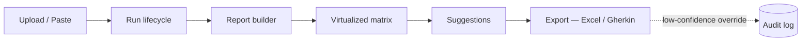

#### UI page (#865)

- Route: `/projects/:projectId/test-coverage` under the authed App Router segment.
- Composed from React Query (`@tanstack/react-query`) for server cache + Socket.IO
  (`testcoverage:run-update` / `testcoverage:run-finished`) for run-lifecycle push.
- Surfaces five tiles: import controls, run table, summary (`coveragePct`, totals,
  budget), matrix, gaps, suggestions, and an export dialog.
- The page-level React Query client is created per render (no global cache) to
  prevent leakage between projects.

#### Virtualized matrix (#868)

- Component: `ui/src/components/test-coverage/coverage-matrix.tsx`.
- Backed by `@tanstack/react-virtual` (`useVirtualizer` for both rows and
  columns) — rendered viewport is `requirements.length × testCases.length`
  conceptually but only the visible window is mounted (≈ 30×40 cells at
  default sizes).
- Sticky requirement column + sticky test-case header row.
- Cell colour bands (`scoreClass`) — green ≥0.80, amber ≥0.50, red <0.50,
  muted when there is no mapping.
- A11y: outer container is `role="grid"` with `aria-rowcount` /
  `aria-colcount`; each cell has an `aria-label` of
  `"<req> × <tc>: score <X.XX>"` or `"<req> × <tc>: no mapping"`.

#### Exports (#866 / #877 / new export route)

- Route: `POST /api/projects/:projectId/test-coverage/exports`
  `{ runId, target: "excel" | "gherkin", overrideLowConfidence? }`.
- Faithfulness gate: suggestions with `faithfulness < 0.6` are tagged
  `lowConfidence` by the Phase 2 suggestion generator and are **excluded**
  from exports unless the caller opts in.
- When `overrideLowConfidence: true` is passed, the route writes a
  `test-coverage.export.low-confidence-override` audit log entry with
  `{ runId, target, suggestionIds }` so the override is traceable.
- Response: `application/vnd.openxmlformats-officedocument.spreadsheetml.sheet`
  for `excel`; `text/plain` (single `.feature`) or `application/zip` for
  `gherkin` depending on the number of features generated. `Content-Disposition`
  carries the suggested filename.

#### E2E coverage (#875)

- `e2e/tests/test-coverage.spec.ts` exercises two flows against a real server:
  - **Mode A** — create project, paste CSV import, start a run, poll until
    `succeeded`, fetch the report, and request an Excel export.
  - **Mode B** — create project with two requirements (no imports → low
    confidence likely), start a run, confirm the first export attempt is
    either successful or returns `LOW_CONFIDENCE_BLOCKED`, then re-request
    with `overrideLowConfidence: true` and assert the Gherkin response.

#### Cost model recap

Phase 4 does not change the budget; it only surfaces it. The summary tile
reads `GET …/runs/:runId/budget` and renders `usedCents / limitCents`. The
export route does not consume budget (no LLM calls), so budget exhaustion
never blocks an export.

## Server-owned chat conversation (Epic #127)

Until #127 the browser held the chat transcript and resent it on every turn;
the server trusted whatever history arrived and trimmed it with a sliding
window (`windowHistory`, now removed). A client could forge earlier assistant
or tool messages, and old turns were silently dropped.

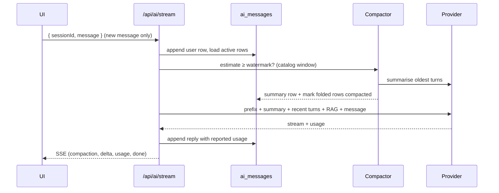

| Piece | Where | What it does |
|---|---|---|
| Transcript | `ai_messages` (`server/prisma/schema.prisma` `AIMessage`); `server/src/lib/ai/conversation/transcript-store.ts` | One row per message, `(sessionId, ordinal)` unique; content parts (`text`, `tool_call`, `tool_result`); provider-reported input/output/cache tokens (NULL when not reported) and the prompt's character count; `compactedAt` / `compactedIntoId` on folded rows. Rows are never deleted by compaction. |
| Request contract | `server/src/routes/ai.ts` `newUserMessage` | `/chat` and `/stream` take `message` (the new user message). Legacy `messages` is accepted only as ONE `user` message; any other role or more than one message is `400 CLIENT_HISTORY_REJECTED`. |
| Turn | `server/src/lib/ai/conversation/turn.ts` | Persists the question first, builds history from active rows (`context-builder.ts`), estimates, compacts, and records the reply — including a reply that failed or was stopped (kept, `meta.error`), a semantic-cache hit (`meta.cached`) and a context overflow (`413 CHAT_CONTEXT_OVERFLOW`). The session `snapshot` is now derived from the transcript. |
| Token accounting (#137) | `server/src/lib/ai/conversation/token-estimator.ts` | After a call: `contextInputTokens` per provider (Anthropic input + cache read + cache write; OpenAI-compatible `prompt_tokens`). Before a call: characters ÷ a ratio chosen calibrated (this session's reported turns on the same model) → catalog (`AI_MODEL_CATALOG_OVERRIDES` `charsPerToken`, measured families) → default 3.0. No tokenizer ships in the repo. |
| Watermark + compaction (#138) | `server/src/lib/analysis/context-watermark.ts`, `server/src/lib/async/compaction.ts` | Window from the model catalog (`resolveContextWindow`), fallback `CHAT_CONTEXT_WINDOW_FALLBACK` reported as `fallback`. At `CHAT_COMPACTION_WATERMARK_PERCENT` (80) the oldest whole turns are summarised (in several calls if needed) into one pinned summary row so the prompt drops to ~50% of the window. The system prompt and cacheable prefix are not transcript rows and are never compacted. An empty summary aborts the pass; a capped one is kept and flagged. |
| Tool results | `chat-code-tool-runtime.ts`, `context-builder.ts` | In the live code-tool loop, a result over `CHAT_TOOL_RESULT_MAX_TOKENS` is truncated with a marker in the model's copy; the full text is stored in the transcript. Past tool results are never replayed into later turns (they are untrusted data), and the summary is sent in the user role, never as a system message. |
| Resume / fork (#139) | `server/src/routes/ai-conversation.ts`, `conversation-service.ts` | `GET /sessions/:id/messages`, `POST /sessions/:id/resume` (transcript + model, reasoning effort, agent, skills, plan-mode from the session row), `POST /sessions/:id/fork { fromOrdinal }` (copies rows ≤ ordinal with their compaction state, and the session state; `forkedFromSessionId`/`forkedFromOrdinal`), `POST /sessions/:id/compact`. Rate-limited by `conversationRateLimiter`. |
| Authorisation | `server/src/lib/ai/conversation/session-access.ts` | Every chat and transcript route requires session ownership AND `assertProjectAccess` on the session's project; every failure is the same 404. Forks inherit owner and project, so they are authorised exactly like the source. |
| Pre-transcript sessions | `legacy-snapshot.ts` | A session with no rows but a v1 snapshot has its user/assistant text imported once (`meta.importedFrom`). |
| Local queue deadline | `stream-idle.ts`, `ChatOptions.onSlotAcquired` | The `local-gemma` provider signals when its concurrency slot is acquired; chat's idle timeout starts then, so queue time is not a stall. The hard ceiling is re-armed after compaction so a summary call never eats the answer's budget. |

The `/model` switch (`currentModel`, #165) is now honoured by chat; before
#127 it was written and never read.

<!-- Last updated: 2026-09-26 by delivery:code-issue resolving #127 -->
