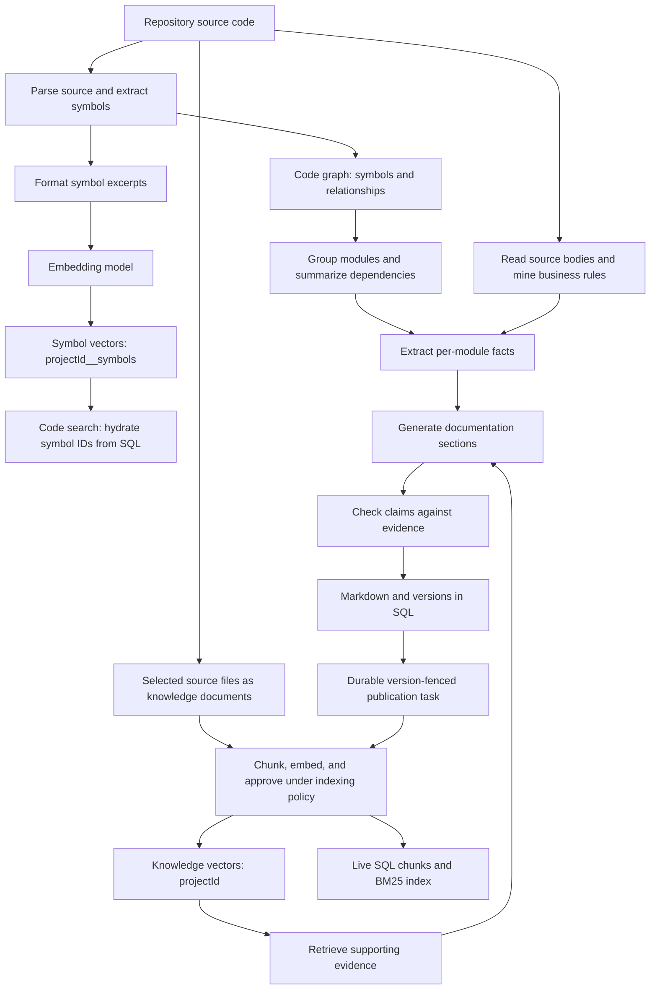
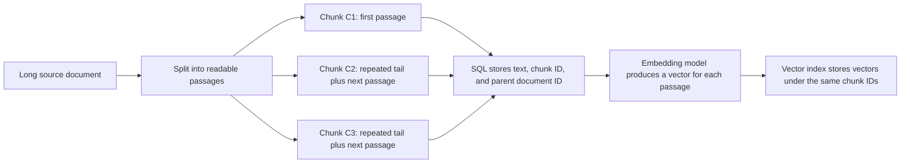
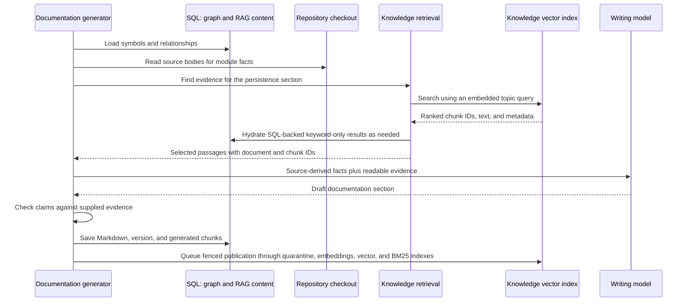

# Code Graph, Code Embeddings, and Documentation Generation

METIS builds two complementary representations of a codebase during Deep
Ingest: a **structural code graph** (explicitly extracted symbols and
relationships) and a **semantic vector index** (embeddings for similarity
search). These are separate representations, connected by identifiers rather
than by embedding vectors inside graph nodes.

**Repository-wide documentation reads the relational graph and actual source
files, then retrieves supporting knowledge-document chunks. It does not directly
search the code-symbol vector index.** After generation, Markdown and versions
are saved to SQL. A separate durable publication task chunks and embeds the
current revision through the shared quarantine/approval, vector, and BM25
pipeline. Saving readable output and publishing searchable output are distinct;
see
[How does chat retrieval work if the answer isn't a
vector?](#how-does-chat-retrieval-work-if-the-answer-isnt-a-vector).
It does not depend on the optional [Graphify](https://github.com/safishamsi/graphify) developer tool.

Implementation details below reflect the local source on 2026-09-18, including
the #1356 regeneration changes. This is a source walkthrough, not a validation
run. Historical observations and remaining proposals are labelled separately.

## Plain-language guide: how the RAG store works

### SQL holds the knowledge; vectors help find it

**The SQL database is METIS's authoritative RAG content and metadata store.**
It holds documents, readable text chunks, their identities and provenance, as
well as the code graph and generated documentation. Original repository files
remain in the checkout; uploaded originals can live in configured file storage.
SQL is not a replacement for those original files.

The **vector store is the semantic search index for that knowledge**, not the
sole home of the knowledge itself. The complete RAG system uses both. Depending
on deployment, vectors live in LanceDB or in PostgreSQL through pgvector; with
pgvector they can be in the same database system as the SQL records while still
serving a different purpose.

Think of a library:

| METIS concept | Library analogy | What it actually does |
|---|---|---|
| SQL documents and chunks | Books and labeled passages | Retains readable content and its identity |
| Code graph | A map of references between chapters | Records explicit code relationships |
| Vector index | A catalog organized by similarity of meaning | Suggests passages related to a question |
| BM25 keyword index | A word/name index | Finds passages containing matching terms |
| Generative LLM | A writer consulting selected passages | Writes an explanation from supplied evidence |

Vector rows can also carry copies of text and metadata for efficient retrieval.
That duplication does not make them the authoritative document/version records.
An embedding cannot be decoded to recover the original source code: it is a
lossy numerical representation, not a compressed file or a generated document.

### Is using SQL for RAG normal?

**Yes. SQL as the system of record, with a vector index for similarity search,
is a common production RAG architecture.** A RAG system does not require all
its content to live in a dedicated vector database. SQL and vector search are
complementary capabilities, not competing definitions of a RAG store.

METIS follows this pattern: SQL retains readable content, ownership, approval
state, provenance, and versions; LanceDB or pgvector provides semantic search.
Storing the code graph as SQL nodes and edges is also a valid design—it does
not require a graph database merely because the data represents relationships.

| Architecture | Why a team might choose it | Operational consideration |
|---|---|---|
| SQL plus an embedded vector engine, such as METIS's LanceDB default | Local operation and a lightweight vector-search deployment | SQL and vector updates require coordinated indexing and cleanup |
| PostgreSQL plus pgvector, supported by METIS | Relational records and vector search in one database system | Index tuning, connection capacity, and transaction boundaries still matter |
| SQL plus a dedicated vector service, such as Qdrant, Milvus, or Pinecone | Independent search scaling, managed operations, or specialized retrieval requirements | Adds a service boundary and synchronization responsibilities; not a currently documented METIS backend |

SQL is useful here because document relationships, versions, permissions, and
audit records benefit from relational constraints and transactions. These
features complement approximate similarity search; they are not replaced by it.
PostgreSQL can potentially update relational records and pgvector rows in one
transaction, **but only if the application explicitly uses a shared transaction**.
Selecting pgvector does not automatically make METIS's separate indexing calls
atomic. LanceDB and SQL likewise need retry and reconciliation logic.

A dedicated vector service can be appropriate at small or large scale depending
on latency, filtering, availability, team expertise, and operational needs.
There is no universal vector-count threshold that makes SQL unsuitable, and
switching databases does not inherently improve embedding quality or generated
documentation accuracy. Benchmark the actual workload before adding another
system.

**Historical finding (before #1351/#1352):** generated Markdown's SQL-only
ingestion left an indexing gap. This was a lifecycle implementation gap, not
evidence that SQL was the wrong RAG store. The current durable publication and
cleanup paths address it without replacing the database; separate generation
and indexing status still matters when publication is pending or fails.

### What is RAG?

**Retrieval-Augmented Generation (RAG)** means finding relevant information
first, then giving it to the writing model as context. It is closer to an
open-book exercise than asking the model to answer from memory.

1. **Retrieve:** find stored passages relevant to the question or section topic.
2. **Augment:** put selected passages and their source identifiers into the prompt.
3. **Generate:** ask the model to write an answer grounded in that evidence.

This does not train the writing model on the repository. It supplies evidence
at request time. Retrieval can miss relevant code, and generation can still
misinterpret the evidence, which is why source traceability and checks matter.

### What are chunks, embeddings, and similarity?

A **chunk** is a small piece of readable text, stored with an ID and a link to
its parent document. Breaking a large document into chunks lets METIS select
the relevant passages rather than sending the whole document to the model.

For ordinary knowledge ingestion, METIS uses a Markdown-aware chunker. Its
defaults are approximately **2,048 characters per chunk with 256 characters of
overlap**. Settings and natural boundaries affect the actual sizes. Characters
are not model tokens, and a chunk is not necessarily a whole function.

The chunker groups text by headings and chooses boundaries within sections.
Overlap repeats some preceding text so a statement near a cut is less likely
to lose its context. More overlap can help continuity, but it also increases
duplicated storage, embedding work, and potentially repeated retrieval results
([chunker implementation](../server/src/lib/rag/chunker.ts)).

This diagram shows the logical content/index relationship; normal ingestion
computes embeddings before approval publishes the SQL chunks and search indexes.
It omits quarantine and error handling for readability.

An **embedding** is a list of numbers representing features of a passage's
meaning. The default embedding model produces 768 numbers per text. Individual
coordinates do not have simple labels such as "billing" or "database."
The useful property is that related text often receives similar vectors.

METIS embeds the search question with a compatible model and finds nearby
passage vectors. For example, "where are generated documents saved?" may match
code describing persistence even without that exact sentence. BM25 adds exact
word/name matching. Neither similarity nor a high search score proves that a
passage supports a particular claim.

**Code-symbol excerpts and document chunks are different units.** Tree-sitter
identifies methods/classes for the graph and symbol-search corpus. The Markdown
chunker splits selected source documents for the knowledge corpus. A single
method may overlap several document chunks, and a chunk may contain parts of
several methods. METIS does not currently store an automatic one-to-one link
between those two units.

### Walkthrough using real METIS code

Consider documenting `ingestDocumentToRag()` in
[the generated-document ingestion module](../server/src/lib/docs-gen/rag-ingest.ts).
This is a real function; the IDs below and the retrieval outcome are illustrative,
not a captured test run. The source-document route assumes this file is included
in the selected files and its chunks are approved/indexed.

**Step 1 — Parse the code and record its structure.**
Deep Ingest recognizes the TypeScript module and its function definitions.
A `CodeSymbol` record identifies `ingestDocumentToRag`, its source path and
line range, and the graph/repository it belongs to. Call/reference relationships
are recorded where the parser can resolve them. A symbol excerpt can separately
be embedded for code search.

**Step 2 — Make source passages searchable as knowledge.**
The selected source file is also wrapped as a Markdown knowledge document with
its source path. The ordinary chunker splits that text. Suppose SQL document
`D` has chunks `C1` and `C2`: each retains its readable text and `documentId = D`.
Normal approved indexing writes corresponding vectors with IDs `C1` and `C2`.
This is separate from the function's symbol vector `S`.

**Step 3 — Prepare documentation facts and retrieve evidence.**
For repository-wide documentation, METIS reads the SQL graph to organize modules
and reads actual source bodies from the checkout. It extracts facts such as
"this module queues publication of generated Markdown."
For a section on persistence, knowledge retrieval may find the source passages
around publication enqueueing and synthetic-document creation.
The LLM receives selected readable text and module facts—not raw vectors.

The diagram simplifies keyword fusion and optional reranking. Dense results
can carry text in vector metadata, so retrieval need not fetch every result
from SQL again. The stable IDs still associate those results with SQL content.

**Step 4 — Know which code the explanation came from.**
The source-derived facts come from graph-organized modules and checkout files.
A retrieved passage has a document ID, chunk ID, and source filename; its
evidence label can be `rag:D:C1`. The symbol's SQL record supplies a more precise
function location for code-search results, but documentation grounding does not
automatically join `C1` to symbol `S`. Current provenance is therefore useful,
but not a complete sentence-to-method audit trail.

**Step 5 — Save the document, without confusing saving with indexing.**
METIS saves generated Markdown, its version, and a durable publication task in
one SQL transaction. After commit it dispatches the retryable task keyed by
generated-document id, version, and immutable `revisionId`. That worker chunks
the Markdown with a 1,500-character target (`docsgen:v1:1500`), computes
embeddings, writes quarantine rows, and promotes approved chunks through the
same `KnowledgeChunk`, vector-store, and BM25 paths used by other trusted
content.

The generated-doc auth contract is intentionally conservative after #1350 and
#1353. Background publication/re-read does not trust the stored request role or
an old provider grant indefinitely: each run recomputes one canonical effective
role from durable assignments, where explicit database or SCIM overrides win
over provider-derived grants, provider grants can downgrade on later login, and
legacy rows written before provenance tracking are treated as `unknown` explicit
overrides rather than reinterpreted. Intentionally role-revoked accounts stay at
least-privilege `reader`, so they may keep readability of the saved Markdown but
will fail closed for operations that require `project.update`, including new
generation and background regeneration/publication that depend on that
permission. Generation health and indexing health are distinct: a completed
publication task may leave chunks quarantined when manual approval is required.
Only an approved revision whose indexing and cleanup have completed is reported
as indexed and searchable; cleanup failures remain visible as reconciliation errors.

New publication uses a revision-owned synthetic-document identity
(`gendoc-${docId}:${revisionId}`); the old shared identity is cleanup-only.
Deletion persists its tombstone and cleanup tasks atomically. If a delayed job wakes after
the artifact was deleted or superseded, it skips publication and reconciles the
synthetic document across quarantine rows, live SQL chunks, vector rows, and
BM25 state. Dense retrieval still performs live `KnowledgeChunk` validation on
chosen chunk ids so a partial cleanup failure cannot resurrect a stale hit just
because vector metadata survived briefly.

For this particular function, an accurate generated explanation should state
that it enqueues fenced publication rather than writing directly into the live
store from the generation route. This illustrates why reading real function
bodies matters more than trusting a name such as `ingestDocumentToRag`.

**In short:** SQL holds the knowledge and its associations; the graph organizes
the code; search indexes help select evidence; the LLM writes from that evidence;
and generated docs publish through the same durable indexing pipeline as other
trusted knowledge.

## 1. Building the code graph

Deep Ingest resolves a Git clone, local directory, or uploaded archive and
calls `ingestCodeGraph()` ([connectors.ts](../server/src/routes/connectors.ts#L208-L235)).

**Parsing:**

- **Tree-sitter** WASM grammars parse TypeScript, JavaScript, Python, Go,
  Java, C#, and Kotlin (`.kt`/`.kts`)
  ([parsers-tree-sitter.ts](../server/src/lib/code-graph/parsers-tree-sitter.ts#L81-L110)).
- **SAS** uses a dedicated regex parser
  ([parsers.ts](../server/src/lib/code-graph/parsers.ts#L27-L110)).
- Extension recognition (e.g. TSX/JSX, C# scripts) is not a guarantee of
  complete language-semantic analysis.

**Graph contents:**

| Element | Examples |
|---|---|
| Nodes | Modules, classes, interfaces, types, functions, methods |
| Edges | `defines`, `imports`, `calls`, `references` |
| Schema extensions | Database tables/columns, EF Core ORM mappings, data-access relationships |

Embedded SQL and routine lineage go through a **feature-gated SQL sidecar**
backed by `sqlglot` ([requirements.txt](../metis-sql-lineage/requirements.txt#L11)),
not the ordinary language parser
([schema extraction wiring](../server/src/lib/code-graph/ingest.ts#L480-L505)).

Relationship targets resolve through qualified names, same-file names,
import-targeted names, then unique names. Ambiguous or external references can
remain unresolved and keep their textual form
([resolution](../server/src/lib/code-graph/ingest.ts#L632-L659)).

> **This is best-effort static analysis, not a compiler-complete or runtime
> call graph.** Reflection, dynamic dispatch, generated code, and
> framework-driven wiring can obscure relationships.

### Storage

The graph is **relational data accessed through Prisma** — not a separate
graph database ([schema](../server/prisma/schema.prisma#L3246-L3372)):

| Representation | Table |
|---|---|
| Graph/repository metadata | `CodeGraph` |
| Symbols, source locations, hashes | `CodeSymbol` |
| Relationships and provenance | `CodeEdge` |
| Exact embedding input, hash, model tag | `CodeSymbolEmbedding` |
| Numerical vectors | Separate vector store |

### Incremental re-ingestion

- **File SHA-256:** unchanged files skip re-parsing; the hash is carried on
  the module symbol ([ingest.ts](../server/src/lib/code-graph/ingest.ts#L348-L360)).
- **Embedding-text SHA-256:** skips re-embedding only when metadata matches
  **and an actual vector for the active model** already exists
  ([symbol-embedding-service.ts](../server/src/lib/code-graph/symbol-embedding-service.ts#L269-L288)).
- Changed files have their symbols recreated — this is not an AST-level
  incremental edit engine.

## 2. Embedding code for semantic search

Each symbol is formatted into a compact text: kind, name, path, and a preview
of the **first 10 body lines**, capped at **32,768 characters**
([symbol-embeddings.ts](../server/src/lib/code-graph/symbol-embeddings.ts#L99-L151)).
Persisting this exact text (rather than re-reading the source file) lets
METIS re-embed onto a new model without another checkout.

**Default model:** `Alibaba-NLP/gte-modernbert-base` — 768 dimensions, CLS
pooling, q8 quantized, run via Transformers.js/ONNX
([constants.ts](../packages/shared/src/constants.ts#L588-L599)). Configurable
backends include in-process `xenova`, HTTP `sidecar`, EmbeddingGemma, AWS
Bedrock (gateway or direct SDK), and OpenAI/Azure OpenAI
([backends/index.ts](../server/src/lib/rag/backends/index.ts#L31-L80)). The
offline hash backend is a test-only stub — not semantic. See also
[EMBEDDINGS_BACKENDS.md](EMBEDDINGS_BACKENDS.md) for backend selection and
pooling details.

Vectors live in a separate store from the graph:

- **LanceDB** (embedded, default).
- **pgvector** for shared, multi-replica deployments
  (`VECTOR_STORE=pgvector`).
- **Local JSON** for offline/testing.

Code symbols use the same store abstraction under their own namespace, not
unconditionally LanceDB
([vector-store.ts](../server/src/lib/rag/vector-store.ts#L1160-L1205)).

### Retrieval

Code-symbol search fuses **vector similarity** and **BM25 keyword matching**
via reciprocal-rank fusion, currently weighted **0.95 vector / 0.05 BM25**
([hybrid-search.ts](../server/src/lib/code-graph/hybrid-search.ts#L130-L136)).
That weighting was chosen empirically — see the sweep documented directly
above `DEFAULT_WEIGHTS` in that file, run against a committed 183-symbol /
30-requirement corpus. The lexical (BM25) index is capped at 5,000 symbols;
vector hits outside that window are hydrated from Prisma
([project-code-searcher.ts](../server/src/lib/code-graph/project-code-searcher.ts#L1-L51)).
Missing embeddings leave lexical search available as a fallback.

### How the vector store relates to SQL

SQL is the source of structured identity, relationships, source locations, and
document content. The vector store is a separate similarity-search index. A
query returns vector row IDs and metadata; application code uses those IDs to
load the corresponding SQL records. There is no automatic vector-to-graph
join or graph traversal inside a similarity search.

Two corpora share the vector-store abstraction but use different namespaces:

| Corpus | Vector namespace | Vector row ID | Authoritative SQL identity |
|---|---|---|---|
| Code symbols | `${projectId}__symbols` | `CodeSymbol.id` | `CodeSymbolEmbedding.symbolId` links to `CodeSymbol.id` |
| Knowledge chunks | `projectId` | `KnowledgeChunk.id` | `KnowledgeChunk.documentId` links to `Document.id` |

A namespace is a logical storage scope, not necessarily a separate database.
For example, pgvector stores it in `rag_vectors.project_id`, with row identity
`(project_id, id)` ([pgvector schema](../server/src/lib/rag/vector-store-pgvector.ts#L173-L188)).
Vectors are filtered by embedding-model identity so incompatible model spaces
are not mixed.

For **symbol search**, the vector ID is the symbol ID. The adapter also places
that symbol ID in its generic `documentId` and `chunkId` metadata fields;
those fields do **not** refer to knowledge documents in this namespace.
The searcher hydrates results from project-scoped `CodeSymbol` rows to recover
names, kinds, and source locations
([adapter](../server/src/lib/code-graph/symbol-embedding-service.ts#L318-L374),
[source-location lookup](../server/src/lib/code-graph/project-code-searcher.ts#L115-L158)).

For **knowledge search**, a normal indexed chunk has the same ID in
`KnowledgeChunk.id`, `KnowledgeChunk.vectorRef`, and the vector row's `id`.
Metadata carries its parent `Document.id`, filename, text, and model identity.
Normal ingestion embeds content and, on approval, updates SQL, vectors, and
BM25 ([indexing flow](../server/src/lib/rag/quarantine.ts#L149-L246)).

### Changing the embedding model: the reindex cutover

Vectors are filtered by embedding-model identity, so switching `EMBED_MODEL`
does not reinterpret existing rows — it makes them unreadable to the new query
space until they are re-embedded. `pnpm embeddings:migrate` performs that
cutover per project: it embeds every chunk into a **shadow** namespace, and only
then swaps the shadow over the live table. The shadow is retained on failure, so
an interrupted run resumes without re-embedding anything.

On LanceDB the swap is a drop-and-recreate rather than a rename, because the
`vectordb` client exposes no `renameTable`. `swapTable` reads the shadow rows,
stages them, drops the live table, and recreates it from what it read. **That
makes the correctness of the full-table read a data-durability property, not a
performance detail**: whatever the read misses is what the recreated table
permanently lacks.

> **Defect found during the model migration documented here (fixed on the #1350
> branch).** The full-table read emulated a scan by issuing a zero-vector
> similarity query with `limit(total)`. That is equivalent to a scan only while
> the table is small enough to be brute-forced. Past `VECTOR_ANN_THRESHOLD`
> (1,000 rows) METIS builds an IVF-PQ index with 256 partitions, after which the
> query probes only a few partitions and returns roughly a tenth of the table —
> measured at **294 of 3,218 rows** on a real project, and 9–13% across five.
> Because `swapTable` rebuilds the live table from exactly those rows, reindexing
> any project above the threshold silently discarded ~90% of its vectors, with no
> error raised. Full reads now use a vector-free scan
> (`filter("id IS NOT NULL")`) and **reject a short read** instead of mistaking
> it for the whole table ([vector-store.ts](../server/src/lib/rag/vector-store.ts)).
>
> Unit tests could not have caught this: they use in-memory doubles that never
> build an ANN index, so the threshold never engages. Only a reindex against a
> real corpus above 1,000 chunks exposed it. The regression test now upserts
> `VECTOR_ANN_THRESHOLD + 200` rows against real LanceDB and asserts every row
> returns.

### How results map back to repository code

There are two different levels of source association:

- **Symbol-level:** `CodeSymbol.codeGraphId` → `CodeGraph.id` →
  `CodeGraph.repoConnectionId` → `RepoConnection.id`. The symbol stores its
  qualified name, file path, and line range. Vector search identifies the
  symbol; these SQL records identify its code and repository.
- **Source-document-level:** Deep Ingest separately wraps selected source
  files as Markdown knowledge documents. Their filenames follow
  `connector:repo:${connectorId}:src/${relativePath}`. Chunks link to that
  document, not directly to a `CodeSymbol`. Repository/path provenance is
  encoded in the filename; this writer does not add a symbol foreign key
  ([source ingestion](../server/src/lib/connectors/connector-ingest.ts#L408-L442)).

All graphs in one project share its symbol namespace. A common `projectId`
provides scope; it does not establish a particular symbol-to-document link.
Changed files can receive new symbol IDs on re-ingestion, so a symbol ID alone
is not a permanent identity across source revisions.

## 3. From graph to documentation

Full-project documentation is produced by `synthesizeHolisticDocument()`
([generated-docs.ts](../server/src/routes/generated-docs.ts)). It
runs in stages:

1. **Load graph symbols and edges**, group them into documentable modules,
   and derive cross-module call/import/reference summaries plus dataset
   lineage
   ([holistic-synthesizer.ts](../server/src/lib/docs-gen/holistic-synthesizer.ts#L933-L1022)).
2. **Extract per-module facts from real source bodies** (not just names or
   embedding previews), supplemented by deterministic formula/rule miners
   (Java, TypeScript/JavaScript, Python, Go, C#, Kotlin, SAS, SQL —
   `server/src/lib/code-graph/*-rule-miner.ts`) and rationale findings
   ([holistic-synthesizer.ts](../server/src/lib/docs-gen/holistic-synthesizer.ts#L1473-L1585)).
   Module extraction defaults to **3 concurrent modules**
   (`DOCS_GEN_PHASE1_CONCURRENCY`), bounded to stay within gateway idle
   timeouts.
3. **Synthesize documentation section by section**, selecting relevant module
   facts and pulling in retrieved knowledge-corpus/web evidence
   ([holistic-synthesizer.ts](../server/src/lib/docs-gen/holistic-synthesizer.ts#L2426-L2538)).
   The enumerative sections are written in batches; up to
   `DOCS_GEN_PHASE2_CONCURRENCY` batches run at once (default 1 on local-gemma,
   4 on cloud providers) and their replies are merged in plan order.
4. **Extract atomic claims and check them against the supplied evidence**,
   warning when a section's faithfulness score falls below threshold
   ([holistic-synthesizer.ts](../server/src/lib/docs-gen/holistic-synthesizer.ts#L2158-L2235)).
  This checks support against the evidence that was actually supplied — it
  does not independently re-derive correctness from source. Missing evidence
  and imperfect judging can produce false positives or false negatives;
  unverified sections may also pass through without a warning.
5. **Persist a fenced version, immutable provenance manifest, input fingerprint,
   and generation health**, then queue publication of the Markdown through shared
   chunking, embeddings, quarantine/approval, vector, and BM25 indexing. A readable
   `ready`/`degraded` document can still have pending or failed publication
   ([generation](../server/src/routes/generated-docs.ts),
   [publication](../server/src/lib/docs-gen/generated-doc-publication.ts)).

Generation models are separate from the embedding model. Native Anthropic
defaults to Sonnet for extraction/synthesis/judging and Haiku for claim
extraction; Bedrock uses its Sonnet profile; local/offline defaults to
`gemma3:4b`, with per-phase overrides available
([holistic-synthesizer.ts](../server/src/lib/docs-gen/holistic-synthesizer.ts#L313-L436)).

### Does generation crawl the database and create vector artifacts?

**This question is about the generation process's own OUTPUT, not about how it
finds evidence while running.** Those are two different things, and it is easy
to read "not a vector" as "no vector search happens anywhere in this
process" — that is not what it means. To be explicit:

- **While generating**, the section-grounding step below *does* search the
  knowledge-document vector index for supporting evidence, exactly like chat
  retrieval (see [How does chat retrieval work if the answer isn't a
  vector?](#how-does-chat-retrieval-work-if-the-answer-isnt-a-vector) below).
- **What generation produces**, once it has that evidence, is Markdown text —
  saved to SQL as `GeneratedDocument`/`GeneratedDocumentVersion` rows. That
  save is not itself an embedding operation. The queued publication worker then
  embeds and indexes the current revision through the shared lifecycle; a manual
  project reindex is not required to make successfully published output searchable.

With that distinction stated: the repository-wide path loads graph records,
builds module groups, and reads their source from the checkout. It is a
structured extraction/synthesis pipeline, not an unrestricted crawl through
every database table or a nearest-neighbor walk through symbol vectors.

The section-grounding callback calls `KnowledgeService.search(projectId,
query, { k, actor, evidencePolicy })`. That searches knowledge chunks in the `projectId` namespace,
not code symbols in `${projectId}__symbols`
([grounding callback](../server/src/lib/docs-gen/grounding/grounding-retrieval.ts)).
Code can therefore contribute through direct source extraction and through
separately indexed source-file chunks. The two routes are complementary, but
they are not an automatic join between graph nodes and document embeddings.

**Evidence policy (#1353).** The route persists a separate, versioned
`GeneratedDocument.evidencePolicy`, authored from the authenticated request;
`scopeFilter.actorId` is not an authorization source. Each generation execution
revalidates the initiating user's active status, assigned role, `project.update`
permission and current workspace membership. Authentication now resolves a
shared durable role boundary across local auth, LDAP, SAML, OIDC, live
generated-document request authorization, and generated-document workers: existing DB or SCIM-backed roles win,
provider-only grants track the current mapping on each trusted login, and an
initialized account with no remaining durable role rows is treated as an
intentional least-privilege `reader` state rather than silently re-elevating
from provider groups. Delayed generation and publication therefore fail closed
for revoked or disabled users. Workers resolve current durable assignments,
including provider-sourced rows; they never fall back to a saved request role.
Login reads the initialization marker and roles in one serializable transaction,
so a stale caller snapshot cannot recreate a revoked grant. Legacy documents with no policy cannot run background
generation implicitly as `system`; create a new authorized generation instead.
Both document and section retrieval require this context.

**Legacy migration recovery (approved #1350 scope).** Unknown legacy accounts with
no assignments deliberately remain `reader`; the 2026-09-18 user decision was
“Fail closed with explicit administrator reconciliation.” This supersedes the old
panel's automatic-provider-recovery premise for ambiguous legacy accounts only,
not preservation of known explicit or SCIM roles. The
[documented API and host recovery workflow](USER_GUIDE.md#legacy-account-access-recovery-1350)
lets a trusted administrator inspect an exact account and approve provider
management with a fingerprint, reason and idempotency UUID. Approval installs only
provider reader; the next fresh trusted login supplies the current mapping. No old
JWT, refresh-token rotation, or background job can supply that grant. Known SCIM
authority survives role removal and cannot be converted. Revoking the approval
uses a new inspected `revoked` decision, never a marker reset or SQL edit. Migrations
are additive on SQLite and PostgreSQL; retain their authority/audit data on rollback.

For repository scope, a missing graph, deleted connector or foreign connector
fails explicitly instead of widening to project scope. Knowledge evidence is
checked against live SQL **before reranking**: only indexed, non-deleted documents
in the project, matching repository identity and both document/chunk ACLs survive.
Live SQL text replaces stale vector text. Other-repository material is excluded
even if allowlisted. Non-repository references require the explicit
`sharedReferenceDocumentIds` API allowlist for repository generation; sources
carry `repository-source` or `project-reference` classification. Web digests are
separately classified and admitted only under the persisted web-research opt-in.
Generated-document chunks (including the artifact being regenerated) are never
primary grounding evidence, even after reindexing or explicit allowlisting. When
publication writes quarantine chunks and later approves them into the live SQL,
vector, and BM25 indexes, it carries the revalidated derived ACL subjects from
that evidence policy rather than any synthetic placeholder identity.
Retrieval failures yield no unchecked candidates; they do not bypass policy.
See [policy resolution](../server/src/lib/docs-gen/evidence-policy.ts) and
[shared evidence filter](../server/src/lib/docs-gen/evidence-filter.ts).

Evidence identifiers distinguish retrieved chunks (`rag:${documentId}:${chunkId}`),
web evidence (`web:${digestId}`), and selected module facts
(`facts:repo:${encodedRepositoryPathTuple}:${selectionRank}`), where the encoded
tuple is `[repoConnectorId, codeGraphId, relativeModulePath]`. Legacy helper callers
without repository identity retain `facts:${sanitizedModuleDir}:${selectionRank}`
([citation identities](../server/src/lib/docs-gen/grounding/grounding-context.ts)).
These identify evidence supplied to generation; they are not all symbol IDs,
and there is no complete persisted sentence-to-source-symbol ledger.

### How does chat retrieval work if the answer isn't a vector?

A user's chat question is answered the same way generation's own
evidence-retrieval step works — through `KnowledgeService.search()`, called
directly from the chat route ([ai.ts](../server/src/routes/ai.ts#L350-L353)).
That method **fuses two independent retrieval channels**, not vector search
alone:

1. **Dense (vector) search** — embed the question, search the project's
   knowledge-vector namespace, filtered to the currently active embedding
   model's identity tag.
2. **Sparse (BM25 keyword) search** — an in-memory keyword index, lazily
   built by loading **every** `KnowledgeChunk` row for the project straight
   from SQL, with no embedding-model filter at index-build time
   ([BM25Index.ensureProject](../server/src/lib/rag/bm25-index.ts#L58-L94)).

Results from both channels are combined by reciprocal-rank fusion. So: text
that has never been embedded can still be a **candidate** for chat retrieval,
via keyword matching alone — SQL text, not a vector, is what BM25 searches.

**Current generated-document behavior:** publication computes embeddings and
records the embedding model alongside approved live chunks. The current fenced
revision is then eligible for chat retrieval under the normal access, live-state,
and model filters. Pending, quarantined, or failed publication is not a promise of
searchability. Dense winners are checked against live SQL to suppress stale
deleted/superseded chunks
([retrieval](../server/src/lib/rag/knowledge-service.ts)). Documentation grounding
still excludes generated artifacts as primary evidence, even when chat can find
them; indexing does not authorize circular self-grounding.

**Historical diagnosis (before #1351):** the old SQL-only helper left generated
chunks tagged with the default `metis-offline-hash-v1` without actually embedding
them. In a deployment using another model, keyword-only hydration filtered those
chunks out by model identity. That explained why saving Markdown did not make it
answerable in chat. It is not the current publication path and is not a reason to
bypass retrieval policy with `includeAllModels`.

### Where generated documents and their associations are saved

| Record | What it stores or references |
|---|---|
| `GeneratedDocument` | Latest Markdown, project, scope/filter, server-authored `evidencePolicy`, status, warnings, and `codeGraphHash` |
| `GeneratedDocumentVersion` | Markdown snapshot, version number, stable `revisionId`, and immutable `provenanceManifest`; its `documentId` references `GeneratedDocument.id`, not `Document.id` |
| Synthetic `Document` | ID `gendoc-${docId}:${revisionId}` for a fenced revision; the unsuffixed `gendoc-${docId}` is the legacy identity, retained only so older rows can still be reconciled and cleaned up ([identity helper](../server/src/lib/docs-gen/generated-doc-publication.ts)) |
| Generated `KnowledgeChunk` | References that synthetic document; JSON metadata includes `source: generated-doc`, `generatedDocumentId: docId`, `generatedDocumentVersion`, `generatedRevisionId`, `historyProvenance`, section slug/index, and `chunkIndex` |

The requested `repoConnectorId` is stored in the artifact's scope filter and
resolved against `CodeGraph.repoConnectionId` when selecting graph symbols.
For code-backed generation, `codeGraphHash` stores the complete input snapshot's
fingerprint after commit (and a temporary exclusive claim during generation).
Database-scope generation retains a graph/schema-related hash without this
repository inventory. The per-version provenance manifest closes part of the
earlier audit gap: each new version stores its own
revision identity, repository/code-graph fingerprints, evidence references,
historical-citation mode, and generation-model/prompt settings. Code-backed versions
also store `inputSnapshot`; holistic versions can retain complete `sectionSynthesis`
records, with automatic regeneration outcomes recorded alongside them. Legacy rows that
predate this field are normalized on read to an explicit `legacy-unknown`
historical-citation state rather than backfilled with invented provenance.

**Current lifecycle behavior:** `ingestDocumentToRag()` is now a compatibility
wrapper over `generated-doc-publication.ts`. Publication no longer writes
directly into the live knowledge store from the generation route; it upserts the
synthetic document placeholder, enqueues `publish-generated-document`, and the
worker performs chunking, embedding, quarantine write, and approval-based live
publication. Deletion and empty-content replacement reconcile the same exact
synthetic-document identity across `QuarantineChunk`, `KnowledgeChunk`, vector
rows, and BM25 state. Retrieval also live-validates dense winners against SQL so
delayed cleanup cannot leak stale chunks back into answers
([publication worker](../server/src/lib/docs-gen/generated-doc-publication.ts),
[retrieval validation](../server/src/lib/rag/knowledge-service.ts)). For
historical generated-document versions that predate immutable fenced revision
storage, route deletion derives the exact synthetic revision identity from the
per-version provenance manifest or deterministic legacy fallback instead of
skipping null-`revisionId` rows. That keeps tombstone cleanup targeted to the
real generated-document id/version pair and prevents fabricated historical
revision ids from leaving stale vectors or BM25 hits behind
([publication worker](../server/src/lib/docs-gen/generated-doc-publication.ts),
[retrieval validation](../server/src/lib/rag/knowledge-service.ts)).

Generation health is separate from indexing: `pending` means publication is queued
or running (the accompanying processing status can be `processing`), `quarantined`
means approval is required, `reconciling` means an approval has selected chunks but
index cleanup is incomplete, and `indexed` is reported only after successful
indexing and cleanup. `rejected` reflects rejection; a failed or explicitly cancelled
publication task without a synthetic document is exposed as indexing `failed`, with
its error message. Cancellation is not a separate indexing badge and is not
automatically revived. Readable `ready`/`degraded` generation is not proof of indexing.

For documents with a selected approval journal, the project's
**Quarantine** panel keeps `reconciling` rows visible after reload, displays the saved
cleanup error, and offers **Retry indexing** through the existing approval API and
permissions. Retry failures remain visible and retryable; Reject/trust controls are
not offered on these already-approved rows. Generated revisions use the same shared
approval fence for manual actions and workers: the parent must be live, the immutable
revision must still be latest, and the persisted initiating principal must remain
authorized. These checks repeat at SQL selection and successful reconciliation;
superseded/deleted/revoked or unversioned legacy publications cannot be approved.

### Living documents: successful ingestion, durable work, and section reuse (#1356)

**Trigger boundary.** Background Deep Ingest, manual Deep Ingest, and manual
repository refresh call the regeneration check only after graph/source-knowledge
ingestion and applicable metadata ingestion succeed; non-Git sources skip Git
metadata. Scheduled `refresh-repo-connector` work calls the same hook after its
successful graph, source, and metadata steps. A partial/failed ingest, a bare graph
write, or a commit alone is not a trigger. See
[connector routes](../server/src/routes/connectors.ts) and
[scheduled refresh](../server/src/lib/scheduler/handler-overrides.ts).

**Whole-inventory no-op comes first.**
[Generation inputs](../server/src/lib/docs-gen/generation-inputs.ts) captures all
eligible symbols in the resolved graph/project inventory, not the first 20 or just
previous citations. The snapshot includes symbol additions/deletions, duplicate
declarations, calls/imports/references and their metadata, actual source files,
bounded SQL discovery, rationale findings, the authorized indexed evidence pool
(whose additions can change top-k retrieval), opted-in web digests, and effective
scope, policy, project, model, prompt, and tuning settings. It stores hashes rather
than raw source or credentials. Repository scope cannot widen to another graph;
module/symbol scopes conservatively inventory broader graph inputs. The inventory
does not imply unlimited source/prompt coverage: source and SQL budgets still apply.
Unchanged snapshots create no job or version, and a connector refresh skips
documents scoped to an unrelated repository.

**Durable identity and recovery.**
[The ingest hook](../server/src/lib/docs-gen/incremental.ts) upserts a
`regenerate-generated-document` task with ID `docs-regen:<SHA-256(payload)>`.
The strict payload is `{ projectId, generatedDocumentId, expectedVersion,
fingerprint }`; it is an identity/freshness envelope, not authority. A pending row
is resumed without creating a duplicate. With the scheduler enabled, recovery at
leader startup and every minute resumes pending work and resets running work stale
for over **two hours** to pending. The generation claim also expires after two
hours. Tasks allow three attempts; a later successful ingest may reset an exhausted
failed task for the same version/inputs, but does not reset cancelled work. See
[scheduler recovery](../server/src/lib/scheduler/scheduler-service.ts).

**Original actor, production path, and commit fences.** The worker reloads and
reauthorizes the persisted initiating-user policy before execution and before
commit. Neither payload fields, the audit-only `createdById`, nor the scheduled
connector's `system` actor can grant authority. Missing legacy policy fails closed.
The worker invokes the same [generation path](../server/src/routes/generated-docs.ts)
as manual generation, rather than an abbreviated replacement. Deleted documents
and disabled auto-update are skipped. A stale version/fingerprint envelope is
re-planned; if its expected next version already exists with matching inputs,
replay re-enqueues publication without generating another version. Authorization,
inputs, the exclusive claim, and version ordering are checked at commit so stale
or superseded work cannot overwrite current output.

**Section reuse is a second, stricter decision.** Inventory planning is
conservative: a citation list is not a complete dependency map. Full/repository
generation retains the holistic Phase 1 module-fact cache and computes actual
section dependencies after fact selection and fresh grounding retrieval. A prior
manifest must have complete, versioned, integrity-checked records for every expected
section. Each section hashes its actual ordered facts, formulas, global flow,
grounding block/text/IDs/metadata, document/group context, effective provider/model,
budgets/thresholds, and rendered system/user prompts. Exact matches reuse Markdown,
synthesis metadata, evidence, and the **original warnings**. Other sections run
the existing synthesis, refinement, claim-extraction, and grounding pipeline; reuse
never upgrades a degraded section to verified output. The module cache likewise
includes repository identity, actual prompts, source/rules/formulas, and effective
provider/configuration—not just filenames or symbol hashes. See
[section records](../server/src/lib/docs-gen/section-reuse.ts) and
[holistic synthesis](../server/src/lib/docs-gen/holistic-synthesizer.ts).

Legacy/missing/incomplete section records require full synthesis. Global
flow/formula/context changes or effective settings can invalidate every section;
a shared hybrid escalation budget disables reuse altogether. Module/symbol scope
retains discovery/assembly rather than promising holistic section reuse. None of
these decisions depends on Graphify or its optional local output.

**No-op versus inventory revision.** A changed inventory may leave every actual
section prompt unchanged. METIS still saves a new snapshot/version with the summary
**Source inventory updated; all section dependencies unchanged**, reusing all
sections and publishing the new revision. This is not the no-task/no-version case
of an unchanged inventory. Partial reuse records the regenerated section IDs;
conservative full work records its fallback reason.

**Publication and scope limits.** A committed version queues the separate shared
publication lifecycle described above. Generation `ready`/`degraded`/`failed`
is distinct from publication/indexing state; revision fences and deletion cleanup
also apply to delayed publish/approval/reindex work. Repository ingest checks
full/repository/module/symbol auto-update documents, **not database-scope documents**.
Database schema generation retains its own path. Evidence/configuration changes
are noticed on the next successful ingest, not by a separate watcher.

### Example: one method, two search representations, one document

Using illustrative IDs:

1. Project `P` and connector `R` have graph `G`. Method `calculateTotal`
  becomes symbol `S`, with `codeGraphId = G`, a file path, and line range.
2. Its embedding is vector `S` in `P__symbols`. A code-search hit on `S`
  resolves back to the method's SQL record.
3. Independently, the containing source file may become knowledge document
  `D`, with chunk `C` and vector `C` in namespace `P`.
4. Documentation artifact `A` is generated from graph/source facts and may
  retrieve chunk `C` as evidence `rag:D:C`. The holistic grounding path
  does not search symbol vector `S` directly.
5. Markdown is saved to `A` and a version row. Post-generation chunking
  creates a revision-owned synthetic `Document` (`gendoc-A` is a legacy identity)
  and attempt-owned SQL chunk `GC`, whose metadata links
  back to `A` and the exact generated version/revision. It still does not record
  a complete sentence-to-symbol ledger for every claim.
6. The queued publication worker creates vector `GC` and BM25 state for the
  fenced revision in namespace `P`. If the artifact is later deleted or
  superseded, the same synthetic-document identity is reconciled out of SQL,
  vector, and BM25 stores, and dense retrieval drops any stale survivor whose
  live SQL chunk row is gone.

## 4. Efficiency — mechanisms and their limits

| Mechanism | Benefit | Limit |
|---|---|---|
| File/vector content hashing | Skips re-parsing and re-embedding unchanged content | Any change to a file re-parses and recreates its symbols |
| Persistent module-fact cache (repository identity + source/rules/formulas + actual prompts + effective model/configuration) | Skips unchanged module extraction | Missing source is not rescued by cached facts; prompt/config changes invalidate entries |
| Scoped inventory fingerprint | Skips regeneration entirely for unchanged inputs | Conservative broader inputs can trigger work; only successful ingest checks freshness |
| Complete section-input fingerprints | Reuses unchanged holistic synthesis and grounding output with original warnings | Legacy/incomplete records, global dependencies, settings, or shared escalation can require full synthesis |
| Bounded source budgets (18K/36K/60K chars, 25/50/80 methods per module) | Keeps prompts affordable | Can omit real behavior in very large modules |
| Concurrency cap (3 modules) | Avoids gateway idle-timeout failures | Serializes large projects into more rounds |
| q8 quantization | 8-bit weights use about one quarter of fp32 weight storage; total runtime RAM savings vary | Forward passes run one text at a time to avoid batch-dependent vector drift — measured **1.87× wall time** vs single-batch inference for 64 texts ([embed-model-config.ts](../server/src/lib/rag/embed-model-config.ts#L337-L357)) |
| Source-as-knowledge grounding budget (#182) | Bounds source-document ingestion volume | `REPO_SOURCE_MAX_FILES` (default 5,000) files, taken production code → configuration → tests (`isTestSourcePath`), each group in path order; files up to `REPO_SOURCE_MAX_FILE_BYTES` (default 1 MiB) are chunked, larger ones skipped, counted and listed on the connector, degrading only documents whose scope (repository or `pathPrefixes`) contains one (#217); lockfiles and `*.min.js` are excluded by policy ([connector-ingest.ts](../server/src/lib/connectors/connector-ingest.ts)). Each run's outcome is recorded on the connector (`sourceIngestState`); a partial, interrupted or unrecorded index makes a generated document `degraded`. Not the same limit as graph ingestion or a per-prompt cap |

### What has actually been measured

A committed retrieval evaluation (183 documents / 30 queries) reports:

| Model | Vector nDCG@10 |
|---|---:|
| Prior BGE model | 0.2461 |
| `gte-modernbert-base` (current default) | 0.4022 |

([eval-results/embed-retrieval-2026-07-13T07-41-49-054Z.json](../eval-results/embed-retrieval-2026-07-13T07-41-49-054Z.json))

This demonstrates a retrieval-quality improvement on that corpus. It still does
not by itself establish end-to-end generated-document quality or operating
cost, but issue #1357 now adds a bounded local benchmark harness for the real
docs-gen generation path: [server/scripts/eval-docs-gen.ts](../server/scripts/eval-docs-gen.ts)
seeds pinned single-repo and multi-repo fixture repositories into a throwaway
database, ingests those fixture sources through the normal knowledge-ingestion
path, and then runs
[synthesizeHolisticDocument](../server/src/lib/docs-gen/holistic-synthesizer.ts)
against them under
[eval-data/corpus/docsgen-01-single-repo](../eval-data/corpus/docsgen-01-single-repo)
and [eval-data/corpus/docsgen-02-multi-repo](../eval-data/corpus/docsgen-02-multi-repo).

The harness measures two kinds of work and labels their boundaries explicitly.
Its `coldIngestionMs` and `warmIngestionMs` numbers are **local harness setup
measurements**: fixture-source seeding is already complete, and these timings
cover embedder warm-up plus retrieval setup in the throwaway benchmark process,
not a production connector Deep Ingest from clone through indexing. Its
`coldGenerationMs` and `warmGenerationMs` numbers time the route-compatible
documentation generation path itself. The result also records process RSS delta,
per-section grounding retrieval latency, supported-claim rate, and missed
expected behavior. Token/cost metrics are reported only on explicit live runs;
deterministic local runs leave them as **NOT REPORTED** rather than inventing
spend from a stub or hash-fallback path.

Issue #1358 adds an **optional, off-by-default typed symbol evidence adapter**
at the per-section grounding seam. When enabled for a benchmark run, it reuses
the existing code-symbol search corpus, hydrates repository-qualified live
source spans from the seeded fixture checkout scoped to the current project and
trusted repository, and can add a bounded set of graph-neighbor symbols.
Generated or self-derived evidence is not introduced through this path;
repository scope and trusted source checks still apply.

The same harness can now run an exploratory A/B comparison between the current
graph/source-plus-knowledge baseline and the typed-symbol candidate. The result
records whether the adapter was enabled, the exact candidate configuration, the
augmentation report, baseline-versus-candidate correctness and latency deltas,
and a decision envelope. That decision is intentionally conservative:

- all current runs, including explicit live-model runs, stay **exploratory**:
  reference answers and a descriptive `calibrationSource` are not validated judge
  calibration
- comparisons can show raw metric movement but record `keep-disabled`; an experiment
  that cannot complete safely records exploratory `insufficient-evidence`
- the feature remains disabled by default. The current harness has no validated
  calibration admission path and cannot promote a live result to a quality claim

This is an evaluation capability, not a default retrieval change or evidence of a
live-model quality improvement. Validated reference/judge work under #1319/#1320
and publication constraints under #1308 still apply. A prompt-level positive control
proves both cold and warm candidates consume typed evidence; it does not establish
model quality.

## 5. Potential enhancements

The following are **remaining proposals, not implemented capabilities**. The
trusted evidence-scope and generated-evidence exclusion foundation (#1353), the
durable publication lifecycle (#1351), exact synthetic cleanup and stale-hit
suppression (#1352), per-repository source identity (#1354), immutable version
provenance (#1355), and durable ingestion-triggered regeneration with conservative
section reuse (#1356) are described above. Correctness and
provenance improvements should precede adding more retrieval or LLM stages.

| Priority | Current limitation | Proposed enhancement and verification |
|---|---|---|
| Medium — provenance | New versions now store immutable version manifests and generated chunks carry version/revision metadata, but there is still no complete sentence-to-symbol association ledger | Extend the manifest with finer-grained source spans where needed and verify that citations still resolve after source changes. |
| Medium — freshness coverage | Repository ingestion drives automatic checks; database scope is excluded, and evidence/settings changes alone do not trigger work | Evaluate dedicated authorized database/evidence/settings triggers without weakening version or actor fences. |
| Medium — reuse efficiency | Complete prompt fingerprints permit section reuse, but global dependencies and shared escalation can require full synthesis | Measure saved model calls and missed-change rates before narrowing dependencies; retain conservative fallback when completeness cannot be proved. |
| Medium — retrieval quality | Holistic grounding still defaults to the current graph/source-plus-knowledge path | Keep the typed symbol-evidence adapter behind explicit benchmark opt-in. Require validated judge calibration and live A/B results, not an opt-in flag or deterministic fixtures alone, before considering any default change. |
| Medium — measurable efficiency | The local harness covers bounded synthetic fixtures only; it is not a public benchmark corpus and is not a CI live-model gate | Extend the fixture set or replay corpus only after publication/licensing work under #1308; keep deterministic local runs honest about unavailable token/cost data. |

Implementation anchors for the current baseline and remaining work:
[generated chunk lifecycle](../server/src/lib/docs-gen/generated-doc-publication.ts),
[generation inputs](../server/src/lib/docs-gen/generation-inputs.ts),
[source-root resolution](../server/src/lib/docs-gen/repository-sources.ts),
[section reuse](../server/src/lib/docs-gen/section-reuse.ts),
and [grounding retrieval](../server/src/lib/docs-gen/grounding/grounding-retrieval.ts).

These changes do not inherently require moving to a graph database. Explicit
provenance, reliable indexing/cleanup, and correctly scoped queries are useful
with the existing Prisma and vector-store architecture. A specialized graph
engine should be considered only if measured traversal workloads justify the
additional operational complexity.

## Key dependencies

Verified against manifests: Prisma, `web-tree-sitter` + grammar packages,
`vectordb` (LanceDB), Transformers.js (`@huggingface/transformers`), the
Anthropic SDK, and the GitHub Copilot SDK — **not** the Vercel AI SDK
([server/package.json](../server/package.json#L51-L71)).

## See also

- [EMBEDDINGS_BACKENDS.md](EMBEDDINGS_BACKENDS.md) — backend selection,
  pooling, and model configuration in depth.
- [ARCHITECTURE.md](ARCHITECTURE.md) — overall system architecture.
