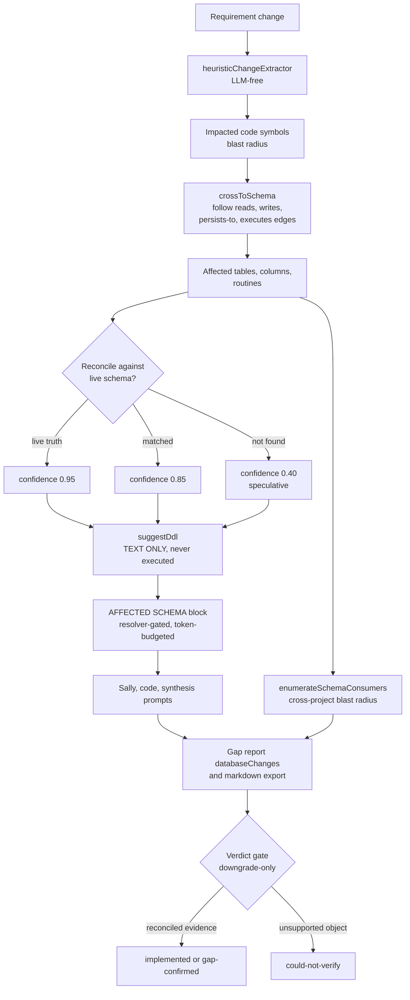

# Database Impact Analysis

> Epic [#820](https://github.com/openzigs/metis-private/issues/820) — database-aware
> Requirements Analysis: per-requirement DDL impact plus shared-database blast
> radius across projects. This document is the canonical guide for the feature —
> how schema impact reaches the gap report, how database identity linking works,
> how to read reconciliation confidence and verdicts, and the safety guarantees.
>
> Epic [#852](https://github.com/openzigs/metis-private/issues/852) replaced the original
> hidden, global env-flag-only gate with a **per-project opt-in**
> (`Project.databaseAwareAnalysis`). See
> [§5, Enabling it: the per-project setting](#5-enabling-it-the-per-project-setting)
> for how `auto`/`on`/`off` resolve and what the legacy env flags do today.

## Overview

When Requirements Analysis runs, METIS already resolves each requirement to the
**code** it touches (its blast radius). Database Impact Analysis crosses that same
blast radius **into the schema graph**: it follows the `reads` / `writes` /
`persists-to` / `executes` edges from the impacted code symbols to the
`table` / `column` / routine objects they touch, reconciles each object against
the live schema when one is available, and reports the affected tables and columns
— with a **suggested DDL string that is text only and is never executed**
([`server/src/lib/impact-analysis/schema-impact.ts`](../server/src/lib/impact-analysis/schema-impact.ts)).

Two things make this safe and honest, and both are non-negotiable:

- **Everything the database side sees is read-only.** Introspection never runs
  DDL and never fetches a routine body; suggested DDL is a review artifact with no
  execution path; nothing ever writes to a customer database.
- **A speculative object is never dressed up as a fact.** An object referenced by
  code but absent from the live schema is separated, down-weighted, and — where it
  drives a finding — forces that finding to the honest `could-not-verify` verdict.

> **On the LLM stack.** METIS's analysis agents run on the **GitHub Copilot SDK**
> (`@github/copilot-sdk`), not the Vercel AI SDK. But the schema crossing that
> produces the AFFECTED SCHEMA block is entirely **deterministic and LLM-free** —
> the same inputs always yield the same block. The model is asked to _reconcile
> and explain_ that block, never to invent the schema.

## Table of contents

1. [What this guide covers](#1-what-this-guide-covers)
2. [The pipeline at a glance](#2-the-pipeline-at-a-glance)
3. [Database identity](#3-database-identity)
4. [The AFFECTED SCHEMA block](#4-the-affected-schema-block)
5. [Enabling it: the per-project setting](#5-enabling-it-the-per-project-setting)
6. [Reading the database changes section](#6-reading-the-database-changes-section)
7. [DDL suggestions](#7-ddl-suggestions)
8. [Verdicts and reconciliation](#8-verdicts-and-reconciliation)
9. [Cross-project blast radius](#9-cross-project-blast-radius)
10. [Safety rails](#10-safety-rails)
11. [What not to trust](#11-what-not-to-trust)
12. [Configuration](#12-configuration)
13. [Source map](#13-source-map)

## 1. What this guide covers

This guide documents the shipped behavior of Epic #820 Phase 1–2 (issues #821–#828)
and its Epic #852 follow-up (issues #853–#859), which replaced the original
global env-flag gate with the per-project opt-in described in §5:

| Capability                                                | Where it lives                                                                                                                     |
| --------------------------------------------------------- | --------------------------------------------------------------------------------------------------------------------------------- |
| Database identity resolution + operator link/unlink       | [`server/src/lib/cross-project/analysis-database-identity.ts`](../server/src/lib/cross-project/analysis-database-identity.ts)      |
| The auto-link key + conservative no-link default          | [`server/src/lib/cross-project/database-resource-service.ts`](../server/src/lib/cross-project/database-resource-service.ts)        |
| Deterministic schema crossing + suggested DDL             | [`server/src/lib/impact-analysis/schema-impact.ts`](../server/src/lib/impact-analysis/schema-impact.ts)                            |
| Per-requirement AFFECTED SCHEMA context                   | [`server/src/lib/analysis/affected-schema-context.ts`](../server/src/lib/analysis/affected-schema-context.ts)                      |
| Read-only live-schema introspection                       | [`server/src/lib/analysis/schema-context.ts`](../server/src/lib/analysis/schema-context.ts)                                        |
| Cross-project consumer enumeration (blast radius)         | [`server/src/lib/analysis/affected-schema-consumers.ts`](../server/src/lib/analysis/affected-schema-consumers.ts)                  |
| Gap report `databaseChanges` + markdown export            | [`server/src/lib/analysis/gap-report.ts`](../server/src/lib/analysis/gap-report.ts), [`analysis-export.ts`](../server/src/lib/analysis/analysis-export.ts) |
| Three-state verdict + schema reconciliation gate          | [`server/src/lib/analysis/requirement-verdict.ts`](../server/src/lib/analysis/requirement-verdict.ts)                              |
| Gap report UI database-changes section                    | [`ui/src/components/analysis/gap-report-schema-section.tsx`](../ui/src/components/analysis/gap-report-schema-section.tsx)          |
| Database identity management UI                            | [`ui/src/components/connectors/database-resource-manager.tsx`](../ui/src/components/connectors/database-resource-manager.tsx)      |
| Per-project opt-in resolver (Epic #852)                   | [`server/src/lib/analysis/database-aware-resolver.ts`](../server/src/lib/analysis/database-aware-resolver.ts)                      |
| Project settings API for the setting + resolved state      | [`server/src/routes/projects.ts`](../server/src/routes/projects.ts), [`project-service.ts`](../server/src/lib/projects/project-service.ts) |
| Project settings UI control                                | [`ui/src/components/projects/database-aware-analysis-settings-card.tsx`](../ui/src/components/projects/database-aware-analysis-settings-card.tsx) |
| Analysis-result ran/skipped indicator                      | [`ui/src/components/analysis/analysis-database-aware-indicator.tsx`](../ui/src/components/analysis/analysis-database-aware-indicator.tsx) |

Every technical claim below cites the file it is grounded in, and every cited path
exists in the tree. For the wider analysis architecture see
[`docs/ARCHITECTURE.md`](./ARCHITECTURE.md) §12; for the analyst-facing gap report
see [`docs/USER_GUIDE.md`](./USER_GUIDE.md) §11.3.3.

**Which parts of Impact Analysis use an LLM, and which are deterministic on
purpose** — plus the reasons, the flags, and the harness lessons behind them — is
documented once in
[`docs/IMPACT_ANALYSIS_LLM_STAGES.md`](./IMPACT_ANALYSIS_LLM_STAGES.md) (#1005).
Everything in *this* guide's crossing, risk-classification and DDL-suggestion path
is deterministic.

## 2. The pipeline at a glance

The data flow is **code blast-radius → schema crossing → reconciliation → prompts
→ gap report → verdicts**. Each stage is deterministic and degrades to a clean
no-op when its inputs are absent.

## 3. Database identity

Cross-project blast radius only means something once METIS knows **which physical
database** a project's connection points at. That is the job of the
workspace-scoped `DatabaseResource` registry (Epic #295): the same physical DB
connected from two projects in one workspace collapses to a single resource
([`database-resource-service.ts`](../server/src/lib/cross-project/database-resource-service.ts)).

### Auto-detection key

A connection is auto-linked to a resource by the identity key
**`(driver, host, port, databaseName)`**
([`database-resource-service.ts`](../server/src/lib/cross-project/database-resource-service.ts),
`resolveDatabaseResourceId`). Linking is deliberately **best-effort and additive**:

- a connection in a project with **no workspace** is left unlinked;
- a connection lacking the minimum identity (**host + databaseName**,
  `hasResourceIdentity`) is left unlinked — a null-host connection is **never**
  given a guessed link, so two under-specified connections can never be merged by
  accident;
- any failure logs and returns `null` so connection-create is never blocked (the
  foreign key is nullable).

This conservative default is the whole point: METIS would rather show
"identity unknown" than assert a shared database it cannot prove.

### Operator link / unlink / re-resolve

The auto key cannot detect the same physical database reached through **two
different hostnames** (an alias, a read replica DNS name). For those cases an
operator asserts the equivalence explicitly. Four endpoints on the connectors
subtree back this
([`analysis-database-identity.ts`](../server/src/lib/cross-project/analysis-database-identity.ts),
routes in [`server/src/routes/connectors.ts`](../server/src/routes/connectors.ts)):

| Endpoint                                                     | Permission         | Effect                                                                                                       |
| ----------------------------------------------------------- | ------------------ | ----------------------------------------------------------------------------------------------------------- |
| `GET  /api/projects/:projectId/connectors/dbs/identities`   | `connector.read`   | Read-only view of each connection's linked resource (or `null`), whether it is linkable, and sibling projects sharing it |
| `POST /api/projects/:projectId/connectors/dbs/:id/link`     | `connector.write`  | Attach a connection to an existing resource across a hostname alias                                          |
| `POST /api/projects/:projectId/connectors/dbs/:id/unlink`   | `connector.write`  | Reverse a link (idempotent no-op when already unlinked)                                                      |
| `POST /api/projects/:projectId/connectors/dbs/:id/reresolve`| `connector.write`  | Safe, opt-in find-or-create for an **unlinked** connection — never clobbers an explicit link                |

Every mutation is audited (`cross-project.connection.link` / `.unlink`).
Authorization reuses the connectors subtree's project-access guard, and linking is
confined to a resource in the **same workspace** — a cross-workspace target is
rejected with a `404` (no existence oracle).

Operators drive all of this from the Connections tab
([`database-resource-manager.tsx`](../ui/src/components/connectors/database-resource-manager.tsx)):
connections are grouped by the resource they resolve to, unlinked connections are
listed separately with the **precise reason** (`insufficient identity` vs
`no workspace` vs `not linked yet`), and both link and unlink pass through a
confirmation dialog that spells out the cross-project consequence.

## 4. The AFFECTED SCHEMA block

For each requirement, METIS replays the requirement's impacted code symbols into
the schema graph and renders the affected tables/columns as a token-budgeted DATA
block — the database twin of the code-side affected-code context
([`affected-schema-context.ts`](../server/src/lib/analysis/affected-schema-context.ts)).
It invents no new traversal; it composes `crossToSchema()`
([`schema-impact.ts`](../server/src/lib/impact-analysis/schema-impact.ts)).

Key properties, all guaranteed in the source:

- **Deterministic.** Rows are deduped per `(table, column)` — highest confidence
  wins — and ordered by confidence, so the same input yields a byte-identical
  block.
- **Physical names.** Rows carry the physical/mapped object names from the schema
  graph (e.g. `requirements`, not the `Requirement` Prisma model).
- **Token-budgeted, carve-out.** Capped at `DEFAULT_AFFECTED_SCHEMA_MAX_ROWS`
  (8) and truncated at `DEFAULT_AFFECTED_SCHEMA_TOKEN_BUDGET` (1200 ≈ 4 chars per
  token), keeping the highest-confidence rows; its cost is carved **out** of the
  consuming agent's budget, never added on top.
- **Degrades cleanly.** No impacted symbols, no schema edges, no schema graph, or
  a crossing failure all resolve to `EMPTY_AFFECTED_SCHEMA_CONTEXT` — the block is
  omitted, never fabricated — and the computation never throws.

When enabled, the block is threaded into the database agent (Sally), the code
agent, and synthesis prompts
([`server/src/lib/analysis/prompts.ts`](../server/src/lib/analysis/prompts.ts),
[`orchestrator.ts`](../server/src/lib/analysis/orchestrator.ts)). Whether it is
enabled for a given run is decided by the **per-project resolver** — see
[§5](#5-enabling-it-the-per-project-setting) — not a bare env flag; with no
block, every prompt is byte-identical to the pre-feature behavior, so a project
the resolver leaves off sees no change.

## 5. Enabling it: the per-project setting

Epic [#852](https://github.com/openzigs/metis-private/issues/852) replaced the original
launch gate — two independent, global, OFF-by-default env flags that an
operator could half-configure and that no analyst could turn on for their own
project — with a single, discoverable **per-project intent**:
`Project.databaseAwareAnalysis: 'auto' | 'on' | 'off'`, default `'auto'`
([`server/prisma/schema.prisma`](../server/prisma/schema.prisma)). This one
setting is the sole user-facing control and it always moves **both** halves of
the feature together — the run-side prompts described in §4 and the gap-report
`databaseChanges` section (§6) — so the feature can no longer end up half-on.

### Resolution logic

A single pure function,
[`resolveDatabaseAwareAnalysis`](../server/src/lib/analysis/database-aware-resolver.ts),
collapses the setting and a `hasSchemaData` presence check into one decision.
Both the run path
([`orchestrator.ts`](../server/src/lib/analysis/orchestrator.ts)'s private
`resolveDatabaseAware`) and the gap-report path
([`schema-impact-producer.ts`](../server/src/lib/analysis/schema-impact-producer.ts)'s
`resolveProjectDatabaseAware` / `resolveGapReportDeps`) call this same
resolver with the same inputs — the coupling invariant that keeps the two
halves from diverging:

| Setting | Schema data present? | Resolved | `enabled` | `ran` | `reason` |
| ------- | --------------------- | -------- | --------- | ----- | -------- |
| `off`   | n/a                    | Always disabled | `false` | `false` | `off` |
| `on`    | yes                    | Enabled, runs   | `true`  | `true`  | `on` |
| `on`    | no                     | Enabled, but skipped — hint shown | `true` | `false` | `skipped-no-schema-data` |
| `auto`  | yes                    | Enabled, runs   | `true`  | `true`  | `auto->resolved-on` |
| `auto`  | no                     | Disabled        | `false` | `false` | `auto->resolved-off-no-data` |
| `auto`  | n/a (not consulted)    | Disabled — operator kill-switch (#849) | `false` | `false` | `auto->platform-disabled` |

"Schema data present" is a pure OR of two signals, probed read-only by
`hasSchemaData()` in the same module: a connected `DatabaseConnection`
(`status: "connected"`) **or** a non-empty schema graph (`table`/`column`
`CodeSymbol` rows plus `reads`/`writes`/`persists-to` `CodeEdge` rows). `auto`
resolves on **schema-data presence alone**, unless an operator has explicitly
disabled the feature platform-wide (see the flags section immediately below).

`off` and `on` are unconditional per-project overrides in both directions: an
explicit opt-out is never second-guessed, and an explicit opt-in is always
reachable without asking an operator to touch any env flag. Critically, `on`
with no schema data is **never a silent no-op** — it resolves
`enabled: true, ran: false, reason: "skipped-no-schema-data"`, and the UI (§5.2
below) surfaces an actionable "connect a database or re-ingest" hint instead of
quietly doing nothing.

### The two platform flags today (#849)

`ANALYSIS_AFFECTED_SCHEMA_MAPPING` and `ANALYSIS_SCHEMA_IMPACT`
([`key-registry.ts`](../server/src/lib/config/key-registry.ts)) are **`true` by
default since #849**. They are the platform default behind `auto` — not a
gate that silently defeats it. The full resolution order is:

1. **Per-project `on`/`off`** — an explicit analyst intent, never
   second-guessed. `on` overrides even a platform kill-switch (an analyst can
   always turn this on for their project), `off` always wins.
2. **An explicitly configured platform flag** — if an operator actually set
   either key (`ConfigService.describeSource(key)` reports source `db` or
   `env`; both keys are `tier: "tunable"`, so an operator-set value can arrive
   from the admin config surface **or** a deployment env var) and every key
   they set is false, `auto` resolves
   `enabled: false, reason: "auto->platform-disabled"` **without** consulting
   schema data. Explicitly setting either key `true` is an opt-in and
   suppresses nothing.
3. **Otherwise the default is ON** — `auto` depends solely on schema-data
   presence. A deployment that never configured these keys now gets
   database-aware analysis on every project that has schema data, with no
   hidden env setup. That is the #849 flip.

Before #849 the resolver never read the flags at all, so an operator who set
`ANALYSIS_SCHEMA_IMPACT=0` was silently overridden with no fleet-wide opt-out;
distinguishing "explicitly configured false" from "never configured" via
`describeSource` is what makes both the default flip and the kill-switch
possible at once. Beyond the resolver, the flags still serve:

- as the **fallback** `enabled` value `computeRunAffectedSchemaContext` reads
  when a caller does not pass a resolver decision at all — i.e. backward
  compatibility for call sites that predate #855 (test harnesses invoking the
  run-side function directly); once the orchestrator's per-project resolver
  decision is threaded through (every production run), this fallback is never
  reached;
- `isSchemaImpactEnabled()` is kept as a named export for tests/observability,
  but it is no longer the direct gate for `resolveGapReportDeps`.

**To disable database-aware analysis fleet-wide**, set
`ANALYSIS_SCHEMA_IMPACT=0` **and** `ANALYSIS_AFFECTED_SCHEMA_MAPPING=0` (an
explicit `true` on either key counts as an opt-in and wins, since the resolver
produces one decision for both paths). Projects that explicitly chose `on`
still run — use the per-project setting to opt those out.

### API and UI surfaces (Epic #852 Phase 3–4)

- `GET /api/projects/:id/database-aware-analysis` (`project.read`) returns the
  resolved state — `{ setting, enabled, ran, reason, hasSchemaData }` — via
  [`resolveProjectDatabaseAwareState`](../server/src/lib/analysis/schema-impact-producer.ts).
- `PATCH /api/projects/:id/database-aware-analysis` (`project.update`,
  body `{ databaseAwareAnalysis }`) writes the override; both routes live in
  [`server/src/routes/projects.ts`](../server/src/routes/projects.ts).
- The project Settings page hosts a self-fetching
  [`DatabaseAwareAnalysisSettingsCard`](../ui/src/components/projects/database-aware-analysis-settings-card.tsx)
  (`auto`/`on`/`off` control, current resolved-state copy, and — when the
  resolved reason is `skipped-no-schema-data` or `auto->resolved-off-no-data` —
  a link to the project's Connections tab, which hosts both "connect a
  database" and the repo re-ingest actions).
- The analysis-result view renders a small, always-honest
  [`AnalysisDatabaseAwareIndicator`](../ui/src/components/analysis/analysis-database-aware-indicator.tsx)
  badge sourced from the run's persisted `metadata.databaseAware` (§5.4), with
  the same reason-vocabulary copy and remediation link. It renders nothing for
  runs that predate #855 or where neither the code nor database agent ran —
  no state is invented.

### Recorded on the analysis result

Every run persists its resolved decision on
`AnalysisSnapshot.databaseAware: { setting, enabled, ran, reason } | null`
([`packages/shared/src/analysis.ts`](../packages/shared/src/analysis.ts)),
`null` only when the resolver was never applicable (neither the code nor
database agent ran, or the run predates #855). `reason` is one of the five
values in the table above — `off` / `auto->resolved-on` /
`auto->resolved-off-no-data` / `on` / `skipped-no-schema-data` — so an
operator or analyst can always see whether schema analysis ran on a given run
and why, without cross-referencing env-flag state.

## 6. Reading the database changes section

When a requirement touches the database, its gap-report card grows a **Database
changes** section — the database replay of the gap findings
([`gap-report.ts`](../server/src/lib/analysis/gap-report.ts) `buildDatabaseChanges`;
UI in [`gap-report-schema-section.tsx`](../ui/src/components/analysis/gap-report-schema-section.tsx)).
Each affected object shows its change kind, reconciliation state, confidence, risk,
suggested DDL, and cross-project consumers.

### Reconciliation states and confidence

Confidence blends provenance with reconciliation
([`schema-impact.ts`](../server/src/lib/impact-analysis/schema-impact.ts)
`affectedConfidence`):

| Reconciliation state              | Confidence | Meaning                                                                     |
| --------------------------------- | ---------- | --------------------------------------------------------------------------- |
| live truth (from the live schema) | **0.95**   | The object was read straight from the introspected live schema.             |
| `matched`                         | **0.85**   | A code-derived object was found in the live schema.                         |
| (blended default)                 | 0.60       | Code-derived, no live schema to reconcile against.                          |
| `table-not-found`                 | **0.40**   | Referenced by code but **absent** from the live schema — speculative.       |
| `column-not-found`                | **0.40**   | The table exists but the column does not — speculative.                     |

### Verified vs unverified

The markdown export renders one section per requirement, headed
**`### Database changes (suggested DDL — review only, never executed)`**, and
**splits** the objects it could reconcile from the ones it could not
([`analysis-export.ts`](../server/src/lib/analysis/analysis-export.ts)
`databaseChangesSection`). Objects with reconciliation `table-not-found` /
`column-not-found` move under an explicit **`#### Unverified against live schema`**
subheading, with the note that they are _speculative, not confirmed schema facts_.
This is the same #773 discipline that keeps "we could not verify it" out of the
"gap" narrative — a speculative object is never presented as a confirmed change,
in the export or in the UI.

## 7. DDL suggestions

Every affected object carries a suggested DDL string built by `suggestDdl()`
([`schema-impact.ts`](../server/src/lib/impact-analysis/schema-impact.ts)). The
reconciliation state drives the shape of the suggestion:

| Reconciliation      | Change kind  | Suggested DDL (illustrative)                                                       |
| ------------------- | ------------ | --------------------------------------------------------------------------------- |
| `table-not-found`   | `add-table`  | `-- CREATE TABLE <name> ( ... ); -- referenced by impacted code but absent from live schema` |
| `column-not-found`  | `add-column` | `ALTER TABLE <table> ADD COLUMN <col> <type>;`                                     |
| column present      | `reference`  | `-- Verify column <table>.<col> — referenced by impacted code`                    |
| table present       | `reference`  | `-- Verify table <table> — referenced by impacted code`                           |

**Proposed new columns (#1001, `IMPACT_LLM_ADDITIVE_DDL`, default ON since
#1025 — `=0` disables).** The rows
above are all derived from what the code *already* references. A requirement that
needs a NEW column was served only by `detectAdditiveColumnIntent`, a regex tuned
to a developer imperative ("add a status flag to account") — every business-analyst
obligation phrasing ("a cancelled order must record who cancelled it and when")
detected nothing. With the flag on (the default), `proposeAdditiveColumns()`
([`additive-column-proposer.ts`](../server/src/lib/impact-analysis/additive-column-proposer.ts))
appends extra `add-column` rows of the form
`ALTER TABLE <table> ADD COLUMN <col> <TYPE>; -- SUGGESTED: …`. It can only ever
propose on a table the deterministic crossing already surfaced for that
requirement (proposals are keyed by integer index into that candidate set, so a
table outside the impact result is structurally unreachable), the type must ground
against a closed allowlist, the column name is sanitized to `[a-z0-9_]`, and an
existing column is never re-proposed. It runs after the #936 relevance filter, so
a table judged tangential gets no proposals. Flag off, provider offline, or a
malformed reply ⇒ nothing is appended.

**The rule that never bends: suggested DDL is text only and is never executed** —
including the LLM-proposed rows above.
It is rendered inert everywhere — behind a persistent
"Suggested DDL — for review only, never executed" label in the UI, and as inert
inline code (backticks stripped) in the markdown export
([`analysis-export.ts`](../server/src/lib/analysis/analysis-export.ts)
`databaseChangeBullet`). There is **no auto-execution path anywhere in the
codebase, and none will be added.** A `CREATE TABLE` for a missing table is emitted
as a commented-out template precisely so a copy-paste cannot accidentally run it.
The DDL is a starting point for an engineer to review, edit, and apply themselves.

## 8. Verdicts and reconciliation

Requirement findings carry one of three verdicts
([`requirement-verdict.ts`](../server/src/lib/analysis/requirement-verdict.ts),
Issue #773):

- **`implemented`** — retrieval worked and cited code that satisfies the
  requirement.
- **`gap-confirmed`** — retrieval worked and the code read does **not** satisfy the
  requirement. This is the only verdict that means "this needs building".
- **`could-not-verify`** — METIS could not tell (search failed, came back empty, or
  the budget ran out). This is the **honest state**, not a gap.

The verdict gate can only ever **weaken** a claim. On top of the #773 retrieval-
health logic, schema reconciliation adds a **downgrade-only** cap (Issue #826): a
finding that relies on an affected-schema object the live schema cannot back —
reconciliation `table-not-found` / `column-not-found`, or a cross-project claim
whose canonical identity did not resolve — is capped at `could-not-verify`. Fully-
reconciled evidence (`matched`, or live truth with nothing to reconcile) leaves the
verdict **unchanged**, and with the feature off the verdict is byte-identical. The
cap is a per-finding physical-name match, so one requirement's absent table never
downgrades another requirement's matched one.

This is why an unsupported DDL suggestion shows `could-not-verify` rather than a
confirmed gap: asserting "you must build this table" on the strength of a table the
live schema has never seen is exactly the hallucinated-gap failure the three-state
verdict exists to prevent.

## 9. Cross-project blast radius

For each affected object, METIS enumerates every **other** project in the analyzed
project's workspace that reads or writes that object on the same shared physical
database ([`affected-schema-consumers.ts`](../server/src/lib/analysis/affected-schema-consumers.ts)
`enumerateSchemaConsumers`). Three rules keep this honest:

- **Identity gates everything.** Consumers are attributed **only** when the analyzed
  project's own connection is linked (`identityResolved: true`). An unlinked
  connection yields `identityResolved: false` even when a sibling created a resource
  for the same DB — METIS never asserts a mapping the operator has not confirmed.
- **"Unknown" is not "none".** A resolved object with genuinely zero consumers is
  reported **distinctly** from an identity-unresolved object. In the report,
  unresolved renders as _"cross-project impact unknown (database identity
  unresolved)"_ and resolved-with-zero as _"no other project reads or writes this
  object"_ ([`gap-report.ts`](../server/src/lib/analysis/gap-report.ts) attaches a
  `consumers` list **only** when identity resolved; the export and UI render the two
  states differently).
- **Tenancy is derived, never input.** The workspace is derived from the analyzed
  project, so every query is confined to that one workspace — there is no
  cross-workspace read and no existence oracle. Within that workspace the **full**
  blast radius is intended, so the consumer query runs as a system actor scoped to
  the derived workspace; the caller-facing route still gates the user's access to
  the analyzed project.

## 10. Safety rails

These guarantees are load-bearing and stated verbatim from the source:

1. **Read-only introspection.** Live-schema introspection **never runs DDL and
   never fetches a routine body** — it reuses the same connector introspection the
   Impact Analysis route uses, and all reads are scoped to `projectId`
   ([`schema-context.ts`](../server/src/lib/analysis/schema-context.ts)).
2. **No DDL execution.** Suggested DDL is text only with no execution path anywhere
   in the codebase, and none will be added
   ([`schema-impact.ts`](../server/src/lib/impact-analysis/schema-impact.ts)).
3. **No customer-database writes.** Consumer enumeration and identity resolution
   touch only METIS's **own** Prisma tables — no customer-database access, no DDL
   ([`affected-schema-consumers.ts`](../server/src/lib/analysis/affected-schema-consumers.ts),
   [`analysis-database-identity.ts`](../server/src/lib/cross-project/analysis-database-identity.ts)).
4. **Destructive changes are flagged, never applied.** A `CREATE TABLE` for a
   missing object is emitted commented-out; the risk badge (once scored) marks
   breaking changes loudly so a reviewer sees them before acting.
5. **Hallucinated-table mitigation.** An object referenced by code but absent from
   the live schema is reconciled to `table-not-found` / `column-not-found`,
   down-weighted to 0.40 confidence, separated under "Unverified against live
   schema", and — where it drives a finding — forces that finding to
   `could-not-verify`. Live-schema reconciliation is the check that stops a
   model-suggested table from ever reading as a confirmed schema fact.

## 11. What not to trust

The advisory DDL is a **starting point, not a migration**. Treat it with the same
skepticism as any generated draft:

- **It may miss data migrations.** `ALTER TABLE ... ADD COLUMN` says nothing about
  backfilling the column, defaults for existing rows, or the order relative to a
  deploy.
- **It may miss procedural logic.** The crossing follows `executes` edges to
  procedures/functions but never reads a routine body (that is a read-only
  guarantee, not an omission bug) — so triggers, stored-procedure side effects, and
  application-level invariants are out of scope.
- **`could-not-verify` is not "safe to ignore".** It means METIS could not confirm
  the object against a live schema — the functionality may already exist, or the
  object may be real but unreconciled. Re-run with a live schema connected, or check
  by hand, before planning work from it.
- **Confidence is a ranking signal, not a probability.** 0.85 "matched" is stronger
  evidence than 0.40 "not found", but neither is a guarantee that the suggested
  change is correct for your migration.

## 12. Configuration

All keys live in
[`server/src/lib/config/key-registry.ts`](../server/src/lib/config/key-registry.ts)
and are validated by the strict config service. **The primary control is now
the per-project `Project.databaseAwareAnalysis` setting** (§5), not these
flags — see that section for the current, precise role of each one below.

| Key                                     | Default | Purpose                                                                                          |
| --------------------------------------- | ------- | ------------------------------------------------------------------------------------------------ |
| `ANALYSIS_AFFECTED_SCHEMA_MAPPING`      | **on**  | Run-side platform default behind `auto` (#849). Explicitly setting it false (with `ANALYSIS_SCHEMA_IMPACT`) is the fleet-wide kill-switch — see §5. Also the fallback `enabled` value for callers that bypass the per-project resolver (e.g. a direct pre-#855 test-harness invocation of `computeRunAffectedSchemaContext`); every production run threads the resolver's decision instead. |
| `ANALYSIS_AFFECTED_SCHEMA_TOKEN_BUDGET` | 1200    | Max tokens the AFFECTED SCHEMA block may occupy; lowest-confidence rows drop first on overflow.    |
| `ANALYSIS_AFFECTED_SCHEMA_MAX_ROWS`     | 8       | Upper bound on affected objects rendered before token budgeting; highest-confidence rows kept.     |
| `ANALYSIS_SCHEMA_CONTEXT`               | **on**  | Read-only live-schema summary for the database agent (Sally) — never DDL, never a routine body (#732). |
| `ANALYSIS_SCHEMA_CONTEXT_TOKEN_BUDGET`  | 2000    | Max tokens for the introspected schema summary; document chunks are never dropped.                 |
| `ANALYSIS_SCHEMA_CONTEXT_MAX_TABLES`    | 60      | Upper bound on tables rendered into the schema summary before the token budget applies.            |
| `ANALYSIS_SCHEMA_IMPACT`                | **on**  | Gap-report platform default behind `auto` (#849). Since Epic #852 (#856) it does not gate `resolveGapReportDeps` directly — that gate is the resolver's `enabled` decision, driven by the per-project setting (§5) — but explicitly setting it false is half of the fleet-wide kill-switch. `isSchemaImpactEnabled()` is kept as a named export for tests/observability. |
| `ANALYSIS_SCHEMA_IMPACT_MAX_REQUIREMENTS` | 50    | Cost cap on how many requirements the gap-report producer crosses per report (#847).               |

> **Reachability (#847, superseded by #852 for the gate itself).** The
> `databaseChanges` section only reaches a user when the gap-report route
> passes the `loadSchemaImpact` producer. Before #847 no producer existed, so
> the whole feature was silently absent from every gap report (epic #820's own
> #750/#797 "reachability ≠ existence" trap). The producer
> ([`schema-impact-producer.ts`](../server/src/lib/analysis/schema-impact-producer.ts))
> reuses `computeProjectImpact` → `crossToSchema` (#823) and
> `enumerateSchemaConsumers` (#822) verbatim — no new blast-radius or identity
> traversal — and is wired into both gap-report call sites in
> [`server/src/routes/analysis.ts`](../server/src/routes/analysis.ts) via
> `resolveGapReportDeps()`, which now returns `{ databaseAware }` with no
> producer when the **per-project resolver** (§5) resolves `enabled: false` —
> not when the bare flag is off. No live database is introspected at report
> time: rows stay unreconciled and therefore `could-not-verify` (#826) unless a
> live index is supplied.

## 13. Source map

Every claim in this guide is grounded in one of these files.

| File                                                                                                                          | Epic / Issue      | Responsibility                                                        |
| ----------------------------------------------------------------------------------------------------------------------------- | ----------------- | -------------------------------------------------------------------- |
| [`server/src/lib/impact-analysis/schema-impact.ts`](../server/src/lib/impact-analysis/schema-impact.ts)                       | #168 / #173       | Schema crossing, confidence blend, text-only `suggestDdl`.           |
| [`server/src/lib/cross-project/database-resource-service.ts`](../server/src/lib/cross-project/database-resource-service.ts)   | #295 / #307       | Identity key `(driver, host, port, databaseName)`, conservative no-link. |
| [`server/src/lib/cross-project/analysis-database-identity.ts`](../server/src/lib/cross-project/analysis-database-identity.ts) | #820 / #821       | Identity resolution + operator link / unlink / re-resolve.           |
| [`server/src/lib/analysis/affected-schema-consumers.ts`](../server/src/lib/analysis/affected-schema-consumers.ts)             | #820 / #822       | Cross-project consumer enumeration (blast radius).                   |
| [`server/src/lib/analysis/affected-schema-context.ts`](../server/src/lib/analysis/affected-schema-context.ts)                 | #820 / #823       | Per-requirement AFFECTED SCHEMA context block.                       |
| [`server/src/lib/analysis/prompts.ts`](../server/src/lib/analysis/prompts.ts)                                                 | #820 / #824       | Threads the block into Sally / code / synthesis prompts.             |
| [`server/src/lib/analysis/gap-report.ts`](../server/src/lib/analysis/gap-report.ts)                                           | #820 / #825       | `buildDatabaseChanges`, consumer join, omit-when-empty.              |
| [`server/src/lib/analysis/schema-impact-producer.ts`](../server/src/lib/analysis/schema-impact-producer.ts)                   | #820 / #847       | Production `loadSchemaImpact` producer + route wiring (reachability). |
| [`server/src/lib/analysis/analysis-export.ts`](../server/src/lib/analysis/analysis-export.ts)                                 | #820 / #825       | Markdown export, verified vs unverified split, inert DDL.            |
| [`server/src/lib/analysis/requirement-verdict.ts`](../server/src/lib/analysis/requirement-verdict.ts)                         | #773 / #826       | Three-state verdict + downgrade-only schema gate.                    |
| [`server/src/lib/analysis/schema-context.ts`](../server/src/lib/analysis/schema-context.ts)                                   | #725 / #732       | Read-only live-schema introspection for Sally.                      |
| [`server/src/lib/config/key-registry.ts`](../server/src/lib/config/key-registry.ts)                                           | #820 / #824       | `ANALYSIS_AFFECTED_SCHEMA_*` and `ANALYSIS_SCHEMA_CONTEXT_*` keys.   |
| [`ui/src/components/analysis/gap-report-schema-section.tsx`](../ui/src/components/analysis/gap-report-schema-section.tsx)      | #820 / #827       | Gap report database-changes UI.                                     |
| [`ui/src/components/connectors/database-resource-manager.tsx`](../ui/src/components/connectors/database-resource-manager.tsx)  | #820 / #828       | Database identity management UI.                                    |
| [`server/prisma/schema.prisma`](../server/prisma/schema.prisma)                                                               | #852 / #853       | `Project.databaseAwareAnalysis` field (dual-schema; see the generated `server/prisma/postgres/schema.prisma`). |
| [`server/src/lib/analysis/database-aware-resolver.ts`](../server/src/lib/analysis/database-aware-resolver.ts)                | #852 / #854       | Pure resolver: setting + schema-data presence → `{enabled, ran, reason}`; `hasSchemaData()` presence probe. |
| [`server/src/lib/analysis/orchestrator.ts`](../server/src/lib/analysis/orchestrator.ts)                                       | #852 / #855       | Run-path wiring (`resolveDatabaseAware`) + `metadata.databaseAware` persistence. |
| [`server/src/lib/analysis/schema-impact-producer.ts`](../server/src/lib/analysis/schema-impact-producer.ts)                   | #852 / #856       | Gap-report-path wiring (`resolveProjectDatabaseAware` / `resolveGapReportDeps`) through the same resolver. |
| [`server/src/routes/projects.ts`](../server/src/routes/projects.ts), [`server/src/lib/projects/project-service.ts`](../server/src/lib/projects/project-service.ts) | #852 / #857 | `GET`/`PATCH /api/projects/:id/database-aware-analysis`. |
| [`ui/src/components/projects/database-aware-analysis-settings-card.tsx`](../ui/src/components/projects/database-aware-analysis-settings-card.tsx) | #852 / #858 | Project Settings control for the `auto`/`on`/`off` intent. |
| [`ui/src/components/analysis/analysis-database-aware-indicator.tsx`](../ui/src/components/analysis/analysis-database-aware-indicator.tsx) | #852 / #859 | Analysis-result ran/skipped/why badge. |
| [`packages/shared/src/analysis.ts`](../packages/shared/src/analysis.ts), [`packages/shared/src/schema-impact.ts`](../packages/shared/src/schema-impact.ts) | #852 | `AnalysisDatabaseAware` / `AnalysisDatabaseAwareReason` types; `DatabaseAwareAnalysisSetting` whitelist + default. |

---

_Phase 3 (#830 / #831) will add breaking / expanding / neutral risk classification;
until then the risk badge honestly reads **Unclassified**. This guide will be
updated when that work lands._
