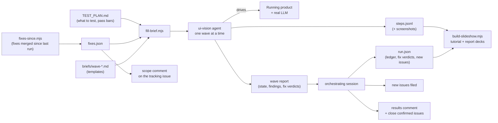

# The AI-driven end-to-end walkthrough

How METIS runs a full end-to-end test of itself with AI agents driving a real browser:
- what the agents do;
- what a person has to write;
- how fixes and findings are tracked;
- what it is worth for QA and UAT;
- what it costs.

The last section explains how to reuse the approach on another project.

> **Web version:** https://openzigs.github.io/metis/walkthroughs/AI_E2E_WALKTHROUGH/ (standalone page: https://openzigs.github.io/metis/walkthroughs/ai-e2e-walkthrough.html)
>
> **Status:** METIS has run the walkthrough five times (runs 1–5, October 2026). Every figure here comes from those runs unless it says otherwise.

---

## 1. What it is

The walkthrough takes one realistic sample project through every feature of the product, the way a careful human tester would.

- It clicks through the real UI in a real browser, against a real running server, with a real LLM.
- It checks every answer against ground truth.
- Each step gets two scores: does it **work**, and is it **useful**.

Its outputs:
- a results comment on a tracking issue;
- two slide decks: a tutorial and a run report;
- new issues for everything it finds;
- verdicts on the fixes it was asked to confirm.

For METIS the sample project is [Miniflux](https://github.com/miniflux/v2) v2.3.3: a real Go + PostgreSQL RSS reader, pinned to one tag so every run sees the same code. The model under test is DeepSeek `deepseek-flash`.

It is **not** a unit or e2e test suite. Those stay in CI and run on every PR. The walkthrough sits above them. It answers "does the product do the job for a user, end to end, on real data?", which no mocked test can answer. Each run takes about **4–5 hours** of agent time and runs on demand, typically after a batch of fixes. It is not a per-PR check.

---

## 2. Why it is worth doing: value for QA and UAT

| | What the walkthrough gives you |
|---|---|
| **QA, regression** | Every feature is exercised end to end on each run, through the UI, against a live model, at a fixed commit of a fixed sample project. Runs are therefore comparable. Run 4 compared its results with runs 2 and 3, step by step. |
| **QA, fix verification** | It is given the list of fixes merged since the last run, and records each one as confirmed, partial, regressed or not exercised, with screenshot evidence. Confirmed issues are closed. The rest carry into the next run. |
| **UAT, "is it useful?"** | A second axis, **Useful**, asks whether the output would help a real analyst or developer, not only whether the button worked. It checks citations against the real source lines, and requirements against the real schema. This is what caught problems that "works" never would: a 2.19 MB BRD, analysis agents inventing modules, Spec Kit plans re-implementing code that already existed. |
| **UAT, persona journeys** | Wave F follows a business analyst and a developer through whole tasks, UI only, with no internal IDs. These journeys find the **handoff** bugs between features that feature-by-feature tests miss. Run 4's worst bugs were of this kind: approval that didn't approve the requirements, and an edit that dropped a traceability label. |
| **Cost and performance** | It measures what each phase actually spends on the product's LLM, from the product's own usage ledger. The BRD went from $8.73 / 2h51m / 2.19 MB in run 3 to $1.91 / 30 min / 171 KB in run 4, once the caps the walkthrough asked for were in place. |
| **Documentation** | The tutorial deck is a screenshot-by-screenshot guide to the product, generated from passing steps. It can be handed to new users. |
| **Honest scoring** | Findings are graded high, medium or low and filed as issues with evidence. The run-to-run table shows whether the product is really getting better. |

What it found across runs 3–4, all filed and since fixed, includes:
- a stored SQL-lineage graph that never picked up a parser fix;
- a Publish button that always returned 501;
- clarification billed twice;
- workspace invites that worked without signing in;
- analysis marked "completed" while its model calls continued;
- the run page under-reporting cost.

The fix rounds it triggered also surfaced deeper problems:
- CI retries had been hiding six deterministic test failures;
- the test plan itself had drifted from the code, with 9 dead route references.

**Measured improvement, run 2 → run 4**, scored per phase: Works ✅/⚠️/❌/🚫 and Useful ✅/⚠️/❌/🚫.

| | Run 2 | Run 3 | Run 4 |
|---|---|---|---|
| Works | 11/6/1/2 | 11/7/1/1 | **15/4/0/1** |
| Useful | 5/4/9/2 | 9/8/2/1 | **12/7/0/1** |
| BA questions correct with valid citations | 8/8 | 8/8 | **8/8** |
| Requirements with no acceptance criteria | – | 29/29 | **3/37** |
| Product LLM spend for the whole run | $5.77 | $9.84 | **$4.32** |

---

## 3. How it works

### 3.1 The pieces

| Piece | Where (METIS) | Role |
|---|---|---|
| **Test plan** | `docs/walkthroughs/TEST_PLAN.md` | The *what*. It lists phases 1–20, Spec Kit S1–S24 and the persona journeys. For each step it gives the action, the Works check and the Useful check. It also holds the test cases with known answers: 8 business-analyst questions and 3 real Miniflux developer issues. |
| **Runbook skill** | `.github/skills/e2e-walkthrough/SKILL.md` | The *how*. It covers fixture setup order, the wave list, safety guard-rails, the cost-ledger SQL, tips learned from earlier runs, and how to build the decks. |
| **Wave briefs** | `.github/skills/e2e-walkthrough/briefs/wave-{a..f}.md`, `ba-reask.md` | One dispatch template per wave. It has the exact steps, what to screenshot, how to score, and the report format. Placeholders like `{{PROJECT_ID}}` and `{{FIXES_TO_VERIFY}}` are filled per run. |
| **Fix finder** | `scripts/walkthrough/fixes-since.mjs` + `docs/walkthroughs/fix-phase-map.json` | Lists the PRs merged since the last run's commit and keeps the user-facing ones. It maps each to the wave and phase that can verify it, and carries forward anything not yet confirmed. |
| **Brief filler** | `scripts/walkthrough/fill-brief.mjs` | Fills the placeholders. It refuses to write a brief with an unfilled placeholder, an unplaced fix, or a missing required PR. |
| **Drift check and PR gate** | `scripts/walkthrough/check-test-plan.mjs`, `scripts/verify-walkthrough-plan.mjs` | Fails if the plan names a route or page that no longer exists. In CI, it also requires a PR that adds or removes a page or route to update the plan, or to be labelled `no-walkthrough-impact`. Both are fast text checks; neither runs the walkthrough. |
| **Deck builder** | `scripts/walkthrough/build-slideshow.mjs` | Turns `steps.jsonl` and `run.json` into two offline HTML decks. |
| **Results template** | `docs/walkthroughs/RESULTS_TEMPLATE.md` | The shape of the results comment, including the run-to-run comparison table. |

### 3.2 A run, step by step

1. **Check the plan.** `pnpm walkthrough:check-plan` confirms every route and page the plan names still exists.
2. **Find the fixes.**
   - `fixes-since.mjs` lists what changed since the last run.
   - A person reviews `fixes.json` and places anything the map can't.
   - The list is posted on the tracking issue as the run's **scope**, so everyone can see what the run will verify before it starts.
3. **Set up fixtures in a fixed order.** For METIS:
   - rebuild the SQL-lineage sidecar from the commit under test;
   - start Postgres with the sample database and seed it;
   - start the product;
   - create the workspace, then the project inside it;
   - add the repo connector, pinned to `v2.3.3`;
   - check out the ground-truth source.

   Run 1 did this out of order and its results weren't comparable.
4. **Run the waves in sequence.** They share one browser, and long jobs must never overlap. For each wave:
   1. Fill the brief with the IDs the previous wave returned.
   2. Dispatch one `ui-vision` agent with it.
   3. Read its report.
   4. Record the IDs it returns for the next wave.

   | Wave | Scope |
   |---|---|
   | A | Setup and phases 1–4 |
   | B | Phases 5–8 |
   | C | Phases 9–13 |
   | D | Spec Kit S1–S24 |
   | E | Phases 15–20 and developer-issue impact |
   | F | Persona journeys |
   | BA | 8 analyst questions over the API, no browser |
5. **Measure.** Snapshot the product's usage ledger (`token_usages`) before and after each phase. Per-phase cost is the difference. Cross-check the ledger total against tokens × price.
6. **Record.**
   - Write `run.json`: the commit tested, the ledger totals, each fix's verdict with its evidence step, and every new issue filed with its severity.
   - Build the decks.
   - Post the results comment.
   - Close the issues the run confirmed.

### 3.3 Waves and phases in METIS

Every phase in the plan has a **Works** bar and a **Useful** bar. For example, Phase 10 (chat):
- **Works:** the answer comes back.
- **Useful:** it names the real function and its `file:line`, and the line is correct at `v2.3.3`.

A step that works but would not help a user scores `works: pass, useful: weak`.

---

## 4. The agent

The browser waves are run by **`ui-vision`**, a Claude Code subagent defined in `.claude/agents/ui-vision.md`.

| Aspect | Detail |
|---|---|
| **Tools** | The Playwright MCP tools (navigate, click, type, snapshot, screenshot, run JS in the page, manage tabs) plus `Bash`, `Read` and `Skill`. It drives a real Chrome. |
| **Model** | It inherits the session's model. METIS runs used a frontier Claude model. |
| **Input** | One filled brief. The brief is everything it knows: its steps, pass bars, guard-rails, the fixes it must verify, the IDs from earlier waves, and the lessons from earlier runs. |
| **What it does per step** | Performs the action in the UI. Waits for long jobs by polling the API, not by sleeping. Takes a screenshot. Checks the result against the pass bars and against ground truth: it opens the cited source file at the cited line in the pinned checkout. Writes one line to `steps.jsonl`, scored `works` (pass/partial/fail/blocked) and `useful` (pass/weak/fail/n/a), with the tokens and cost attributed from the ledger. |
| **What it returns** | A fixed-format report with four parts: state for the next wave (IDs, ledger snapshot); a per-phase table of time, tokens, cost, console errors, Works and Useful; a **fix-verification table**, where each fix in its brief is confirmed, partial, regressed or not exercised, with a step id as evidence; and **findings** graded high, medium or low with evidence. It also returns "durable findings": lessons for the next run. |
| **What it does not do** | It files no issues, merges nothing and doesn't change settings beyond what its steps require. Filing and closing is left to the orchestrating session, so a person or the orchestrator sees every finding first. |
| **Guard-rails it must obey** | It never publishes to the real upstream repository, only to a sandbox. It always does a dry run first, and publishes at most 2 issues per run. Credentials only come through the product's vault picker, never pasted. It never overlaps long jobs. It never clicks destructive actions on data later steps need. |

The **orchestrating session** is the main Claude Code session. It doesn't drive the browser. It:
- fills briefs and dispatches waves in order;
- reads each report and passes state forward;
- runs the ledger queries;
- writes `run.json`, builds the decks and posts the results;
- files issues and closes the confirmed ones.

The **BA re-ask** needs no browser. A smaller agent asks the 8 analyst questions over the chat API, one session each, and checks every citation against the source.

### Practical limits

- **Some checks are blocked by the harness's own safety classifier.**
  - Driving a second user's browser context, for presence checks.
  - Sending `UPDATE` SQL to prove a query endpoint is read-only.

  The operator runs these, or they are verified from the database. The run records them as blocked.
- **Real publishing needs an allow rule.** The operator has to add an allow rule for the publish call to the sandbox repository.
- **Agent shells are killed after 2 hours.** The product server must run where the operator controls it, for example in `screen`, not in an agent's background shell.
- **Playwright quirks.** After a sign-out, a tab can stop delivering clicks. Downloads crash the page. Dev-mode routes take 20–40 s to compile. The briefs carry workarounds for each.

---

## 5. What a person has to write

The agents do the clicking. People supply the judgement: what to test, what "good" means, and what's safe.

| You write | Why it matters | METIS example |
|---|---|---|
| **A test plan** with phases, steps, and Works and Useful pass bars per step | Without explicit bars, "it worked" is the agent's opinion. The bars make scoring repeatable across runs. | `TEST_PLAN.md`, 20 phases plus S1–S24 plus 2 journeys |
| **Test cases with known answers** | Usefulness can only be checked against something true. | 8 BA questions, with the facts a correct answer must contain; 3 real upstream issues, with the code each must surface |
| **A pinned sample project and ground truth** | Runs are comparable only if the input is identical. | Miniflux at tag `v2.3.3`, commit `c4d54f87`, plus a seeded database |
| **Fixture setup, in order** | Order changes results. | Lineage sidecar, then database, then workspace, then project, then connector |
| **Safety guard-rails** | The agent acts for real: real repos, real credentials, real spend. | Sandbox repo only; vault-only credentials; at most 2 issues; never touch upstream |
| **The cost source** | Cost has to come from the product's own ledger, not estimates. | The `token_usages` SQL, and the per-token prices |
| **Persona journeys** | Feature checks miss handoff bugs. | A BA turns feature requests into reviewed, published issues; a developer takes an upstream issue to a change plan |
| **The fix-to-phase map** | So each merged fix is verified by the right wave. | `fix-phase-map.json` |
| **Review of each run's scope and findings** | The agent proposes; a person decides what is a bug and how severe. | Reviewing `fixes.json`, then triaging the findings |

What you **don't** write, because it is generated or reusable: the wave briefs (templated, filled per run), the fixes-to-verify list, the decks, and the results comment.

---

## 6. How issues are tracked

There are two lists: fixes the run **verifies**, and findings the run **files**.

### 6.1 Fixes to verify (going in)

1. **Generate the candidates.** `fixes-since.mjs` reads the previous run's commit from its `run.json` and lists every PR merged on `main` since then. It keeps the PRs that:
   - are labelled `e2e-walkthrough`, or close an issue that is;
   - touch a UI page or API route;
   - touch a core product library.

   Dependabot PRs are listed separately.
2. **Place each fix.** `fix-phase-map.json` assigns each fix a wave, a phase and a one-line "what to check". A fix the map can't place is printed for a person to decide. Nothing is dropped silently.
3. **Carry forward.** Any fix the previous run did not mark `confirmed` is added again automatically.
4. **Publish the scope.** The full list is posted on the tracking issue **before** the run, so its scope is visible and reviewable.
5. **Hand each wave its own list.** `fill-brief.mjs` puts only that wave's fixes into each brief, as `{{FIXES_TO_VERIFY}}`.

### 6.2 Verdicts (coming out)

- **Mark each fix.** Each wave returns a verdict per fix: `confirmed`, `partial`, `regressed` or `not-exercised`. Every verdict except `not-exercised` cites a step id in `steps.jsonl` as evidence.
- **Record them.** The orchestrator writes the verdicts into `run.json`. The deck shows "Fixes confirmed this run (N of M)".
- **Close what passed.** `fixes-since.mjs --close-list` lists the confirmed issues that are still open. Each is closed with a link to the results.

### 6.3 New findings

- **Return them.** Each wave returns findings graded high, medium or low, each with evidence: screenshots and file:line.
- **File them.**
  - High and medium findings each get their own issue.
  - Low findings are bundled into one checklist issue.
  - Every issue carries the `e2e-walkthrough` label.
- **Record them.** They are listed in `run.json` under `newIssues` with their severity. The report deck ends with a slide listing them.
- **Feed the next run.** When they are fixed and merged, the next run's fix finder picks them up automatically. That closes the loop.

### 6.4 Keeping the plan honest

- **Drift check.** CI fails if `TEST_PLAN.md` names a route or page that no longer exists.
- **PR gate.** A PR that adds or removes a page or route must update the plan, or be labelled `no-walkthrough-impact`.
- **Lessons go back.** Each run's lessons flow into the runbook and briefs as "agent tips", in a PR. So does any step the run found wrong in the plan.

---

## 7. Cost

A walkthrough has two separate costs.

### 7.1 The product's own LLM spend (the system under test)

This is what METIS spends calling its model, DeepSeek `deepseek-flash`, while the agent drives it. It is read from METIS's own usage ledger.

| Run | Total | Biggest item |
|---|---|---|
| Run 2 | $5.77 | – |
| Run 3 | $9.84 | Docs generation, 89% |
| Run 4 | **$4.32** | Docs generation ($2.89 for wave C), under a $5 per-document cap |

Per wave in run 4:

| Wave | A | B | C | D | E | BA |
|---|---|---|---|---|---|---|
| Cost | $0 | $0.61 | $2.89 | $0.44 | $0.28 | $0.09 |

Wave A spends nothing: ingest, embeddings and retrieval make no LLM calls. This cost depends entirely on the product and the model it uses.

### 7.2 The testing agent's own tokens (the AI doing the testing)

This is the cost of the Claude agents driving the browser and checking results. It is separate from the product's spend, and much larger in tokens.

**Run 4, measured per wave**, as tokens processed by each wave's agent (input and output, as reported by the agent harness):

| Wave | Agent | Tokens | Tool calls | Wall time |
|---|---|---|---|---|
| A: setup, phases 1–4 | ui-vision | ~238k | ~290 | 35 min |
| B: phases 5–8 | ui-vision | ~400k | ~495 | 40 min |
| C: phases 9–13 | ui-vision | ~416k | ~475 | 64 min |
| D: Spec Kit | ui-vision | ~304k | ~390 | 41 min |
| E: phases 15–20 | ui-vision | ~426k | ~450 | 49 min |
| BA re-ask | general (API only) | ~115k | ~35 | 6 min |
| **Run total (agents)** | | **~1.9M tokens** | **~2,100** | **~4 h** |

Run 5's wave A came in at a similar ~257k.

**What these figures leave out:**
- **The orchestrating session's own tokens.** It fills briefs, reads reports, runs queries, writes results and files issues. That is smaller than the waves, but not zero.
- **Prompt caching.** Most of each agent's context is re-read on every turn, and cached reads are billed far below fresh input. This is why per-wave tokens are high but cost stays moderate.

**To turn this into dollars:** total cost ≈ the Claude agent tokens priced at your model's per-token rates, plus the product's own LLM spend. Most of each agent's tokens are input, and a large share of that is cached reads. This document quotes no Claude dollar figure, because it depends on the model and pricing tier you run. Use the token counts above with your provider's current price list, and check your provider's usage dashboard after a run for the actual figure.

**What it costs to act on the findings** is separate again, and can be larger than the run. Each fix goes through an implement → review → fix → re-review loop. Security-relevant fixes add a 3-lens adversarial panel. For example, one round that fixed 9 issues from run 4 used about **2.3M agent tokens** across 21 agents. Budget for that if you plan to fix what the walkthrough finds.

### 7.3 Ways to keep it down

- **Run it after a batch of fixes, not per PR.** CI covers each PR.
- **Cap the product's spend.** For example, a per-document cost cap ($5 per document in METIS) stops one runaway job from eating the budget.
- **Keep the briefs tight.** Every line in a brief is re-read on every turn of that wave.
- **Don't add zero-LLM checks to the walkthrough.** Steps that need no model belong in the normal e2e suite in CI.
- **Run only the waves a change touches**, when you just need to confirm a few fixes. The fixes list shows which waves those are.

---

## 8. Using this on another project

The method carries over. Most METIS-specific parts are configuration.

**Reusable as is:**
- The `ui-vision` agent: generic browser QA through Playwright.
- The two-axis Works/Useful scoring and the `steps.jsonl` manifest format.
- The deck builder. It only needs `steps.jsonl` and, optionally, `run.json`. The issue-link base and the title are its only project-specific parts.
- The flow of fix finder → scope comment → per-wave verdicts → `run.json` → close confirmed. Point the fix finder at your repo, and at your own list of core paths.
- The drift check and PR gate, adjusted to your route and page layout.

**You write for your project:**
1. **A `TEST_PLAN.md`.** Group your features into phases. Give every step a Works bar and a Useful bar, and add test cases with known answers.
2. **A pinned sample dataset and its ground truth.** Something realistic that never changes between runs.
3. **Fixture setup, in a fixed order.**
4. **Guard-rails.** Which external systems the agent may touch; sandbox targets; how credentials are supplied; what it must never click.
5. **A cost source** for your product's LLM or API spend, if it has one.
6. **Wave briefs.** Split the plan into waves of about 30–60 minutes, each self-contained apart from the IDs it is handed.
7. **One or two persona journeys,** written as user goals, UI only.

**Start small.** One wave covering your core path, two or three known-answer checks, and the deck builder. Add waves once the first run's findings show where the gaps are. The skill and briefs grow with each run's lessons; METIS's "agent tips" section is five runs of those.

**A useful split for a shared plugin:**
- **A generic `product-walkthrough` skill:** the method, the manifest, the scoring, the deck builder and the fix tracking.
- **A per-project profile:** the plan, fixtures, guard-rails and cost SQL.

---

## 9. Limits and honest caveats

- **"Useful" is a judgement by a model,** guided by the pass bars and checked against ground truth where possible. It is not a human UAT sign-off. Treat it as a strong signal, and have a person review the findings.
- **It only tests what the plan describes.** New features need new steps, which is why the PR gate exists.
- **A run takes hours and costs real tokens.** It complements CI and doesn't replace it.
- **Some checks need a person.** Anything the harness's safety classifier blocks, or anything that needs a public webhook, the operator must do.
- **Results depend on the model under test.** A change of model (for example DeepSeek to Claude) changes Useful scores, so record the model with every run.
