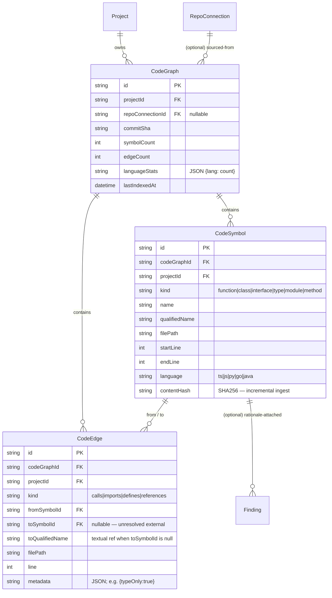

# METIS v1 Data Model

This document maps every Prisma model to the consuming phase and the
`packages/shared` schema that mirrors it. The canonical schema lives in
[`server/prisma/schema.prisma`](../server/prisma/schema.prisma) (SQLite for dev)
with an autogenerated Postgres twin at
[`server/prisma/postgres/schema.prisma`](../server/prisma/postgres/schema.prisma).

## Provider strategy

Prisma's `datasource` block requires a string-literal `provider`, so dual-target
support is implemented as **two schema files that differ only in the datasource
block**. The Postgres copy is **mechanically generated** from the SQLite source
so the two cannot drift.

- **Dev (default)**: `prisma/schema.prisma` → SQLite at `prisma/dev.db` + `prisma/migrations/`
- **Prod**: `prisma/postgres/schema.prisma` → PostgreSQL via `DATABASE_URL` + `prisma/postgres/migrations/`

Run against the postgres schema by passing `--schema`:

```bash
pnpm --filter @metis/server exec prisma migrate deploy --schema prisma/postgres/schema.prisma
```

To update the postgres copy after editing the SQLite source, run:

```bash
pnpm --filter @metis/server db:gen-postgres
```

This runs [`scripts/gen-postgres-schema.sh`](../scripts/gen-postgres-schema.sh)
which strips the sqlite header, prepends an autogen warning, and rewrites the
datasource provider. The resulting file is byte-identical to the SQLite source
except for the datasource block.

**CI parity guard**: [`server/tests/schema-parity.test.ts`](../server/tests/schema-parity.test.ts)
fails if the two schema bodies diverge or if regeneration would produce a diff.

## Model map

| Model | Phase | Purpose | Shared schema file |
|---|---|---|---|
| `User` | 1, 2 (auth) | Identity. Many-to-many to `Role`. | `user.ts` |
| `Role` | 1, 2 | RBAC role. Many-to-many to `Permission`. | `user.ts` |
| `Permission` | 1, 2 | Capability key (e.g. `project.create`). | `user.ts` |
| `UserRole` | 1 | M2M join. | `user.ts` |
| `RolePermission` | 1 | M2M join. | `user.ts` |
| `AuditLog` | 1, 2 | `actorId/action/targetType/targetId/argsHash/resultHash/ts`. | `user.ts` |
| `Secret` | 1 (shape only), 2 (crypto) | Encrypted vault row: `ciphertext/iv/tag/salt/keyVersion/algorithm`. | `vault.ts` |
| `Project` | 1, 3 | Top-level workspace. Owns documents, analyses, drafts. | `project.ts` |
| `Document` | 1, 3 | Uploaded source-of-truth blob. | `project.ts` |
| `KnowledgeChunk` | 1, 3 | Post-chunking text + md5 + LanceDB vectorRef. Vector lives in LanceDB, not Prisma. | `project.ts` |
| `RepoConnection` | 1, 5 | GitHub/GitLab repo linkage. References `Secret` for tokens. | `project.ts` |
| `DatabaseConnection` | 1, 5 | JDBC/native DB linkage. References `Secret`. | `project.ts` |
| `Analysis` | 1, 4 | Multi-agent analysis run. | `analysis.ts` |
| `AgentResult` | 1, 4 | Per-specialist output within an Analysis. | `analysis.ts` |
| `Finding` | 1, 4 | Atomic finding emitted by an AgentResult. Carries `derivation` (`extracted` \| `inferred` \| `ambiguous`) and `confidence` (0.0–1.0) per Epic #298. | `analysis.ts` |
| `CodeGraph` | 7 (Epic #298) | One per Project / RepoConnection. Tracks `commitSha`, aggregate `symbolCount` / `edgeCount`, JSON `languageStats`, `lastIndexedAt`. | — (server-only) |
| `CodeSymbol` | 7 (Epic #298) | One row per AST-extracted definition (`function` \| `class` \| `interface` \| `type` \| `module` \| `method`). Carries `qualifiedName`, file path, line range, `language`, `contentHash` for incremental ingest. | — |
| `CodeEdge` | 7 (Epic #298) | One row per AST-extracted relationship (`calls` \| `imports` \| `defines` \| `references`). Nullable `toSymbolId` (with `toQualifiedName`) for unresolved external refs. JSON `metadata` carries edge-specific data such as `{ "typeOnly": true }` for TS type-only imports. | — |
| `Requirement` | 1, 4 | Synthesized requirement; supports parent/child hierarchy. | `analysis.ts` |
| `IssueDraft` | 1, 5 | Pre-publish draft (title/body/labels/assignees). | `publishing.ts` |
| `PublishBatch` | 1, 5 | Group of drafts pushed to a target repo. | `publishing.ts` |
| `PublishedIssue` | 1, 5 | Idempotent record of `{issueNumber, issueId, htmlUrl}`. | `publishing.ts` |
| `MCPServer` | 1, 6, 7 | MCP transport config + encrypted env + cached capabilities. Scope is `global`, `project`, or `user` (gated by `MCP_ALLOW_USER_SCOPE`). Carries `runtime` (`native` \| `docker-stdio` \| `k8s-sse`), per-server K8s overrides (`k8sMemoryLimit`, `k8sCpuLimit`, `egressAllowlist`, `coldStart`), `userId` for `user` scope, and `lastToolInvocationAt` for the idle reaper. | `platform.ts` |
| `RuntimeConfig` | 7 | Tier-3 DB-backed tunables (`runtime_config` table). `key @id`, `value`, `valueType`, `scope`, `updatedById`. Hydrated into `ConfigService` cache at boot, refreshed on every write via the `config.changed` event bus. | — (admin-only API) |
| `ConfigAudit` | 7 | Append-only audit log for every Tier-2 secret rotation and Tier-3 tunable write. Stores redacted before/after pairs (`[REDACTED]` for sensitive keys), actor, timestamp. Surfaced at `GET /api/admin/config/audit`. | — |
| `Skill` | 1, 6 | Reusable capability manifest. | `platform.ts` |
| `Agent` | 1, 6 | LLM persona referencing one or more skills. | `platform.ts` |
| `AgentSkill` | 1, 6 | M2M join. | `platform.ts` |
| `ScheduledJob` | 1, 4 | Cron-driven recurring task. | `platform.ts` |
| `Task` | 1, 4 | Discrete unit of work; queue-scannable on `(status, priority, createdAt)`. | `platform.ts` |

## Runtime configuration tier model (Phase 7)

The `ConfigService` (`server/src/lib/config/`) reads every config key through one of three tiers, in this fall-through order:

1. **Tier 1 — Bootstrap** (`.env` only): `DATABASE_URL`, `VAULT_MASTER_KEY`, `JWT_SECRET`, `PORT`, `NODE_ENV`. Restart required to change. Writes to bootstrap keys via the API are rejected with `400 BOOTSTRAP_KEY`.
2. **Tier 2 — Vault-backed secrets**: API keys, tokens (e.g. `BEDROCK_GATEWAY_API_KEY`, `GITHUB_TOKEN`, `OPENAI_API_KEY`). Stored as `Secret` rows; `[REDACTED]` in audit; `vault > env` precedence. Rotated via `PUT /api/admin/config/:key`.
3. **Tier 3 — DB-backed tunables**: AI model selection, scheduler intervals, rate limits, allowlists, MCP enforcement flags, K8s defaults. Stored in `RuntimeConfig`; precedence is `db > env > registry default`. Cached in-process; the `config.changed` event bus invalidates subscribers (scheduler, publisher, network allowlist, MCP health, MCP K8s reaper).

All keys are declared in `server/src/lib/config/key-registry.ts` with a per-key Zod validator, sensitive flag (drives audit redaction), and optional bound. The unified admin API at `/api/admin/config` reads/writes all three tiers; bootstrap rows are read-only.

## Conventions

- **IDs**: `cuid()` strings (collision-free, sortable, URL-safe).
- **Timestamps**: every model has `createdAt @default(now())` and
  `updatedAt @updatedAt`. Models that benefit carry a nullable `deletedAt`
  for soft-delete.
- **JSON columns**: stored as `String` (JSON-encoded) so the schema is
  identical between SQLite and Postgres. Server-side parsers live with the
  feature code.
- **Indexes**: hot read paths get composite indexes (e.g.
  `Task @@index([status, priority, createdAt])`,
  `AuditLog @@index([actorId, ts])`,
  `AuditLog @@index([targetType, targetId])`).
- **Cascades**: child rows delete with their owning aggregate (e.g.
  `KnowledgeChunk` → `Document` → `Project`).

## UI / server type sharing

The UI bundle MUST NOT import `@prisma/client` (it pulls in the engine).
Instead, both server and UI import from `@metis/shared`:

```ts
import { projectSchema, type Project } from "@metis/shared";
```

`@metis/shared` exports plain TypeScript types and zod schemas inferred from
those types. This keeps a single source of truth without coupling the UI to
Prisma's runtime.

## Code Discovery / AST Graph (Epic #298)

The `code_graphs`, `code_symbols`, and `code_edges` tables back the AST-derived
code graph populated by the repo-ingest tree-sitter pass and read by the
`code-graph-runner-sse` MCP tools (`get_call_graph`, `who_calls`, `defined_in`,
`imports_of`, `outline`) and the per-Project `project_overview.md` generator.

### Entity relationships



### Index strategy

Hot read paths (driven by the MCP tools):

| Index | Read path |
|---|---|
| `code_symbols (projectId, kind)` | "list every `function` in this project" — fan-out for `outline()` and the project-overview top-N |
| `code_symbols (projectId, qualifiedName)` | `defined_in(symbol)` — single-row lookup |
| `code_symbols (codeGraphId, filePath)` | `outline(file)` — flat per-file symbol list |
| `code_edges (fromSymbolId, kind)` | `get_call_graph(file)` — outbound traversal |
| `code_edges (toSymbolId, kind)` | `who_calls(symbol)` — inbound traversal |
| `code_edges (projectId, kind)` | project-overview god-node ranking by in-degree |
| `code_edges (codeGraphId, filePath)` | `imports_of(file)` — both directions filtered to one file |

### Cascade rules

- `Project` delete → cascades to its `CodeGraph`s (and on through `CodeSymbol` /
  `CodeEdge`).
- `RepoConnection` delete → `CodeGraph.repoConnectionId` is nulled (the graph
  survives so historical findings still resolve).
- `CodeSymbol` delete → cascades to outbound edges (`fromSymbolId`); inbound
  edges (`toSymbolId`) are nulled and fall back to `toQualifiedName`.

### Finding provenance columns (Issue #309)

The existing `findings` table grew three columns:

| Column | Type | Default | Semantics |
|---|---|---|---|
| `derivation` | `String` (enum at the Zod layer) | `'inferred'` | Provenance: `extracted` (source/AST), `inferred` (agent reasoning), or `ambiguous` (flagged for human review). |
| `confidence` | `Float NOT NULL` | `0.7` | Value in `[0.0, 1.0]`. For `derivation='extracted'` MUST be exactly `1.0` (extraction is ground truth). |
| `symbolId` | `String?` (FK → `code_symbols.id`) | `null` | Optional link to the source `CodeSymbol` for findings extracted from code (e.g. `// WHY:` rationale). |

**Refinement rule**: `derivation === 'extracted' ⇒ confidence === 1.0`.
Enforced at the validation boundary by `findingProvenanceSchema` /
`findingCreateSchema` in
[`server/src/lib/findings/schema.ts`](../server/src/lib/findings/schema.ts) and
mirrored in `createFindingSchema` in
[`packages/shared/src/analysis.ts`](../packages/shared/src/analysis.ts).
The Prisma layer cannot enforce this directly because SQLite (dev) does not
expose the CHECK-constraint round-trip Prisma needs for cross-driver parity;
validation at the Zod boundary is therefore the single source of truth.

**Backfill**: pre-migration rows are set to `derivation='inferred'`,
`confidence=0.7` (deliberately conservative — if any of those rows happen to
have been ground-truth, future re-extraction will upgrade them to
`derivation='extracted'`).

**Type-safety gate**: every call site of `prisma.finding.create` /
`prisma.finding.upsert` MUST pass both `derivation` and `confidence`. Both
columns are non-nullable at the Prisma layer specifically so TypeScript will
refuse to compile a call that omits them.

## Spec Kit Mode v1.3 (Epic #396)

Five new tables back the per-feature workflow + governance + filesystem installer.

### `SpecKitFeature`

| Column | Type | Notes |
|---|---|---|
| `id` | `String` PK | cuid |
| `projectId` | `String` FK → `projects.id` (cascade) | |
| `slug` | `String` | `^\d{3}-[a-z0-9-]{1,80}$` — monotonic per project |
| `title` | `String` | first-sentence heuristic from `/speckit.specify` prompt |
| `status` | `String` | `draft` → `planned` → `tasked` → `implementing` → `done` |
| `branchName` | `String?` | optional Git branch when `SPECKIT_AUTOBRANCH=true` |
| `createdById` | `String?` FK → `users.id` (set null) | |

Unique: `(projectId, slug)`.

### `SpecKitFeatureArtifact`

Per-feature artifact store — keys are free-form so the installer can write `spec.md`, `plan.md`, `research.md`, `data-model.md`, `tasks.md`, `quickstart.md`, `checklist-{domain}.md`, `contracts/api.openapi.yaml`, etc.

| Column | Type | Notes |
|---|---|---|
| `id` | `String` PK | cuid |
| `featureId` | `String` FK → `SpecKitFeature.id` (cascade) | |
| `key` | `String` | `^[a-zA-Z0-9._/-]{1,128}$`; rejects `..` segments |
| `content` | `Text` | Markdown / YAML body |
| `version` | `Int` | monotonic; bumped on every write |
| `updatedById` | `String?` FK → `users.id` (set null) | |

Unique: `(featureId, key)`.

### `SpecKitConstitution`

Stores the version + ratification metadata for `/speckit.constitution`. The constitution body itself lives in the v1.2 `SpecKitArtifact` row with `name='constitution.md'` so the per-project preamble loader can fall back gracefully.

| Column | Type | Notes |
|---|---|---|
| `projectId` | `String` PK FK → `projects.id` (cascade) | one constitution per project |
| `version` | `String` | semver — bumped per `detectBump()` rules |
| `ratifiedAt` | `DateTime?` | first-write timestamp |
| `lastAmendedAt` | `DateTime?` | last semver bump |

### `SpecKitConfig`

Per-project configuration overrides for Spec Kit commands. All columns are nullable — falsey values fall back to compile-time defaults.

| Column | Type | Notes |
|---|---|---|
| `projectId` | `String` PK FK → `projects.id` (cascade) | |
| `checklistDomains` | `Text?` | JSON array of domain names; overrides the default 5 |
| `tasksToIssuesRepo` | `String?` | `owner/name` — bypasses `RepoConnection` lookup |
| `tasksToIssuesParentEpic` | `Int?` | parent epic issue number for `addSubIssue` linking |

### `SpecKitTaskExport`

Idempotency table for `/speckit.taskstoissues` — records the GitHub issue number created for each `(projectId, featureSlug, taskId)` so re-runs upsert instead of duplicating.

| Column | Type | Notes |
|---|---|---|
| `id` | `String` PK | cuid |
| `projectId` | `String` FK → `projects.id` (cascade) | |
| `featureSlug` | `String` | denormalised for the unique constraint |
| `taskId` | `String` | e.g. `T01` |
| `issueNumber` | `Int` | created issue number |
| `repoOwner` / `repoName` | `String` | recorded on creation, not re-queried |

Unique: `(projectId, featureSlug, taskId)`.

## AI Bug Scanner

See [docs/AI_BUG_SCANNER.md](./AI_BUG_SCANNER.md) for the full architectural narrative.
The Prisma source-of-truth is `server/prisma/schema.prisma`.

### `RuleSet`
- `id`, `projectId`, `name`, `description?`, `isActive`, `createdAt`, `updatedAt`
- `@@unique([projectId, name])` — keep duplicate set names out of the same project.

### `Rule`
- `id`, `ruleSetId`, `createdById`
- `naturalLanguage` (≥10 chars), `severity`, `category` (default `correctness`)
- `status` ∈ `draft | compiling | awaiting_grading | active | failed`
- `compiledMeta` (JSON string), `exemplarGrades` (JSON string)
- `errorMessage?` for compile failures

### `Scan`
- `id`, `projectId`, `repoConnectionId`, `commitSha`
- `status` ∈ `pending | running | completed | failed | aborted`
- `mode` ∈ `rules | heuristic | both` (default `both`)
- `totalSymbols`, `scannedSymbols`, `totalTokens`, `costCents?`
- `budgetCapTokens` (default 2,000,000), `errorMessage?`
- `startedAt?`, `completedAt?`

### `ScanFinding`
- `id`, `scanId`, `projectId`, `repoConnectionId`, `symbolId`, `qualifiedName`
- `ruleId?` (heuristic findings leave this `null`)
- `title`, `body`, `severity`, `category`, `evidenceLines` (JSON-encoded number[])
- `filePath`, `fingerprint`, `confidence` (0–1)
- `triageStatus` ∈ `pending | approved | rejected | deferred`, `triageNote?`
- `triagedById?`, `triagedAt?`
- `materializedFindingId?` — set only after triage `approved` (links to `Finding`)
- `@@unique([scanId, fingerprint])` — idempotent across reruns of the same commit.

### `IssueLink`
- `id`, `scanFindingId`, `findingId?`, `provider` ∈ `github | jira`
- `externalId`, `externalUrl`, `fingerprint`
- `@@unique([scanFindingId, provider])` — one external issue per finding per provider.
